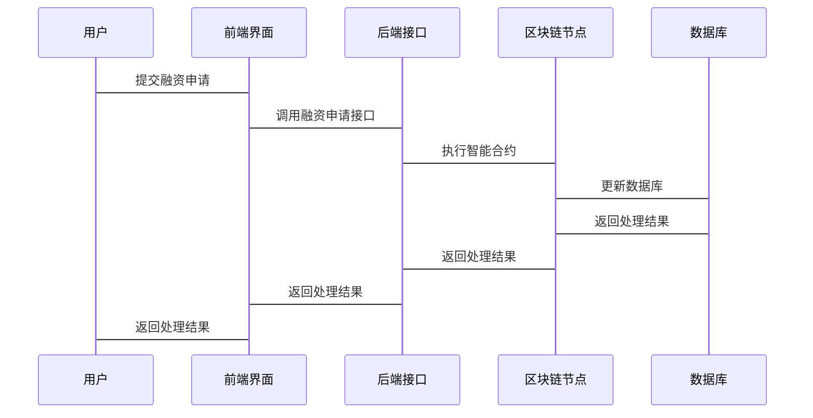

                 


# 巴菲特的供应链韧性分析：区块链技术在供应链金融中的应用

## 关键词：
- 供应链金融
- 区块链技术
- 供应链韧性
- 智能合约
- 共识机制

## 摘要：
区块链技术作为一种革新性的技术，正在改变供应链金融的运作方式。本文将从供应链金融的基本概念出发，结合区块链技术的核心原理，分析区块链如何解决供应链金融中的信任问题，提升其透明度和效率。通过详细阐述区块链技术在供应链金融中的应用场景、算法原理、系统架构以及项目实战，本文旨在为读者提供一个全面的视角，理解区块链技术如何增强供应链的韧性。

## 第一部分: 巴菲特的供应链韧性分析与区块链技术概述

### 第1章: 供应链金融与区块链技术的背景介绍

#### 1.1 供应链金融的基本概念

##### 1.1.1 供应链金融的定义与特点
供应链金融是指通过整合供应链上的资金流、信息流和物流，为供应链上的企业提供融资支持的一种金融模式。其特点是：
- **融资效率高**：通过整合供应链信息，企业能够快速获得融资。
- **风险可控**：通过供应链上的数据，金融机构可以更准确地评估企业的信用风险。
- **多方共赢**：供应链金融能够优化整个供应链的资金流动，降低各参与方的成本。

##### 1.1.2 供应链金融的核心参与方与流程
供应链金融的主要参与方包括：
- **核心企业**：供应链中的主导企业，如制造商或零售商。
- **供应商**：为核心企业提供原材料或服务的企业。
- **金融机构**：提供融资服务的银行或其他金融机构。
- **物流方**：负责货物运输和仓储的企业。

供应链金融的流程一般包括：
1. 核心企业向供应商发出订单。
2. 供应商完成货物交付。
3. 核心企业确认收货并支付货款。
4. 金融机构根据供应链上的数据提供融资支持。

##### 1.1.3 供应链金融的痛点与挑战
供应链金融在实际操作中面临以下问题：
- **信息不对称**：供应链上的信息分散在不同的参与方，导致信息不透明。
- **融资难**：中小企业由于缺乏足够的抵押品和信用记录，难以获得融资。
- **效率低下**：传统供应链金融流程复杂，审批时间长，融资成本高。

#### 1.2 区块链技术的起源与发展

##### 1.2.1 区块链技术的基本概念
区块链是一种去中心化的分布式账本技术，通过加密算法和共识机制，确保数据的安全性和不可篡改性。区块链的核心特征包括：
- **去中心化**：数据不由单一机构控制，而是分布在整个网络中。
- **不可篡改**：数据一旦记录在区块链上，无法被修改或删除。
- **透明性**：区块链上的交易对所有参与者公开，确保信息的透明。

##### 1.2.2 区块链的核心特性与优势
区块链技术的优势主要体现在以下几个方面：
- **提高信任度**：通过去中心化和加密技术，区块链能够建立多方之间的信任。
- **降低成本**：去除了中间机构，减少了交易成本。
- **提高效率**：自动化处理和智能合约能够显著提高交易效率。

##### 1.2.3 区块链在金融领域的应用现状
区块链技术在金融领域的应用已经取得了一定的进展，主要集中在以下几个方面：
- **支付与清算**：通过区块链技术实现跨境支付和清算的自动化。
- **智能合约**：利用智能合约自动执行合同条款，减少人为干预。
- **证券发行与交易**：通过区块链技术实现证券的发行、交易和结算。

#### 1.3 区块链技术与供应链金融的结合

##### 1.3.1 供应链金融中的信任问题
供应链金融的核心问题在于信任。由于信息分散在不同的参与方，金融机构难以准确评估企业的信用状况，导致融资难和效率低。

##### 1.3.2 区块链如何解决供应链金融的信任痛点
区块链技术通过以下方式解决供应链金融的信任问题：
- **数据共享与透明化**：区块链技术可以实现供应链上数据的共享和透明化，降低信息不对称。
- **提高信任度**：区块链的不可篡改性和透明性能够增强供应链参与方之间的信任。
- **自动化执行**：智能合约可以自动执行合同条款，减少人为干预，提高效率。

##### 1.3.3 区块链技术在供应链金融中的应用场景
区块链技术在供应链金融中的应用场景包括：
- **应收账款融资**：通过区块链技术记录和管理应收账款，优化融资流程。
- **供应链库存融资**：基于区块链的库存数据，提供融资支持。
- **跨境供应链金融**：通过区块链技术实现跨境支付和融资的自动化。

### 第2章: 供应链金融的核心概念与区块链技术的联系

#### 2.1 供应链金融的核心概念

##### 2.1.1 供应链金融的业务流程
供应链金融的业务流程可以分为以下几个步骤：
1. **订单生成**：核心企业向供应商发出订单。
2. **货物交付**：供应商完成货物交付。
3. **确认收货**：核心企业确认收货。
4. **融资申请**：供应商向金融机构申请融资。
5. **融资审核与放款**：金融机构审核融资申请并放款。
6. **还款**：供应商在收到货款后偿还贷款。

##### 2.1.2 供应链金融的主要参与方
供应链金融的主要参与方包括：
- **核心企业**：供应链中的主导企业。
- **供应商**：为核心企业提供原材料或服务的企业。
- **金融机构**：提供融资服务的银行或其他金融机构。
- **物流方**：负责货物运输和仓储的企业。

##### 2.1.3 供应链金融的核心要素与关系
供应链金融的核心要素包括：
- **供应链参与方**：包括核心企业、供应商、金融机构和物流方。
- **供应链数据**：包括订单、物流、货物交付和融资信息。
- **融资需求**：供应商的融资需求和核心企业的支付能力。

#### 2.2 区块链技术的核心概念

##### 2.2.1 区块链的基本结构
区块链的基本结构包括以下几个部分：
- **区块**：存储交易数据，每个区块包含一个随机数、交易数据和时间戳。
- **链式结构**：区块通过哈希值连接成链式结构，确保数据不可篡改。
- **共识机制**：通过共识机制确保所有节点达成一致。

##### 2.2.2 区块链的核心机制与组件
区块链的核心机制包括：
- **共识机制**：确保所有节点达成一致的机制，如工作量证明（PoW）和权益证明（PoS）。
- **智能合约**：自动执行合同条款的脚本。
- **加密算法**：确保数据的安全性和隐私性。

##### 2.2.3 区块链的共识机制与安全性
区块链的共识机制包括：
- **工作量证明（PoW）**：通过计算找到哈希值最小的节点来决定记账权。
- **权益证明（PoS）**：根据节点持有的代币数量来决定记账权。
- **拜占庭容错（BFT）**：通过投票机制达成共识。

#### 2.3 供应链金融与区块链技术的联系

##### 2.3.1 区块链技术如何提升供应链金融的透明度
区块链技术通过以下方式提升供应链金融的透明度：
- **数据共享**：区块链技术实现供应链数据的共享和透明化。
- **不可篡改性**：区块链上的数据不可篡改，确保信息的真实性。
- **实时监控**：区块链可以实时监控供应链的交易数据，提高透明度。

##### 2.3.2 区块链技术如何增强供应链金融的信任机制
区块链技术通过以下方式增强供应链金融的信任机制：
- **去中心化**：区块链技术去除了中间机构，减少信息篡改的可能性。
- **智能合约**：通过智能合约自动执行合同条款，减少人为干预。
- **多方参与**：区块链技术允许多方共同参与和监督，增强信任。

##### 2.3.3 区块链技术如何优化供应链金融的效率
区块链技术通过以下方式优化供应链金融的效率：
- **自动化处理**：智能合约自动执行合同条款，减少人工干预。
- **实时结算**：区块链技术实现实时结算，减少交易时间。
- **简化流程**：通过区块链技术简化融资流程，提高效率。

### 第3章: 区块链技术在供应链金融中的算法原理

#### 3.1 区块链共识机制的算法原理

##### 3.1.1 共识机制的定义与分类
共识机制是指通过算法确保所有节点达成一致的机制。常见的共识机制包括：
- **工作量证明（PoW）**：通过计算找到哈希值最小的节点来决定记账权。
- **权益证明（PoS）**：根据节点持有的代币数量来决定记账权。
- **拜占庭容错（BFT）**：通过投票机制达成共识。

##### 3.1.2 工作量证明机制（PoW）
工作量证明机制通过计算找到哈希值最小的节点来决定记账权。具体步骤如下：
1. 每个节点尝试找到一个哈希值小于目标值的随机数。
2. 最先找到的节点获得记账权。
3. 该节点将区块广播给其他节点，其他节点验证后将区块添加到本地链中。

##### 3.1.3 权益证明机制（PoS）
权益证明机制通过节点持有的代币数量来决定记账权。具体步骤如下：
1. 节点根据持有的代币数量分配记账权。
2. 被选中的节点负责验证区块。
3. 其他节点验证后将区块广播给整个网络。

##### 3.1.4 拜占庭容错（BFT）及其变种
拜占庭容错（BFT）通过投票机制达成共识。具体步骤如下：
1. 提议节点提出区块。
2. 其他节点对提议的区块进行投票。
3. 超过半数的节点投票通过后，区块被确认。

#### 3.2 智能合约的算法原理

##### 3.2.1 智能合约的定义与特点
智能合约是指在区块链上运行的自动执行脚本，用于自动执行合同条款。其特点包括：
- **自动化**：智能合约自动执行合同条款，减少人为干预。
- **不可篡改性**：智能合约一旦部署，无法被修改或删除。
- **透明性**：智能合约的代码对所有参与者公开，确保透明。

##### 3.2.2 智能合约的执行流程
智能合约的执行流程包括以下几个步骤：
1. **触发条件**：智能合约根据设定的条件自动触发。
2. **代码执行**：智能合约代码开始执行。
3. **状态更新**：智能合约根据执行结果更新区块链的状态。
4. **完成通知**：智能合约完成执行并通知相关方。

##### 3.2.3 智能合约的安全性与可靠性
智能合约的安全性与可靠性主要依赖于以下几点：
- **代码审查**：通过代码审查确保智能合约的安全性。
- **测试环境**：在测试环境中进行全面测试，确保智能合约的可靠性。
- **不可篡改性**：区块链的不可篡改性确保智能合约的安全性。

## 第二部分: 区块链技术在供应链金融中的算法实现

### 第4章: 区块链技术在供应链金融中的数学模型与公式

#### 4.1 区块链中的哈希函数

##### 4.1.1 哈希函数的定义与作用
哈希函数是一种将任意长度的数据映射为固定长度的哈希值的函数。哈希函数的作用包括：
- **数据摘要**：通过哈希函数生成数据的摘要，便于存储和传输。
- **数据校验**：通过哈希函数验证数据的完整性。

##### 4.1.2 哈希函数的数学模型
哈希函数的数学模型可以表示为：
$$ H(x) = f(x) $$
其中，$H(x)$ 表示输入数据 $x$ 的哈希值，$f(x)$ 表示哈希函数。

##### 4.1.3 哈希函数的应用场景
哈希函数在区块链中的应用场景包括：
- **区块头哈希**：将区块头数据哈希化，生成区块的唯一标识。
- **交易哈希**：将交易数据哈希化，生成交易的唯一标识。
- **Merkle树**：通过哈希函数构建Merkle树，确保数据的完整性和一致性。

#### 4.2 区块链中的数字签名

##### 4.2.1 数字签名的定义与作用
数字签名是指通过加密算法生成的电子签名，用于验证数据的完整性和真实性。数字签名的作用包括：
- **身份验证**：验证数据的来源。
- **数据完整性**：确保数据在传输过程中没有被篡改。
- **不可否认性**：确保签名者无法否认签名的行为。

##### 4.2.2 数字签名的数学模型
数字签名的数学模型可以表示为：
$$ S = Sign(K_{私}, H(x)) $$
其中，$K_{私}$ 表示私钥，$H(x)$ 表示数据的哈希值，$S$ 表示数字签名。

##### 4.2.3 数字签名的应用场景
数字签名在区块链中的应用场景包括：
- **交易签名**：通过数字签名验证交易的合法性。
- **智能合约签名**：通过数字签名验证智能合约的合法性。
- **区块签名**：通过数字签名验证区块的合法性。

### 第5章: 区块链技术在供应链金融中的系统架构设计

#### 5.1 系统分析与设计

##### 5.1.1 供应链金融的典型场景
供应链金融的典型场景包括：
- **供应商融资**：供应商通过区块链技术向金融机构申请融资。
- **核心企业支付**：核心企业通过区块链技术向供应商支付货款。
- **物流监控**：通过区块链技术实时监控货物的物流信息。

##### 5.1.2 供应链金融系统的功能需求
供应链金融系统的功能需求包括：
- **数据共享**：实现供应链数据的共享和透明化。
- **智能合约**：通过智能合约自动执行合同条款。
- **融资申请**：供应商可以通过系统提交融资申请。
- **融资审核**：金融机构可以通过系统审核融资申请。
- **融资放款**：金融机构可以通过系统完成融资放款。

##### 5.1.3 供应链金融系统的非功能需求
供应链金融系统的非功能需求包括：
- **安全性**：确保系统数据的安全性和隐私性。
- **高性能**：确保系统的处理能力能够满足高并发需求。
- **可扩展性**：确保系统能够适应未来的业务扩展需求。

#### 5.2 系统架构设计

##### 5.2.1 领域模型设计
供应链金融系统的领域模型设计包括以下几个部分：
- **供应链参与方**：包括核心企业、供应商、金融机构和物流方。
- **供应链数据**：包括订单、物流、货物交付和融资信息。
- **智能合约**：用于自动执行合同条款。

##### 5.2.2 系统架构设计
供应链金融系统的系统架构设计包括以下几个部分：
- **前端界面**：用户通过前端界面提交融资申请。
- **后端接口**：后端接口负责处理用户的请求并调用智能合约。
- **区块链节点**：区块链节点负责处理智能合约的执行和区块的生成。
- **数据库**：数据库负责存储供应链相关的数据。

##### 5.2.3 接口设计
供应链金融系统的接口设计包括以下几个部分：
- **融资申请接口**：用户通过接口提交融资申请。
- **融资审核接口**：金融机构通过接口审核融资申请。
- **融资放款接口**：金融机构通过接口完成融资放款。
- **物流监控接口**：用户通过接口监控货物的物流信息。

#### 5.3 系统交互设计

##### 5.3.1 系统交互流程
供应链金融系统的交互流程包括以下几个步骤：
1. **融资申请**：用户通过前端界面提交融资申请。
2. **融资审核**：金融机构通过后端接口审核融资申请。
3. **融资放款**：金融机构通过后端接口完成融资放款。
4. **物流监控**：用户通过接口监控货物的物流信息。

##### 5.3.2 系统交互的mermaid序列图
以下是系统交互的mermaid序列图：



### 第6章: 区块链技术在供应链金融中的项目实战

#### 6.1 项目环境安装

##### 6.1.1 安装以太坊钱包与Ganache
以太坊钱包和Ganache的安装步骤如下：
1. 下载并安装以太坊钱包：可以从官方网站（https://www.myetherwallet.com）下载以太坊钱包。
2. 下载并安装Ganache：可以从GitHub（https://github.com/ethereum/ganache-cli）下载Ganache。

##### 6.1.2 安装Solidity与Web3.py
Solidity和Web3.py的安装步骤如下：
1. 安装Solidity：使用npm安装Solidity，命令如下：
   ```bash
   npm install -g solc
   ```
2. 安装Web3.py：使用pip安装Web3.py，命令如下：
   ```bash
   pip install web3
   ```

##### 6.1.3 安装Python环境
安装Python环境的步骤如下：
1. 下载并安装Python：可以从官方网站（https://www.python.org）下载并安装Python。
2. 安装pip：在安装Python后，自动安装pip。

#### 6.2 项目核心代码实现

##### 6.2.1 智能合约实现
以下是智能合约的Solidity代码：

```solidity
// SPDX-License-Identifier: MIT
pragma solidity ^0.8.0;

contract SupplyChainFinance {
    struct Transaction {
        uint256 amount;
        address supplier;
        address buyer;
        uint256 timestamp;
    }

    event TransactionCompleted(uint256 indexed amount, address indexed supplier, address indexed buyer);

    function requestTransaction(uint256 amount, address buyer) public {
        emit TransactionCompleted(amount, msg.sender, buyer);
    }

    function confirmTransaction(uint256 amount, address supplier) public {
        emit TransactionCompleted(amount, supplier, msg.sender);
    }
}
```

##### 6.2.2 后端接口实现
以下是后端接口的Python代码：

```python
from web3 import Web3
from web3.middleware import gethMiddleware

# 初始化Web3实例
w3 = Web3(Web3.HTTPProvider("http://localhost:8545"))

# 加载智能合约ABI
abi = [
    {"constant": false, "inputs": [{"name": "buyer", "type": "address"}, {"name": "amount", "type": "uint256"}], "name": "requestTransaction", "outputs": [], "payable": false, "stateMutability": "nonpayable", "type": "function"},
    {"constant": false, "inputs": [{"name": "supplier", "type": "address"}, {"name": "amount", "type": "uint256"}], "name": "confirmTransaction", "outputs": [], "payable": false, "stateMutability": "nonpayable", "type": "function"},
    {"constant": true, "inputs": [], "name": "getTransactionCount", "outputs": [{"name": "", "type": "uint256"}], "payable": false, "stateMutability": "view", "type": "function"}
]

# 加载智能合约地址
contract_address = "0xYourContractAddress"

# 初始化智能合约实例
contract = w3.eth.contract(address=contract_address, abi=abi)

# 提交融资申请
def submit_finance_request(amount, buyer):
    tx_hash = contract.functions.requestTransaction(buyer, amount).transact()
    receipt = w3.eth.waitForTransactionReceipt(tx_hash)
    return receipt

# 确认融资申请
def confirm_finance_request(amount, supplier):
    tx_hash = contract.functions.confirmTransaction(supplier, amount).transact()
    receipt = w3.eth.waitForTransactionReceipt(tx_hash)
    return receipt
```

#### 6.3 项目实现与分析

##### 6.3.1 智能合约实现分析
智能合约的实现包括以下几个部分：
- **智能合约定义**：定义智能合约的结构和功能。
- **智能合约部署**：将智能合约部署到区块链上。
- **智能合约调用**：通过后端接口调用智能合约。

##### 6.3.2 后端接口实现分析
后端接口的实现包括以下几个部分：
- **Web3初始化**：初始化Web3实例，连接到区块链节点。
- **智能合约ABI加载**：加载智能合约的ABI，用于与智能合约进行交互。
- **智能合约调用**：通过后端接口调用智能合约的函数，完成融资申请的提交和确认。

##### 6.3.3 项目运行与测试
项目运行与测试的步骤如下：
1. 部署智能合约到Ganache测试网络。
2. 在后端接口中调用智能合约的函数，完成融资申请的提交和确认。
3. 监听智能合约的事件，验证融资申请的处理结果。

#### 6.4 项目小结
通过本项目的实现，我们可以看到区块链技术在供应链金融中的应用潜力。智能合约的自动执行能力和区块链的不可篡改性，能够显著提高供应链金融的效率和透明度。同时，通过本项目的实践，我们也能够更好地理解区块链技术的核心原理和实际应用。

### 第7章: 区块链技术在供应链金融中的最佳实践

#### 7.1 项目总结与经验分享

##### 7.1.1 项目总结
通过本项目的实现，我们总结出以下几点经验：
- **技术选型**：选择合适的区块链平台和智能合约语言，确保项目的顺利进行。
- **安全性**：确保智能合约的安全性，通过代码审查和测试确保智能合约的可靠性。
- **可扩展性**：设计系统的可扩展性，确保系统能够适应未来的业务扩展需求。

##### 7.1.2 经验分享
在实际项目中，我们需要注意以下几点：
- **技术选型**：选择合适的区块链平台和工具，确保项目的顺利进行。
- **安全性**：通过代码审查和测试确保智能合约的安全性。
- **可扩展性**：设计系统的可扩展性，确保系统能够适应未来的业务需求。

#### 7.2 项目注意事项

##### 7.2.1 技术注意事项
在实际项目中，技术注意事项包括：
- **技术选型**：选择合适的区块链平台和工具，确保项目的顺利进行。
- **安全性**：通过代码审查和测试确保智能合约的安全性。
- **性能优化**：优化系统的性能，确保系统的高效运行。

##### 7.2.2 安全注意事项
在实际项目中，安全注意事项包括：
- **数据隐私**：确保供应链数据的隐私性，防止数据泄露。
- **权限管理**：通过权限管理确保只有授权的用户能够访问敏感数据。
- **安全审计**：定期进行安全审计，确保系统的安全性。

#### 7.3 项目拓展阅读

##### 7.3.1 拓展阅读资料
以下是拓展阅读资料：
- **《精通以太坊：区块链开发指南》**：这本书详细介绍了以太坊平台的开发指南。
- **《区块链设计模式》**：这本书介绍了区块链设计模式，帮助开发者更好地设计区块链系统。
- **《智能合约安全审计指南》**：这本书介绍了智能合约安全审计的指南，帮助开发者确保智能合约的安全性。

##### 7.3.2 项目扩展建议
在实际项目中，可以考虑以下扩展建议：
- **跨链技术**：研究和实现跨链技术，实现不同区块链平台之间的数据互通。
- **隐私保护**：研究和实现隐私保护技术，确保供应链数据的隐私性。
- **自动化测试**：实现系统的自动化测试，确保系统的稳定性和可靠性。

## 作者：AI天才研究院/AI Genius Institute & 禅与计算机程序设计艺术 /Zen And The Art of Computer Programming

---

这篇文章详细介绍了区块链技术在供应链金融中的应用，从供应链金融的基本概念到区块链技术的核心原理，再到系统的实现与项目实战，全面阐述了区块链技术如何增强供应链的韧性。通过本文的学习，读者可以更好地理解区块链技术在供应链金融中的潜力和应用前景。

