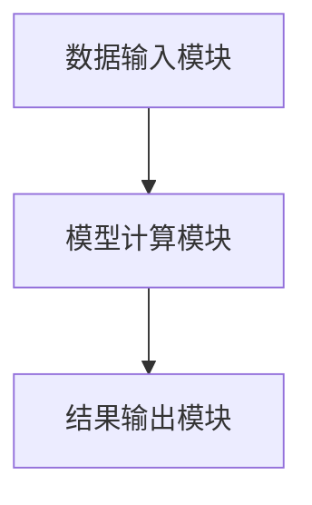
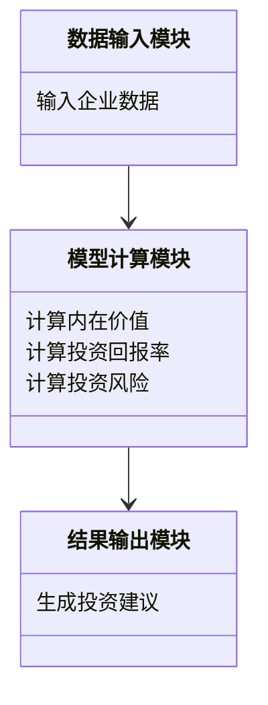

                 


# 巴菲特的看待市场波动的方式：短期投票机，长期称重机

> 关键词：巴菲特，市场波动，投资策略，价值评估，长期投资，短期波动

> 摘要：本文深入分析了巴菲特看待市场波动的独特视角，将市场波动比喻为短期投票机和长期称重机。文章从巴菲特的投资理念出发，结合数学模型和实际案例，详细阐述了短期波动的特征、长期价值的评估方法，以及如何在市场波动中制定有效的投资策略。通过系统的分析和实战案例，本文为投资者提供了宝贵的见解和实用的建议。

---

## 第一部分: 巴菲特的市场波动观点概述

### 第1章: 巴菲特投资理念的核心思想

#### 1.1 巴菲特的生平与投资哲学

##### 1.1.1 巴菲特的生平简介

沃伦·巴菲特（Warren Buffett），1934年8月31日出生于美国堪萨斯州奥马哈市，是世界著名投资家、企业家和慈善家。他创立的伯克希尔哈撒韦公司（Berkshire Hathaway）成为全球知名的投资公司，其投资哲学和策略对全球投资者产生了深远影响。

巴菲特的 investing philosophy 以价值投资为核心，强调购买价格低于内在价值的股票，并长期持有。他注重企业的基本面分析，关注企业的盈利能力、财务状况和竞争优势，而不是短期市场波动。

##### 1.1.2 巴菲特的投资哲学与价值观

巴菲特的投资哲学可以概括为“价格合理、价值巨大、数量足够”的原则。他强调：

1. **内在价值**：企业的真实价值是其未来现金流的现值。
2. **安全边际**：买入价格应低于内在价值，以确保足够的安全空间。
3. **长期视角**：投资不是交易，而是买入并持有优质企业，等待其价值自然增长。

##### 1.1.3 巴菲特的长期投资策略

巴菲特认为，成功的投资不在于预测市场的短期波动，而在于选择那些具备强大竞争优势、良好管理和持续盈利能力的企业，并长期持有。他强调，市场先生（Mr. Market）是投资者的朋友，而不是敌人。市场的波动提供了以合理价格买入优质资产的机会。

---

#### 1.2 巴菲特的市场波动观点

##### 1.2.1 市场波动的定义与特性

市场波动是指股票价格或其他资产价格在短时间内围绕其内在价值上下波动的现象。市场波动是市场参与者的集体行为的结果，受投资者情绪、市场流动性、宏观经济环境等多种因素影响。

##### 1.2.2 短期市场波动的特征

1. **情绪驱动**：短期波动往往由投资者的非理性情绪（如贪婪和恐惧）驱动，表现为市场的过度上涨或下跌。
2. **短期性**：短期波动通常在较短时间内发生，可能持续几天、几周或几个月。
3. **不可预测性**：短期波动难以预测，因为它们受情绪和市场参与者的集体行为影响。

##### 1.2.3 长期市场波动的规律

1. **价值回归**：长期来看，资产价格会回归其内在价值，市场波动只是暂时的偏差。
2. **长期增长**：优质企业的内在价值会随着时间的推移而增长，尤其是那些具备强大竞争优势和持续盈利能力的企业。
3. **周期性**：市场波动具有周期性，投资者应关注长期趋势，而不是短期波动。

---

### 第2章: 巴菲特的市场波动框架

#### 2.1 巴菲特的市场波动理论

##### 2.1.1 市场波动的周期性分析

市场波动具有周期性，通常分为以下几个阶段：

1. **底部阶段**：市场处于低谷，资产价格远低于其内在价值，投资者情绪悲观。
2. **上升阶段**：市场逐步复苏，资产价格开始上涨，投资者情绪逐渐转为乐观。
3. **顶部阶段**：市场达到高点，资产价格远高于其内在价值，投资者情绪贪婪。
4. **下降阶段**：市场开始下跌，资产价格回归理性，投资者情绪逐渐转为恐慌。

##### 2.1.2 市场波动的驱动因素

1. **宏观经济因素**：如经济周期、通货膨胀、利率变化等。
2. **市场情绪**：投资者的心理和行为影响市场的短期波动。
3. **市场流动性**：市场资金的流动性和充裕性影响资产价格。
4. **企业基本面**：企业的盈利能力和财务状况影响其内在价值。

##### 2.1.3 市场波动与投资者心理

市场波动与投资者心理密切相关。当市场上涨时，投资者情绪贪婪，可能导致资产价格被高估；当市场下跌时，投资者情绪悲观，可能导致资产价格被低估。

---

#### 2.2 巴菲特的短期市场波动分析

##### 2.2.1 短期波动的投票机特性

巴菲特将短期市场波动比喻为“投票机”，认为短期市场波动是市场参与者对企业价值的投票结果，而不是企业的真实价值。短期波动反映了市场的集体情绪，而不是企业的实际表现。

##### 2.2.2 短期波动对投资者的影响

1. **情绪干扰**：短期波动可能干扰投资者的判断，导致非理性决策。
2. **机会与风险**：短期波动为投资者提供了以合理价格买入优质资产的机会，但也可能引发过度交易和风险。

##### 2.2.3 短期波动的应对策略

1. **保持冷静**：投资者应避免被短期波动所干扰，专注于长期目标。
2. **利用波动**：短期波动可能为投资者提供以合理价格买入优质资产的机会。
3. **分散投资**：通过分散投资降低短期波动对投资组合的影响。

---

#### 2.3 巴菲特的长期市场波动分析

##### 2.3.1 长期波动的称重机特性

巴菲特将长期市场波动比喻为“称重机”，认为长期市场波动反映了企业的实际价值。长期波动是市场对企业的内在价值进行“称重”的过程，优质企业的价值会逐渐被市场发现并反映在价格中。

##### 2.3.2 长期波动的核心驱动因素

1. **企业基本面**：企业的盈利能力、财务状况和竞争优势是长期波动的核心驱动因素。
2. **时间**：长期波动需要时间来反映企业的实际价值。
3. **市场参与者的行为**：市场参与者的长期行为和决策影响长期波动。

##### 2.3.3 长期波动的预测与投资策略

1. **长期投资**：投资者应关注企业的长期价值，而不是短期波动。
2. **选择优质企业**：投资于那些具备强大竞争优势、良好管理和持续盈利能力的企业。
3. **耐心等待**：长期波动需要时间来反映企业的价值，投资者应耐心等待。

---

## 第二部分: 巴菲特投资策略的数学模型与分析

### 第3章: 巴菲特投资模型的数学分析

#### 3.1 巴菲特投资模型的构建

##### 3.1.1 投资模型的构建过程

巴菲特的投资模型基于价值投资理念，强调以合理价格买入优质企业并长期持有。模型的核心是内在价值的计算，内在价值是企业未来现金流的现值。

##### 3.1.2 投资模型的输入变量

1. **企业未来现金流**：包括企业未来几年的自由现金流。
2. **贴现率**：通常使用企业的加权平均资本成本（WACC）作为贴现率。
3. **企业寿命**：假设企业在合理的情况下可以持续产生现金流的期限。

##### 3.1.3 投资模型的输出结果

1. **内在价值**：企业未来现金流的现值。
2. **安全边际**：买入价格与内在价值的差异，确保足够的安全空间。

#### 3.2 巴菲特投资模型的数学公式

##### 3.2.1 投资价值的计算公式

$$
\text{内在价值} = \sum_{t=1}^{n} \frac{\text{自由现金流}_t}{(1 + r)^t}
$$

其中：
- \( r \) 是贴现率
- \( n \) 是企业寿命
- \( \text{自由现金流}_t \) 是第 \( t \) 年的自由现金流

##### 3.2.2 投资回报率的计算公式

$$
\text{投资回报率} = \frac{\text{内在价值} - \text{买入价格}}{\text{买入价格}} \times 100\%
$$

##### 3.2.3 投资风险的计算公式

$$
\text{投资风险} = \frac{\text{买入价格} - \text{内在价值}}{\text{内在价值}} \times 100\%
$$

---

#### 3.3 巴菲特投资模型的案例分析

##### 3.3.1 案例一：可口可乐的投资分析

1. **内在价值计算**：通过分析可口可乐的自由现金流和贴现率，计算其内在价值。
2. **买入价格**：确定合理的买入价格，低于内在价值。
3. **投资回报率**：计算投资回报率，评估投资的盈利能力。

##### 3.3.2 案例二：苹果的投资分析

1. **内在价值计算**：通过分析苹果的自由现金流和贴现率，计算其内在价值。
2. **买入价格**：确定合理的买入价格，低于内在价值。
3. **投资回报率**：计算投资回报率，评估投资的盈利能力。

##### 3.3.3 案例三：其他经典投资案例分析

分析巴菲特其他经典投资案例，如美国运通、喜诗糖果等，总结其投资策略和成功经验。

---

### 第4章: 巴菲特投资模型的系统架构设计

#### 4.1 投资模型的系统架构

##### 4.1.1 系统功能模块划分

1. **数据输入模块**：输入企业的财务数据、市场数据等。
2. **模型计算模块**：计算企业的内在价值、投资回报率和投资风险。
3. **结果输出模块**：输出投资建议和投资策略。

##### 4.1.2 系统功能模块的交互流程

1. 数据输入模块接收企业数据。
2. 模型计算模块计算内在价值、投资回报率和投资风险。
3. 结果输出模块生成投资建议和投资策略。

##### 4.1.3 系统功能模块的实现细节

1. **数据输入模块**：包括企业名称、自由现金流、贴现率等。
2. **模型计算模块**：包括内在价值计算、投资回报率计算和投资风险计算。
3. **结果输出模块**：包括投资建议、买入价格和卖出价格。

---

#### 4.2 投资模型的系统架构图

##### 4.2.1 系统架构的Mermaid图



##### 4.2.2 系统功能模块的类图



##### 4.2.3 系统接口的设计与实现

1. **接口设计**：定义系统的输入和输出接口。
2. **接口实现**：通过编程语言（如Python）实现系统的功能模块。

---

## 第五部分: 项目实战

### 第5章: 项目实战分析

#### 5.1 环境安装

1. **安装Python**：下载并安装Python编程语言。
2. **安装相关库**：安装NumPy、Pandas、Matplotlib等库，用于数据处理和可视化。

#### 5.2 核心实现源代码

##### 5.2.1 内在价值计算代码

```python
import numpy as np
import pandas as pd

def calculate_intrinsic_value(fcf, discount_rate):
    n = len(fcf)
    present_value = 0
    for i in range(n):
        present_value += fcf[i] / (1 + discount_rate) ** (i + 1)
    return present_value

# 示例数据
fcf = [100, 150, 200, 250, 300]
discount_rate = 0.10

intrinsic_value = calculate_intrinsic_value(fcf, discount_rate)
print("内在价值:", intrinsic_value)
```

##### 5.2.2 投资回报率计算代码

```python
def calculate_return(intrinsic_value, purchase_price):
    return ((intrinsic_value - purchase_price) / purchase_price) * 100

# 示例数据
purchase_price = 100
intrinsic_value = 150

return_rate = calculate_return(intrinsic_value, purchase_price)
print("投资回报率:", return_rate, "%")
```

##### 5.2.3 投资风险计算代码

```python
def calculate_risk(intrinsic_value, purchase_price):
    return ((purchase_price - intrinsic_value) / intrinsic_value) * 100

# 示例数据
purchase_price = 100
intrinsic_value = 150

risk = calculate_risk(intrinsic_value, purchase_price)
print("投资风险:", risk, "%")
```

---

#### 5.3 代码应用解读与分析

1. **内在价值计算**：通过自由现金流和贴现率计算企业的内在价值。
2. **投资回报率计算**：计算投资的回报率，评估投资的盈利能力。
3. **投资风险计算**：计算投资的风险，评估投资的安全性。

---

## 第六部分: 总结与启示

### 第6章: 总结与启示

#### 6.1 总结

本文深入分析了巴菲特看待市场波动的独特视角，将市场波动比喻为短期投票机和长期称重机。通过系统的分析和实战案例，本文为投资者提供了宝贵的见解和实用的建议。

#### 6.2 启示

1. **长期投资**：投资者应关注企业的长期价值，而不是短期波动。
2. **选择优质企业**：投资于那些具备强大竞争优势、良好管理和持续盈利能力的企业。
3. **耐心等待**：长期波动需要时间来反映企业的价值，投资者应耐心等待。

---

## 作者信息

作者：AI天才研究院/AI Genius Institute & 禅与计算机程序设计艺术 /Zen And The Art of Computer Programming

---

通过本文的分析，读者可以更好地理解巴菲特的市场波动观点，并将其应用于实际投资中，从而在复杂的市场环境中做出更明智的投资决策。

