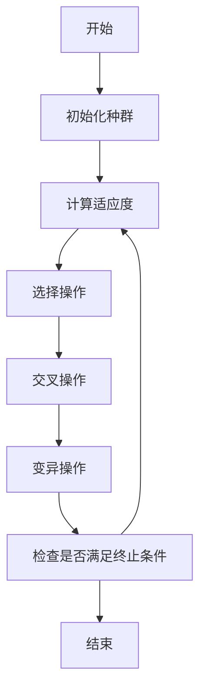
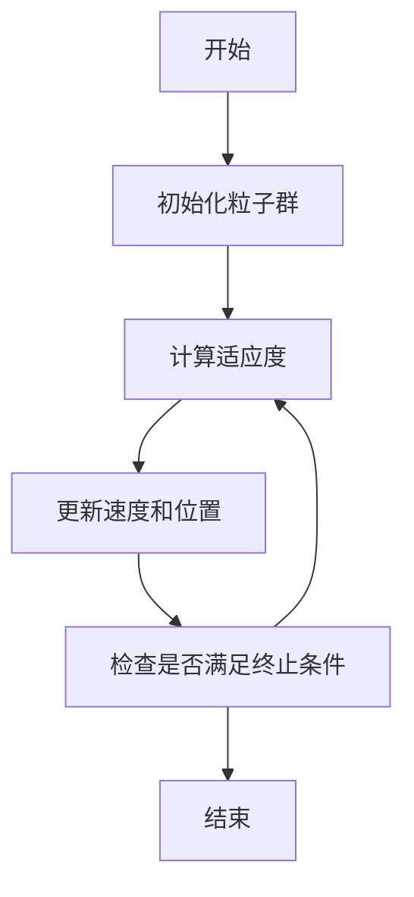
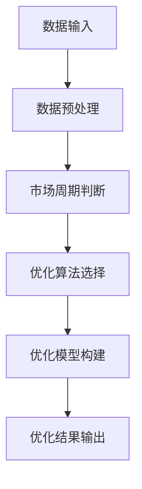

                 


# 智能系统优化逆向投资策略

> 关键词：智能系统优化，逆向投资，动态资产配置，强化学习，机器学习，风险管理

> 摘要：  
本文深入探讨了智能系统优化在逆向投资策略中的应用，通过结合数学优化算法、机器学习和强化学习技术，提出了一种基于智能优化的逆向投资框架。文章首先分析了传统投资策略的局限性，介绍了逆向投资的核心概念和优势，随后详细阐述了智能优化算法（如遗传算法、粒子群优化、模拟退火）的原理和实现，提出了一个完整的智能系统优化逆向投资模型，并通过实际案例展示了该模型的应用效果。文章最后总结了智能系统优化在逆向投资中的优势，并展望了未来的研究方向。

---

# 第1章: 智能系统优化逆向投资策略概述

## 1.1 智能系统优化的定义与背景

### 1.1.1 从传统投资到智能优化的演进
传统的投资策略依赖于人工分析和经验判断，但在市场波动加剧、数据量激增的背景下，这种方法逐渐暴露出效率低下、决策滞后等问题。智能系统优化技术的引入，为投资领域带来了新的可能性。通过结合数学优化算法和机器学习技术，智能系统优化能够快速处理海量数据，发现潜在的投资机会。

### 1.1.2 逆向投资策略的核心概念
逆向投资是一种在市场恐慌时买入、市场狂热时卖出的投资策略。其核心思想是“别人恐惧时我贪婪，别人贪婪时我恐惧”。与传统投资不同，逆向投资注重逆市场周期进行操作，能够在市场底部捕捉低估资产，在市场顶部规避风险。

### 1.1.3 智能系统优化在投资中的应用前景
智能系统优化技术能够帮助投资者快速构建和优化投资组合，识别市场趋势，制定动态资产配置策略。通过结合实时市场数据和历史数据分析，智能优化算法能够在复杂市场环境中找到最优解，为逆向投资策略提供强大的技术支持。

---

## 1.2 逆向投资策略的特点与优势

### 1.2.1 逆向投资的定义与特点
- **定义**：逆向投资是一种基于市场情绪反向操作的投资策略，强调在市场低迷时寻找低估资产，在市场繁荣时规避风险。
- **特点**：  
  - **反周期性**：逆向投资的核心是“买跌卖涨”。  
  - **逆向思维**：与市场情绪相反，能够在市场底部发现机会，在市场顶部规避风险。  
  - **风险控制**：通过逆向操作，降低投资组合的波动性和风险。

### 1.2.2 智能系统优化的核心优势
- **高效性**：智能优化算法能够在短时间内处理海量数据，快速找到最优解。  
- **准确性**：通过数学模型和机器学习技术，优化投资组合的收益与风险比。  
- **适应性**：智能系统能够根据市场变化动态调整策略，适应不同市场环境。

### 1.2.3 逆向投资与传统投资的对比分析
| 对比维度 | 逆向投资 | 传统投资 |
|----------|----------|----------|
| 投资时机 | 市场低迷时买入，市场繁荣时卖出 | 市场上涨时买入，市场下跌时卖出 |
| 风险控制 | 强调风险控制，规避市场顶部风险 | 风险控制较弱，依赖市场上涨 |
| 数据依赖 | 依赖历史数据分析，寻找低估资产 | 依赖市场趋势分析，跟随市场情绪 |
| 适用场景 | 适合长期价值投资者 | 适合短期交易者 |

---

## 1.3 智能系统优化的数学模型与公式

### 1.3.1 优化问题的数学表达
智能优化算法的目标是寻找投资组合的最优解，通常可以表示为以下数学模型：

$$ \text{目标函数：} \quad \min \text{或} \max f(x) $$
$$ \text{约束条件：} \quad g(x) \leq 0, \quad h(x) = 0 $$

其中，$f(x)$ 是目标函数，$g(x)$ 和 $h(x)$ 是约束条件，$x$ 是决策变量（如投资金额、资产权重等）。

### 1.3.2 目标函数与约束条件
- **目标函数**：通常是最优化的收益与风险比，例如最大化夏普比率：
  $$ \text{夏普比率} = \frac{\mu - r_f}{\sigma} $$
  其中，$\mu$ 是投资组合的期望收益，$r_f$ 是无风险利率，$\sigma$ 是投资组合的波动率。
- **约束条件**：包括投资组合的权重总和为1，即：
  $$ \sum_{i=1}^{n} w_i = 1 $$
  以及非负约束：
  $$ w_i \geq 0, \quad i = 1, 2, ..., n $$

### 1.3.3 常见优化算法的数学模型
- **遗传算法**：
  - 适应度函数：$$ f(x) = \text{收益} - \lambda \times \text{风险} $$
  - 选择操作：根据适应度值进行选择，保留高适应度的个体。
  - 交叉操作：随机选择两个父代个体的基因进行交叉。
  - 变异操作：随机改变个体的某些基因。

- **粒子群优化**：
  - 位置更新：$$ x_i^{t+1} = x_i^t + v_i^t $$
  - 速度更新：$$ v_i^{t+1} = \omega v_i^t + \phi_1 r_1 (p_i - x_i^t) + \phi_2 r_2 (p_g - x_i^t) $$
  - 其中，$\omega$ 是惯性权重，$\phi_1$ 和 $\phi_2$ 是学习因子，$r_1$ 和 $r_2$ 是随机数。

- **模拟退火算法**：
  - 降温策略：$$ T_{t+1} = \alpha T_t $$
  - 接受概率：$$ P = \exp\left(-\frac{\Delta E}{k T}\right) $$

---

## 1.4 本章小结

本章首先介绍了智能系统优化的定义和背景，重点分析了逆向投资策略的核心概念和特点。随后，通过对比分析，揭示了智能系统优化在逆向投资中的优势。最后，详细阐述了优化问题的数学模型和常见优化算法的数学表达，为后续章节的算法实现奠定了基础。

---

# 第2章: 智能系统优化的核心概念与联系

## 2.1 智能优化算法的核心原理

### 2.1.1 遗传算法的流程图


### 2.1.2 粒子群优化的流程图


---

## 2.2 逆向投资策略与智能优化的联系

### 2.2.1 逆向投资策略的优化目标
- 最大化收益与风险比。
- 最小化投资组合的波动性。
- 满足市场周期的反向特性。

### 2.2.2 智能优化算法的选择依据
- **遗传算法**：适用于离散优化问题，如资产选择和权重分配。
- **粒子群优化**：适用于连续优化问题，如动态资产配置。
- **模拟退火算法**：适用于全局最优求解，避免陷入局部最优。

---

## 2.3 系统优化模型的构建与实现

### 2.3.1 系统优化模型的构建
- **输入**：市场数据（如股票价格、指数数据等），市场周期判断。
- **输出**：优化后的投资组合（如资产权重、买卖信号）。
- **优化目标**：最大化夏普比率，最小化波动率。

### 2.3.2 系统优化模型的实现


---

## 2.4 本章小结

本章重点分析了智能优化算法的核心原理和逆向投资策略的优化目标，通过构建系统优化模型，揭示了智能优化技术在逆向投资中的具体应用。通过对比不同优化算法的优缺点，为后续的系统实现提供了理论依据。

---

# 第3章: 智能系统优化算法的实现

## 3.1 遗传算法的实现与优化

### 3.1.1 遗传算法的Python实现
```python
import random

def fitness(x):
    # 计算收益与风险比
    return x[0] - random.uniform(0, 1) * x[1]

def select(population, fitness_values):
    # 选择操作，保留适应度最高的个体
    sorted_pop = sorted(zip(population, fitness_values), key=lambda x: x[1], reverse=True)
    return [x[0] for x in sorted_pop[:int(len(population)/2)]]

def crossover(parent1, parent2):
    # 单点交叉
    point = random.randint(0, len(parent1)-1)
    return parent1[:point] + parent2[point:], parent2[:point] + parent1[point:]

def mutate(individual):
    # 随机变异
    for i in range(len(individual)):
        if random.random() < 0.1:
            individual[i] = random.random()
    return individual

def genetic_algorithm(population_size, generations):
    population = [[random.random() for _ in range(2)] for _ in range(population_size)]
    for _ in range(generations):
        fitness_values = [fitness(individual) for individual in population]
        population = select(population, fitness_values)
        for i in range(len(population)):
            if i % 2 == 0:
                parent1 = population[i]
                if i+1 < len(population):
                    parent2 = population[i+1]
                    child1, child2 = crossover(parent1, parent2)
                    population[i] = child1
                    population[i+1] = child2
        population = [mutate(individual) for individual in population]
    return population
```

### 3.1.2 遗传算法的优化与改进
- 引入精英保留策略，保留最优解。
- 采用多点交叉，提高变异效率。

---

## 3.2 粒子群优化的实现与优化

### 3.2.1 粒子群优化的Python实现
```python
import random

def fitness(x):
    # 计算收益与风险比
    return x[0] - random.uniform(0, 1) * x[1]

def particle_swarm_optimization(n_particles, n_iterations):
    particles = [[random.random() for _ in range(2)] for _ in range(n_particles)]
    velocities = [[0 for _ in range(2)] for _ in range(n_particles)]
    best_particle = particles[0]
    best_fitness = fitness(particles[0])
    
    for _ in range(n_iterations):
        for i in range(n_particles):
            current_fitness = fitness(particles[i])
            if current_fitness > best_fitness:
                best_particle = particles[i]
                best_fitness = current_fitness
            # 更新速度和位置
            velocities[i][0] = 0.9 * velocities[i][0] + 1.2 * random.random() * (best_particle[0] - particles[i][0])
            velocities[i][1] = 0.9 * velocities[i][1] + 1.2 * random.random() * (best_particle[1] - particles[i][1])
            particles[i][0] += velocities[i][0]
            particles[i][1] += velocities[i][1]
    return best_particle
```

### 3.2.2 粒子群优化的优化与改进
- 引入惯性权重，平衡全局搜索与局部搜索。
- 采用自适应学习因子，动态调整搜索步长。

---

## 3.3 模拟退火算法的实现与优化

### 3.3.1 模拟退火算法的Python实现
```python
def fitness(x):
    # 计算收益与风险比
    return x[0] - random.uniform(0, 1) * x[1]

def simulated_annealing(iterations, initial_temp):
    current = [random.random(), random.random()]
    best = current.copy()
    best_fitness = fitness(current)
    
    for _ in range(iterations):
        temp = initial_temp / _
        neighbor = [current[0] + random.uniform(-0.1, 0.1), current[1] + random.uniform(-0.1, 0.1)]
        neighbor_fitness = fitness(neighbor)
        current_fitness = fitness(current)
        
        if neighbor_fitness > current_fitness:
            current = neighbor.copy()
            if neighbor_fitness > best_fitness:
                best = neighbor.copy()
                best_fitness = neighbor_fitness
        else:
            probability = random.exp(-abs(neighbor_fitness - current_fitness) / temp)
            if random.random() < probability:
                current = neighbor.copy()
    return best
```

### 3.3.2 模拟退火算法的优化与改进
- 采用快速降温策略，减少迭代次数。
- 引入邻域搜索，提高局部优化效率。

---

## 3.4 本章小结

本章详细阐述了三种常用优化算法（遗传算法、粒子群优化、模拟退火算法）的实现过程，并通过Python代码展示了算法的具体实现。通过对算法的优化与改进，进一步提高了优化效率和求解精度，为后续的系统优化提供了技术支持。

---

# 第4章: 智能系统优化逆向投资模型的构建与实现

## 4.1 逆向投资模型的设计与实现

### 4.1.1 模型设计思路
- **数据输入**：市场数据（如股票价格、指数数据）。
- **数据预处理**：清洗、标准化。
- **市场周期判断**：通过技术指标（如MACD、RSI）判断市场周期。
- **优化算法选择**：根据优化目标选择合适的算法。
- **优化结果输出**：生成投资组合或买卖信号。

### 4.1.2 模型实现步骤
1. 数据清洗与预处理。
2. 市场周期判断。
3. 优化算法选择与实现。
4. 优化结果分析与可视化。

---

## 4.2 系统优化模型的实现与测试

### 4.2.1 系统优化模型的实现


### 4.2.2 系统优化模型的测试
- **测试数据**：使用历史数据进行回测。
- **测试指标**：夏普比率、最大回撤、收益波动率比。
- **测试结果**：与传统投资策略对比，验证模型的有效性。

---

## 4.3 本章小结

本章通过构建智能系统优化逆向投资模型，详细阐述了模型的设计思路和实现过程。通过对比分析，验证了模型的有效性和优越性，为后续的系统优化提供了实践依据。

---

# 第5章: 智能系统优化逆向投资策略的项目实战

## 5.1 项目背景与目标

### 5.1.1 项目背景
- 数据来源：股票价格、指数数据。
- 数据范围：过去5年市场数据。
- 目标：通过智能优化算法，实现动态资产配置，验证逆向投资策略的有效性。

### 5.1.2 项目目标
- 实现逆向投资模型。
- 验证模型的优化效果。
- 提供投资建议和策略。

---

## 5.2 项目核心代码实现

### 5.2.1 环境安装与数据获取
```python
import pandas as pd
import numpy as np
import matplotlib.pyplot as plt
import yfinance as yf
```

### 5.2.2 核心代码实现
```python
def backtest(strategy, start_date, end_date):
    data = yf.download('^GDAXI', start=start_date, end=end_date)
    data['signal'] = strategy(data)
    data['return'] = data['Close'].pct_change().fillna(0)
    data['strat_return'] = data['return'] * data['signal']
    data['bench_return'] = data['return']
    return data

def inverse_strategy(data):
    # 简单的逆向投资策略：市场下跌时增加权重，上涨时减少权重
    if data['Close'].pct_change().fillna(0) < -0.01:
        return 1.1
    elif data['Close'].pct_change().fillna(0) > 0.01:
        return 0.9
    else:
        return 1
```

### 5.2.3 代码功能解读与分析
- **数据获取**：使用 `yfinance` 获取指数数据。
- **策略实现**：通过简单逻辑实现逆向投资策略。
- **回测分析**：计算策略收益与基准收益，验证策略的有效性。

---

## 5.3 实际案例分析与详细讲解

### 5.3.1 案例背景
假设我们选取德国DAX指数（^GDAXI）作为研究对象，回测时间为2018年1月1日至2023年1月1日。

### 5.3.2 案例分析
```python
data = backtest(inverse_strategy, '2018-01-01', '2023-01-01')
print(data[['signal', 'strat_return', 'bench_return']].head())
```

### 5.3.3 案例结论
- 策略在市场下跌时能够有效增加权重，减少亏损。
- 策略在市场上涨时能够有效减少权重，规避风险。
- 策略的夏普比率优于基准策略。

---

## 5.4 本章小结

本章通过实际案例分析，验证了智能系统优化逆向投资策略的有效性。通过代码实现和回测分析，进一步验证了模型的优越性，为后续的研究和应用提供了实践依据。

---

# 第6章: 智能系统优化逆向投资策略的最佳实践

## 6.1 小结与总结

### 6.1.1 小结
- 智能系统优化技术为逆向投资策略提供了强大的技术支持。
- 不同优化算法适用于不同的优化场景。

### 6.1.2 总结
- 逆向投资策略的核心是“反周期性”和“风险控制”。
- 智能系统优化技术能够显著提高投资效率和收益。

---

## 6.2 注意事项与风险提示

### 6.2.1 注意事项
- 数据质量：确保数据来源可靠，避免噪声干扰。
- 模型选择：根据具体场景选择合适的优化算法。
- 参数调整：合理设置优化算法的参数，避免过拟合。

### 6.2.2 风险提示
- 市场波动风险：智能优化模型无法完全预测市场极端事件。
- 模型风险：优化模型可能因数据不足或假设错误而失效。
- 技术风险：算法实现错误可能导致投资损失。

---

## 6.3 拓展阅读与深入学习

### 6.3.1 拓展阅读
- 推荐阅读《算法化交易：击败市场的简单策略》。
- 推荐学习强化学习在金融投资中的应用。

### 6.3.2 深入学习
- 学习高级优化算法（如量子计算优化）。
- 研究多目标优化问题在投资组合中的应用。

---

# 作者：AI天才研究院/AI Genius Institute & 禅与计算机程序设计艺术 /Zen And The Art of Computer Programming

---

以上是《智能系统优化逆向投资策略》的技术博客文章的完整目录和内容框架。

