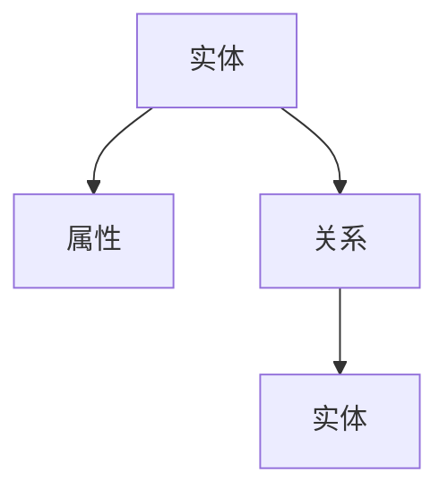
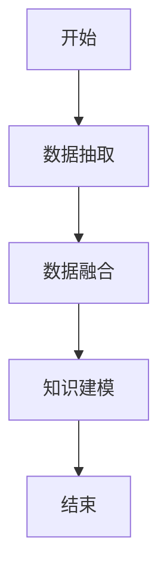
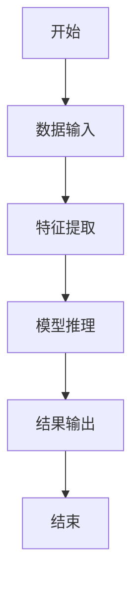
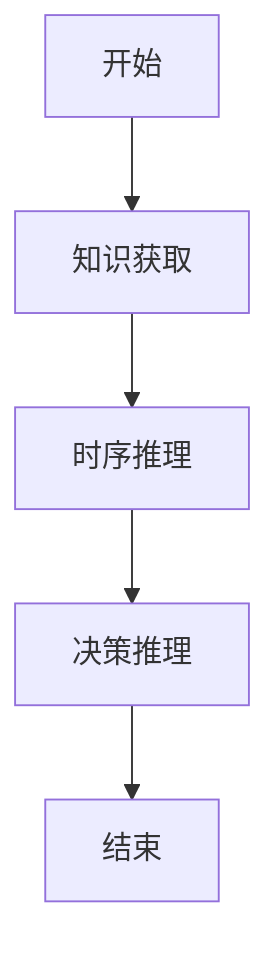
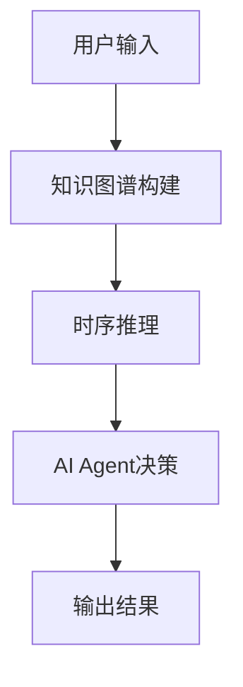
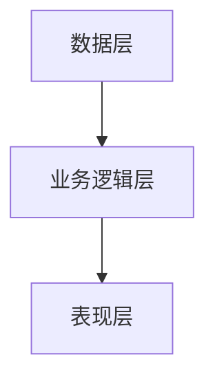
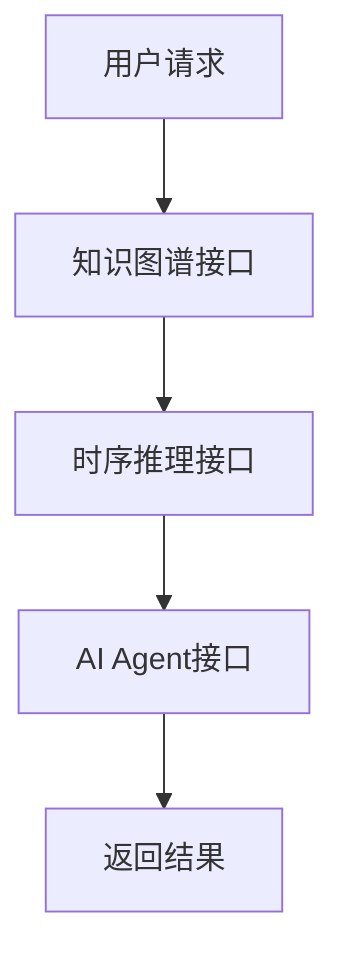
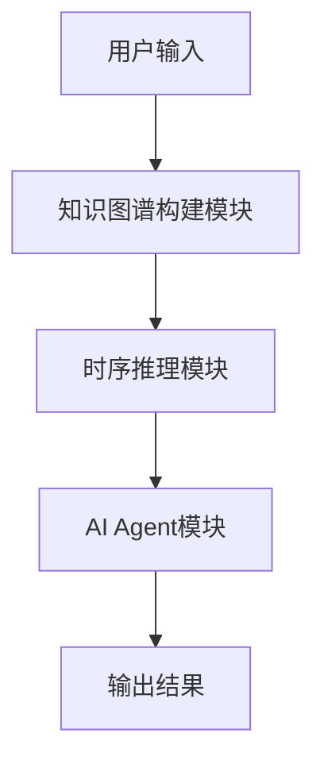

                 


# 《构建AI Agent的知识图谱时序推理系统》

> **关键词**：知识图谱、时序推理、AI Agent、算法原理、系统架构  
> **摘要**：本文系统地介绍了构建AI Agent的知识图谱时序推理系统的背景、核心概念、算法原理、系统架构、项目实战以及最佳实践。通过对知识图谱和时序推理的深入分析，结合AI Agent的设计与实现，展示了如何利用这些技术构建一个高效的知识推理系统。

---

# 第一章: 背景介绍与核心概念

## 1.1 问题背景

### 1.1.1 知识图谱的定义与特点
知识图谱是一种用于表示知识的图结构，由实体和关系组成，能够将分散的知识组织成一个统一的网络。其特点包括：
- **语义丰富**：通过实体间的关系表示复杂的语义信息。
- **结构化**：以图的形式组织知识，便于计算机理解和推理。
- **动态更新**：能够实时更新以反映新信息。

### 1.1.2 时序推理的定义与特点
时序推理是指基于时间序列数据进行推理和预测的过程。其特点包括：
- **时序依赖性**：推理结果依赖于时间序列中的前后关系。
- **动态性**：能够处理实时变化的数据。
- **复杂性**：涉及多个时间点的关联，推理过程复杂。

### 1.1.3 AI Agent的核心概念
AI Agent是一种智能体，能够感知环境并自主决策以实现目标。其核心概念包括：
- **自主性**：能够自主决策和行动。
- **反应性**：能够实时感知环境并做出反应。
- **学习能力**：能够通过学习提升自身的推理和决策能力。

## 1.2 问题描述

### 1.2.1 知识图谱构建的挑战
知识图谱的构建面临以下挑战：
- **数据多样性**：需要处理多种类型的数据。
- **数据准确性**：需要确保数据的准确性和一致性。
- **计算复杂性**：大规模知识图谱的构建需要高效的算法支持。

### 1.2.2 时序推理的复杂性
时序推理的复杂性主要体现在：
- **长序列处理**：处理长序列数据时计算开销大。
- **依赖关系**：需要处理复杂的时间依赖关系。
- **不确定性**：数据中可能存在噪声和不确定性。

### 1.2.3 AI Agent在知识图谱时序推理中的作用
AI Agent在知识图谱时序推理中的作用包括：
- **知识表示**：利用知识图谱表示知识。
- **推理能力**：利用时序推理技术进行推理。
- **自主决策**：基于推理结果做出决策。

## 1.3 问题解决思路

### 1.3.1 知识图谱构建方法
知识图谱的构建方法包括：
1. **数据抽取**：从文本、数据库等来源中抽取实体和关系。
2. **数据融合**：将多个来源的数据进行整合和清洗。
3. **知识建模**：构建图结构表示知识。

### 1.3.2 时序推理算法选择
时序推理算法选择的关键点包括：
- **数据类型**：选择适合处理时间序列数据的算法。
- **计算效率**：选择计算效率高的算法。
- **模型复杂度**：选择适合应用场景的模型复杂度。

### 1.3.3 AI Agent的设计与实现
AI Agent的设计与实现包括：
1. **感知模块**：感知环境并获取信息。
2. **推理模块**：基于知识图谱和时序推理进行推理。
3. **决策模块**：基于推理结果做出决策并执行。

## 1.4 边界与外延

### 1.4.1 知识图谱的边界
知识图谱的边界包括：
- **数据范围**：限定在特定领域或主题。
- **知识层次**：限定在特定的知识层次，如浅层知识。
- **更新频率**：限定在特定的更新频率。

### 1.4.2 时序推理的边界
时序推理的边界包括：
- **时间范围**：限定在特定的时间范围内。
- **数据量**：限定在特定的数据量。
- **推理深度**：限定在特定的推理深度。

### 1.4.3 AI Agent的边界
AI Agent的边界包括：
- **任务范围**：限定在特定的任务范围内。
- **决策权限**：限定在特定的决策权限。
- **环境交互**：限定在特定的环境交互方式。

## 1.5 核心概念结构与组成

### 1.5.1 知识图谱的核心要素
知识图谱的核心要素包括：
- **实体**：知识图谱中的基本单位。
- **关系**：实体之间的联系。
- **属性**：实体的特征或属性。

### 1.5.2 时序推理的核心要素
时序推理的核心要素包括：
- **时间序列数据**：用于推理的基础数据。
- **推理规则**：推理过程中的规则和逻辑。
- **推理结果**：推理过程中的输出结果。

### 1.5.3 AI Agent的核心要素
AI Agent的核心要素包括：
- **感知能力**：感知环境的能力。
- **推理能力**：推理和判断的能力。
- **决策能力**：做出决策的能力。
- **执行能力**：执行决策的能力。

---

# 第二章: 核心概念与联系

## 2.1 知识图谱与时序推理的关系

### 2.1.1 知识图谱为时序推理提供知识基础
知识图谱为时序推理提供以下知识基础：
- **实体关系**：提供实体之间的关系信息。
- **属性信息**：提供实体的属性信息。
- **语义信息**：提供语义信息以支持推理。

### 2.1.2 时序推理为知识图谱提供动态推理能力
时序推理为知识图谱提供以下动态推理能力：
- **动态更新**：支持知识图谱的动态更新。
- **实时推理**：支持实时推理和预测。
- **复杂推理**：支持复杂推理和关联分析。

## 2.2 知识图谱与AI Agent的结合

### 2.2.1 知识图谱作为AI Agent的知识库
知识图谱作为AI Agent的知识库，具有以下优势：
- **知识丰富性**：提供丰富的知识。
- **知识结构化**：知识以结构化的形式组织。
- **动态更新**：能够实时更新知识。

### 2.2.2 AI Agent利用时序推理能力进行决策
AI Agent利用时序推理能力进行决策，具有以下优势：
- **实时决策**：能够实时进行决策。
- **动态适应**：能够动态适应环境的变化。
- **复杂决策**：能够处理复杂的决策问题。

## 2.3 核心概念属性特征对比

| 概念         | 属性             | 特征                           |
|--------------|------------------|--------------------------------|
| 知识图谱     | 表示方式         | 图结构                         |
| 时序推理     | 方法             | 基于时间序列的推理             |
| AI Agent     | 行为             | 自主决策与执行                 |

## 2.4 ER实体关系图架构



---

## 2.5 核心概念之间的关系

### 2.5.1 知识图谱与AI Agent的关系
知识图谱作为AI Agent的知识库，AI Agent利用知识图谱进行推理和决策。

### 2.5.2 时序推理与AI Agent的关系
时序推理为AI Agent提供动态推理能力，AI Agent利用时序推理进行实时决策。

### 2.5.3 知识图谱与时序推理的关系
知识图谱为时序推理提供知识基础，时序推理为知识图谱提供动态推理能力。

---

# 第三章: 算法原理与数学模型

## 3.1 知识图谱构建算法

### 3.1.1 知识抽取算法
知识抽取算法包括：
- **实体抽取**：从文本中抽取实体。
- **关系抽取**：从文本中抽取关系。
- **属性抽取**：从文本中抽取属性。

### 3.1.2 知识融合算法
知识融合算法包括：
- **数据清洗**：清洗数据，去除噪声。
- **数据整合**：将多个数据源的数据进行整合。
- **冲突消解**：解决数据冲突。

### 3.1.3 知识图谱构建的数学模型
知识图谱构建的数学模型如下：

$$
\text{实体} = \{e_1, e_2, \ldots, e_n\}
$$

$$
\text{关系} = \{r_1, r_2, \ldots, r_m\}
$$

$$
\text{属性} = \{a_1, a_2, \ldots, a_k\}
$$

### 3.1.4 算法流程图


---

## 3.2 时序推理算法

### 3.2.1 时序推理方法
时序推理方法包括：
- **基于RNN的时序推理**：使用循环神经网络进行时序推理。
- **基于Transformer的时序推理**：使用Transformer模型进行时序推理。
- **基于HMM的时序推理**：使用隐马尔可夫模型进行时序推理。

### 3.2.2 时序推理的数学模型
时序推理的数学模型如下：

$$
p(x_t | x_{t-1}, x_{t-2}, \ldots, x_1)
$$

### 3.2.3 算法流程图


---

## 3.3 AI Agent的推理算法

### 3.3.1 AI Agent的推理过程
AI Agent的推理过程包括：
1. **知识获取**：获取知识图谱中的知识。
2. **时序推理**：基于时序数据进行推理。
3. **决策推理**：基于推理结果进行决策。

### 3.3.2 AI Agent推理的数学模型
AI Agent推理的数学模型如下：

$$
\text{决策} = \arg\max_{a} P(a | s)
$$

其中，$s$ 表示状态，$a$ 表示动作。

### 3.3.3 推理流程图


---

# 第四章: 系统分析与架构设计

## 4.1 项目背景

### 4.1.1 项目目标
项目目标是构建一个基于知识图谱的AI Agent时序推理系统。

### 4.1.2 项目范围
项目范围包括：
- 知识图谱的构建与管理。
- 时序推理算法的设计与实现。
- AI Agent的设计与实现。

### 4.1.3 项目需求
项目需求包括：
- 高效的知识图谱构建能力。
- 精准的时序推理能力。
- 自主决策能力。

## 4.2 系统功能设计

### 4.2.1 系统功能模块
系统功能模块包括：
1. **知识图谱构建模块**：负责知识图谱的构建与管理。
2. **时序推理模块**：负责时序推理的实现。
3. **AI Agent模块**：负责AI Agent的设计与实现。

### 4.2.2 系统功能流程
系统功能流程如下：



## 4.3 系统架构设计

### 4.3.1 系统架构选择
系统架构选择包括：
- **分层架构**：将系统分为数据层、业务逻辑层和表现层。
- **微服务架构**：将系统功能模块化为微服务。

### 4.3.2 系统架构图


## 4.4 系统接口设计

### 4.4.1 系统接口
系统接口包括：
- **知识图谱接口**：提供知识图谱的构建与查询接口。
- **时序推理接口**：提供时序推理的接口。
- **AI Agent接口**：提供AI Agent的决策接口。

### 4.4.2 接口交互流程
接口交互流程如下：



## 4.5 系统交互设计

### 4.5.1 系统交互流程
系统交互流程如下：



---

# 第五章: 项目实战

## 5.1 环境安装

### 5.1.1 系统需求
系统需求包括：
- 操作系统：Linux/Windows/MacOS。
- 内存：8GB以上。
- 处理器：支持多线程的CPU。

### 5.1.2 环境配置
环境配置包括：
- **Python**：3.8以上版本。
- **TensorFlow**：2.0以上版本。
- **PyTorch**：1.0以上版本。

## 5.2 系统核心实现

### 5.2.1 知识图谱构建代码
```python
class KnowledgeGraph:
    def __init__(self):
        self.graph = {}

    def add_entity(self, entity):
        if entity not in self.graph:
            self.graph[entity] = {}

    def add_relation(self, entity, relation, target):
        self.graph[entity][relation] = target
```

### 5.2.2 时序推理代码
```python
class TimeSeriesReasoning:
    def __init__(self):
        self.model = None

    def train(self, X, y):
        # 训练模型
        pass

    def predict(self, X):
        # 预测结果
        return self.model.predict(X)
```

### 5.2.3 AI Agent代码
```python
class AI-Agent:
    def __init__(self):
        self.graph = KnowledgeGraph()
        self.reasoning = TimeSeriesReasoning()

    def make_decision(self, input):
        # 获取知识
        self.graph.add_entity(input)
        # 进行推理
        result = self.reasoning.predict(input)
        # 做出决策
        return result
```

## 5.3 代码解读与分析

### 5.3.1 知识图谱构建代码解读
- **KnowledgeGraph类**：管理知识图谱。
- **add_entity方法**：添加实体。
- **add_relation方法**：添加关系。

### 5.3.2 时序推理代码解读
- **TimeSeriesReasoning类**：管理时序推理。
- **train方法**：训练模型。
- **predict方法**：预测结果。

### 5.3.3 AI Agent代码解读
- **AI-Agent类**：管理AI Agent。
- **make_decision方法**：做出决策。

## 5.4 实际案例分析

### 5.4.1 案例背景
假设我们有一个股票价格预测的案例，需要构建一个基于知识图谱的AI Agent时序推理系统。

### 5.4.2 数据准备
数据包括：
- **股票价格数据**：包括历史价格、交易量等。
- **市场新闻数据**：包括市场新闻、公司公告等。

### 5.4.3 知识图谱构建
构建知识图谱，包括股票实体、市场新闻实体以及它们之间的关系。

### 5.4.4 时序推理
基于股票价格数据和市场新闻数据进行时序推理，预测未来股票价格。

### 5.4.5 AI Agent决策
基于推理结果做出投资决策。

## 5.5 项目小结

### 5.5.1 项目总结
通过本项目，我们成功构建了一个基于知识图谱的AI Agent时序推理系统，实现了股票价格预测。

### 5.5.2 项目经验
- **知识图谱构建**：需要选择合适的数据源和算法。
- **时序推理**：需要选择合适的模型和算法。
- **AI Agent设计**：需要考虑系统的可扩展性和可维护性。

---

# 第六章: 最佳实践

## 6.1 小结

### 6.1.1 核心知识点总结
- 知识图谱的构建与管理。
- 时序推理算法的设计与实现。
- AI Agent的设计与实现。

### 6.1.2 系统设计总结
- 系统架构设计：选择合适的架构。
- 接口设计：设计合理的接口。
- 交互设计：设计合理的交互流程。

## 6.2 注意事项

### 6.2.1 开发注意事项
- **数据质量**：确保数据质量。
- **模型选择**：选择合适的模型。
- **系统优化**：优化系统性能。

### 6.2.2 部署注意事项
- **环境配置**：确保环境配置正确。
- **模型部署**：确保模型部署正确。
- **系统监控**：监控系统运行状态。

## 6.3 拓展阅读

### 6.3.1 推荐书籍
- 《知识图谱：概念、方法与应用》
- 《时序数据分析与预测》

### 6.3.2 推荐论文
- “知识图谱的构建与应用”
- “时序推理算法研究”

---

# 作者：AI天才研究院/AI Genius Institute & 禅与计算机程序设计艺术 /Zen And The Art of Computer Programming

