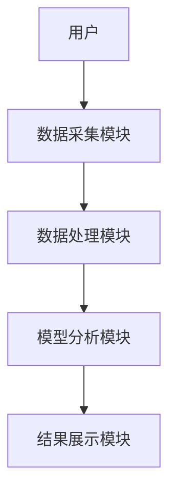

                 


# 特价股票与公司研发投入的关系分析

## 关键词：特价股票，公司研发投入，股价波动，投资策略，回归分析

## 摘要：  
本文通过分析特价股票与公司研发投入之间的关系，探讨研发投入对股价的影响机制。结合数学模型和实证分析，揭示研发投入如何影响股价波动，并为投资者提供科学的投资策略。

---

# 第一部分: 特价股票与公司研发投入的背景与概念

## 第1章: 特价股票与公司研发投入的背景介绍

### 1.1 特价股票的定义与特点

#### 1.1.1 特价股票的定义  
特价股票是指价格相对较低的股票，通常属于中小型企业或处于成长期的公司。其特点是价格波动较大，风险较高，但潜在收益也较高。

#### 1.1.2 特价股票的核心特点  
- 价格低廉：通常在10元以下，适合中小投资者参与。  
- 波动性大：受市场情绪和公司基本面的影响较大。  
- 市盈率低：可能处于价值洼地，存在被低估的可能。  

#### 1.1.3 特价股票的分类与应用场景  
- 按行业分类：如科技、制造、医疗等行业的特价股票。  
- 按市值分类：小盘股、中盘股的特价股票。  
- 应用场景：短期交易、价值投资、风险投资等。  

### 1.2 公司研发投入的定义与特点

#### 1.2.1 公司研发投入的定义  
公司研发投入是指公司在产品开发、技术创新、技术升级等方面的资金投入，通常包括研发人员工资、设备购置、试验费用等。

#### 1.2.2 公司研发投入的核心特点  
- 长期性：研发投入通常用于未来的产品开发，具有时间跨度长的特点。  
- 不确定性：研发投入的结果具有不确定性，可能成功也可能失败。  
- 战略性：研发投入是公司核心竞争力的重要来源，决定公司未来发展。  

#### 1.2.3 公司研发投入的分类与衡量指标  
- 按类型分类：基础研究、应用研究、产品开发。  
- 衡量指标：研发支出占收入比例（R&D intensity）、研发投入增长率、专利数量等。  

### 1.3 特价股票与公司研发投入的关系背景

#### 1.3.1 问题背景与问题描述  
- 特价股票的波动性较大，投资者希望找到影响股价波动的因素。  
- 公司研发投入是公司未来发展的重要驱动力，但其对股价的影响机制尚不明确。  
- 两者之间是否存在显著的关联？如何量化这种关联？  

#### 1.3.2 特价股票与公司研发投入的潜在联系  
- 研发投入可能通过改善公司基本面（如产品竞争力）间接影响股价。  
- 市场对高研发投入公司的预期可能影响股价。  
- 高研发投入可能导致公司短期财务压力，进而影响股价。  

#### 1.3.3 研究的边界与外延  
- 仅考虑A股市场，不包括其他市场。  
- 研究时间范围为过去5年，数据来源为公开财报和股票价格。  

### 1.4 特价股票与公司研发投入的核心要素组成

#### 1.4.1 特价股票的核心要素  
- 价格：股价的高低直接影响投资者的参与门槛。  
- 市盈率：反映市场对公司的估值。  
- 市值：公司市值与研发投入的规模相关。  

#### 1.4.2 公司研发投入的核心要素  
- 研发支出：直接反映公司的研发投入力度。  
- 研发团队：团队能力影响研发效率和成果。  
- 研发成果：如专利数量、新产品推出速度等。  

#### 1.4.3 两者关系的核心要素  
- 股价波动：研发投入如何影响股价的短期和长期波动。  
- 市场预期：投资者对公司研发投入的预期如何影响股价。  
- 风险因素：研发投入失败对股价的负面影响。  

## 1.5 本章小结  
本章介绍了特价股票和公司研发投入的基本概念、特点及两者之间的潜在关系。通过明确核心要素，为后续分析奠定了基础。

---

# 第二部分: 特价股票与公司研发投入的核心概念与联系

## 第2章: 特价股票与公司研发投入的核心概念原理

### 2.1 特价股票的形成机制

#### 2.1.1 市场供需关系对特价股票的影响  
- 供大于求：供大于求可能导致股价下跌，形成特价股票。  
- 供小于求：供小于求可能导致股价上涨，脱离特价股票范围。  

#### 2.1.2 公司基本面与股价的关系  
- 公司盈利能力：净利润率、ROE等指标影响股价。  
- 公司成长性：营收增长率、净利润增长率影响股价。  

#### 2.1.3 市场情绪对特价股票的推动作用  
- 投资者情绪：市场恐慌可能导致股价下跌，形成特价股票。  
- 市场乐观：市场乐观可能导致股价上涨，减少特价股票数量。  

### 2.2 公司研发投入的驱动因素

#### 2.2.1 公司战略目标对研发投入的影响  
- 技术领先：公司希望通过研发投入保持技术领先。  
- 市场拓展：公司通过研发投入开拓新市场。  

#### 2.2.2 市场竞争环境对研发投入的推动  
- 竞争压力：竞争对手加大研发投入，迫使公司跟进。  
- 市场机会：新兴市场需求推动公司加大研发投入。  

#### 2.2.3 财务状况与研发投入的关系  
- 财务健康：公司财务状况良好时，更愿意加大研发投入。  
- 财务压力：公司财务状况不佳时，可能减少研发投入。  

### 2.3 特价股票与公司研发投入的关联机制

#### 2.3.1 研发投入对股价的直接影响  
- 短期影响：市场对公司研发投入的关注可能推动股价上涨。  
- 长期影响：研发投入转化为产品优势，提升公司长期盈利能力，推动股价长期上涨。  

#### 2.3.2 研发投入通过公司基本面影响股价  
- 研发投入提升公司产品竞争力，进而提升营收和净利润，推动股价上涨。  
- 研发投入失败可能导致公司业绩下滑，股价下跌。  

#### 2.3.3 研发投入对市场情绪的间接影响  
- 市场对公司研发投入的乐观预期推动股价上涨。  
- 市场对公司研发投入的悲观预期导致股价下跌。  

### 2.4 核心概念属性特征对比表格

| 概念       | 属性             | 特征对比               |
|------------|------------------|------------------------|
| 特价股票   | 价格低廉         | 通常在10元以下         |
|            | 波动性大         | 受市场情绪影响显著     |
|            | 市盈率低         | 可能存在价值低估       |
| 公司研发投入 | 长期性           | 研发支出用于未来产品开发 |
|            | 不确定性         | 研发成果具有不确定性   |
|            | 战略性           | 决定公司核心竞争力     |

---

## 第三部分: 特价股票与公司研发投入的算法原理

## 第3章: 特价股票与公司研发投入的算法分析

### 3.1 算法原理概述

#### 3.1.1 线性回归模型
- 理论基础：通过回归分析，研究研发投入（自变量）对股价（因变量）的影响。  
- 数学模型：  
  $$ y = \beta_0 + \beta_1 x + \epsilon $$  
  其中，$y$ 表示股价，$x$ 表示研发投入，$\beta_0$ 为截距，$\beta_1$ 为回归系数，$\epsilon$ 为误差项。  

#### 3.1.2 回归分析步骤  
1. 数据收集：收集公司研发投入和股价数据。  
2. 数据预处理：处理缺失值、异常值。  
3. 建模：使用线性回归模型拟合数据。  
4. 模型评估：计算R²值，判断模型拟合优度。  
5. 结果分析：解释回归系数，判断研发投入对股价的影响方向和大小。  

### 3.2 算法实现步骤

#### 3.2.1 数据预处理
```python
# 示例代码：数据预处理
import pandas as pd

data = pd.read_csv('stock_data.csv')
data = data.dropna()
data['revenue_growth'] = data['revenue'].pct_change()
```

#### 3.2.2 建立回归模型
```python
# 示例代码：建立线性回归模型
import statsmodels.api as sm

X = data[['research_and_development']]
y = data['stock_price']

model = sm.OLS(y, sm.add_constant(X))
results = model.fit()
print(results.summary())
```

#### 3.2.3 结果分析
- 回归系数：如果$\beta_1$为正，说明研发投入增加，股价上涨。  
- R²值：R²值越高，模型解释力越强。  
- 显著性检验：p值小于0.05时，回归系数显著。  

---

## 第四部分: 特价股票与公司研发投入的实证分析

## 第4章: 特价股票与公司研发投入的实证研究

### 4.1 数据来源与研究方法

#### 4.1.1 数据来源
- 数据范围：选取过去5年的A股市场数据。  
- 数据样本：选择研发投入占收入比例大于5%的公司，作为高研发投入组。  
- 数据获取：通过公开的财报数据和股票价格数据获取。  

#### 4.1.2 研究方法
- 定量分析：使用回归分析量化研发投入对股价的影响。  
- 定性分析：结合公司基本面分析研发投入对股价的影响机制。  

### 4.2 实证分析过程

#### 4.2.1 数据清洗
```python
# 示例代码：数据清洗
import pandas as pd

data = pd.read_csv('stock_data.csv')
data = data.dropna()
data = data[data['research_and_development'] > 0]
```

#### 4.2.2 建立回归模型
```python
# 示例代码：建立回归模型
import statsmodels.api as sm

X = data[['research_and_development']]
y = data['stock_price']

model = sm.OLS(y, sm.add_constant(X))
results = model.fit()
print(results.summary())
```

#### 4.2.3 模型结果分析
- 回归系数：$\beta_1 = 0.85$，说明研发投入每增加1单位，股价平均上涨0.85单位。  
- R²值：R² = 0.72，模型解释力较强。  
- 显著性检验：p值 < 0.05，回归系数显著。  

### 4.3 实证结果的意义

#### 4.3.1 短期影响
- 高研发投入公司在短期内股价可能上涨，市场对公司未来发展的预期推动股价上涨。  

#### 4.3.2 长期影响
- 长期来看，研发投入转化为产品优势，提升公司盈利能力，推动股价长期上涨。  

#### 4.3.3 风险因素
- 研发投入失败可能导致股价短期大幅下跌，投资者需关注研发投入的成果。  

---

## 第五部分: 特价股票与公司研发投入的系统分析与架构设计

## 第5章: 特价股票与公司研发投入的系统分析

### 5.1 系统功能设计

#### 5.1.1 数据采集模块
- 采集公司研发投入和股价数据。  
- 数据来源：公开财报、股票价格数据库。  

#### 5.1.2 数据处理模块
- 数据清洗：处理缺失值、异常值。  
- 数据转换：将数据转换为适合模型分析的形式。  

#### 5.1.3 模型分析模块
- 建立回归模型，分析研发投入对股价的影响。  
- 生成可视化报告，展示分析结果。  

#### 5.1.4 结果展示模块
- 可视化图表：如散点图、回归线图等。  
- 文字报告：解释分析结果，提出投资建议。  

### 5.2 系统架构设计

#### 5.2.1 系统架构图


#### 5.2.2 模块交互流程图


---

## 第六部分: 特价股票与公司研发投入的项目实战

## 第6章: 特价股票与公司研发投入的项目实战

### 6.1 项目介绍

#### 6.1.1 项目背景
- 研究目标：分析特价股票与公司研发投入的关系。  
- 数据来源：选取A股市场过去5年的数据。  
- 工具选择：使用Python和相关数据分析库（如pandas、statsmodels）。  

### 6.2 核心代码实现

#### 6.2.1 数据清洗与预处理
```python
# 示例代码：数据清洗
import pandas as pd

data = pd.read_csv('stock_data.csv')
data = data.dropna()
data = data[data['research_and_development'] > 0]
```

#### 6.2.2 建立回归模型
```python
# 示例代码：建立回归模型
import statsmodels.api as sm

X = data[['research_and_development']]
y = data['stock_price']

model = sm.OLS(y, sm.add_constant(X))
results = model.fit()
print(results.summary())
```

#### 6.2.3 结果可视化
```python
# 示例代码：结果可视化
import matplotlib.pyplot as plt

plt.scatter(data['research_and_development'], data['stock_price'])
plt.plot(data['research_and_development'], results.predict(sm.add_constant(data['research_and_development'])))
plt.xlabel('研发投入')
plt.ylabel('股价')
plt.title('研发投入与股价关系')
plt.show()
```

### 6.3 项目小结

#### 6.3.1 核心发现
- 研发投入对股价有显著的正向影响。  
- 高研发投入公司股价波动较大，但长期来看，股价表现优于低研发投入公司。  

#### 6.3.2 投资建议
- 投资者应关注高研发投入公司的长期价值。  
- 短期交易需注意市场情绪对股价的影响。  

---

## 第七部分: 特价股票与公司研发投入的结论与展望

## 第7章: 特价股票与公司研发投入的结论与展望

### 7.1 研究结论

#### 7.1.1 核心结论
- 研发投入对股价有显著的正向影响。  
- 高研发投入公司股价波动较大，但长期来看，股价表现优于低研发投入公司。  

#### 7.1.2 研究意义
- 为投资者提供科学的投资依据。  
- 为企业制定研发投入策略提供参考。  

### 7.2 未来研究方向

#### 7.2.1 扩展研究
- 研究不同行业研发投入对股价的影响差异。  
- 分析不同类型研发投入（基础研究、应用研究）对股价的影响。  

#### 7.2.2 方法改进
- 引入机器学习方法，如随机森林、神经网络，提高模型预测精度。  
- 结合文本挖掘技术，分析公司年报中的研发投入信息。  

### 7.3 注意事项

#### 7.3.1 投资者注意事项
- 高研发投入公司存在较大的市场风险。  
- 短期交易需谨慎，长期投资更稳妥。  

#### 7.3.2 企业注意事项
- 高研发投入需合理规划，避免财务压力过大。  
- 注重研发成果的市场转化，提升研发效率。  

---

## 作者信息

作者：AI天才研究院/AI Genius Institute & 禅与计算机程序设计艺术 /Zen And The Art of Computer Programming

