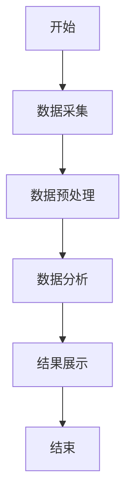
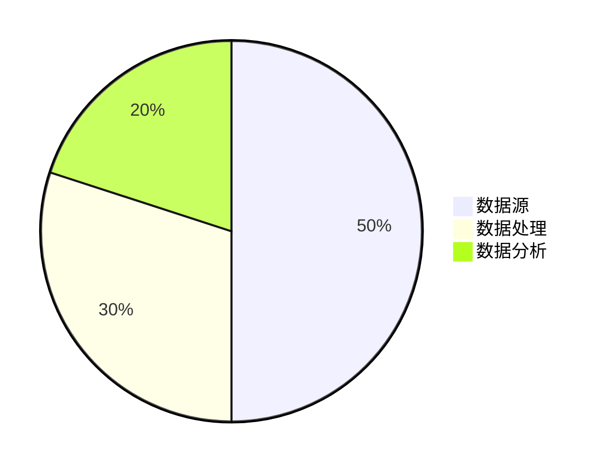
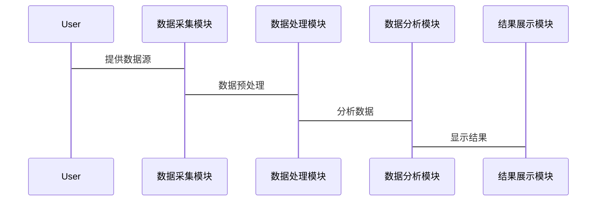

                 


# 特价股票投资中的产业集群分析方法

> **关键词**：特价股票、产业集群、投资分析、数学模型、算法实现

> **摘要**：本文详细探讨了在特价股票投资中，如何通过产业集群分析方法来优化投资策略。文章首先介绍了特价股票和产业集群的基本概念，然后分析了产业集群对股票投资的影响。接着，详细讲解了产业集群分析的核心概念、数学模型和算法实现，包括聚类分析、回归分析等方法，并通过实际案例展示了这些方法在投资中的应用。最后，本文总结了产业集群分析在投资中的重要性，并提出了未来研究的方向。

---

# 第1章: 特价股票投资与产业集群概述

## 1.1 特价股票投资的基本概念

### 1.1.1 特价股票的定义与特征

特价股票是指市场价格低于其内在价值的股票。通常，这些股票可能因为市场波动、公司暂时的困境或其他外部因素而被低估。其主要特征包括：

- 低估值：市场价格远低于公司净资产或未来现金流的现值。
- 高波动性：价格波动较大，容易受市场情绪影响。
- 高风险与高回报：投资风险较高，但潜在回报也较大。

### 1.1.2 特价股票投资的背景与现状

近年来，随着资本市场的快速发展，越来越多的投资者开始关注特价股票。特别是在经济下行周期，许多优质公司因市场恐慌而被低估，吸引了大量价值投资者的关注。然而，特价股票投资也面临着诸多挑战，如信息不对称、市场波动剧烈等。

### 1.1.3 特价股票投资的市场环境分析

市场环境是影响特价股票投资的重要因素。本文将从宏观经济环境、行业周期、政策环境等方面进行分析。例如，宏观经济的不确定性可能导致市场波动加剧，从而影响特价股票的价格。

---

## 1.2 产业集群的基本概念

### 1.2.1 产业集群的定义与特征

产业集群是指在地理上相对集中、具有互补性或协同性的企业群体。其核心特征包括：

- 地理集中：企业通常位于同一区域。
- 产业链互补：企业之间存在上下游关系。
- 协同效应：通过合作降低生产成本，提高效率。

### 1.2.2 产业集群的类型与分类

产业集群可以按照不同的标准进行分类，常见的分类方式包括：

- 按行业分类：如制造业产业集群、服务业产业集群。
- 按规模分类：小型产业集群、大型产业集群。
- 按区域分类：地方产业集群、国家级产业集群。

### 1.2.3 产业集群在经济中的作用

产业集群在经济发展中起着重要作用。它不仅能够提高企业的生产效率，还能降低交易成本，促进技术创新。此外，产业集群还能够增强区域经济竞争力，促进就业增长。

---

## 1.3 特价股票投资与产业集群的关联性

### 1.3.1 产业集群对股票投资的影响

产业集群的存在可以为投资者提供更多的投资机会。例如，在某一区域内，可能存在多个具有互补性的企业，这些企业的股票价格往往具有相关性。

### 1.3.2 特价股票投资中产业集群分析的必要性

通过分析产业集群，投资者可以更好地理解企业的经营环境和潜在风险。例如，在一个产业集群中，某些企业可能因产业链的协同而具有更强的竞争力。

### 1.3.3 产业集群分析在投资策略中的应用

产业集群分析可以帮助投资者制定更具针对性的投资策略。例如，投资者可以通过分析产业集群的产业链结构，找到具有竞争优势的企业进行投资。

---

## 1.4 本章小结

本章主要介绍了特价股票投资和产业集群的基本概念，并分析了它们之间的关联性。通过产业集群分析，投资者可以更好地识别投资机会，降低投资风险。

---

# 第2章: 特价股票投资中的产业集群分析方法

## 2.1 产业集群分析的核心概念

### 2.1.1 产业集群的构成要素

产业集群的构成要素主要包括：

- 企业：产业集群的核心。
- 产业链：企业的上下游关系。
- 资源：包括人力资源、技术资源等。
- 政策环境：政府的支持政策。

### 2.1.2 产业集群的形成机制

产业集群的形成通常需要以下几个条件：

- 地理集中：企业聚集在同一区域。
- 互补性：企业之间存在上下游关系。
- 协同效应：企业之间能够通过合作降低生产成本。

### 2.1.3 产业集群的竞争力分析

产业集群的竞争力主要体现在以下几个方面：

- 产业链协同：提高生产效率。
- 成本优势：通过规模效应降低生产成本。
- 技术创新：促进技术交流与合作。

---

## 2.2 特价股票投资中的产业集群分析框架

### 2.2.1 分析框架的构建

本文提出了一个基于产业集群分析的框架，包括以下几个步骤：

1. **数据收集**：收集相关企业的财务数据和市场数据。
2. **数据分析**：通过聚类分析、回归分析等方法对数据进行分析。
3. **结果解读**：根据分析结果制定投资策略。

### 2.2.2 分析框架的适用性与局限性

该分析框架适用于产业集群较为明显的行业。其局限性在于，对于一些分散的产业集群，可能难以准确分析。

### 2.2.3 分析框架的优化与改进

为了提高分析框架的准确性，可以引入更多的数据源，如企业社会责任数据、技术创新数据等。

---

## 2.3 产业集群分析方法的比较与选择

### 2.3.1 常见的产业集群分析方法

常用的产业集群分析方法包括：

- 聚类分析：用于识别产业集群的结构。
- 回归分析：用于分析产业集群的影响因素。
- 主成分分析：用于简化数据维度。

### 2.3.2 不同分析方法的优缺点

| 方法名称 | 优点 | 缺点 |
|----------|------|------|
| 聚类分析 | 可以发现数据中的自然分组 | 结果可能不稳定 |
| 回归分析 | 可以识别变量之间的关系 | 依赖于假设条件 |
| 主成分分析 | 可以降低数据维度 | 可能丢失重要信息 |

### 2.3.3 方法选择的策略与建议

在选择分析方法时，需要综合考虑数据特征、研究目标和计算复杂度等因素。

---

## 2.4 本章小结

本章详细介绍了产业集群分析的核心概念，并构建了一个基于产业集群分析的框架。通过比较不同分析方法的优缺点，为投资者提供了选择合适方法的参考。

---

# 第3章: 特价股票投资中的产业集群分析方法的具体应用

## 3.1 产业集群分析方法的数学模型

### 3.1.1 聚类分析模型

聚类分析是一种常用的产业集群分析方法。其基本思想是将相似的企业归为一类。常用的聚类算法包括K-means、层次聚类等。

### 3.1.2 回归分析模型

回归分析用于研究变量之间的关系。例如，可以通过回归分析研究产业集群对股票收益的影响。

### 3.1.3 主成分分析模型

主成分分析用于简化数据维度。例如，可以通过主成分分析提取产业集群的关键特征。

---

## 3.2 产业集群分析的算法实现

### 3.2.1 K-means聚类算法

K-means聚类算法是一种常用的无监督学习算法。其基本步骤如下：

1. **初始化**：随机选择K个质心。
2. **迭代**：计算每个数据点到质心的距离，将数据点归到最近的质心所在的簇。
3. **更新质心**：重新计算簇的质心。
4. **终止条件**：当质心不再变化时停止。

### 3.2.2 层次聚类算法

层次聚类是一种基于数据点之间相似性的聚类方法。其步骤包括：

1. **计算相似性矩阵**：计算每对数据点之间的相似性。
2. **聚类**：根据相似性矩阵进行层次聚类。

### 3.2.3 线性回归算法

线性回归用于研究变量之间的线性关系。其基本公式为：

$$ y = \beta_0 + \beta_1x + \epsilon $$

---

## 3.3 数学模型与公式

### 3.3.1 K-means聚类算法公式

K-means算法的目标是最小化以下目标函数：

$$ J = \sum_{i=1}^{k} \sum_{j=1}^{n_i} (x_j - c_i)^2 $$

其中，$k$ 是聚类数，$n_i$ 是第 $i$ 个簇中的数据点数，$x_j$ 是数据点，$c_i$ 是第 $i$ 个簇的质心。

### 3.3.2 线性回归模型公式

线性回归模型的参数 $\beta_0$ 和 $\beta_1$ 可以通过最小二乘法估计：

$$ \hat{\beta} = \arg\min_{\beta} \sum_{i=1}^{n} (y_i - \beta_0 - \beta_1x_i)^2 $$

---

## 3.4 算法实现与案例分析

### 3.4.1 算法实现步骤

以下是K-means算法的Python实现代码：

```python
from sklearn.cluster import KMeans
import numpy as np

# 假设我们有数据矩阵X
X = np.array([[1, 2], [3, 4], [5, 6], [7, 8], [9, 10]])

# 初始化K-means模型
kmeans = KMeans(n_clusters=2, random_state=0)

# 训练模型
kmeans.fit(X)

# 获取聚类结果
labels = kmeans.labels_
print(labels)
```

### 3.4.2 案例分析与结果解读

通过上述代码，我们可以将数据点分为两类。聚类结果可以帮助我们识别产业集群的结构。

### 3.4.3 案例分析的启示与总结

通过实际案例分析，我们可以验证产业集群分析方法的有效性，并根据分析结果制定相应的投资策略。

---

## 3.5 本章小结

本章通过具体案例展示了如何在特价股票投资中应用产业集群分析方法。通过数学模型和算法实现，投资者可以更好地识别投资机会，降低投资风险。

---

# 第4章: 特价股票投资中的产业集群系统分析与架构设计

## 4.1 系统分析与设计概述

### 4.1.1 系统分析的目标与方法

系统分析的目标是通过数据分析和建模，识别产业集群的特征。常用方法包括定性分析和定量分析。

### 4.1.2 系统设计的原则与步骤

系统设计需要遵循模块化、可扩展性等原则。步骤包括需求分析、功能设计、系统架构设计等。

### 4.1.3 系统分析与设计的注意事项

在系统分析与设计中，需要注意数据的准确性和模型的可解释性。

---

## 4.2 系统功能设计

### 4.2.1 系统功能模块

系统功能模块包括数据采集模块、数据分析模块、结果展示模块等。

### 4.2.2 系统功能流程图

以下是系统功能流程图的Mermaid图：



---

## 4.3 系统架构设计

### 4.3.1 系统架构图

以下是系统架构图的Mermaid图：



### 4.3.2 系统接口设计

系统接口设计需要考虑数据输入和输出的格式。例如，数据输入可以是CSV格式，数据输出可以是JSON格式。

### 4.3.3 系统交互设计

以下是系统交互设计的Mermaid图：



---

## 4.4 本章小结

本章通过系统分析与设计，展示了如何构建一个基于产业集群分析的系统。系统功能设计、架构设计和交互设计为投资者提供了高效的投资工具。

---

# 第5章: 特价股票投资中的产业集群分析方法的项目实战

## 5.1 项目背景与目标

### 5.1.1 项目背景

本项目旨在通过产业集群分析方法，识别具有投资价值的特价股票。

### 5.1.2 项目目标

通过数据分析和建模，找到具有竞争优势的企业进行投资。

---

## 5.2 项目实施步骤

### 5.2.1 环境配置

以下是项目环境配置的代码：

```python
# 安装所需的Python库
!pip install numpy pandas scikit-learn matplotlib
```

### 5.2.2 核心代码实现

以下是项目的核心代码：

```python
import pandas as pd
from sklearn.cluster import KMeans
import matplotlib.pyplot as plt

# 读取数据
data = pd.read_csv('data.csv')

# 数据预处理
data.dropna(inplace=True)

# 数据分析
kmeans = KMeans(n_clusters=3, random_state=0)
clusters = kmeans.fit_predict(data[['收益', '风险']])

# 可视化结果
plt.scatter(data['收益'], data['风险'], c=clusters, cmap='viridis')
plt.xlabel('收益')
plt.ylabel('风险')
plt.title('产业集群分析')
plt.show()
```

### 5.2.3 案例分析与结果解读

通过上述代码，我们可以将股票分为三类。每类股票代表不同的产业集群结构。

### 5.2.4 项目总结

通过项目实战，我们可以验证产业集群分析方法的有效性，并根据分析结果制定相应的投资策略。

---

## 5.3 本章小结

本章通过项目实战，展示了如何在实际中应用产业集群分析方法。通过环境配置、数据处理和结果可视化，投资者可以更好地识别投资机会。

---

# 第6章: 特价股票投资中的产业集群分析方法的最佳实践与总结

## 6.1 最佳实践 tips

### 6.1.1 数据来源的选择

选择可靠的数据源，确保数据的准确性和完整性。

### 6.1.2 模型的选择

根据具体问题选择合适的分析方法，避免盲目使用复杂模型。

### 6.1.3 结果的验证

通过交叉验证等方法，验证模型的准确性和稳定性。

---

## 6.2 小结

通过本文的分析，我们可以看到，产业集群分析方法在特价股票投资中具有重要的应用价值。通过合理选择分析方法和工具，投资者可以更好地识别投资机会，降低投资风险。

---

## 6.3 注意事项

### 6.3.1 数据的局限性

数据可能存在偏差，影响分析结果的准确性。

### 6.3.2 模型的假设条件

分析方法的假设条件可能影响结果的准确性。

### 6.3.3 投资风险

特价股票投资风险较高，投资者需谨慎决策。

---

## 6.4 拓展阅读

### 6.4.1 相关书籍

- 《投资学原理》
- 《产业集群与经济发展》

### 6.4.2 相关研究

- 基于大数据的产业集群分析
- 人工智能在股票投资中的应用

---

# 作者

**作者：AI天才研究院/AI Genius Institute & 禅与计算机程序设计艺术/Zen And The Art of Computer Programming**

