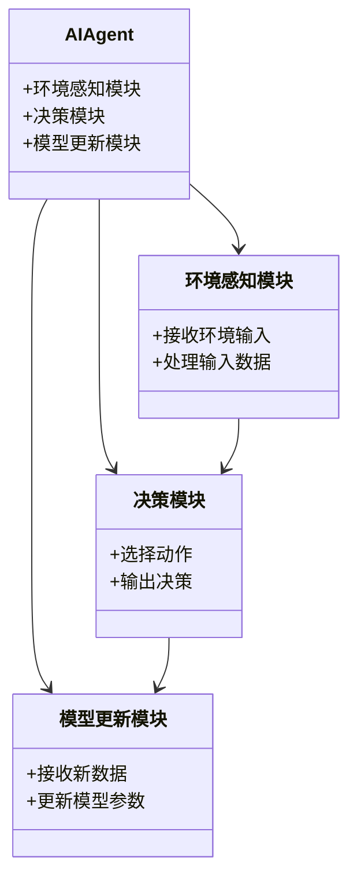
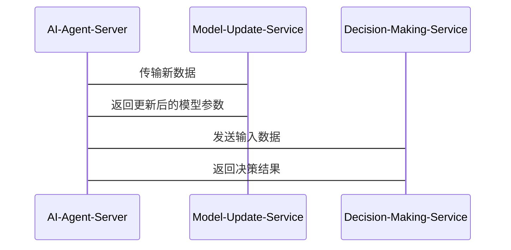

                 


# 设计AI Agent的持续学习与模型更新机制

> 关键词：AI Agent, 持续学习, 模型更新, 算法原理, 系统架构, 项目实战

> 摘要：本文系统地探讨了设计AI Agent的持续学习与模型更新机制的核心概念、算法原理、系统架构以及实际应用。通过分析持续学习的必要性、模型更新机制的重要性，结合具体的算法实现和系统设计，为读者提供了从理论到实践的全面指导。文章内容涵盖了经验重放机制、策略梯度方法、增量学习方法等核心算法，并通过Mermaid图和LaTeX公式详细阐述了系统架构和数学模型。

---

## 第1章: AI Agent的持续学习与模型更新背景

### 1.1 AI Agent的基本概念
AI Agent（人工智能代理）是一种能够感知环境并采取行动以实现目标的智能实体。它具备以下核心特点：
- **自主性**：能够在没有外部干预的情况下自主决策。
- **反应性**：能够实时感知环境变化并做出反应。
- **目标导向性**：通过优化目标函数来实现特定目标。

AI Agent广泛应用于自动驾驶、智能助手、机器人控制等领域。

### 1.2 持续学习的必要性
在动态环境中，AI Agent需要不断适应新的输入数据和环境变化。持续学习的重要性体现在以下几个方面：
- **实时性要求**：数据流通常是实时的，模型需要快速更新以保持性能。
- **环境变化**：环境可能发生变化，例如新的障碍物出现或用户需求变化，模型需要适应这些变化。
- **数据稀疏性**：新数据可能稀疏或不完整，模型更新需要高效处理这些数据。

### 1.3 模型更新机制的重要性
模型更新机制是AI Agent持续学习的核心。它通过调整模型参数以适应新的数据和环境。模型更新机制的重要性体现在：
- **性能优化**：通过更新模型参数，AI Agent可以保持或提升其性能。
- **适应性增强**：模型更新使AI Agent能够更好地适应动态环境。
- **鲁棒性提升**：通过模型更新，AI Agent可以减少过拟合风险，提高模型的泛化能力。

---

## 第2章: 持续学习的核心概念与联系

### 2.1 持续学习的核心概念
持续学习是一种机器学习范式，旨在通过不断接收新的数据样本或任务来提升模型的性能。其核心概念包括：
- **经验重放机制**：通过存储历史经验并重复学习，减少样本偏差。
- **策略梯度方法**：通过优化策略函数，使AI Agent在复杂环境中做出最优决策。
- **增量学习方法**：通过逐步更新模型参数，适应新数据。

### 2.2 模型更新机制的核心原理
模型更新机制通过调整模型参数，使模型能够适应新的数据。其核心原理包括：
- **数学模型**：模型更新通常基于优化算法，如随机梯度下降（SGD）。
- **优化目标**：模型更新的目标是最小化损失函数，最大化模型性能。
- **更新策略**：模型更新可以通过在线更新或批量更新进行，具体取决于应用场景。

### 2.3 持续学习与模型更新的关系
持续学习与模型更新相互依存，共同驱动AI Agent的性能提升。具体表现为：
- **持续学习驱动模型更新**：通过不断接收新数据，持续学习促使模型更新。
- **模型更新支持持续学习**：通过优化模型参数，模型更新为持续学习提供支持。
- **相互作用与依赖**：持续学习和模型更新的相互作用使AI Agent能够在动态环境中保持高性能。

---

## 第3章: 持续学习的算法原理

### 3.1 经验重放机制
经验重放是一种通过存储历史经验并重复学习来减少样本偏差的技术。其基本原理如下：

#### 经验重放的实现步骤
1. **存储经验**：将每次动作、状态和奖励存储在经验回放库中。
2. **采样经验**：随机采样一批经验，用于训练模型。
3. **更新模型**：基于采样的经验，更新模型参数。

#### 经验重放的优缺点分析
- **优点**：减少样本偏差，提高模型的泛化能力。
- **缺点**：存储和处理大量经验可能带来计算开销。

#### 经验重放的数学模型
经验重放的核心公式为：
$$ Q(s, a) = r + \gamma \max Q(s', a') $$
其中：
- $s$：当前状态
- $a$：当前动作
- $r$：奖励
- $s'$：下一个状态
- $\gamma$：折扣因子

### 3.2 策略梯度方法
策略梯度方法是一种通过优化策略函数来最大化期望奖励的方法。其基本原理如下：

#### 策略梯度的实现步骤
1. **定义策略函数**：$ \pi(a|s) $，表示在状态$s$下选择动作$a$的概率。
2. **计算梯度**：通过梯度上升方法，优化策略函数。
3. **更新策略**：基于梯度更新策略参数。

#### 策略梯度的数学模型
策略梯度的核心公式为：
$$ \nabla J(\theta) = \mathbb{E}_{s,a} \left[ \nabla \log \pi(a|s;\theta) Q(s,a) \right] $$
其中：
- $J(\theta)$：目标函数
- $\theta$：策略参数
- $Q(s,a)$：动作值函数

### 3.3 增量学习方法
增量学习方法是一种通过逐步更新模型参数来适应新数据的技术。其基本原理如下：

#### 增量学习的实现步骤
1. **接收新数据**：持续接收新的数据样本。
2. **更新模型**：基于新数据，更新模型参数。
3. **评估性能**：评估模型性能，调整更新策略。

#### 增量学习的数学模型
增量学习的核心公式为：
$$ \theta_{t+1} = \theta_t + \alpha (y_t - f(x_t;\theta_t)) \nabla f(x_t;\theta_t) $$
其中：
- $\theta_t$：当前模型参数
- $\alpha$：学习率
- $y_t$：目标输出
- $f(x_t;\theta_t)$：模型输出

---

## 第4章: 模型更新机制的系统分析与架构设计

### 4.1 系统分析
#### 问题场景介绍
在动态环境中，AI Agent需要实时接收新数据，并快速更新模型参数以适应环境变化。

#### 项目介绍
本项目旨在设计一种高效的模型更新机制，使AI Agent能够在动态环境中保持高性能。

#### 系统功能设计（领域模型Mermaid类图）


### 4.2 系统架构设计
#### 系统架构Mermaid架构图
```mermaid
docker
server AI-Agent-Server {
    Service AI-Agent-Server {
        Route /update -> Model-Update-Service
        Route /predict -> Decision-Making-Service
    }
    Component Model-Update-Service {
        Process update-model
    }
    Component Decision-Making-Service {
        Process make-decision
    }
}
```

#### 系统接口设计
- `/update`：接收新数据，触发模型更新。
- `/predict`：接收输入，返回预测结果。

#### 系统交互Mermaid序列图


---

## 第5章: 项目实战

### 5.1 环境安装与配置
#### 开发环境的选择
推荐使用Python 3.8及以上版本，安装必要的依赖库。

#### 依赖库的安装
```bash
pip install numpy matplotlib tensorflow
```

#### 环境配置步骤
1. 安装Python和必要的开发工具。
2. 安装依赖库。
3. 配置项目目录结构。

### 5.2 核心代码实现
#### 模型更新机制的代码实现
```python
import numpy as np
import tensorflow as tf

class ModelUpdater:
    def __init__(self):
        self.model = self.build_model()
        self.optimizer = tf.keras.optimizers.Adam(learning_rate=0.001)
    
    def build_model(self):
        model = tf.keras.Sequential([
            tf.keras.layers.Dense(64, activation='relu', input_shape=(input_dim,)),
            tf.keras.layers.Dense(output_dim, activation='linear')
        ])
        return model
    
    def update_model(self, x, y):
        with tf.GradientTape() as tape:
            predictions = self.model(x)
            loss = tf.keras.losses.mean_squared_error(y, predictions)
        gradients = tape.gradient(loss, self.model.trainable_weights)
        self.optimizer.apply_gradients(zip(gradients, self.model.trainable_weights))
```

#### 代码应用解读与分析
- **ModelUpdater类**：负责模型的构建和更新。
- **build_model方法**：构建神经网络模型。
- **update_model方法**：基于输入数据更新模型参数。

### 5.3 实际案例分析
假设我们设计一个简单的线性回归模型，用于预测房价。通过持续更新模型参数，使模型能够适应新的数据。

#### 数据生成与训练
```python
import numpy as np

# 生成训练数据
x = np.random.rand(100, 1)
y = 2 * x + 1 + np.random.normal(0, 0.1, (100, 1))

# 初始化模型更新器
model_updater = ModelUpdater()

# 更新模型
for i in range(100):
    model_updater.update_model(x, y)
```

#### 模型性能评估
```python
import matplotlib.pyplot as plt

# 预测结果
predictions = model_updater.model.predict(x)

# 绘制真实值与预测值
plt.scatter(x, y, c='r', label='True values')
plt.scatter(x, predictions, c='b', label='Predictions')
plt.legend()
plt.show()
```

### 5.4 项目小结
通过实际案例分析，我们可以看到模型更新机制在持续学习中的重要性。通过不断更新模型参数，AI Agent能够更好地适应新数据，提高预测准确性。

---

## 第6章: 总结与展望

### 6.1 总结
本文系统地探讨了设计AI Agent的持续学习与模型更新机制的核心概念、算法原理、系统架构以及实际应用。通过分析持续学习的必要性、模型更新机制的重要性，结合具体的算法实现和系统设计，为读者提供了从理论到实践的全面指导。

### 6.2 未来研究方向
未来的研究可以集中在以下几个方面：
- **更高效的模型更新算法**：探索更高效的模型更新算法，减少计算开销。
- **分布式模型更新机制**：研究分布式环境下的模型更新机制。
- **多任务持续学习**：探索多任务持续学习的理论与应用。

---

## 注意事项

1. **数据质量问题**：持续学习的效果依赖于数据的质量，需确保数据的准确性和代表性。
2. **模型更新的频率**：模型更新频率过高可能会增加计算开销，需权衡性能与资源消耗。
3. **模型的可解释性**：模型更新可能会影响模型的可解释性，需注意模型的可解释性问题。

---

## 拓展阅读

- **论文推荐**：《A survey on deep learning with incremental learning》
- **书籍推荐**：《Hands-On Machine Learning with Scikit-Learn, Keras, and TensorFlow》
- **工具推荐**：TensorFlow、PyTorch等深度学习框架。

---

作者：AI天才研究院/AI Genius Institute & 禅与计算机程序设计艺术 /Zen And The Art of Computer Programming

---

本文通过系统地探讨AI Agent的持续学习与模型更新机制，为读者提供了从理论到实践的全面指导。希望本文能为相关领域的研究者和实践者提供有价值的参考。

