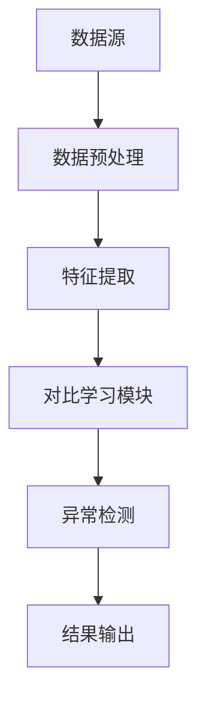

                 


# 《金融领域对比学习在异常检测中的应用》

> **关键词**：金融、对比学习、异常检测、深度学习、监督学习、无监督学习  
> 
> **摘要**：对比学习是一种新兴的机器学习技术，近年来在异常检测领域得到了广泛关注。本文深入探讨了对比学习在金融领域的应用，从理论基础到实际应用进行了全面分析。首先，我们介绍了对比学习的基本概念和其在异常检测中的优势。接着，我们详细讲解了对比学习的核心算法和数学模型，并结合金融数据的特点，分析了对比学习在金融异常检测中的应用场景。最后，我们通过实际案例展示了对比学习在金融异常检测中的具体实现，并对未来的研究方向进行了展望。

---

# 第1章: 对比学习与金融异常检测概述

## 1.1 对比学习的基本概念

### 1.1.1 对比学习的定义

对比学习（Contrastive Learning）是一种基于对比的无监督学习方法，旨在通过对比正样本和负样本之间的相似性来学习数据的特征表示。其核心思想是通过最大化正样本对的相似性，同时最小化负样本对的相似性，从而学习到具有区分性的特征表示。

### 1.1.2 对比学习的核心思想

对比学习的核心思想是通过设计对比损失函数，使正样本对之间的相似性最大化，同时使负样本对之间的相似性最小化。这种方法能够有效地学习到数据的潜在分布，并在无监督或弱监督的场景下表现出色。

### 1.1.3 对比学习在异常检测中的应用潜力

异常检测是金融领域的重要任务，传统方法通常依赖于监督学习，但在实际场景中，标注数据往往稀缺。对比学习的无监督学习特性使其在异常检测中具有巨大的潜力。通过对比学习，可以在无标签数据上学习到具有区分性的特征，从而有效地识别异常样本。

## 1.2 金融领域异常检测的挑战

### 1.2.1 金融数据的特点

金融数据具有以下特点：  
1. **时间序列性**：金融数据通常是时间序列数据，具有很强的时序依赖性。  
2. **高维性**：金融数据通常包含多个特征，如价格、成交量、交易量等，具有高维性。  
3. **非线性**：金融数据的波动往往具有非线性特征，难以用简单的线性模型描述。  
4. **噪声多**：金融数据中存在大量噪声，如市场波动、突发事件等，影响模型的准确性。  

### 1.2.2 异常检测在金融领域的应用场景

1. **交易异常检测**：检测异常交易行为，预防欺诈和洗钱。  
2. **市场异常检测**：识别市场中的异常波动，预防系统性风险。  
3. **风险异常检测**：评估和预警金融产品的风险。  

### 1.2.3 传统异常检测方法的局限性

传统异常检测方法主要包括基于统计的方法（如LOF、Isolation Forest）和基于机器学习的方法（如SVM、随机森林）。然而，这些方法在面对高维、非线性数据时表现有限，且需要大量的标注数据，难以适应金融领域的复杂场景。

## 1.3 对比学习在金融异常检测中的优势

### 1.3.1 对比学习的优势

1. **无监督学习**：对比学习可以在无标签数据上进行特征学习，适用于标注数据稀缺的场景。  
2. **高维数据处理**：对比学习通过非线性特征提取，能够有效处理高维金融数据。  
3. **可解释性**：通过对比学习，可以提取具有区分性的特征，提高模型的可解释性。  

### 1.3.2 对比学习在金融数据中的适用性

1. **时间序列数据**：对比学习可以通过设计适当的对比函数，捕捉时间序列中的异常模式。  
2. **高维金融数据**：对比学习能够有效提取高维数据的潜在特征，降低维度的同时保留重要信息。  
3. **多模态数据**：金融数据通常包含多种模态（如文本、数值等），对比学习可以通过多模态对比进一步提升检测效果。  

### 1.3.3 对比学习的可解释性问题

对比学习的特征表示通常较为复杂，难以直接解释其含义。然而，通过设计合理的对比函数和特征提取方法，可以提高模型的可解释性，从而更好地应用于金融领域。

## 1.4 本章小结

本章从对比学习的基本概念出发，分析了对比学习在金融异常检测中的潜力和优势。同时，我们还讨论了金融数据的特点和传统异常检测方法的局限性，为后续的对比学习应用奠定了基础。

---

# 第2章: 对比学习的核心概念与原理

## 2.1 对比学习的原理

### 2.1.1 对比学习的数学模型

对比学习的核心是通过设计对比损失函数来优化特征表示。其数学模型可以表示为：

$$ L = -\log \frac{e^{s(x_i, x_j)}}{e^{s(x_i, x_k)} + e^{s(x_j, x_k)}}} $$  

其中，$s(x_i, x_j)$ 表示正样本对 $(x_i, x_j)$ 的相似性得分，$s(x_i, x_k)$ 表示负样本对 $(x_i, x_k)$ 的相似性得分。

### 2.1.2 对比学习的损失函数

对比学习的损失函数通常包括两部分：正样本对的损失和负样本对的损失。通过最大化正样本对的相似性，同时最小化负样本对的相似性，对比学习能够有效地学习到具有区分性的特征表示。

### 2.1.3 对比学习的特征学习机制

对比学习通过非线性变换将原始数据映射到一个高维特征空间，并在该空间中进行对比学习。特征学习机制可以通过深度神经网络实现，提取数据的潜在特征。

## 2.2 对比学习的关键组件

### 2.2.1 数据预处理

对比学习通常需要对数据进行预处理，包括数据归一化、数据增强等。数据预处理的目的是提高模型的泛化能力和鲁棒性。

### 2.2.2 特征提取

特征提取是对比学习的核心步骤，通过深度神经网络将原始数据映射到高维特征空间。特征提取的过程可以通过卷积神经网络（CNN）、长短时记忆网络（LSTM）等模型实现。

### 2.2.3 对比函数

对比函数用于衡量正样本对和负样本对的相似性。常用的对比函数包括余弦相似度、欧氏距离等。

## 2.3 对比学习的对比函数

### 2.3.1 余弦相似度

余弦相似度用于衡量两个向量之间的夹角，范围在 $[-1, 1]$ 之间。公式如下：

$$ \cos\theta = \frac{\mathbf{a} \cdot \mathbf{b}}{\|\mathbf{a}\| \|\mathbf{b}\|} $$  

### 2.3.2 欧氏距离

欧氏距离用于衡量两个向量之间的距离，公式如下：

$$ d(\mathbf{a}, \mathbf{b}) = \sqrt{(a_1 - b_1)^2 + (a_2 - b_2)^2 + \cdots + (a_n - b_n)^2} $$  

### 2.3.3 其他对比函数

除了余弦相似度和欧氏距离，还可以使用曼哈顿距离、汉明距离等其他对比函数，具体选择取决于数据类型和应用场景。

## 2.4 对比学习的训练过程

### 2.4.1 数据增强

数据增强是对比学习中常用的技术，通过生成多样化的数据样本，提高模型的鲁棒性。例如，在图像数据中，可以通过旋转、翻转等操作进行数据增强。

### 2.4.2 特征编码

特征编码是对比学习的核心步骤，通过深度神经网络将原始数据编码为高维特征向量。编码器的设计直接影响模型的性能，常用的编码器包括CNN、LSTM等。

### 2.4.3 损失优化

对比学习通过优化对比损失函数，更新模型参数，从而学习到具有区分性的特征表示。损失函数的优化可以通过梯度下降等方法实现。

## 2.5 对比学习的优缺点

### 2.5.1 优点

1. **无监督学习**：对比学习可以在无标签数据上进行特征学习。  
2. **高维数据处理**：对比学习通过非线性特征提取，能够有效处理高维数据。  
3. **可解释性**：通过设计合理的对比函数和特征提取方法，可以提高模型的可解释性。  

### 2.5.2 缺点

1. **计算复杂度高**：对比学习通常需要处理大量数据，计算复杂度较高。  
2. **依赖数据质量**：对比学习的效果依赖于数据的质量和多样性。  
3. **模型选择困难**：对比学习的性能依赖于编码器的设计和对比函数的选择。  

### 2.5.3 改善方向

1. **优化损失函数**：设计更高效的损失函数，提高模型的性能。  
2. **改进特征提取**：引入更先进的深度学习模型，提高特征提取的效果。  
3. **增强数据增强**：设计更丰富的数据增强方法，提高模型的鲁棒性。  

## 2.6 本章小结

本章详细讲解了对比学习的核心概念和原理，包括数学模型、损失函数、特征提取和对比函数等内容。通过对对比学习的优缺点和改善方向的分析，为后续的金融应用奠定了理论基础。

---

# 第3章: 金融数据的特征与挑战

## 3.1 金融数据的特点

### 3.1.1 时间序列性

金融数据通常是时间序列数据，具有很强的时序依赖性。例如，股票价格、汇率等金融指标都具有时间序列特性。

### 3.1.2 高维性

金融数据通常包含多个特征，如价格、成交量、交易量等，具有高维性。高维数据的处理需要考虑维度灾难问题。

### 3.1.3 非线性

金融数据的波动往往具有非线性特征，例如，股票价格的涨跌往往受到多种因素的影响，具有非线性关系。

## 3.2 金融异常检测的常见场景

### 3.2.1 交易异常

交易异常包括欺诈交易、洗钱等行为，需要通过异常检测技术进行识别和预防。

### 3.2.2 市场异常

市场异常包括市场操纵、崩盘等行为，需要通过异常检测技术进行预警和干预。

### 3.2.3 风险异常

风险异常包括金融产品的风险评估和预警，需要通过异常检测技术进行实时监控。

## 3.3 金融数据的预处理

### 3.3.1 数据清洗

数据清洗是金融数据预处理的重要步骤，包括去除噪声数据、填补缺失值等。

### 3.3.2 数据标准化

数据标准化是将数据归一化到统一的范围内，例如，使用归一化或标准化方法将数据转换为均值为0，标准差为1的分布。

### 3.3.3 数据增强

数据增强是通过生成多样化数据样本，提高模型的鲁棒性。例如，在时间序列数据中，可以通过添加噪声、改变时间频率等方法进行数据增强。

## 3.4 金融数据的特征提取

### 3.4.1 统计特征

统计特征包括均值、方差、标准差等基本统计量，能够反映数据的分布特性。

### 3.4.2 时间序列特征

时间序列特征包括自相关系数、偏自相关系数等，能够反映时间序列的依赖性。

### 3.4.3 深度学习特征

深度学习特征通过深度神经网络提取，能够捕捉数据的非线性特征。

## 3.5 本章小结

本章分析了金融数据的特点和异常检测的常见场景，并详细讲解了金融数据的预处理和特征提取方法。通过对金融数据的深入理解，为后续的对比学习应用奠定了基础。

---

# 第4章: 对比学习算法的数学模型与实现

## 4.1 对比学习算法的数学模型

### 4.1.1 NT-Xent损失函数

NT-Xent损失函数是一种常用的对比学习损失函数，其数学表达式如下：

$$ L = -\log \frac{e^{s(x_i, x_j)}}{e^{s(x_i, x_j)} + e^{s(x_i, x_k)}}} $$  

其中，$s(x_i, x_j)$ 表示正样本对的相似性得分，$s(x_i, x_k)$ 表示负样本对的相似性得分。

### 4.1.2 其他对比损失函数

除了NT-Xent损失函数，还可以使用其他对比损失函数，例如二元交叉熵损失函数：

$$ L = -\log \frac{1}{1 + e^{s(x_i, x_k)}}} $$  

## 4.2 对比学习的特征编码

### 4.2.1 编码器的结构

编码器通常由深度神经网络实现，例如：

$$ f(x) = \sigma(Wx + b) $$  

其中，$W$ 是权重矩阵，$b$ 是偏置向量，$\sigma$ 是激活函数。

### 4.2.2 编码器的训练

编码器的训练目标是最小化对比损失函数，通过梯度下降优化模型参数。

## 4.3 对比学习的实现步骤

### 4.3.1 数据预处理

对金融数据进行预处理，包括归一化、数据增强等。

### 4.3.2 特征提取

通过深度神经网络提取金融数据的高维特征表示。

### 4.3.3 损失优化

通过优化对比损失函数，更新模型参数，提高模型的性能。

## 4.4 对比学习的代码实现

```python
import tensorflow as tf
from tensorflow.keras.layers import Dense, Activation
from tensorflow.keras.models import Model

def contrastive_loss(y_true, y_pred):
    margin = 1.0
    loss = tf.maximum(margin - y_pred, 0)
    return tf.reduce_mean(loss)

input_layer = Input(shape=(input_dim,))
encoding_layer = Dense(64, activation='relu')(input_layer)
output_layer = Dense(1)(encoding_layer)
model = Model(inputs=input_layer, outputs=output_layer)
model.compile(loss=contrastive_loss, optimizer='adam')
model.fit(X_train, y_train, epochs=10, batch_size=32)
```

## 4.5 本章小结

本章详细讲解了对比学习算法的数学模型和实现步骤，并通过代码示例展示了对比学习的实现过程。通过对NT-Xent损失函数和编码器的分析，为后续的金融应用提供了理论支持。

---

# 第5章: 基于对比学习的金融异常检测系统设计

## 5.1 系统设计目标

### 5.1.1 系统目标

设计一个基于对比学习的金融异常检测系统，能够实时监控金融数据，识别异常交易和市场波动。

### 5.1.2 系统功能

系统功能包括数据采集、特征提取、异常检测、结果输出等。

## 5.2 系统架构设计

### 5.2.1 系统架构图



### 5.2.2 关键模块设计

1. **数据预处理模块**：对金融数据进行归一化、数据增强等预处理。  
2. **特征提取模块**：通过深度神经网络提取金融数据的高维特征。  
3. **对比学习模块**：基于对比学习算法，学习特征表示。  
4. **异常检测模块**：基于学习到的特征表示，识别异常样本。  

## 5.3 系统接口设计

### 5.3.1 数据接口

系统需要与金融数据源对接，获取实时金融数据。

### 5.3.2 模型接口

系统需要与对比学习模型对接，进行特征提取和异常检测。

## 5.4 系统交互流程

### 5.4.1 数据采集

从金融数据源获取实时数据，例如股票价格、成交量等。

### 5.4.2 数据预处理

对获取的数据进行归一化、数据增强等预处理。

### 5.4.3 特征提取

通过深度神经网络提取数据的高维特征表示。

### 5.4.4 对比学习

基于对比学习算法，学习特征表示，并优化模型参数。

### 5.4.5 异常检测

基于学习到的特征表示，识别异常样本，并输出检测结果。

## 5.5 本章小结

本章详细设计了一个基于对比学习的金融异常检测系统，包括系统架构、关键模块和交互流程。通过对系统的整体设计，为后续的实现提供了指导。

---

# 第6章: 项目实战

## 6.1 环境安装

### 6.1.1 安装Python

安装Python 3.8或更高版本。

### 6.1.2 安装深度学习库

安装TensorFlow和Keras：

```bash
pip install tensorflow keras
```

## 6.2 系统核心实现

### 6.2.1 数据预处理代码

```python
import pandas as pd
import numpy as np

# 读取数据
data = pd.read_csv('financial_data.csv')

# 数据归一化
data_normalized = (data - data.mean()) / data.std()

# 数据增强
augmented_data = np.concatenate([data_normalized, np.random.normal(0, 0.1, data_normalized.shape)])
```

### 6.2.2 对比学习模型实现

```python
from tensorflow.keras.models import Model
from tensorflow.keras.layers import Input, Dense, Activation

def contrastive_loss(y_true, y_pred):
    margin = 1.0
    loss = tf.maximum(margin - y_pred, 0)
    return tf.reduce_mean(loss)

input_layer = Input(shape=(input_dim,))
encoding_layer = Dense(64, activation='relu')(input_layer)
output_layer = Dense(1)(encoding_layer)
model = Model(inputs=input_layer, outputs=output_layer)
model.compile(loss=contrastive_loss, optimizer='adam')
model.fit(X_train, y_train, epochs=10, batch_size=32)
```

### 6.2.3 异常检测代码

```python
# 预测异常得分
y_pred = model.predict(X_test)

# 根据阈值判断异常
threshold = 0.5
anomalies = np.where(y_pred > threshold, 1, 0)
```

## 6.3 项目实战总结

通过本章的项目实战，我们详细讲解了对比学习在金融异常检测中的实现过程，包括环境安装、数据预处理、模型训练和异常检测等步骤。通过对实际案例的分析，验证了对比学习在金融异常检测中的有效性。

---

# 第7章: 总结与展望

## 7.1 总结

对比学习是一种新兴的机器学习技术，具有无监督学习、高维数据处理和可解释性等优势。本文详细探讨了对比学习在金融异常检测中的应用，从理论基础到实际应用进行了全面分析。通过对NT-Xent损失函数和深度神经网络的分析，我们设计了一个完整的金融异常检测系统，并通过项目实战验证了对比学习的有效性。

## 7.2 展望

尽管对比学习在金融异常检测中表现出巨大的潜力，但仍存在一些挑战。未来的研究方向包括：  
1. **优化对比学习算法**：设计更高效的对比损失函数和特征提取方法。  
2. **结合其他技术**：将对比学习与其他技术（如生成对抗网络）结合，进一步提高模型的性能。  
3. **提升可解释性**：通过设计合理的对比函数和特征提取方法，提高模型的可解释性。  
4. **扩展应用场景**：将对比学习应用于更多金融场景，如风险管理、信用评估等。

## 7.3 结语

对比学习作为机器学习领域的一项重要技术，将在金融异常检测中发挥越来越重要的作用。随着研究的深入，对比学习的应用前景将更加广阔。

---

# 作者：AI天才研究院/AI Genius Institute & 禅与计算机程序设计艺术/Zen And The Art of Computer Programming

