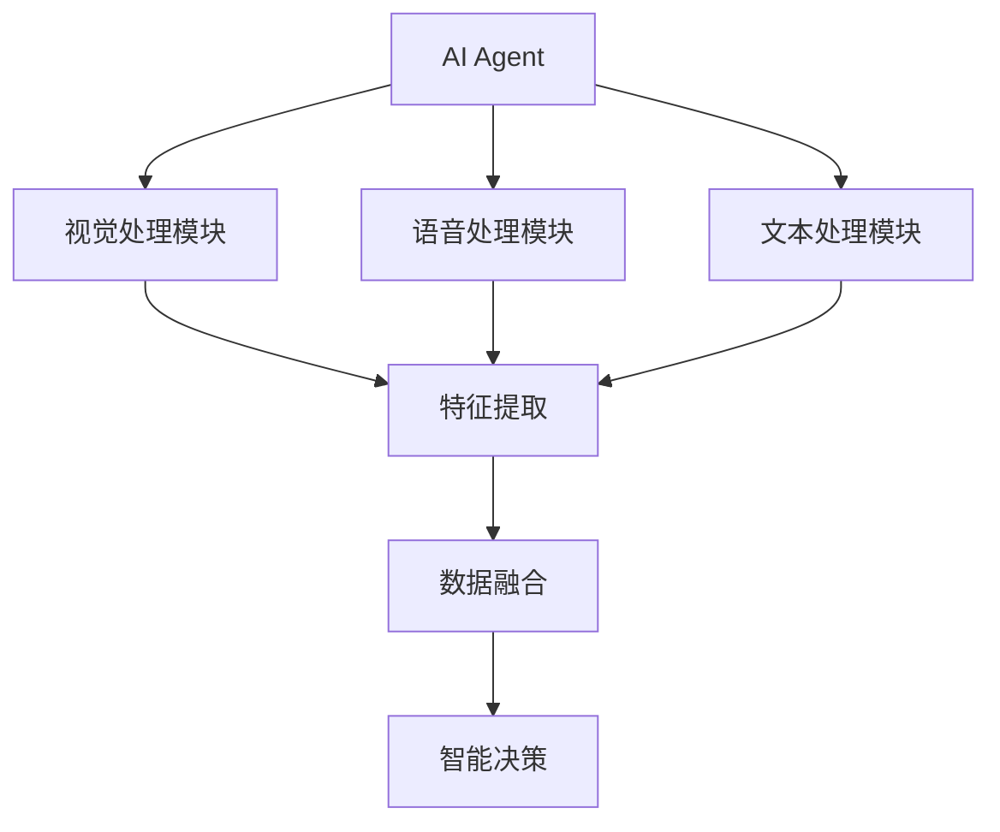

                 


# AI Agent的视觉-语音-文本多模态融合

> 关键词：AI Agent、多模态融合、视觉处理、语音处理、文本处理、融合算法

> 摘要：  
本文系统地探讨了AI Agent在视觉、语音和文本多模态数据融合方面的技术原理和应用实践。通过分析多模态数据的特征提取、融合方法及其数学模型，结合实际应用场景，详细阐述了AI Agent如何通过多模态数据的协同工作实现更强大的智能交互能力。本文内容涵盖从基础理论到实际应用的全链条，旨在为相关领域的研究者和开发者提供深入的技术洞察与实践指导。

---

# 第二部分: 多模态数据处理基础

# 第2章: 视觉数据处理基础

## 2.1 图像与视频处理概述

### 2.1.1 图像处理的基本概念与方法

图像处理是计算机视觉领域的基础技术，其目标是通过对图像的分析和变换，提取有用的信息或改善图像的质量。常见的图像处理方法包括：

1. **图像增强**：通过调整亮度、对比度、锐化等操作改善图像质量。
2. **图像分割**：将图像分割为多个区域，识别图像中的物体边界。
3. **图像识别**：基于深度学习模型（如CNN）识别图像中的物体或场景。

### 2.1.2 视频处理的基本概念与方法

视频处理是对视频数据的分析和处理，其核心挑战在于时间和空间维度的复杂性。常见的视频处理方法包括：

1. **视频流处理**：实时处理视频流，用于实时监控或直播场景。
2. **视频分割**：将视频分割为关键帧和非关键帧，降低计算复杂度。
3. **视频识别**：基于3D CNN等模型识别视频中的物体或动作。

### 2.1.3 常见的图像与视频处理算法

- **图像处理算法**：Sobel边缘检测、Canny边缘检测、Hough变换等。
- **视频处理算法**：背景建模、运动估计、光流法等。

---

## 2.2 视觉数据的特征提取与表示

### 2.2.1 基于CNN的图像特征提取

卷积神经网络（CNN）是图像特征提取的主流方法。其核心思想是通过卷积操作提取图像的局部特征，并通过池化操作降低计算复杂度。典型的CNN架构包括LeNet、AlexNet、VGGNet、ResNet等。

#### CNN的数学模型
$$
\text{Conv}(x, w) = \sum_{i,j} w[i,j] \cdot x[i+j,j] + b
$$

其中，\( x \) 是输入特征图，\( w \) 是卷积核权重，\( b \) 是偏置项。

### 2.2.2 基于Transformer的图像特征提取

Transformer架构最初用于自然语言处理，但在计算机视觉领域也展现出巨大潜力。Vision Transformer (ViT) 将图像划分为块，将每个块表示为一个token，通过自注意力机制提取全局特征。

#### Transformer的注意力机制公式
$$
\alpha_{i,j} = \frac{\exp(\text{sim}(x_i, x_j))}{\sum_{k} \exp(\text{sim}(x_i, x_k))}
$$

其中，\( \text{sim}(x_i, x_j) \) 是查询 \( x_i \) 和键 \( x_j \) 的相似度。

### 2.2.3 视觉数据的多模态表示方法

多模态表示旨在将视觉、语音和文本数据统一表示为某种共同的特征空间。常用的方法包括：

1. **模态对齐**：通过映射函数将不同模态的特征对齐到同一空间。
2. **模态融合**：通过加权或注意力机制将多模态特征融合为一个统一的表示。

---

## 2.3 视觉数据处理的挑战与解决方案

### 2.3.1 视觉数据处理的主要挑战

1. **计算复杂度高**：尤其是对于高分辨率图像和视频，计算资源消耗较大。
2. **数据异质性**：不同模态的数据格式和特征空间差异较大，难以直接融合。
3. **实时性要求**：在实时应用中，如何在保证精度的同时降低处理延迟是一个难题。

### 2.3.2 常见的解决方案与技术路线

1. **轻量化模型设计**：通过模型剪枝、知识蒸馏等技术降低模型复杂度。
2. **多模态联合优化**：在特征提取阶段同时考虑多模态信息，减少后期融合的复杂性。
3. **边缘计算与分布式处理**：通过边缘计算和分布式架构降低处理延迟。

### 2.3.3 未来发展趋势与研究方向

1. **自适应视觉处理**：根据场景动态调整处理策略，提升鲁棒性。
2. **多模态协同优化**：研究视觉、语音和文本之间的协同关系，提升融合效果。
3. **实时性与精度的平衡**：在保证精度的前提下，优化处理速度。

---

## 2.4 本章小结

本章详细介绍了视觉数据处理的基础知识，包括图像和视频处理的基本概念、特征提取方法以及多模态表示策略。通过分析视觉数据处理的挑战与解决方案，为后续的多模态融合奠定了基础。

---

# 第3章: 语音数据处理基础

## 3.1 语音信号处理概述

### 3.1.1 语音信号的基本特性

语音信号是声音的时序信号，具有时变性和非线性特点。语音信号的主要特性包括：

1. **时域特性**：幅度、频率随时间的变化。
2. **频域特性**：能量分布、频谱特征。
3. **时频特性**：语音信号的时频分析（如STFT）。

### 3.1.2 常见的语音信号处理方法

1. **语音增强**：通过降噪算法提升语音质量。
2. **语音识别**：基于深度学习模型（如RNN、Transformer）识别语音内容。
3. **语音合成**：通过TTS（文本到语音）技术生成自然语音。

### 3.1.3 语音识别与合成的基本原理

- **语音识别**：通过特征提取、模型训练和解码过程将语音信号转换为文本。
- **语音合成**：基于声学模型和声码器生成目标语音。

---

## 3.2 语音数据的特征提取与表示

### 3.2.1 基于MFCC的语音特征提取

梅尔频率倒谱系数（MFCC）是常用的语音特征提取方法。其步骤包括：

1. **预处理**：加窗、预加重。
2. **傅里叶变换**：计算频谱。
3. **梅尔滤波器 banks**：提取频带能量。
4. **倒谱计算**：提取时域特征。

#### MFCC的计算公式
$$
\text{MFCC}(t) = \log\left(\sum_{k} B_k(f_t) \cdot e^{-k \cdot \tau}\right)
$$

其中，\( B_k(f_t) \) 是第 \( k \) 个滤波器的输出，\( \tau \) 是时间常数。

### 3.2.2 基于深度学习的语音特征提取

深度学习模型（如CNN、Transformer）在语音特征提取中表现出色。特别是Transformer架构，通过自注意力机制捕捉长距离依赖关系，提升了语音识别的性能。

---

## 3.3 语音数据处理的挑战与解决方案

### 3.3.1 语音数据处理的主要挑战

1. **噪声干扰**：实际场景中的噪声会影响语音识别和合成的准确性。
2. **语种多样性**：多语种场景下的模型适应性问题。
3. **实时性要求**：实时语音处理需要高效算法和硬件支持。

### 3.3.2 常见的解决方案与技术路线

1. **噪声鲁棒性优化**：通过数据增强和模型训练提升模型的抗噪声能力。
2. **多语种模型**：通过迁移学习和数据联合训练提升多语种支持能力。
3. **轻量化设计**：通过模型压缩和优化算法降低计算复杂度。

### 3.3.3 未来发展趋势与研究方向

1. **端到端语音处理**：研究端到端的语音识别和合成模型，减少特征提取和解码的复杂性。
2. **多模态协同优化**：结合视觉和文本信息，提升语音处理的准确性和智能化水平。
3. **边缘计算应用**：探索语音处理在边缘设备上的应用，推动智能化终端的发展。

---

## 3.4 本章小结

本章详细介绍了语音数据处理的基础知识，包括语音信号的基本特性、特征提取方法以及语音识别与合成的基本原理。通过分析语音数据处理的挑战与解决方案，为后续的多模态融合奠定了基础。

---

# 第4章: 文本数据处理基础

## 4.1 文本处理概述

### 4.1.1 文本数据的基本特性

文本数据是字符序列，具有离散性和结构性特点。文本数据的主要特性包括：

1. **语义信息**：文本的含义依赖于上下文和语法规则。
2. **语义多样性**：同一文本在不同上下文中可能有不同的含义。
3. **格式多样性**：文本可以是结构化的（如HTML）或非结构化的（如自然文本）。

### 4.1.2 常见的文本处理方法

1. **文本分词**：将文本分割为单词或短语。
2. **文本摘要**：提取文本的关键信息，生成摘要。
3. **文本分类**：根据文本内容进行分类（如情感分类、主题分类）。

### 4.1.3 文本生成与理解的基本原理

- **文本生成**：基于生成式模型（如GPT）生成新的文本内容。
- **文本理解**：通过编码器-解码器架构理解文本语义。

---

## 4.2 文本数据的特征提取与表示

### 4.2.1 基于词袋模型的文本特征提取

词袋模型（Bag of Words, BoW）是一种简单的文本特征提取方法。其步骤包括：

1. **分词**：将文本分割为单词或短语。
2. **特征向量化**：统计每个单词的出现频率。

#### 词袋模型的计算公式
$$
\text{BoW}(x_i) = \sum_{j=1}^{n} w_j \cdot \mathbb{I}(x_i = w_j)
$$

其中，\( w_j \) 是第 \( j \) 个单词，\( \mathbb{I}(x_i = w_j) \) 是指示函数，表示 \( x_i \) 是否等于 \( w_j \)。

### 4.2.2 基于深度学习的文本特征提取

深度学习模型（如Transformer）在文本特征提取中表现出色。通过自注意力机制，模型可以捕捉到长距离依赖关系，提升文本理解能力。

---

## 4.3 文本数据处理的挑战与解决方案

### 4.3.1 文本数据处理的主要挑战

1. **语义理解困难**：文本的语义信息复杂，难以通过简单的特征提取方法捕捉。
2. **数据稀疏性**：长尾现象导致部分文本数据稀疏，影响模型性能。
3. **多语言支持**：多语言场景下的模型适应性问题。

### 4.3.2 常见的解决方案与技术路线

1. **预训练模型**：通过大规模预训练（如BERT）提升模型的语义理解能力。
2. **数据增强**：通过数据增强技术（如同义词替换）缓解数据稀疏性问题。
3. **多语言模型**：通过联合训练和迁移学习提升多语言支持能力。

### 4.3.3 未来发展趋势与研究方向

1. **生成式文本处理**：研究生成式模型（如GPT-4）在文本处理中的应用。
2. **多模态协同优化**：结合视觉和语音信息，提升文本处理的智能化水平。
3. **实时性优化**：通过模型优化和硬件加速提升文本处理的实时性。

---

## 4.4 本章小结

本章详细介绍了文本数据处理的基础知识，包括文本处理的基本概念、特征提取方法以及文本生成与理解的基本原理。通过分析文本数据处理的挑战与解决方案，为后续的多模态融合奠定了基础。

---

# 第五章: 多模态数据融合方法

## 5.1 多模态数据融合的基本原理

### 5.1.1 多模态数据融合的定义与分类

多模态数据融合是将来自不同模态的数据（如视觉、语音、文本）进行协同处理，以提升智能系统的感知和理解能力。多模态数据融合可以分为以下几种类型：

1. **浅层融合**：在特征级别进行融合，如简单的加法或加权。
2. **深层融合**：在模型内部进行融合，如通过注意力机制或转换器架构。

### 5.1.2 多模态数据融合的数学模型与算法

- **注意力机制**：通过注意力机制对不同模态的特征进行加权融合。
- **转换器架构**：通过模态间转换器实现跨模态信息的协同处理。

#### 注意力机制的公式
$$
\alpha_i = \frac{\exp(\text{sim}(x_i, y_j))}{\sum_{k} \exp(\text{sim}(x_i, y_k))}
$$

其中，\( x_i \) 是视觉特征，\( y_j \) 是语音特征，\( \text{sim} \) 是相似度计算函数。

### 5.1.3 多模态数据融合的挑战与解决方案

1. **模态异构性**：不同模态的数据格式和特征空间差异较大，难以直接融合。
2. **融合策略选择**：如何选择合适的融合策略对融合效果至关重要。
3. **计算复杂度**：多模态数据的融合可能增加计算复杂度，尤其是在实时应用中。

---

## 5.2 多模态数据融合的数学模型与算法

### 5.2.1 基于注意力机制的多模态融合模型

注意力机制是一种有效的多模态融合方法。通过计算不同模态特征之间的相似度，模型可以自动学习各模态的重要性。

#### 注意力机制的实现步骤
1. **特征提取**：分别提取视觉、语音和文本特征。
2. **相似度计算**：计算各模态特征之间的相似度。
3. **加权融合**：根据相似度计算各模态的权重，并进行加权融合。

### 5.2.2 基于图神经网络的多模态融合模型

图神经网络（Graph Neural Network, GNN）通过构建模态间的图结构，实现跨模态信息的协同处理。

#### 图神经网络的实现步骤
1. **构建模态图**：将多模态数据表示为图结构，节点代表模态特征，边表示模态间的关联。
2. **特征传播**：通过消息传递机制在图中传播特征信息。
3. **融合与聚合**：在图的各个节点上聚合特征信息，生成最终的融合结果。

---

## 5.3 多模态数据融合的算法实现

### 5.3.1 多模态数据融合的Python代码实现

以下是一个简单的多模态数据融合算法的Python代码示例：

```python
import numpy as np
from sklearn.metrics.pairwise import cosine_similarity

def multimodal_fusion(features_list, weights):
    # 计算各模态特征之间的相似度
    similarity_matrix = cosine_similarity(features_list)
    
    # 根据相似度计算权重
    weight_matrix = similarity_matrix * weights
    
    # 融合特征
    fused_feature = np.sum(weight_matrix, axis=1)
    
    return fused_feature

# 示例数据
visual_feature = np.random.randn(1, 128)
audio_feature = np.random.randn(1, 128)
text_feature = np.random.randn(1, 128)

features_list = [visual_feature, audio_feature, text_feature]
weights = [0.5, 0.3, 0.2]

# 调用融合函数
fused_feature = multimodal_fusion(features_list, weights)
print("Fused Feature:", fused_feature)
```

### 5.3.2 算法的数学模型和公式

- **相似度计算公式**：余弦相似度
$$
\text{sim}(x, y) = \frac{x \cdot y}{\|x\| \|y\|}
$$

- **加权融合公式**：
$$
z = \sum_{i=1}^{n} \alpha_i x_i
$$

其中，\( \alpha_i \) 是第 \( i \) 个模态的权重。

---

## 5.4 本章小结

本章详细介绍了多模态数据融合的基本原理和算法实现，包括注意力机制和图神经网络等方法。通过分析多模态数据融合的挑战与解决方案，为后续的系统架构设计和项目实战奠定了基础。

---

# 第六章: 系统架构设计与项目实战

## 6.1 系统架构设计

### 6.1.1 系统功能设计

AI Agent的多模态融合系统需要实现以下功能：

1. **多模态数据采集**：采集视觉、语音和文本数据。
2. **特征提取**：对各模态数据进行特征提取。
3. **数据融合**：将各模态特征进行融合，生成统一的表示。
4. **智能决策**：基于融合后的特征进行智能决策和输出。

### 6.1.2 系统架构设计

以下是多模态融合系统的架构图：



### 6.1.3 系统接口设计

- **输入接口**：接收视觉、语音和文本数据。
- **输出接口**：输出融合后的特征或智能决策结果。
- **内部接口**：模块间的通信接口。

---

## 6.2 项目实战

### 6.2.1 环境配置

以下是项目实战所需的环境配置：

```bash
# 安装依赖
pip install numpy scikit-learn matplotlib
```

### 6.2.2 核心代码实现

以下是多模态数据融合的核心代码实现：

```python
import numpy as np
from sklearn.metrics.pairwise import cosine_similarity

def multimodal_fusion(features_list, weights):
    # 计算各模态特征之间的相似度
    similarity_matrix = cosine_similarity(features_list)
    
    # 根据相似度计算权重
    weight_matrix = similarity_matrix * weights
    
    # 融合特征
    fused_feature = np.sum(weight_matrix, axis=1)
    
    return fused_feature

# 示例数据
visual_feature = np.random.randn(1, 128)
audio_feature = np.random.randn(1, 128)
text_feature = np.random.randn(1, 128)

features_list = [visual_feature, audio_feature, text_feature]
weights = [0.5, 0.3, 0.2]

# 调用融合函数
fused_feature = multimodal_fusion(features_list, weights)
print("Fused Feature:", fused_feature)
```

### 6.2.3 案例分析与详细讲解

以下是一个具体的案例分析：

**案例背景**：一个AI Agent需要通过视觉、语音和文本数据识别用户的意图。

**案例分析**：
1. **数据采集**：采集用户的图像、语音和文本输入。
2. **特征提取**：分别提取视觉、语音和文本特征。
3. **数据融合**：通过注意力机制融合多模态特征。
4. **智能决策**：基于融合后的特征进行意图识别。

---

## 6.3 项目小结

通过本章的系统架构设计和项目实战，我们详细介绍了AI Agent多模态融合系统的实现过程，包括系统架构设计、环境配置、核心代码实现和案例分析。这些内容为读者提供了从理论到实践的完整指导。

---

# 第七章: 总结与展望

## 7.1 最佳实践 Tips

1. **数据预处理**：在特征提取前，进行数据预处理（如归一化、降噪等）。
2. **模型优化**：通过数据增强、模型蒸馏等技术优化模型性能。
3. **多模态协同优化**：在融合过程中，考虑不同模态的协同关系，提升融合效果。

---

## 7.2 小结

本文系统地探讨了AI Agent在视觉、语音和文本多模态数据融合方面的技术原理和应用实践。通过分析多模态数据的特征提取、融合方法及其数学模型，结合实际应用场景，详细阐述了AI Agent如何通过多模态数据的协同工作实现更强大的智能交互能力。

---

## 7.3 注意事项

1. **数据隐私**：在实际应用中，需要注意数据隐私保护，避免用户数据泄露。
2. **模型可解释性**：在模型部署前，需要确保模型的可解释性，便于调试和优化。
3. **计算资源**：多模态数据的处理需要较大的计算资源，需要合理规划硬件配置。

---

## 7.4 拓展阅读

1. **多模态数据融合的最新研究**：阅读相关领域的最新论文，了解前沿技术。
2. **AI Agent的应用案例**：研究实际应用中的AI Agent案例，学习经验。
3. **深度学习框架的学习**：深入学习TensorFlow、PyTorch等深度学习框架，提升实际开发能力。

---

# 结语

通过本文的学习，读者可以全面了解AI Agent的视觉-语音-文本多模态融合的核心技术与实践方法。希望本文能够为相关领域的研究者和开发者提供有价值的参考和启发。

---

# 作者

作者：AI天才研究院/AI Genius Institute & 禅与计算机程序设计艺术 /Zen And The Art of Computer Programming

