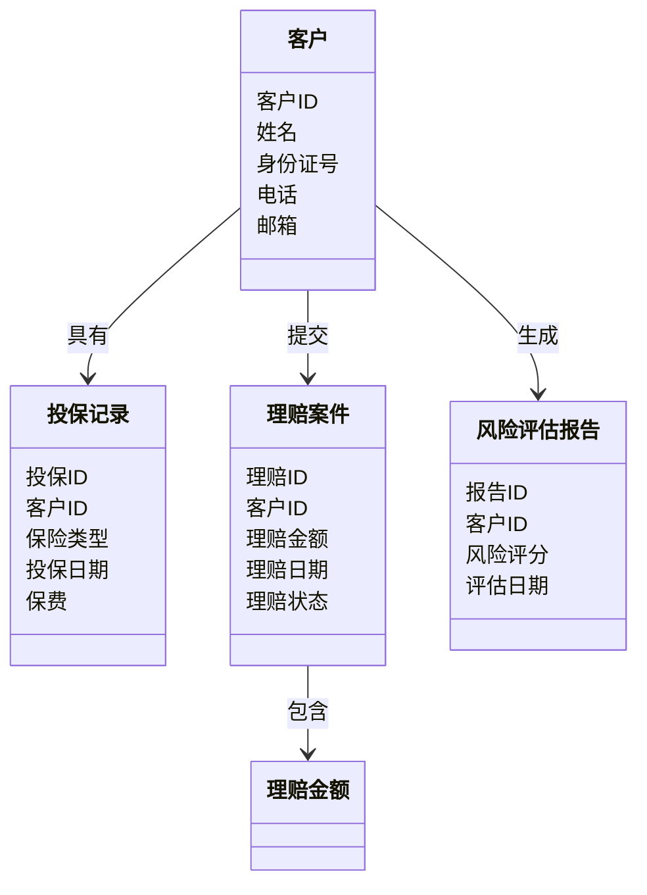
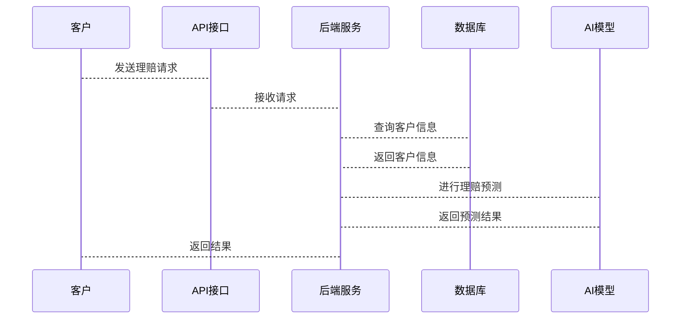

                 


# AI在保险理赔预测中的创新应用

> **关键词**：保险理赔预测、人工智能、机器学习、深度学习、神经网络

> **摘要**：本文深入探讨了人工智能技术在保险理赔预测中的创新应用。通过分析保险行业的数字化转型趋势，详细讲解了AI算法在保险理赔预测中的核心原理和应用场景，结合实际案例，展示了如何利用机器学习和深度学习技术提升保险理赔的准确性和效率。

---

# 第1章: 保险理赔预测的背景与挑战

## 1.1 保险行业的数字化转型

### 1.1.1 保险行业的现状与发展趋势

保险行业正经历着数字化转型的浪潮。随着大数据、人工智能和云计算等技术的快速发展，保险公司正在积极探索如何利用这些技术提升业务效率、优化客户体验并降低运营成本。传统保险业务模式依赖人工操作，效率低下且容易出错，而数字化转型为保险行业带来了新的机遇。

### 1.1.2 数字化转型对保险行业的影响

数字化转型不仅仅是技术的升级，更是保险行业业务模式的根本性变革。通过引入AI、大数据和区块链等技术，保险公司能够实现从投保、理赔到客户服务的全流程自动化和智能化。这种转变不仅提高了效率，还显著降低了成本。

### 1.1.3 保险理赔预测的业务价值

保险理赔预测是保险数字化转型中的核心业务之一。通过预测客户的理赔概率和金额，保险公司可以更精准地制定保费策略、优化风险管理，并提前识别潜在的高风险客户。这不仅有助于提高公司的盈利能力，还能显著降低理赔成本。

## 1.2 保险理赔预测的核心问题

### 1.2.1 理赔预测的基本概念

保险理赔预测是指通过分析客户的投保信息、历史数据和行为特征，预测客户在未来一段时间内发生理赔的概率和金额。这种预测可以帮助保险公司更好地评估风险、制定保费策略，并优化理赔流程。

### 1.2.2 理赔预测中的关键挑战

- **数据质量**：保险数据通常包含大量缺失值和噪声，如何清洗和处理这些数据是关键挑战。
- **模型准确性**：理赔预测的准确性直接影响到保险公司的收益和风险控制能力。
- **模型解释性**：复杂的AI模型（如深度学习）往往缺乏可解释性，这在保险行业中尤为重要。
- **数据隐私**：保险数据通常包含敏感信息，如何在保证数据隐私的前提下进行预测是一个重要问题。

### 1.2.3 理赔预测的边界与外延

理赔预测的核心是基于客户的投保信息和历史数据，预测未来可能发生的理赔情况。其外延包括对客户行为的分析、对市场风险的评估以及对保险产品设计的优化。

## 1.3 AI技术在保险行业的应用前景

### 1.3.1 AI技术在保险行业的应用场景

AI技术在保险行业的应用非常广泛，包括客户画像、风险评估、保费定价、理赔预测、欺诈检测等。其中，理赔预测是AI技术应用最为成熟的领域之一。

### 1.3.2 保险理赔预测中的AI创新

AI技术的创新为保险理赔预测带来了新的可能性。例如，通过自然语言处理技术分析客户的投保申请文本，识别潜在的风险因素；或者通过图像识别技术分析客户的驾驶行为，预测车险理赔的概率。

### 1.3.3 保险行业对AI技术的需求与期望

保险公司对AI技术的需求主要集中在提高效率、降低成本和提升客户体验上。未来，保险公司期望AI技术能够提供更加精准的预测模型，并在数据隐私和模型解释性方面取得突破。

## 1.4 本章小结

本章从保险行业的数字化转型出发，详细介绍了保险理赔预测的核心问题和AI技术的应用前景。通过分析理赔预测的业务价值和关键挑战，为后续章节的深入探讨奠定了基础。

---

# 第2章: 保险理赔预测的核心概念与联系

## 2.1 核心概念原理

### 2.1.1 理赔预测的数学模型

保险理赔预测的核心是构建一个能够准确预测理赔概率和金额的数学模型。常用的模型包括逻辑回归、随机森林、神经网络等。

### 2.1.2 AI算法在理赔预测中的作用

AI算法通过分析客户的特征数据，提取潜在的风险因素，并构建预测模型。这些算法能够处理复杂的非线性关系，并提供高精度的预测结果。

### 2.1.3 理赔预测的业务流程

1. 数据收集：包括客户的基本信息、投保记录、历史理赔记录等。
2. 数据预处理：清洗数据，处理缺失值和异常值。
3. 特征提取：从数据中提取有用的特征，例如年龄、职业、驾驶行为等。
4. 模型训练：利用训练数据训练预测模型。
5. 模型评估：通过测试数据验证模型的准确性。
6. 模型部署：将模型应用于实际业务中，进行实时预测。

## 2.2 核心概念属性特征对比

以下表格对比了传统理赔预测和AI理赔预测的关键属性特征：

| **属性**         | **传统理赔预测**               | **AI理赔预测**                |
|-------------------|-------------------------------|-------------------------------|
| 数据来源          | 主要依赖历史理赔数据           | 结合历史数据、客户行为数据等     |
| 预测准确性        | 较低，依赖经验判断              | 较高，基于复杂算法和大数据分析  |
| 模型可解释性       | 较高，基于统计分析             | 较低，复杂算法难以解释          |
| 处理效率          | 低，人工操作为主               | 高，自动化处理为主             |
| 应用场景          | 单一，主要用于事后分析         | 多样，可用于事前风险评估、实时监控等 |

## 2.3 ER实体关系图架构

以下是一个简化的保险理赔预测的ER实体关系图：

```mermaid
erd
    客户
    投保记录
    理赔案件
    理赔金额
    理赔申请
    理赔决策
    投保公司
    风险评估报告

    客户 --> 投保记录: 具有
    客户 --> 理赔案件: 提交
    理赔案件 --> 理赔金额: 包含
    客户 --> 理赔申请: 提交
    理赔申请 --> 理赔决策: 得到
    投保公司 --> 风险评估报告: 生成
```

## 2.4 本章小结

本章通过对比传统和AI理赔预测的核心概念，详细介绍了保险理赔预测的业务流程和ER实体关系图。这些内容为后续章节的算法和系统设计奠定了基础。

---

# 第3章: 常见AI算法在保险理赔预测中的应用

## 3.1 传统机器学习算法

### 3.1.1 逻辑回归

#### 模型简介

逻辑回归是一种常用的二分类算法，适用于预测客户是否会发生理赔。其数学公式为：

$$ P(y=1|x) = \frac{e^{\beta_0 + \beta_1x_1 + ... + \beta_nx_n}}{1 + e^{\beta_0 + \beta_1x_1 + ... + \beta_nx_n}} $$

其中，$x_i$ 是输入特征，$\beta_i$ 是模型参数。

#### 优缺点分析

- **优点**：简单易懂，适合线性关系。
- **缺点**：不擅长处理非线性关系。

### 3.1.2 支持向量机

#### 模型简介

支持向量机（SVM）是一种强大的分类算法，适用于高维数据。其核心思想是通过找到一个超平面，将数据分成两类。

#### 优缺点分析

- **优点**：适合高维数据，分类能力强。
- **缺点**：对数据预处理敏感，计算复杂度高。

### 3.1.3 随机森林

#### 模型简介

随机森林是一种基于决策树的集成算法，通过构建多个决策树并取其预测结果的平均值，可以显著提高预测准确率。

#### 优缺点分析

- **优点**：抗过拟合能力强，适合高维数据。
- **缺点**：计算复杂度较高。

## 3.2 深度学习算法

### 3.2.1 神经网络

#### 模型简介

神经网络是一种模拟人脑神经网络的算法，适用于处理复杂的非线性关系。其核心是通过多层神经元的激活函数进行特征提取和分类。

#### 优缺点分析

- **优点**：适合处理复杂数据，预测能力强。
- **缺点**：模型复杂，难以解释，计算资源消耗大。

### 3.2.2 长短期记忆网络

#### 模型简介

长短期记忆网络（LSTM）是一种特殊的循环神经网络，适用于处理序列数据。其核心是通过记忆单元保存长期信息。

#### 优缺点分析

- **优点**：适合处理时间序列数据，记忆能力强。
- **缺点**：训练复杂，难以调优。

### 3.2.3 图神经网络

#### 模型简介

图神经网络是一种适用于图结构数据的算法，通过节点之间的关系进行特征传播和预测。

#### 优缺点分析

- **优点**：适合复杂关系数据，预测能力强。
- **缺点**：计算复杂度高，难以部署。

## 3.3 算法对比与选择

### 3.3.1 不同算法的优缺点分析

以下表格对比了传统机器学习算法和深度学习算法的优缺点：

| **算法**       | **优点**                               | **缺点**                               |
|----------------|--------------------------------------|--------------------------------------|
| 逻辑回归       | 简单易懂，适合线性关系                | 不擅长处理非线性关系                  |
| 支持向量机      | 适合高维数据，分类能力强             | 对数据预处理敏感，计算复杂度高        |
| 随机森林       | 抗过拟合能力强，适合高维数据           | 计算复杂度高                          |
| 神经网络        | 适合处理复杂数据，预测能力强           | 模型复杂，难以解释，计算资源消耗大    |
| LSTM            | 适合处理时间序列数据，记忆能力强        | 训练复杂，难以调优                    |
| 图神经网络      | 适合复杂关系数据，预测能力强           | 计算复杂度高，难以部署                |

### 3.3.2 算法选择的依据

- **数据类型**：线性关系适合逻辑回归，复杂关系适合深度学习。
- **数据规模**：小数据适合传统算法，大数据适合深度学习。
- **计算资源**：深度学习需要较高的计算资源。

### 3.3.3 算法调优与优化

- **数据预处理**：清洗数据，特征工程。
- **模型调参**：调整学习率、正则化参数等。
- **模型融合**：结合多种算法结果，提高准确率。

## 3.4 本章小结

本章详细介绍了传统机器学习算法和深度学习算法在保险理赔预测中的应用，并通过对比分析帮助读者选择合适的算法。

---

# 第4章: 保险理赔预测的数学模型与算法原理

## 4.1 逻辑回归模型

### 4.1.1 逻辑回归的数学公式

$$ P(y=1|x) = \frac{e^{\beta_0 + \beta_1x_1 + ... + \beta_nx_n}}{1 + e^{\beta_0 + \beta_1x_1 + ... + \beta_nx_n}} $$

其中，$y$ 是输出标签，$x_i$ 是输入特征，$\beta_i$ 是模型参数。

### 4.1.2 逻辑回归的损失函数

$$ L = -\sum_{i=1}^{n} [y_i \ln p_i + (1 - y_i)\ln(1 - p_i)] $$

其中，$p_i$ 是模型预测的概率，$y_i$ 是真实标签。

### 4.1.3 逻辑回归的优化方法

逻辑回归的优化通常采用梯度下降算法，通过求解损失函数的梯度并更新参数来最小化损失。

$$ \beta_j := \beta_j - \eta \frac{\partial L}{\partial \beta_j} $$

其中，$\eta$ 是学习率，$\frac{\partial L}{\partial \beta_j}$ 是损失函数对$\beta_j$的偏导数。

---

## 4.2 支持向量机原理

### 4.2.1 支持向量机的数学公式

支持向量机的目标是找到一个超平面，使得正负样本被正确分类。其优化目标为：

$$ \min \frac{1}{2} \sum_{i=1}^{n} \beta_i^2 $$

受约束于：

$$ y_i (\beta_0 + \beta_1x_{i1} + ... + \beta_nx_{in}) \geq 1 $$

其中，$\beta_i$ 是模型参数，$x_{ij}$ 是输入特征，$y_i$ 是输出标签。

---

## 4.3 随机森林原理

### 4.3.1 随机森林的数学公式

随机森林通过构建多个决策树并取其预测结果的平均值来降低过拟合。其数学公式可以表示为：

$$ y = \frac{1}{N} \sum_{i=1}^{N} y_i $$

其中，$N$ 是决策树的数量，$y_i$ 是每棵决策树的预测结果。

---

## 4.4 神经网络原理

### 4.4.1 神经网络的数学公式

神经网络通过多层神经元的激活函数进行特征提取和分类。其数学公式可以表示为：

$$ a^{(l+1)} = \sigma(w^{(l)} a^{(l)} + b^{(l)}) $$

其中，$a^{(l)}$ 是第$l$层的激活值，$w^{(l)}$ 是权重矩阵，$b^{(l)}$ 是偏置项，$\sigma$ 是激活函数。

---

## 4.5 LSTM原理

### 4.5.1 LSTM的数学公式

LSTM通过记忆单元和 gates（输入门、输出门、遗忘门）来控制信息的流动。其数学公式可以表示为：

$$ i_t = \sigma(W_i x_t + U_i h_{t-1}) $$

$$ f_t = \sigma(W_f x_t + U_f h_{t-1}) $$

$$ o_t = \sigma(W_o x_t + U_o h_{t-1}) $$

$$ c_t = f_t c_{t-1} + i_t x_t $$

$$ h_t = o_t \tanh(c_t) $$

其中，$i_t$ 是输入门，$f_t$ 是遗忘门，$o_t$ 是输出门，$c_t$ 是记忆单元，$h_t$ 是隐藏状态。

---

## 4.6 图神经网络原理

### 4.6.1 图神经网络的数学公式

图神经网络通过节点之间的关系进行特征传播和预测。其数学公式可以表示为：

$$ h_i^{(l+1)} = \sum_{j \in N(i)} W h_j^{(l)} + b $$

其中，$h_i^{(l)}$ 是第$l$层节点$i$的隐藏状态，$N(i)$ 是节点$i$的邻居节点集合，$W$ 是权重矩阵，$b$ 是偏置项。

---

## 4.7 本章小结

本章详细介绍了几种常见AI算法的数学模型和算法原理，为后续章节的系统设计和项目实现奠定了理论基础。

---

# 第5章: 保险理赔预测的系统架构设计

## 5.1 系统功能设计

### 5.1.1 领域模型设计

以下是一个简化的保险理赔预测系统的领域模型：



### 5.1.2 系统架构设计

以下是一个简化的保险理赔预测系统的架构图：


### 5.1.3 接口设计与交互流程

以下是一个简化的系统交互流程图：



---

## 5.2 系统架构设计

### 5.2.1 系统架构设计图

以下是一个简化的系统架构图：


### 5.2.2 系统功能模块

1. **前端界面**：用户提交理赔请求。
2. **API接口**：接收用户的请求并转发给后端服务。
3. **后端服务**：处理用户的请求，调用AI模型进行预测。
4. **数据库**：存储客户信息和历史数据。
5. **AI模型**：进行理赔预测并返回结果。

---

## 5.3 本章小结

本章详细介绍了保险理赔预测系统的架构设计，包括功能设计、系统架构图和交互流程图。这些内容为后续章节的项目实战奠定了基础。

---

# 第6章: 保险理赔预测的项目实战

## 6.1 环境安装与配置

### 6.1.1 Python环境安装

安装Python和必要的库：

```bash
python -m pip install --upgrade pip
pip install numpy
pip install pandas
pip install scikit-learn
pip install matplotlib
pip install xgboost
```

---

### 6.1.2 数据集准备

以下是一个简单的数据集示例：

```csv
客户ID,年龄,职业,驾驶行为,理赔记录
1,25,司机,正常,0
2,35,司机,偶尔违规,1
3,45,司机,经常违规,1
4,28,司机,正常,0
5,32,司机,偶尔违规,0
```

---

## 6.2 系统核心实现源代码

### 6.2.1 数据预处理

```python
import pandas as pd
from sklearn.model_selection import train_test_split
from sklearn.preprocessing import StandardScaler

# 加载数据集
data = pd.read_csv('insurance.csv')

# 分离特征和标签
X = data[['年龄', '职业', '驾驶行为']]
y = data['理赔记录']

# 划分训练集和测试集
X_train, X_test, y_train, y_test = train_test_split(X, y, test_size=0.2, random_state=42)

# 特征标准化
scaler = StandardScaler()
X_train = scaler.fit_transform(X_train)
X_test = scaler.transform(X_test)
```

---

### 6.2.2 模型训练与优化

```python
from sklearn.linear_model import LogisticRegression
from sklearn.metrics import accuracy_score

# 训练逻辑回归模型
model = LogisticRegression()
model.fit(X_train, y_train)

# 模型预测
y_pred = model.predict(X_test)

# 模型评估
print('准确率:', accuracy_score(y_test, y_pred))
```

---

### 6.2.3 模型部署与应用

```python
import joblib

# 保存模型
joblib.dump(model, 'insurance_model.pkl')

# 加载模型
model = joblib.load('insurance_model.pkl')

# 预测新客户
new_customer = [[25, '司机', '正常']]
new_customer_encoded = scaler.transform(new_customer)
print('预测理赔记录:', model.predict(new_customer_encoded))
```

---

## 6.3 项目总结

### 6.3.1 项目实现的难点

1. 数据预处理：处理缺失值和异常值。
2. 模型调优：选择合适的算法和参数。
3. 模型部署：将模型部署到实际业务系统中。

### 6.3.2 项目经验与启示

1. 数据质量对模型性能影响重大。
2. 模型选择需要结合业务需求和数据特征。
3. 模型部署需要考虑计算资源和数据隐私。

### 6.3.3 项目扩展与优化

1. 引入深度学习算法（如神经网络、LSTM）进行预测。
2. 实现实时监控和异常检测。
3. 提供模型解释工具，帮助业务人员理解预测结果。

---

## 6.4 本章小结

本章通过一个简单的项目实战，展示了保险理赔预测的实现过程，包括环境安装、数据预处理、模型训练和部署。这些内容帮助读者更好地理解AI技术在保险理赔预测中的应用。

---

# 第7章: 总结与展望

## 7.1 总结

本文详细探讨了AI技术在保险理赔预测中的创新应用，从算法原理到系统设计，再到项目实战，全面介绍了保险理赔预测的核心内容。通过对比传统算法和深度学习算法，分析了不同算法的优缺点和适用场景。同时，通过一个具体的项目案例，展示了AI技术在保险理赔预测中的实际应用。

---

## 7.2 展望

随着AI技术的不断发展，保险理赔预测的应用前景将更加广阔。未来，保险公司可以通过引入更复杂的算法（如图神经网络、强化学习）来提高预测的准确性。同时，随着数据隐私和模型解释性问题的逐步解决，AI技术在保险行业的应用将更加深入和广泛。

---

## 7.3 本章小结

本章总结了全文的核心内容，并展望了AI技术在保险理赔预测中的未来发展方向。

---

# 作者：AI天才研究院/AI Genius Institute & 禅与计算机程序设计艺术 /Zen And The Art of Computer Programming

