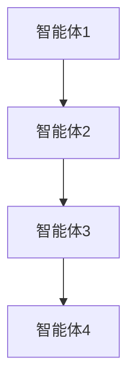
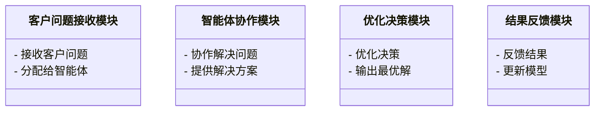
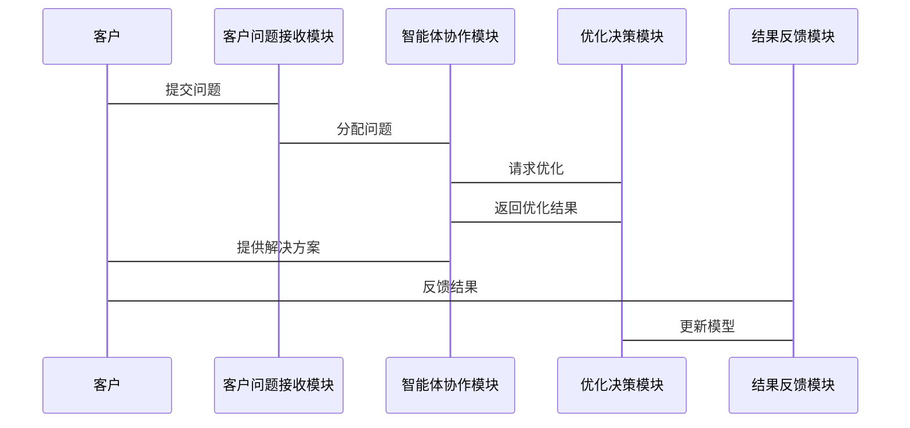

                 


# AI智能体协作：构建更精准的公司价值创造模型

---

## 关键词：AI智能体协作、价值创造模型、企业协作、分布式计算、系统架构设计

---

## 摘要：  
本文探讨了AI智能体协作在构建公司价值创造模型中的应用，通过分析多智能体协作系统的核心原理、算法实现、系统架构设计，以及实际案例的深入剖析，提出了构建更精准公司价值创造模型的方法论和实践方案。文章结合理论与实践，旨在为企业提供一套高效、可扩展的协作模型，助力企业在数字化转型中实现价值最大化。

---

## 第一部分：AI智能体协作与公司价值创造模型概述

### 第1章：AI智能体协作的背景与问题背景

#### 1.1 问题背景

##### 1.1.1 传统公司价值创造的局限性
传统的公司价值创造模式依赖于人力资源和管理流程的优化，但在当今数字化时代，这种方式逐渐暴露出以下问题：
- **效率低下**：人工协作过程中的信息传递延迟和决策滞后。
- **资源浪费**：资源分配不均导致的部分部门超负荷工作，而其他部门闲置。
- **信息孤岛**：不同部门之间缺乏有效沟通，导致信息重复和资源浪费。

##### 1.1.2 AI智能体协作的兴起
随着人工智能技术的快速发展，AI智能体协作逐渐成为企业协作的新趋势。AI智能体通过分布式计算和多智能体协作，能够实时分析数据、优化决策，并实现资源的高效分配。

##### 1.1.3 当前企业协作中的主要问题
当前企业协作面临的主要问题包括：
- **协作效率低**：传统协作方式依赖人工沟通，效率低下。
- **资源分配不均**：缺乏动态调整的机制，导致资源浪费。
- **信息孤岛**：部门间信息不共享，导致决策失误。

#### 1.2 问题描述

##### 1.2.1 企业协作效率低下
企业协作效率低下主要表现为：
- 信息传递延迟
- 决策滞后
- 协作过程中的信息重复

##### 1.2.2 资源分配不均
资源分配不均的原因包括：
- 缺乏实时数据支持
- 资源分配机制不合理
- 部门间协作不足

##### 1.2.3 协作过程中的信息孤岛
信息孤岛的主要表现：
- 部门间信息不共享
- 数据重复存储
- 信息传递不畅

#### 1.3 问题解决思路

##### 1.3.1 引入AI智能体协作的概念
AI智能体协作是一种基于人工智能的协作方式，通过智能体之间的协作实现资源的高效分配和信息的实时共享。

##### 1.3.2 建立AI智能体协作的目标
AI智能体协作的目标是：
- 提高企业协作效率
- 实现资源的动态分配
- 消除信息孤岛

##### 1.3.3 解决方案的初步框架
解决方案的初步框架包括：
- AI智能体的设计与实现
- 协作机制的设计与实现
- 价值创造模型的构建与优化

#### 1.4 概念结构与核心要素

##### 1.4.1 核心概念的定义
- **AI智能体**：具备感知、决策和执行能力的智能体。
- **协作机制**：智能体之间实现信息共享和任务分配的机制。
- **价值创造模型**：通过智能体协作实现价值最大化的过程。

##### 1.4.2 概念属性对比表格

| 概念       | 属性1：自主性 | 属性2：协作性 | 属性3：智能性 |
|------------|--------------|--------------|--------------|
| AI智能体    | 高           | 高           | 高           |
| 传统协作方式 | 中           | 中           | 低           |

##### 1.4.3 实体关系图（ER图）架构
```mermaid
er
actor AI智能体协作系统 {
  < AI智能体
  < 价值创造模型
  < 协作机制
}
```

---

## 第2章：AI智能体协作的核心概念与联系

### 2.1 多智能体协作系统

#### 2.1.1 多智能体系统的定义
多智能体系统是指由多个智能体组成的协作系统，每个智能体具备自主决策和协作能力。

#### 2.1.2 智能体的协作机制
智能体的协作机制包括：
- 信息共享机制
- 任务分配机制
- 决策协调机制

#### 2.1.3 智能体之间的通信协议
智能体之间的通信协议包括：
- 数据格式协议
- 通信频率协议
- 优先级协议

### 2.2 价值创造模型

#### 2.2.1 价值创造模型的定义
价值创造模型是指通过智能体协作实现价值最大化的模型。

#### 2.2.2 模型的核心要素
模型的核心要素包括：
- 输入数据
- 协作机制
- 优化算法

#### 2.2.3 模型的构建步骤
模型的构建步骤包括：
1. 数据收集与预处理
2. 模型设计
3. 模型优化
4. 模型验证

### 2.3 智能体协作与价值创造的关系

#### 2.3.1 协作对价值创造的影响
协作对价值创造的影响包括：
- 提高协作效率
- 实现资源优化配置
- 提升决策准确性

#### 2.3.2 价值创造对协作的反馈
价值创造对协作的反馈包括：
- 数据反馈
- 模型优化反馈
- 任务分配反馈

#### 2.3.3 协作与创造的动态平衡
协作与创造的动态平衡是指在协作过程中，不断优化协作机制和价值创造模型，以实现效率和效果的双重提升。

---

## 第3章：AI智能体协作的算法原理

### 3.1 分布式计算与多智能体协作

#### 3.1.1 分布式计算的基本原理
分布式计算的基本原理是将计算任务分发到多个节点上，通过节点之间的协作完成任务。

#### 3.1.2 多智能体协作的算法选择
多智能体协作的算法选择包括：
- 分布式算法
- 并行计算算法
- 协作学习算法

#### 3.1.3 算法实现的数学模型
多智能体协作的数学模型可以表示为：
$$
f(x) = \sum_{i=1}^{n} f_i(x_i)
$$
其中，$x_i$ 表示第 $i$ 个智能体的输入，$f_i$ 表示第 $i$ 个智能体的目标函数。

### 3.2 智能体协作的通信协议

#### 3.2.1 通信协议的设计原则
通信协议的设计原则包括：
- 简洁性
- 可扩展性
- 可靠性

#### 3.2.2 协议实现的流程图


#### 3.2.3 协议实现的Python代码示例
```python
import zmq

context = zmq.Context()
socket = context.socket(zmq.PUBLISHER)
socket.bind("tcp://*:5555")

while True:
    message = input("Enter message: ")
    socket.send_string(message)
```

### 3.3 价值创造模型的优化算法

#### 3.3.1 优化算法的数学模型
价值创造模型的优化算法可以表示为：
$$
\min_x \sum_{i=1}^{n} (x_i - a_i)^2
$$
其中，$x_i$ 表示第 $i$ 个智能体的决策变量，$a_i$ 表示目标值。

#### 3.3.2 优化算法的实现步骤
优化算法的实现步骤包括：
1. 初始化参数
2. 计算目标函数
3. 迭代优化
4. 输出最优解

#### 3.3.3 优化算法的Python代码实现
```python
import numpy as np

def objective(x, a):
    return np.sum((x - a) ** 2)

def optimize(a, iterations=100):
    x = np.random.randn(len(a))
    for _ in range(iterations):
        gradient = 2 * (x - a)
        x -= gradient
    return x

a = np.array([1, 2, 3])
result = optimize(a)
print(result)
```

---

## 第4章：系统分析与架构设计

### 4.1 问题场景介绍

#### 4.1.1 问题场景描述
假设某公司需要优化其客户服务流程，希望通过AI智能体协作实现客户问题的快速响应和解决。

#### 4.1.2 项目介绍
项目目标是通过AI智能体协作优化客户服务流程，提高客户满意度和工作效率。

### 4.2 系统功能设计

#### 4.2.1 系统功能模块
系统功能模块包括：
- 客户问题接收模块
- 智能体协作模块
- 优化决策模块
- 结果反馈模块

#### 4.2.2 系统功能设计的领域模型类图


### 4.3 系统架构设计

#### 4.3.1 系统架构的Mermaid架构图


#### 4.3.2 系统接口设计
系统接口设计包括：
- API接口
- 数据接口
- 通信接口

#### 4.3.3 系统交互的Mermaid序列图


---

## 第5章：项目实战

### 5.1 环境安装

#### 5.1.1 安装依赖
安装Python和相关库：
```bash
pip install numpy zmq
```

### 5.2 系统核心实现源代码

#### 5.2.1 智能体协作模块实现
```python
import zmq

context = zmq.Context()
socket = context.socket(zmq.PUBLISHER)
socket.bind("tcp://*:5555")

while True:
    message = input("Enter message: ")
    socket.send_string(message)
```

#### 5.2.2 价值创造模型优化实现
```python
import numpy as np

def objective(x, a):
    return np.sum((x - a) ** 2)

def optimize(a, iterations=100):
    x = np.random.randn(len(a))
    for _ in range(iterations):
        gradient = 2 * (x - a)
        x -= gradient
    return x

a = np.array([1, 2, 3])
result = optimize(a)
print(result)
```

### 5.3 代码应用解读与分析

#### 5.3.1 智能体协作模块解读
智能体协作模块通过ZMQ实现智能体之间的通信，实时共享信息和任务分配。

#### 5.3.2 价值创造模型优化解读
价值创造模型优化通过梯度下降算法实现，不断优化决策变量，提高模型的准确性。

### 5.4 实际案例分析

#### 5.4.1 案例背景
某公司希望通过AI智能体协作优化客户服务流程，提高客户满意度和工作效率。

#### 5.4.2 案例实现
通过智能体协作模块接收客户问题，优化决策模块提供解决方案，最终实现客户问题的快速响应和解决。

### 5.5 项目小结

#### 5.5.1 项目成果
- 提高了客户服务效率
- 提升了客户满意度
- 实现了资源的动态分配

#### 5.5.2 经验总结
- AI智能体协作能够显著提高企业协作效率
- 价值创造模型优化能够提升决策的准确性
- 系统架构设计是项目成功的关键

---

## 第6章：最佳实践、小结、注意事项与拓展阅读

### 6.1 最佳实践

#### 6.1.1 系统设计
- 确保系统架构的可扩展性和可维护性
- 定期优化模型和算法
- 加强智能体之间的协作机制

#### 6.1.2 项目实施
- 明确项目目标和范围
- 选择合适的开发工具和库
- 加强团队协作和沟通

### 6.2 小结

#### 6.2.1 核心内容总结
本文通过分析AI智能体协作的核心概念、算法原理和系统架构设计，提出了构建更精准公司价值创造模型的方法论和实践方案。

#### 6.2.2 重要结论
- AI智能体协作能够显著提高企业协作效率
- 价值创造模型优化能够提升决策的准确性
- 系统架构设计是项目成功的关键

### 6.3 注意事项

#### 6.3.1 开发过程中的注意事项
- 确保代码的可读性和可维护性
- 定期进行代码审查和测试
- 加强团队协作和沟通

#### 6.3.2 系统运行中的注意事项
- 定期优化模型和算法
- 加强系统监控和维护
- 提高系统的安全性和稳定性

### 6.4 拓展阅读

#### 6.4.1 推荐阅读的书籍和论文
- 《分布式计算原理与应用》
- 《多智能体协作系统的优化与实现》
- 《人工智能与企业协作》

#### 6.4.2 其他相关资源
- 开源项目和工具
- 技术博客和论坛
- 专业培训和讲座

---

## 第7章：未来展望

### 7.1 未来发展方向

#### 7.1.1 技术发展
- AI智能体协作的进一步优化
- 新型算法的引入
- 多智能体协作系统的扩展

#### 7.1.2 应用场景
- 更多行业的应用
- 新型协作模式的探索
- 与区块链等其他技术的结合

### 7.2 未来研究方向

#### 7.2.1 理论研究
- 协作机制的优化
- 价值创造模型的创新
- 多智能体协作系统的理论框架

#### 7.2.2 实践应用
- 新型协作模式的实践
- 技术创新的应用
- 行业标准的制定

---

## 作者：AI天才研究院 & 禅与计算机程序设计艺术

