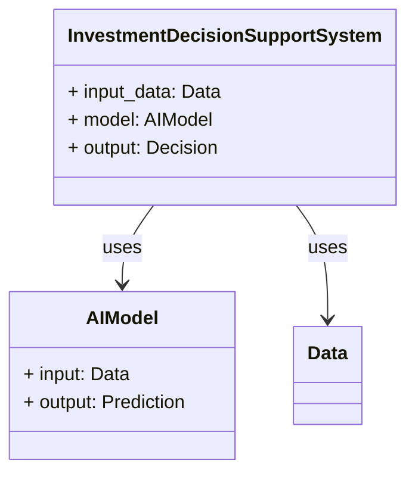
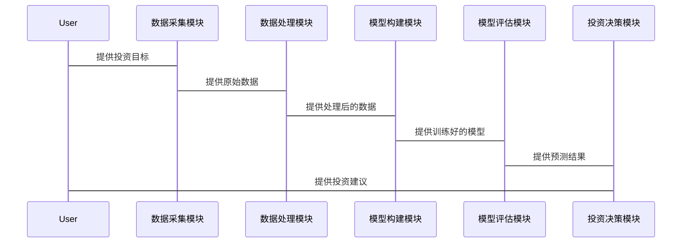

                 


# AI驱动的投资决策支持系统

> 关键词：AI，投资决策，决策支持系统，机器学习，深度学习，金融技术

> 摘要：本文深入探讨了AI驱动的投资决策支持系统的构建与应用。通过分析投资决策的核心要素、AI技术的应用原理、系统架构设计及项目实战，结合数学公式、Mermaid图表和代码示例，详细阐述了AI在投资决策中的优势与实现方法。本文旨在为金融领域的专业人士提供一个系统化、理论与实践相结合的参考。

---

## 第一部分：AI驱动的投资决策支持系统概述

### 第1章：AI驱动的投资决策支持系统概述

#### 1.1 投资决策支持系统的概念与背景

##### 1.1.1 投资决策支持系统的定义
投资决策支持系统（Investment Decision Support System，IDSS）是一种利用数据分析、人工智能和计算机技术辅助投资者进行决策的系统。其核心目标是通过数据处理、模型构建和结果分析，帮助投资者做出更科学、更高效的决策。

##### 1.1.2 AI技术在投资决策中的作用
AI技术通过机器学习、深度学习和自然语言处理等方法，可以从海量数据中提取有价值的信息，识别潜在的投资机会和风险，为投资者提供决策支持。AI技术的优势在于其能够快速处理非结构化数据（如新闻、社交媒体评论）和结构化数据（如财务报表），并基于这些数据构建预测模型。

##### 1.1.3 当前投资决策支持系统的挑战
传统的投资决策主要依赖于人类经验和基本的财务分析方法，存在以下问题：
1. 数据处理能力有限：无法高效处理海量数据，尤其是非结构化数据。
2. 决策偏差：投资者容易受到情绪影响，导致决策失误。
3. 预测精度不足：传统方法难以捕捉复杂市场中的细微变化。

AI技术的应用可以有效解决这些问题，提升投资决策的效率和准确性。

#### 1.2 AI驱动的投资决策支持系统的必要性

##### 1.2.1 数据驱动投资决策的优势
AI技术可以通过大数据分析，发现传统方法难以察觉的市场规律和投资机会。例如，通过自然语言处理技术分析新闻和社交媒体，可以捕捉市场情绪的变化，提前预判市场走势。

##### 1.2.2 传统投资决策的局限性
传统投资决策方法依赖于经验和基本分析，存在以下局限性：
1. 数据处理能力有限：难以处理海量数据，尤其是非结构化数据。
2. 决策主观性较强：容易受到投资者情绪和偏见的影响。
3. 预测能力有限：难以捕捉复杂市场中的细微变化。

##### 1.2.3 AI技术如何提升投资决策效率
AI技术通过以下方式提升投资决策效率：
1. 自动化数据处理：快速处理和分析海量数据，提取有价值的信息。
2. 预测模型构建：基于历史数据和市场规律，构建预测模型，辅助投资决策。
3. 实时监控：通过实时数据分析，及时发现市场变化，优化投资策略。

#### 1.3 本章小结
本章介绍了投资决策支持系统的概念和背景，分析了AI技术在投资决策中的作用，指出了传统投资决策的局限性，并强调了AI技术在提升投资决策效率中的重要性。

---

## 第二部分：AI驱动的投资决策支持系统的核心概念与联系

### 第2章：投资决策支持系统的核心概念

#### 2.1 投资决策的核心要素

##### 2.1.1 投资目标与策略
投资目标是指投资者希望通过投资实现的具体目标，例如财富增值、风险控制等。投资策略是实现投资目标的具体方法，包括资产配置、风险控制、交易时机等。

##### 2.1.2 数据来源与处理
投资决策需要依赖多种数据来源，包括：
1. 市场数据：如股票价格、成交量、指数等。
2. 财务数据：如公司财务报表、财务指标等。
3. 非结构化数据：如新闻、社交媒体评论、行业报告等。

##### 2.1.3 风险评估与优化
投资决策需要对潜在风险进行评估，并通过优化模型（如风险中性化、风险规避）来降低风险对投资决策的影响。

#### 2.2 AI技术在投资决策中的应用原理

##### 2.2.1 机器学习在投资预测中的作用
机器学习通过训练模型，从历史数据中学习市场规律，并对未来市场走势进行预测。常用算法包括线性回归、支持向量机、随机森林等。

##### 2.2.2 自然语言处理在市场情绪分析中的应用
自然语言处理技术可以分析新闻、社交媒体评论等非结构化数据，提取市场情绪信息，并将其纳入投资决策模型。

##### 2.2.3 图神经网络在关系分析中的应用
图神经网络可以分析公司之间的关系（如供应链、关联交易等），并基于这些关系预测市场风险和投资机会。

#### 2.3 核心概念对比分析

##### 2.3.1 传统投资决策与AI驱动决策的对比
| 对比维度 | 传统投资决策 | AI驱动决策 |
|----------|--------------|------------|
| 数据来源 | 有限，主要依赖财务数据 | 海量数据，包括结构化和非结构化数据 |
| 决策速度 | 较慢，依赖人工分析 | 快速，自动化处理 |
| 预测精度 | 较低，依赖经验判断 | 较高，基于数据驱动的模型 |

##### 2.3.2 不同AI技术的优劣势分析
| AI技术 | 优势 | 劣势 |
|--------|------|------|
| 机器学习 | 简单易用，适合小规模数据 | 对非结构化数据处理能力有限 |
| 深度学习 | 处理能力强大，适合复杂数据 | 计算资源消耗大，模型解释性差 |
| 自然语言处理 | 能够处理非结构化数据 | 对数据质量要求高，模型训练复杂 |

#### 2.4 本章小结
本章分析了投资决策的核心要素，介绍了AI技术在投资决策中的应用原理，并通过对比分析，指出了不同AI技术的优劣势。

---

## 第三部分：AI驱动的投资决策支持系统的算法原理

### 第3章：机器学习算法在投资决策中的应用

#### 3.1 线性回归与投资预测

##### 3.1.1 线性回归的数学模型
线性回归的数学模型如下：
$$ y = \beta_0 + \beta_1x + \epsilon $$
其中，$y$ 是目标变量，$x$ 是自变量，$\beta_0$ 是截距，$\beta_1$ 是回归系数，$\epsilon$ 是误差项。

##### 3.1.2 投资预测的实现步骤
1. 数据收集：收集相关的历史数据，包括股票价格、成交量等。
2. 数据预处理：对数据进行标准化或归一化处理。
3. 模型训练：使用线性回归算法训练模型。
4. 模型评估：通过均方误差（MSE）等指标评估模型性能。
5. 预测与可视化：基于训练好的模型进行预测，并将结果可视化。

##### 3.1.3 示例代码实现
```python
import pandas as pd
import numpy as np
from sklearn.linear_model import LinearRegression
from sklearn.metrics import mean_squared_error

# 数据加载
data = pd.read_csv('stock_data.csv')

# 特征选择
X = data[['volume']]
y = data['price']

# 模型训练
model = LinearRegression()
model.fit(X, y)

# 预测
y_pred = model.predict(X)

# 模型评估
mse = mean_squared_error(y, y_pred)
print(f'Mean Squared Error: {mse}')
```

#### 3.2 支持向量机在投资分类中的应用

##### 3.2.1 支持向量机的原理
支持向量机（Support Vector Machine，SVM）是一种监督学习算法，适用于分类和回归问题。其核心思想是通过构建超平面，将数据点分为不同类别。

##### 3.2.2 投资分类的实现流程
1. 数据收集：收集相关的历史数据，包括股票价格、财务指标等。
2. 数据预处理：对数据进行标准化或归一化处理。
3. 特征选择：选择对投资分类影响较大的特征。
4. 模型训练：使用SVM算法训练模型。
5. 模型评估：通过准确率、召回率等指标评估模型性能。
6. 分类与可视化：基于训练好的模型进行分类，并将结果可视化。

##### 3.2.3 示例代码实现
```python
from sklearn.svm import SVC
from sklearn.metrics import accuracy_score

# 数据加载
data = pd.read_csv('stock_data.csv')

# 特征选择
X = data[['pe_ratio', 'market_cap']]
y = data['target']  # 0代表卖出，1代表买入

# 模型训练
model = SVC()
model.fit(X, y)

# 预测
y_pred = model.predict(X)

# 模型评估
accuracy = accuracy_score(y, y_pred)
print(f'Accuracy: {accuracy}')
```

#### 3.3 随机森林在投资决策中的应用

##### 3.3.1 随机森林的原理
随机森林（Random Forest）是一种基于决策树的集成学习算法。其核心思想是通过构建多棵决策树，并对结果进行投票或平均，从而提高模型的准确性和稳定性。

##### 3.3.2 投资决策中的特征选择
特征选择是随机森林的重要步骤，通过计算特征的重要性，选择对投资决策影响较大的特征。

##### 3.3.3 示例代码实现
```python
from sklearn.ensemble import RandomForestClassifier
from sklearn.metrics import accuracy_score

# 数据加载
data = pd.read_csv('stock_data.csv')

# 特征选择
X = data[['pe_ratio', 'market_cap', 'volume']]
y = data['target']  # 0代表卖出，1代表买入

# 模型训练
model = RandomForestClassifier()
model.fit(X, y)

# 预测
y_pred = model.predict(X)

# 模型评估
accuracy = accuracy_score(y, y_pred)
print(f'Accuracy: {accuracy}')

# 特征重要性分析
feature_importance = model.feature_importances_
print(f'Feature Importances: {feature_importance}')
```

### 第4章：深度学习算法在投资决策中的应用

#### 4.1 LSTM在时间序列预测中的应用

##### 4.1.1 LSTM的原理
长短期记忆网络（Long Short-Term Memory，LSTM）是一种特殊的循环神经网络（RNN），适用于时间序列数据的预测。其核心思想是通过门控机制，控制信息的流动，从而解决传统RNN的梯度消失问题。

##### 4.1.2 时间序列预测的实现步骤
1. 数据收集：收集相关的历史数据，包括股票价格、指数等。
2. 数据预处理：对数据进行标准化或归一化处理，并将其转换为时间序列数据。
3. 模型训练：使用LSTM算法训练模型。
4. 模型评估：通过均方误差（MSE）等指标评估模型性能。
5. 预测与可视化：基于训练好的模型进行预测，并将结果可视化。

##### 4.1.3 示例代码实现
```python
import numpy as np
from keras.layers import LSTM, Dense
from keras.models import Sequential
from sklearn.preprocessing import MinMaxScaler

# 数据加载
data = pd.read_csv('stock_data.csv')

# 数据预处理
scaler = MinMaxScaler()
data_scaled = scaler.fit_transform(data['price'].values.reshape(-1, 1))

# 数据分割
train_size = int(len(data_scaled) * 0.8)
X_train = data_scaled[:train_size]
y_train = data_scaled[1:train_size+1]
X_test = data_scaled[train_size:]
y_test = data_scaled[train_size+1:]

# 模型构建
model = Sequential()
model.add(LSTM(50, input_shape=(1, 1)))
model.add(Dense(1))
model.compile(loss='mean_squared_error', optimizer='adam')

# 模型训练
model.fit(X_train, y_train, epochs=100, batch_size=32)

# 预测
X_test_reshaped = X_test.reshape(X_test.shape[0], 1, 1)
y_pred = model.predict(X_test_reshaped)

# 模型评估
mse = mean_squared_error(y_test, y_pred)
print(f'Mean Squared Error: {mse}')

# 结果可视化
import matplotlib.pyplot as plt

plt.plot(y_test, label='Actual Price')
plt.plot(y_pred, label='Predicted Price')
plt.legend()
plt.show()
```

#### 4.2 图神经网络在关系分析中的应用

##### 4.2.1 图神经网络的原理
图神经网络（Graph Neural Network，GNN）是一种适用于图数据的深度学习算法。其核心思想是通过节点之间的关系，逐步传播信息，从而学习节点的特征表示。

##### 4.2.2 投资关系分析的实现流程
1. 数据收集：收集相关的关系数据，包括公司之间的关联交易、供应链关系等。
2. 图数据构建：将关系数据转换为图结构，包括节点和边。
3. 模型训练：使用图神经网络算法训练模型。
4. 模型评估：通过准确率、召回率等指标评估模型性能。
5. 关系分析与可视化：基于训练好的模型进行关系分析，并将结果可视化。

##### 4.2.3 示例代码实现
```python
import networkx as nx
from keras.layers import Input, Embedding, Flatten, Dense
from keras.models import Model

# 数据加载
data = pd.read_csv('company_relations.csv')

# 图数据构建
G = nx.Graph()
G.add_edges_from(data[['company1', 'company2']].values)

# 节点嵌入
node_embeddings = {}
for node in G.nodes():
    embedding = np.random.randn(10)  # 假设嵌入维度为10
    node_embeddings[node] = embedding

# 模型构建
input_node = Input(shape=(1,))
embedding_layer = Embedding(input_dim=len(G.nodes()), output_dim=10, weights=[node_embeddings])(input_node)
flatten_layer = Flatten()(embedding_layer)
dense_layer = Dense(1, activation='sigmoid')(flatten_layer)
model = Model(inputs=input_node, outputs=dense_layer)

# 模型训练
model.compile(loss='binary_crossentropy', optimizer='adam')

# 模型评估
# 假设我们有一个测试集，用于评估模型性能
# 这里仅展示模型构建，具体评估需要根据实际数据进行

# 关系分析与可视化
nx.draw(G, with_labels=True, node_size=500, edge_color='blue')
plt.show()
```

#### 4.3 本章小结
本章介绍了深度学习算法在投资决策中的应用，重点讲解了LSTM和图神经网络的原理、实现步骤及示例代码，展示了AI技术在时间序列预测和关系分析中的强大能力。

---

## 第四部分：AI驱动的投资决策支持系统的系统分析与架构设计

### 第5章：系统分析与架构设计

#### 5.1 问题场景介绍

##### 5.1.1 投资决策支持系统的应用场景
投资决策支持系统广泛应用于股票、基金、外汇等投资领域，帮助投资者进行市场分析、风险评估和投资组合优化。

##### 5.1.2 系统的目标与范围
系统的目标是通过AI技术辅助投资者进行投资决策，具体包括市场分析、风险评估、投资组合优化等功能。

#### 5.2 系统功能设计

##### 5.2.1 领域模型设计（Mermaid类图）


##### 5.2.2 系统功能模块划分
1. 数据采集模块：负责采集市场数据、新闻数据等。
2. 数据处理模块：对数据进行清洗、转换和特征提取。
3. 模型构建模块：基于机器学习或深度学习算法构建预测模型。
4. 模型评估模块：对模型性能进行评估和优化。
5. 投资决策模块：根据模型预测结果，生成投资决策建议。

#### 5.3 系统架构设计

##### 5.3.1 系统架构设计（Mermaid架构图）
```mermaid
container InvestmentDecisionSupportSystem {
    InvestmentDecisionSupportSystem
    Data采集模块 --> 数据处理模块
    数据处理模块 --> 模型构建模块
    模型构建模块 --> 模型评估模块
    模型评估模块 --> 投资决策模块
    投资决策模块 --> 输出决策
}
```

##### 5.3.2 系统接口设计
1. 数据接口：与数据源（如股票交易系统、新闻网站）对接，获取实时数据。
2. 用户接口：提供用户输入（如投资目标、风险偏好）和输出（如投资建议）。
3. 模型接口：与AI模型对接，提供输入数据并获取预测结果。

##### 5.3.3 系统交互设计（Mermaid序列图）


#### 5.4 本章小结
本章通过系统分析与架构设计，明确了投资决策支持系统的功能模块和系统架构，为后续的系统实现奠定了基础。

---

## 第五部分：AI驱动的投资决策支持系统的项目实战

### 第6章：项目实战

#### 6.1 环境安装

##### 6.1.1 安装Python环境
```bash
python --version
pip install numpy pandas scikit-learn keras tensorflow
```

##### 6.1.2 安装依赖库
```bash
pip install numpy pandas scikit-learn keras tensorflow
```

#### 6.2 系统核心实现源代码

##### 6.2.1 数据处理代码
```python
import pandas as pd
import numpy as np
from sklearn.preprocessing import MinMaxScaler

# 数据加载
data = pd.read_csv('stock_data.csv')

# 数据预处理
scaler = MinMaxScaler()
data_scaled = scaler.fit_transform(data['price'].values.reshape(-1, 1))

# 数据分割
train_size = int(len(data_scaled) * 0.8)
X_train = data_scaled[:train_size]
y_train = data_scaled[1:train_size+1]
X_test = data_scaled[train_size:]
y_test = data_scaled[train_size+1:]
```

##### 6.2.2 模型构建代码
```python
from keras.layers import LSTM, Dense
from keras.models import Sequential

# 模型构建
model = Sequential()
model.add(LSTM(50, input_shape=(1, 1)))
model.add(Dense(1))
model.compile(loss='mean_squared_error', optimizer='adam')
```

##### 6.2.3 模型训练代码
```python
# 模型训练
model.fit(X_train, y_train, epochs=100, batch_size=32)
```

##### 6.2.4 模型评估代码
```python
# 预测
X_test_reshaped = X_test.reshape(X_test.shape[0], 1, 1)
y_pred = model.predict(X_test_reshaped)

# 模型评估
mse = mean_squared_error(y_test, y_pred)
print(f'Mean Squared Error: {mse}')

# 结果可视化
import matplotlib.pyplot as plt

plt.plot(y_test, label='Actual Price')
plt.plot(y_pred, label='Predicted Price')
plt.legend()
plt.show()
```

#### 6.3 代码应用解读与分析
通过上述代码，我们可以实现一个基于LSTM的时间序列预测模型，用于股票价格预测。通过数据预处理、模型构建、训练和评估，我们可以评估模型的性能，并将其应用于实际投资决策中。

#### 6.4 实际案例分析和详细讲解剖析
假设我们有一个包含股票价格的历史数据集，我们可以使用上述代码进行股票价格预测。通过调整模型参数和数据预处理方法，我们可以优化模型性能，并根据预测结果制定投资策略。

#### 6.5 项目小结
本章通过项目实战，详细讲解了AI驱动的投资决策支持系统的实现过程，包括环境安装、数据处理、模型构建、训练、评估和可视化。通过实际案例分析，展示了AI技术在投资决策中的应用价值。

---

## 第六部分：AI驱动的投资决策支持系统的优化与总结

### 第7章：优化与总结

#### 7.1 最佳实践Tips

##### 7.1.1 数据预处理
- 确保数据质量，去除缺失值和异常值。
- 对数据进行标准化或归一化处理，确保模型性能。

##### 7.1.2 模型选择
- 根据数据类型和任务选择合适的算法，例如时间序列预测选择LSTM，关系分析选择图神经网络。
- 对模型进行调参优化，选择最优参数。

##### 7.1.3 系统架构设计
- 确保系统模块化设计，便于功能扩展和维护。
- 优化系统接口设计，确保数据流畅通。

##### 7.1.4 模型解释性
- 使用特征重要性分析等方法，提升模型的解释性，帮助投资者理解投资决策的依据。

#### 7.2 小结
AI技术在投资决策支持系统中的应用前景广阔，通过不断优化算法和系统架构设计，可以进一步提升投资决策的效率和准确性。

#### 7.3 注意事项
- 数据隐私和安全问题：确保数据的合法性和安全性。
- 模型的实时性：投资决策需要实时数据支持，确保系统的实时性。
- 模型的可解释性：投资者需要理解模型的决策依据，避免盲目依赖模型。

#### 7.4 拓展阅读
- 《机器学习实战》
- 《深度学习》
- 《Python金融大数据分析》

---

## 作者信息

作者：AI天才研究院/AI Genius Institute & 禅与计算机程序设计艺术/Zen And The Art of Computer Programming

