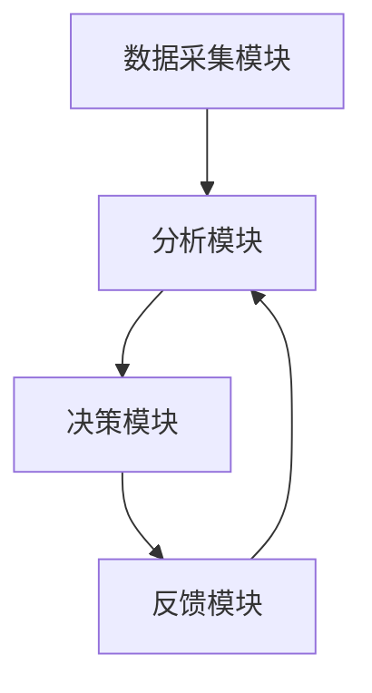
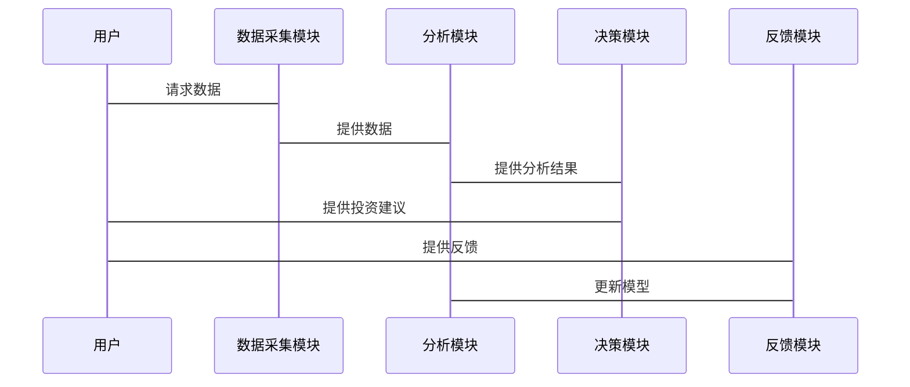

                 


# 价值投资中的AI驱动创新评估：多智能体系统的作用

**关键词：** 多智能体系统，价值投资，AI驱动，金融创新，投资评估

**摘要：** 本文探讨了在价值投资中，如何利用AI技术，特别是多智能体系统，来提升创新评估的效率和准确性。文章从理论基础、算法原理到系统架构和项目实战，全面分析了多智能体系统在价值投资中的应用，展示了其在信息处理、风险评估和投资组合优化等方面的优势，并提出了实际应用的最佳实践。

---

# 第一部分: 价值投资中的AI驱动创新评估基础

# 第1章: 价值投资与AI驱动创新评估概述

## 1.1 价值投资的基本概念

### 1.1.1 价值投资的定义与核心理念
价值投资是一种以基本面分析为基础的投资策略，强调通过深入研究公司的财务状况、行业地位和管理团队等因素，寻找市场价格低于其内在价值的证券进行投资。其核心理念是“买入低于内在价值的资产”，并长期持有。

### 1.1.2 价值投资的哲学与方法论
价值投资的哲学强调安全边际和长期主义，认为市场短期波动不可预测，但长期趋势可以通过基本面分析来把握。其方法论包括：
1. **基本面分析**：研究公司的财务报表、行业地位、竞争优势等。
2. **安全边际**：买入价格远低于内在价值的资产。
3. **长期持有**：避免频繁交易，降低交易成本。

### 1.1.3 价值投资在现代金融中的地位
尽管价值投资在传统金融中占据重要地位，但在信息不对称加剧和市场波动性增加的背景下，传统的基本面分析方法逐渐暴露出效率低下和覆盖面不足的问题。

---

## 1.2 AI在金融投资中的应用现状

### 1.2.1 AI在金融分析中的作用
人工智能技术（如机器学习、自然语言处理）在金融分析中的应用日益广泛，主要包括：
1. **数据处理**：快速分析大量非结构化数据（如新闻、社交媒体）。
2. **模式识别**：发现传统方法难以察觉的市场规律。
3. **预测模型**：构建股票价格预测模型，辅助投资决策。

### 1.2.2 AI在投资决策中的优势
AI的优势在于其处理海量数据和复杂关系的能力。例如：
1. **高频交易**：AI可以实时分析市场数据，捕捉短期交易机会。
2. **风险控制**：通过机器学习模型预测市场风险，优化投资组合。

### 1.2.3 当前AI在价值投资中的挑战
尽管AI在金融领域的应用潜力巨大，但价值投资的核心是长期基本面分析，AI在处理复杂的人为因素（如管理层决策、行业政策变化）方面仍有局限性。

---

## 1.3 多智能体系统的基本概念

### 1.3.1 多智能体系统的定义与特点
多智能体系统（Multi-Agent System, MAS）是由多个相互作用的智能体组成的系统，这些智能体能够通过协作完成复杂的任务。其特点包括：
1. **分布式性**：每个智能体独立决策。
2. **协作性**：通过通信和协作完成共同目标。
3. **反应性**：智能体能够感知环境并实时调整行为。

### 1.3.2 多智能体系统与单智能体系统的区别
| 特性         | 单智能体系统       | 多智能体系统       |
|--------------|--------------------|--------------------|
| 决策中心化    | 是                | 否                |
| 信息共享     | 有限              | 充分              |
| 复杂性处理    | 较低              | 较高              |

### 1.3.3 多智能体系统在金融领域的潜力
在价值投资中，多智能体系统可以通过分工协作，分别负责数据收集、分析、预测和决策，从而提高投资效率和准确性。

---

## 1.4 本章小结
本章介绍了价值投资的基本概念、AI在金融中的应用现状以及多智能体系统的基本原理。多智能体系统作为AI技术的重要组成部分，具有分布式协作和高效决策的特点，为价值投资中的创新评估提供了新的可能性。

---

# 第2章: 多智能体系统的核心原理

## 2.1 多智能体系统的组成与结构

### 2.1.1 多智能体系统的组成要素
1. **智能体**：独立决策的个体，能够感知环境并采取行动。
2. **环境**：智能体所处的外部环境，包括市场数据、政策变化等。
3. **通信机制**：智能体之间的信息交互方式。

### 2.1.2 多智能体系统的通信机制
通信机制是多智能体系统的核心，主要包括：
1. **直接通信**：智能体之间直接交换信息。
2. **间接通信**：通过中间媒介传递信息。

### 2.1.3 多智能体系统的协作模型
协作模型决定了智能体之间的合作方式，常见的协作模型包括：
1. **任务分配型**：智能体根据自身能力分配任务。
2. **目标驱动型**：智能体协作完成共同目标。

---

## 2.2 多智能体系统的协作机制

### 2.2.1 分布式协作的基本原理
分布式协作强调智能体之间的自主性和去中心化，通过局部决策实现全局优化。

### 2.2.2 基于强化学习的协作方法
强化学习是一种通过试错优化决策的方法，常用于多智能体系统的协作优化。例如，每个智能体通过学习策略函数来优化协作效果。

### 2.2.3 基于博弈论的协作策略
博弈论为多智能体系统的协作提供了理论基础，通过分析智能体之间的互动，制定最优策略。

---

## 2.3 多智能体系统的决策过程

### 2.3.1 多智能体系统的决策框架
决策框架包括状态感知、目标设定、策略选择和行动执行四个步骤。

### 2.3.2 基于状态空间的决策模型
状态空间是指智能体所处的所有可能状态的集合。通过分析状态空间，智能体可以制定最优决策。

### 2.3.3 多智能体系统的动态调整机制
动态调整机制是指智能体根据环境变化实时调整决策，确保系统能够适应复杂多变的市场环境。

---

## 2.4 本章小结
本章详细介绍了多智能体系统的组成、协作机制和决策过程。通过分布式协作和强化学习，多智能体系统能够在复杂环境中实现高效决策。

---

# 第3章: 多智能体系统在价值投资中的应用

## 3.1 价值投资中的信息处理与决策

### 3.1.1 信息不对称与多智能体系统的解决方案
信息不对称是价值投资中的主要挑战，多智能体系统可以通过分布式信息处理和协作分析来缓解这一问题。

### 3.1.2 多智能体系统在信息整合中的优势
通过分工协作，多智能体系统能够高效整合市场数据、财务报表和行业新闻等信息，为投资决策提供支持。

### 3.1.3 基于多智能体系统的投资决策模型
投资决策模型通过多智能体系统的协作，综合分析多种因素，实现精准的投资决策。

---

## 3.2 多智能体系统在风险评估中的作用

### 3.2.1 风险评估的基本原理
风险评估是投资决策的重要环节，多智能体系统可以通过实时数据分析和风险预测，优化风险控制。

### 3.2.2 多智能体系统在风险识别中的应用
通过实时监控市场数据和公司动态，多智能体系统能够快速识别潜在风险。

### 3.2.3 多智能体系统在风险控制中的策略
多智能体系统可以通过动态调整投资组合，分散风险，降低整体投资风险。

---

## 3.3 多智能体系统在投资组合优化中的应用

### 3.3.1 投资组合优化的基本问题
投资组合优化的目标是通过合理配置资产，最大化收益并最小化风险。

### 3.3.2 基于多智能体系统的优化方法
多智能体系统通过协作优化，能够找到最优的投资组合配置。

### 3.3.3 多智能体系统在实际投资中的应用案例
通过具体案例分析，展示多智能体系统在投资组合优化中的实际应用效果。

---

## 3.4 本章小结
本章探讨了多智能体系统在价值投资中的具体应用，包括信息处理、风险评估和投资组合优化等方面。多智能体系统通过协作和分布式决策，显著提升了投资效率和准确性。

---

# 第4章: 多智能体系统在价值投资中的算法实现

## 4.1 多智能体系统的算法框架

### 4.1.1 基于强化学习的多智能体协作算法
强化学习是实现多智能体协作的核心算法，通过智能体之间的策略优化，实现协作目标。

### 4.1.2 分布式算法的实现步骤
1. **初始化**：设置智能体的初始状态。
2. **通信**：智能体之间共享信息。
3. **决策**：每个智能体根据当前状态和信息做出决策。
4. **反馈**：根据决策结果更新智能体的状态。

---

## 4.2 基于深度学习的多智能体系统实现

### 4.2.1 多智能体系统的深度学习模型
深度学习模型通过神经网络结构，模拟智能体的决策过程。

### 4.2.2 模型训练的步骤
1. **数据准备**：收集和整理训练数据。
2. **模型构建**：设计神经网络结构。
3. **训练优化**：通过反向传播优化模型参数。

---

## 4.3 实验与结果分析

### 4.3.1 实验设计
设计实验来验证多智能体系统在价值投资中的效果。

### 4.3.2 实验结果
通过实验结果分析，验证多智能体系统在投资决策中的优势。

---

## 4.4 本章小结
本章详细介绍了多智能体系统的算法实现，包括强化学习和深度学习的方法，并通过实验验证了其在价值投资中的有效性。

---

# 第5章: 多智能体系统的系统架构与实现

## 5.1 系统架构设计

### 5.1.1 系统功能模块
1. **数据采集模块**：采集市场数据和公司信息。
2. **分析模块**：进行数据分析和模型计算。
3. **决策模块**：生成投资决策。
4. **反馈模块**：根据市场反馈优化决策。

### 5.1.2 系统架构图


---

## 5.2 系统实现细节

### 5.2.1 系统接口设计
系统需要与外部数据源（如股票交易平台）进行接口对接。

### 5.2.2 系统交互流程


---

## 5.3 系统优化与维护

### 5.3.1 系统优化策略
1. **算法优化**：改进强化学习算法，提高决策效率。
2. **数据优化**：增加数据来源，提高分析精度。

### 5.3.2 系统维护方法
定期更新系统模型，确保其适应市场变化。

---

## 5.4 本章小结
本章详细介绍了多智能体系统的系统架构和实现细节，为实际应用提供了参考。

---

# 第6章: 项目实战与应用案例

## 6.1 项目背景与目标

### 6.1.1 项目背景
本项目旨在利用多智能体系统优化价值投资决策。

### 6.1.2 项目目标
实现一个多智能体系统，用于股票投资的决策支持。

---

## 6.2 项目环境与工具

### 6.2.1 环境安装
1. 安装Python和相关库（如TensorFlow、Keras）。
2. 安装数据采集工具（如Yahoo Finance API）。

### 6.2.2 工具选择
选择适合的开发工具和框架，如Jupyter Notebook、PyCharm等。

---

## 6.3 项目核心代码实现

### 6.3.1 数据采集模块
```python
import pandas_datareader as pdr

# 从Yahoo Finance获取数据
data = pdr.get_data_yahoo('AAPL', start='2020-01-01', end='2023-12-31')
```

### 6.3.2 数据分析模块
```python
from sklearn.model_selection import train_test_split
from tensorflow.keras import layers

# 数据预处理
X_train, X_test, y_train, y_test = train_test_split(X, y, test_size=0.2)
```

### 6.3.3 决策模块
```python
# 强化学习策略函数
def policy(state):
    return action
```

---

## 6.4 项目总结与分析

### 6.4.1 实验结果分析
通过实验验证多智能体系统的有效性。

### 6.4.2 项目小结
总结项目经验，提出改进建议。

---

## 6.5 本章小结
本章通过一个实际项目，展示了多智能体系统在价值投资中的具体应用。

---

# 第7章: 最佳实践与未来展望

## 7.1 最佳实践

### 7.1.1 系统设计建议
1. **模块化设计**：便于维护和扩展。
2. **数据安全**：确保数据隐私和安全。

### 7.1.2 算法优化建议
1. **算法选择**：根据具体问题选择合适的算法。
2. **参数调优**：通过实验优化算法性能。

---

## 7.2 小结与注意事项

### 7.2.1 小结
总结全文内容，强调多智能体系统在价值投资中的重要性。

### 7.2.2 注意事项
在实际应用中，需要注意数据质量和模型鲁棒性。

---

## 7.3 未来展望

### 7.3.1 未来研究方向
1. **算法改进**：探索更高效的多智能体协作算法。
2. **应用场景扩展**：将多智能体系统应用于更多金融领域。

### 7.3.2 技术发展趋势
随着AI技术的发展，多智能体系统在金融领域的应用前景广阔。

---

## 7.4 本章小结
本章提出了多智能体系统在价值投资中的最佳实践，并展望了未来的发展方向。

---

# 作者：AI天才研究院/AI Genius Institute & 禅与计算机程序设计艺术/Zen And The Art of Computer Programming

