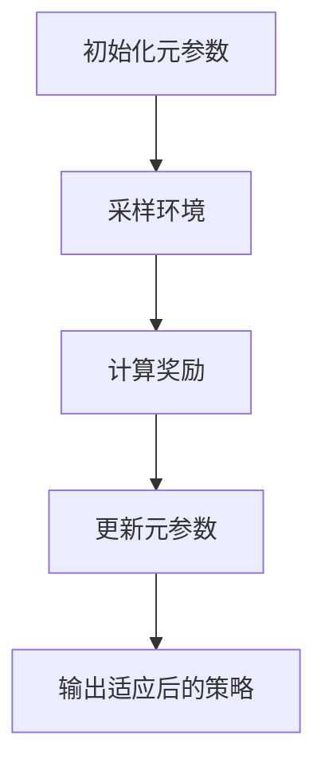

                 


# 元强化学习：提高AI Agent在新环境中的适应能力

> 关键词：元强化学习，AI Agent，适应能力，强化学习，环境建模，智能决策，自适应算法

> 摘要：元强化学习是一种新兴的AI技术，旨在提高AI代理在新环境中的适应能力。本文将从基础概念、算法原理、系统架构、项目实战等多个维度深入探讨元强化学习的核心思想和实现方法。通过详细分析其核心概念、算法框架、系统设计以及实际应用案例，本文为读者提供一个全面的视角，帮助他们理解如何利用元强化学习提升AI代理的环境适应能力。

---

# 第一部分: 元强化学习基础

## 第1章: 元强化学习概述

### 1.1 强化学习基础

#### 1.1.1 强化学习的基本概念
强化学习（Reinforcement Learning，简称RL）是一种机器学习范式，其中智能体通过与环境交互来学习策略，以最大化累积奖励。智能体通过选择动作、观察环境反馈（状态和奖励）来逐步优化其行为策略。

$$
\text{强化学习的目标：} \quad \max_{\pi} \mathbb{E}[R]
$$

#### 1.1.2 强化学习的核心要素
- **状态（State）**：环境中的当前情况。
- **动作（Action）**：智能体在某一状态下选择的行为。
- **奖励（Reward）**：智能体执行动作后获得的反馈。
- **策略（Policy）**：智能体选择动作的规则。
- **值函数（Value Function）**：评估某状态下采取某动作后的预期累积奖励。

#### 1.1.3 强化学习的应用场景
- 游戏AI
- 机器人控制
- 自动驾驶
- 自然语言处理

### 1.2 元强化学习的概念

#### 1.2.1 元强化学习的定义
元强化学习（Meta-Reinforcement Learning，简称Meta-RL）是一种强化学习的扩展，旨在通过学习如何学习，使AI代理能够快速适应新环境。它在元层次上优化学习过程，使代理在面对新任务时能够更快地找到最优策略。

#### 1.2.2 元强化学习与传统强化学习的区别
| 特性 | 传统强化学习 | 元强化学习 |
|------|--------------|------------|
| 学习目标 | 单一任务优化 | 多任务快速适应 |
| 策略更新 | 离线或在线 | 在线学习 |
| 适应能力 | 低 | 高 |

#### 1.2.3 元强化学习的优势
- 快速适应新环境
- 跨任务迁移能力
- 灵活性和泛化性

### 1.3 元强化学习的背景与应用

#### 1.3.1 新环境适应能力的重要性
在动态变化的环境中，传统的强化学习方法需要从头开始学习，效率低下。元强化学习通过预学习元知识，使代理能够快速适应新环境。

#### 1.3.2 元强化学习在AI Agent中的应用
- 多智能体协作
- 动态环境适应
- 高维度状态空间处理

#### 1.3.3 元强化学习的未来发展趋势
- 更高效的元学习算法
- 更强的环境建模能力
- 更广泛的实际应用

### 1.4 本章小结
本章介绍了强化学习的基本概念和核心要素，重点讲解了元强化学习的定义、优势及其在AI代理中的应用。通过对比分析，突出了元强化学习在新环境适应能力方面的独特价值。

---

## 第2章: 元强化学习的核心概念与原理

### 2.1 元强化学习的核心概念

#### 2.1.1 元学习的定义与特点
元学习（Meta-Learning）是指学习如何学习，通过预训练使模型具备快速适应新任务的能力。其特点包括：
- **任务多样性**：能够处理多个不同任务。
- **快速适应**：在新任务上线后，能够快速调整策略。
- **元知识表示**：通过元参数表示任务间的关系。

#### 2.1.2 元强化学习的元知识表示
元知识通常以参数化的方式表示，例如：
$$
\theta = \{\theta_1, \theta_2, ..., \theta_n\}
$$
这些参数用于调节策略网络的权重，从而快速适应新任务。

#### 2.1.3 元强化学习的适应机制
适应机制包括：
1. **参数调整**：通过优化元参数使策略快速适应新环境。
2. **状态空间建模**：通过元知识表示状态间的关系。
3. **任务迁移**：将已有任务的知识迁移到新任务中。

### 2.2 元强化学习的数学模型

#### 2.2.1 元强化学习的优化目标
元强化学习的目标是在多个任务上优化元参数，使得代理能够快速适应新任务。数学表达式为：
$$
\theta^* = \arg\max_{\theta} \mathbb{E}_{t \sim T} \left[ \sum_{t} r_t \right]
$$
其中，$\theta$是元参数，$T$是任务分布。

#### 2.2.2 元强化学习的数学公式
以Meta-Policy Gradient算法为例，其更新规则为：
$$
\theta_{t+1} = \theta_t + \alpha \nabla_{\theta} J(\theta_t)
$$
其中，$\alpha$是学习率，$J(\theta)$是目标函数。

#### 2.2.3 元强化学习的算法框架
1. 初始化元参数$\theta_0$。
2. 对于每个任务$t$：
   - 采样环境，获取状态-动作-奖励序列。
   - 更新元参数$\theta$，以最大化累积奖励。
3. 重复步骤2，直到收敛。

### 2.3 元强化学习与传统强化学习的对比

#### 2.3.1 学习目标的对比
- 传统RL：单任务优化。
- 元RL：多任务快速适应。

#### 2.3.2 算法复杂度的对比
- 传统RL：每个任务独立训练。
- 元RL：通过元参数共享，降低计算复杂度。

#### 2.3.3 适应能力的对比
- 传统RL：适应能力有限。
- 元RL：适应能力强，尤其在新环境中的表现显著提升。

### 2.4 本章小结
本章详细讲解了元强化学习的核心概念、数学模型和算法框架，并通过对比分析，突出了其相对于传统强化学习的独特优势。

---

## 第3章: 元强化学习的算法原理

### 3.1 元强化学习的算法框架

#### 3.1.1 元强化学习的通用算法结构
1. **预训练阶段**：通过多个任务训练元参数。
2. **适应阶段**：在新任务上线后，通过少量数据更新策略。

#### 3.1.2 元强化学习的初始化与参数设置
- 初始元参数$\theta_0$。
- 学习率$\alpha$和动量系数$\beta$。

#### 3.1.3 元强化学习的训练流程
1. 采样环境，获取状态-动作-奖励序列。
2. 计算梯度，更新元参数。
3. 重复步骤1和2，直到收敛。

### 3.2 元强化学习的核心算法

#### 3.2.1 Meta-Policy Gradient算法
- **核心思想**：通过优化元参数，使策略网络快速适应新任务。
- **算法步骤**：
  1. 采样环境，获取状态-动作-奖励序列。
  2. 计算策略梯度，更新元参数。
  3. 重复步骤1和2，直到收敛。

#### 3.2.2 Model-Agnostic Meta-Learning算法
- **核心思想**：通过任务间梯度共享，使模型具备快速适应能力。
- **算法步骤**：
  1. 对于每个任务，计算任务特定的梯度。
  2. 更新元参数，使任务间梯度共享。
  3. 重复步骤1和2，直到收敛。

#### 3.2.3 其他元强化学习算法
- **Meta-Q-Learning**：基于Q-learning的元强化学习算法。
- **Recurrent Meta-Learning**：基于循环神经网络的元学习算法。

### 3.3 元强化学习算法的实现细节

#### 3.3.1 状态空间的处理
- 状态空间可以是高维向量或图结构。
- 通过元参数调整状态表示，使模型快速适应新环境。

#### 3.3.2 动作空间的处理
- 动作空间可以是离散或连续的。
- 通过元参数调整动作选择策略，使模型在新环境中表现更优。

#### 3.3.3 奖励函数的设计
- 奖励函数需要与任务目标一致。
- 通过元参数调整奖励权重，使模型在不同任务中表现均衡。

### 3.4 本章小结
本章详细讲解了元强化学习的核心算法，包括Meta-Policy Gradient和Model-Agnostic Meta-Learning算法，并分析了其在状态、动作和奖励处理中的实现细节。

---

## 第4章: 元强化学习的系统架构与设计

### 4.1 系统架构概述

#### 4.1.1 元强化学习系统的组成模块
1. **环境接口**：与外部环境交互。
2. **策略网络**：基于元参数生成动作。
3. **元参数优化器**：优化元参数，使策略快速适应新任务。
4. **任务管理器**：管理多个任务的训练和测试。

#### 4.1.2 各模块的功能与交互关系
- **环境接口**：接收状态，输出动作。
- **策略网络**：基于元参数和状态生成动作。
- **元参数优化器**：通过梯度更新元参数。
- **任务管理器**：协调多个任务的训练过程。

#### 4.1.3 系统的灵活性与可扩展性
- 支持多种任务类型。
- 元参数可以根据任务需求动态调整。

### 4.2 元强化学习的系统设计

#### 4.2.1 系统功能需求分析
- 支持多任务训练。
- 支持快速适应新任务。
- 支持在线和离线训练。

#### 4.2.2 系统的领域模型设计
- **状态空间**：高维向量或图结构。
- **动作空间**：离散或连续。
- **奖励函数**：任务特定的奖励。

#### 4.2.3 系统的架构设计
- **模块化设计**：各模块独立开发。
- **分布式架构**：支持多线程或多进程。

### 4.3 系统接口与交互设计

#### 4.3.1 系统接口的设计原则
- 易用性：提供简洁的API。
- 扩展性：支持新任务的快速接入。

#### 4.3.2 系统交互的流程设计
1. 初始化系统，加载元参数。
2. 对于每个任务，采样环境，更新元参数。
3. 输出适应后的策略。

#### 4.3.3 系统接口的实现细节
- **输入接口**：接收任务参数和环境反馈。
- **输出接口**：输出适应后的策略。

### 4.4 本章小结
本章详细讲解了元强化学习系统的架构设计，包括模块组成、功能需求和接口设计，并分析了其灵活性和可扩展性。

---

## 第5章: 元强化学习的项目实战

### 5.1 项目背景

#### 5.1.1 项目目标
- 实现一个基于元强化学习的AI代理。
- 验证其在新环境中的适应能力。

#### 5.1.2 项目需求
- 支持多任务训练。
- 支持快速适应新任务。
- 提供可视化界面。

### 5.2 项目实现

#### 5.2.1 环境安装与配置
- 安装Python和相关库（如TensorFlow、PyTorch）。
- 配置运行环境（如虚拟环境）。

#### 5.2.2 核心代码实现

##### 5.2.2.1 元参数优化器
```python
class MetaOptimizer:
    def __init__(self, learning_rate=0.001):
        self.lr = learning_rate
        self.theta = ...

    def update_theta(self, gradient):
        self.theta += self.lr * gradient
```

##### 5.2.2.2 策略网络
```python
class PolicyNetwork:
    def __init__(self, input_dim, output_dim):
        self.model = ...

    def get_action(self, state, theta):
        return self.model.predict(state, theta)
```

##### 5.2.2.3 任务管理器
```python
class TaskManager:
    def __init__(self, tasks):
        self.tasks = tasks

    def run_task(self, task_id):
        task = self.tasks[task_id]
        # 训练过程
        ...
```

#### 5.2.3 算法流程图


### 5.3 项目测试与优化

#### 5.3.1 环境配置与测试
- 配置不同环境，测试代理的适应能力。
- 记录累积奖励和适应时间。

#### 5.3.2 算法性能优化
- 调整学习率和动量系数。
- 优化梯度计算方法。

### 5.4 项目总结

#### 5.4.1 项目成果
- 成功实现元强化学习代理。
- 验证其在新环境中的适应能力。

#### 5.4.2 项目经验
- 元参数设计的关键性。
- 环境建模的重要性。

#### 5.4.3 项目不足
- 计算资源需求较高。
- 算法收敛速度较慢。

### 5.5 本章小结
本章通过一个实际项目，详细讲解了元强化学习的实现过程，包括环境配置、核心代码实现和算法流程图，并分析了项目的测试与优化过程。

---

## 第6章: 元强化学习的最佳实践与未来展望

### 6.1 元强化学习的最佳实践

#### 6.1.1 系统设计中的注意事项
- 合理设计元参数的表示方式。
- 确保系统的灵活性和可扩展性。

#### 6.1.2 算法实现中的小贴士
- 选择合适的优化算法。
- 合理设置学习率和动量系数。

#### 6.1.3 环境建模中的关键点
- 状态表示要准确。
- 奖励函数要与任务目标一致。

### 6.2 未来展望

#### 6.2.1 元强化学习的未来发展方向
- 更高效的元学习算法。
- 更强的环境建模能力。
- 更广泛的实际应用。

#### 6.2.2 元强化学习的挑战与机遇
- 挑战：计算资源需求高，算法复杂。
- 机遇：在动态环境中实现更智能的决策。

### 6.3 本章小结
本章总结了元强化学习的最佳实践，并展望了其未来的发展方向，为读者提供了进一步研究和实践的参考。

---

# 作者：AI天才研究院/AI Genius Institute & 禅与计算机程序设计艺术 /Zen And The Art of Computer Programming

---

以上是《元强化学习：提高AI Agent在新环境中的适应能力》的技术博客文章的完整目录大纲和详细内容。

