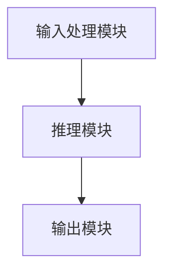
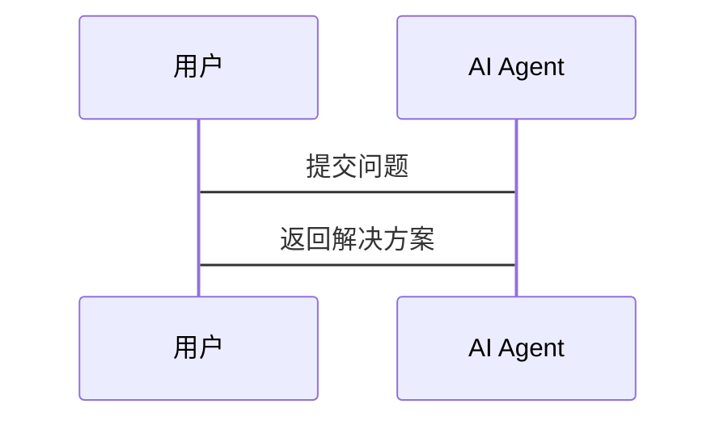
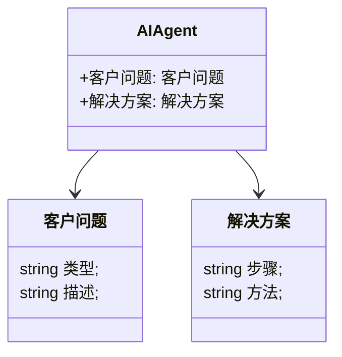
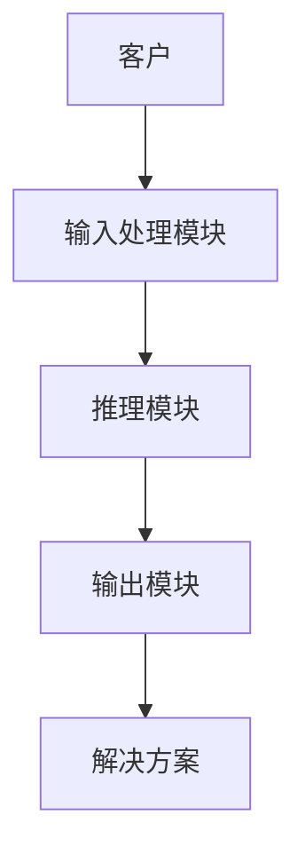

                 


# 复杂问题解决AI Agent：利用LLM进行多步骤推理

## 关键词：LLM, AI Agent, 多步骤推理, 复杂问题, 问题建模

## 摘要：本文探讨如何利用大语言模型（LLM）构建复杂问题解决的AI代理，通过多步骤推理来处理复杂任务。文章从问题背景、LLM原理、系统架构到项目实战，详细分析了复杂问题解决的AI Agent的设计与实现，并通过案例分析展示了实际应用场景。

---

# 第一章：引言

## 1.1 问题背景

### 1.1.1 复杂问题的定义与特性
复杂问题通常具有以下特性：
- **分解性**：可以分解为多个子问题，但子问题之间存在依赖关系。
- **动态性**：问题的状态会随着时间变化，需要动态调整解决方案。
- **不确定性**：问题中存在不确定因素，可能影响解决方案的正确性。

### 1.1.2 LLM在复杂问题解决中的作用
- **自然语言处理能力**：LLM能够理解和生成自然语言，适合处理复杂的文本信息。
- **多步骤推理能力**：LLM可以通过链式推理和记忆机制，逐步解决复杂问题。
- **可扩展性**：LLM可以轻松扩展到各种复杂问题领域。

### 1.1.3 问题解决的边界与外延
- **边界**：复杂问题的解决需要明确的边界，避免范围蔓延。
- **外延**：复杂问题的解决需要考虑外部因素和环境的影响。

## 1.2 问题描述

### 1.2.1 问题分解方法
- **分而治之策略**：将复杂问题分解为多个子问题，分别解决后再整合。
- **问题树分析**：通过树状结构分解问题，识别关键子问题。

### 1.2.2 问题间的关联性分析
- **依赖关系**：子问题之间存在依赖关系，需要顺序解决。
- **并行处理**：某些子问题可以并行处理，提高效率。

### 1.2.3 问题解决的动态性与不确定性
- **动态环境下的问题解决**：需要实时调整解决方案。
- **不确定性建模**：通过概率推理和决策树来处理不确定性。

## 1.3 问题解决的AI Agent概述

### 1.3.1 AI Agent的基本概念
- **定义**：AI Agent是一个智能实体，能够感知环境并采取行动以实现目标。
- **类型**：包括基于规则的AI Agent和基于模型的AI Agent。

### 1.3.2 LLM驱动的AI Agent特点
- **自然语言处理能力**：能够理解和生成自然语言。
- **多步骤推理能力**：能够通过LLM进行链式推理和记忆机制，逐步解决复杂问题。

### 1.3.3 多步骤推理的核心要素
- **推理链**：通过多个推理步骤逐步解决问题。
- **记忆机制**：保持上下文信息，避免重复推理。

## 1.4 本章小结
本章介绍了复杂问题的特性、分解方法以及LLM驱动的AI Agent的基本概念和特点，为后续章节奠定了基础。

---

# 第二章：复杂问题的特性与建模

## 2.1 复杂问题的分解方法

### 2.1.1 分而治之策略
- **定义**：将复杂问题分解为多个子问题，分别解决后再整合。
- **优势**：提高解决问题的效率和准确性。

### 2.1.2 问题树分析
- **定义**：通过树状结构分解问题，识别关键子问题。
- **优势**：清晰地展示问题之间的关系和层次结构。

### 2.1.3 问题间的依赖关系
- **依赖关系**：子问题之间存在依赖关系，需要顺序解决。
- **处理方法**：通过依赖图展示子问题之间的关系，制定解决顺序。

## 2.2 问题的动态性与不确定性

### 2.2.1 动态环境下的问题解决
- **定义**：问题的状态会随着时间变化，需要动态调整解决方案。
- **处理方法**：通过实时监测和反馈机制，动态调整解决方案。

### 2.2.2 不确定性建模方法
- **概率推理**：通过概率分布建模不确定性，计算每种可能性的概率。
- **决策树**：通过决策树分析不同决策路径的概率和结果。

### 2.2.3 概率推理与决策
- **贝叶斯推理**：利用贝叶斯定理进行概率推理，更新概率分布。
- **马尔可夫决策过程**：通过马尔可夫决策过程建模不确定性环境下的决策问题。

## 2.3 问题建模与领域模型

### 2.3.1 领域模型的构建
- **定义**：领域模型是描述问题领域的概念模型。
- **构建方法**：通过问题分析和知识建模，构建领域模型。

### 2.3.2 基于LLM的领域模型优化
- **LLM的优势**：利用LLM进行领域模型的优化和调整。
- **具体方法**：通过LLM生成和优化领域模型，提高模型的准确性和实用性。

### 2.3.3 领域模型的验证与评估
- **验证方法**：通过专家评审和测试案例验证领域模型的准确性。
- **评估指标**：包括模型的准确率、覆盖率和可扩展性。

## 2.4 本章小结
本章详细分析了复杂问题的分解方法、动态性与不确定性，并探讨了基于LLM的领域模型构建方法，为后续章节提供了理论基础。

---

# 第三章：LLM的工作原理与能力

## 3.1 LLM的内部机制

### 3.1.1 大语言模型的结构
- **Transformer架构**：包括编码器和解码器，通过自注意力机制处理输入和生成输出。
- **自注意力机制**：通过计算输入序列中每个词与其他词的相关性，生成注意力权重。

### 3.1.2 模型的训练过程
- **预训练**：通过大量文本数据进行无监督预训练，学习语言的结构和语义。
- **微调**：针对具体任务进行有监督微调，优化模型在特定任务上的表现。

### 3.1.3 推理机制
- **生成式推理**：通过生成式模型生成可能的输出，选择最合适的解。
- **链式推理**：通过链式推理逐步生成输出，保持逻辑连贯性。

## 3.2 LLM的多步骤推理能力

### 3.2.1 链式推理
- **定义**：通过多个推理步骤逐步解决问题。
- **优势**：能够处理复杂问题，提高推理的准确性和深度。

### 3.2.2 基于记忆的推理
- **定义**：通过记忆机制保持上下文信息，避免重复推理。
- **实现方法**：利用外部存储器或内部状态保持记忆。

### 3.2.3 分步推理的优化策略
- **定义**：通过优化推理步骤，提高推理效率和准确性。
- **实现方法**：通过动态规划或贪心算法优化推理步骤。

## 3.3 LLM的可解释性与可控制性

### 3.3.1 可解释性的重要性
- **定义**：模型的决策过程能够被人类理解。
- **优势**：提高模型的可信度和可用性。

### 3.3.2 可控性实现
- **定义**：通过控制模型的推理过程，引导模型生成期望的输出。
- **实现方法**：通过提示工程技术（Prompt Engineering）控制模型的输出。

## 3.4 本章小结
本章详细介绍了LLM的内部机制、多步骤推理能力以及可解释性和可控制性，为后续章节的设计和实现提供了理论支持。

---

# 第四章：AI Agent的设计与实现

## 4.1 AI Agent的设计原则

### 4.1.1 目标导向性
- **定义**：AI Agent的行为以明确的目标为导向。
- **实现方法**：通过目标分解和优先级排序实现目标导向性。

### 4.1.2 可扩展性
- **定义**：AI Agent能够适应不同问题领域和任务。
- **实现方法**：通过模块化设计和接口标准化实现可扩展性。

### 4.1.3 可靠性
- **定义**：AI Agent在复杂环境下的稳定性和健壮性。
- **实现方法**：通过冗余设计和错误恢复机制提高可靠性。

## 4.2 系统架构设计

### 4.2.1 功能模块划分
- **输入处理模块**：接收输入并解析问题。
- **推理模块**：利用LLM进行多步骤推理，生成解决方案。
- **输出模块**：将解决方案输出给用户或系统。

### 4.2.2 系统架构图


### 4.2.3 交互流程


## 4.3 交互设计

### 4.3.1 用户界面设计
- **定义**：设计直观的用户界面，方便用户与AI Agent交互。
- **实现方法**：通过图形用户界面（GUI）或命令行界面（CLI）实现用户交互。

### 4.3.2 接口设计
- **定义**：设计标准化的接口，方便与其他系统集成。
- **实现方法**：通过API接口实现与外部系统的集成。

## 4.4 评估指标

### 4.4.1 解决方案的正确性
- **定义**：解决方案的正确性和准确性。
- **评估方法**：通过专家评审和测试案例评估解决方案的正确性。

### 4.4.2 效率
- **定义**：AI Agent解决问题的效率和速度。
- **评估方法**：通过时间复杂度和资源消耗评估效率。

## 4.5 本章小结
本章详细介绍了AI Agent的设计原则、系统架构和交互设计，为后续章节的项目实战奠定了基础。

---

# 第五章：项目实战

## 5.1 项目介绍

### 5.1.1 项目背景
- **定义**：智能客服系统用于处理客户的问题和服务请求。
- **目标**：提高客户满意度和解决问题的效率。

## 5.2 系统功能设计

### 5.2.1 领域模型


### 5.2.2 系统架构


## 5.3 系统实现

### 5.3.1 环境安装
- **Python 3.8+**
- **LLM库**：如Hugging Face的GPT模型
- **依赖管理**：使用pip安装必要的库

### 5.3.2 核心实现代码
```python
# 定义输入处理模块
def process_input(user_input):
    return user_input

# 定义推理模块
def llm_inference(model, input_text):
    return model.generate(input_text)

# 定义输出模块
def output_result(solution):
    print(solution)

# 主函数
def main():
    model = load_llm_model()
    user_input = input("请输入问题：")
    processed_input = process_input(user_input)
    solution = llm_inference(model, processed_input)
    output_result(solution)

if __name__ == "__main__":
    main()
```

### 5.3.3 代码应用解读与分析
- **输入处理模块**：接收用户输入并进行初步处理。
- **推理模块**：利用LLM进行多步骤推理，生成解决方案。
- **输出模块**：将解决方案输出给用户。

## 5.4 实际案例分析

### 5.4.1 案例描述
- **问题**：客户投诉订单延迟。
- **解决方案**：联系相关部门调查原因，提供补偿方案。

### 5.4.2 详细分析
- **问题分解**：订单延迟的原因可能包括物流问题、系统故障等。
- **多步骤推理**：首先调查物流情况，然后检查系统记录，最后制定补偿方案。

## 5.5 项目小结
本章通过智能客服系统的实际案例，详细讲解了AI Agent的项目实现过程，包括系统设计、代码实现和案例分析。

---

# 第六章：高级主题

## 6.1 可解释性与可控制性

### 6.1.1 可解释性的重要性
- **定义**：模型的决策过程能够被人类理解。
- **实现方法**：通过提示工程技术（Prompt Engineering）提高可解释性。

### 6.1.2 可控性实现
- **定义**：通过控制模型的推理过程，引导模型生成期望的输出。
- **实现方法**：通过提示工程技术实现对模型的可控性。

## 6.2 鲁棒性与容错性

### 6.2.1 鲁棒性
- **定义**：AI Agent在复杂环境下的稳定性和健壮性。
- **实现方法**：通过冗余设计和错误恢复机制提高鲁棒性。

### 6.2.2 容错性
- **定义**：AI Agent在出现错误时能够恢复正常运行。
- **实现方法**：通过容错设计和错误处理机制提高容错性。

## 6.3 伦理问题与责任承担

### 6.3.1 伦理问题
- **定义**：AI Agent在运行过程中可能涉及的伦理问题，如隐私泄露和算法偏见。
- **实现方法**：通过伦理审查和算法优化减少伦理问题。

### 6.3.2 责任承担
- **定义**：在出现问题时，明确责任承担方。
- **实现方法**：通过法律合规和责任分配明确责任承担。

## 6.4 人机协作

### 6.4.1 定义
- **定义**：人与机器协同工作，共同解决问题。
- **优势**：结合人类的创造力和机器的计算能力。

### 6.4.2 实现方法
- **定义**：通过人机交互界面实现协作，结合人类的决策和机器的执行。

## 6.5 本章小结
本章探讨了AI Agent的高级主题，包括可解释性、鲁棒性、伦理问题和人机协作，为实际应用提供了指导。

---

# 第七章：总结与展望

## 7.1 总结

### 7.1.1 核心内容回顾
- **复杂问题解决的AI Agent**：通过多步骤推理和LLM技术解决复杂问题。
- **系统架构设计**：通过模块化设计和标准化接口实现系统的可扩展性和可靠性。

### 7.1.2 项目实战经验
- **智能客服系统**：通过实际案例展示了AI Agent的实现过程和应用效果。

## 7.2 未来展望

### 7.2.1 技术发展
- **更强大的LLM**：随着技术进步，LLM的性能和能力将不断提升。
- **更复杂的推理**：未来LLM将支持更复杂的多步骤推理和动态环境下的问题解决。

### 7.2.2 应用场景拓展
- **更多领域应用**：AI Agent将应用于更多领域，如医疗、金融、教育等。
- **人机协作深化**：人机协作将更加紧密，结合人类的创造力和机器的计算能力。

## 7.3 本章小结
本章总结了全文的核心内容，并展望了未来的技术发展和应用场景，为读者提供了进一步思考的空间。

---

# 作者：AI天才研究院/AI Genius Institute & 禅与计算机程序设计艺术 /Zen And The Art of Computer Programming

---

**注**：本文为技术博客文章示例，实际写作时需要根据具体情况进行调整和补充，确保内容的完整性和深度。

