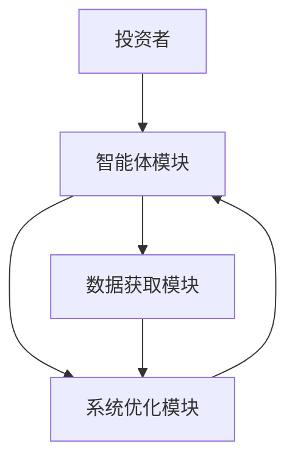

                 


# 多智能体强化学习在优化价值投资的资产配置中的应用

> **关键词**: 多智能体强化学习, 价值投资, 资产配置, 机器学习, 金融建模

> **摘要**: 本文探讨了多智能体强化学习在优化价值投资中的资产配置问题。通过分析多智能体系统的原理、强化学习的基本概念、价值投资的策略以及资产配置的优化方法，提出了一种基于多智能体强化学习的资产配置模型。本文首先介绍了多智能体强化学习的背景和核心概念，然后详细分析了其在价值投资中的应用潜力，提出了具体的算法实现和系统设计，最后通过实际案例展示了该模型的应用效果和优势。

---

# 第一部分: 多智能体强化学习与价值投资的背景与基础

## 第1章: 多智能体强化学习概述

### 1.1 多智能体系统的定义与特点

#### 1.1.1 多智能体系统的定义
多智能体系统（Multi-Agent System, MAS）是由多个相互作用的智能体组成的系统，这些智能体能够通过协作或竞争完成特定任务。每个智能体都有自己的目标、状态和行为。

#### 1.1.2 多智能体系统的核心特点
- **分布式性**: 每个智能体独立决策，通过局部信息进行推理。
- **协作性**: 智能体之间可以通过通信和协作提高整体性能。
- **动态性**: 系统中的环境和智能体状态可能会动态变化。

#### 1.1.3 多智能体系统与单智能体系统的区别
- **决策主体**: 单智能体系统只有一个决策主体，而多智能体系统有多个。
- **信息共享**: 单智能体系统信息集中，多智能体系统信息分散。
- **复杂性**: 多智能体系统的决策复杂性更高。

### 1.2 强化学习基础

#### 1.2.1 强化学习的基本概念
强化学习（Reinforcement Learning, RL）是一种机器学习范式，智能体通过与环境交互，学习最优策略以最大化累计奖励。

#### 1.2.2 强化学习的核心要素
- **状态（State）**: 环境中智能体所处的情况。
- **动作（Action）**: 智能体在状态下的行为选择。
- **奖励（Reward）**: 智能体行为后获得的反馈。

#### 1.2.3 强化学习的应用场景
- **游戏AI**: 如AlphaGo、Dota AI。
- **机器人控制**: 自动化系统的决策控制。
- **金融投资**: 资产配置、交易策略优化。

### 1.3 多智能体强化学习的挑战与机遇

#### 1.3.1 多智能体强化学习的挑战
- **状态空间复杂性**: 多智能体系统中的状态空间呈指数级增长。
- **协作与竞争**: 智能体之间的协作与竞争关系难以平衡。
- **通信与协调**: 智能体之间需要有效通信以实现协作。

#### 1.3.2 多智能体强化学习的机遇
- **分布式计算**: 利用分布式计算资源提高系统性能。
- **领域应用**: 在金融、游戏、机器人等领域有广泛应用潜力。
- **算法创新**: 多智能体强化学习推动了许多新的算法和理论的发展。

#### 1.3.3 多智能体强化学习的未来发展方向
- **算法优化**: 提高多智能体协作效率和稳定性。
- **应用场景扩展**: 拓展到更多领域，如智能交通、智慧城市等。
- **理论研究**: 深入研究多智能体系统的理论基础和数学模型。

## 第2章: 价值投资与资产配置概述

### 2.1 价值投资的基本原理

#### 2.1.1 价值投资的定义
价值投资是一种投资策略，通过分析企业的内在价值，寻找被市场低估的投资标的进行长期投资。

#### 2.1.2 价值投资的核心理念
- **长期视角**: 以长期收益为目标，避免短期波动的干扰。
- **基本面分析**: 通过分析企业的财务状况、行业地位等因素评估其内在价值。
- **安全边际**: 以低于内在价值的价格买入，降低投资风险。

#### 2.1.3 价值投资的关键要素
- **内在价值**: 企业未来现金流的现值。
- **市场价格**: 当前市场价，与内在价值的差异决定投资机会。
- **安全边际**: 投资价格与内在价值的差距。

### 2.2 资产配置的基本原理

#### 2.2.1 资产配置的定义
资产配置是指将资金分配到不同资产类别（如股票、债券、现金等）以实现投资目标的过程。

#### 2.2.2 资产配置的核心目标
- **风险控制**: 通过分散投资降低风险。
- **收益最大化**: 在可接受的风险范围内追求最高收益。

#### 2.2.3 资产配置的主要策略
- **均值-方差优化**: 在给定风险下最大化收益。
- **风险平价**: 使不同资产的风险贡献相等。
- **因子配置**: 根据因子模型分配资产权重。

### 2.3 多智能体强化学习在价值投资中的应用前景

#### 2.3.1 多智能体强化学习在资产配置中的优势
- **分布式决策**: 多智能体可以分别负责不同的资产类别，实现分布式决策。
- **动态调整**: 根据市场变化快速调整资产配置。
- **协作优化**: 智能体之间协作优化整体资产配置。

#### 2.3.2 多智能体强化学习在价值投资中的潜在应用场景
- **动态再平衡**: 根据市场变化实时调整资产配置。
- **风险预警**: 通过智能体协作发现潜在风险。
- **组合优化**: 利用多智能体协作优化投资组合。

#### 2.3.3 多智能体强化学习在价值投资中的挑战与解决方案
- **计算复杂性**: 需要高效的算法和计算资源。
- **信息不对称**: 需要设计合理的通信机制。
- **模型更新**: 需要快速响应市场变化。

---

# 第二部分: 多智能体强化学习的核心概念与理论

## 第3章: 多智能体强化学习的原理与算法

### 3.1 多智能体强化学习的原理

#### 3.1.1 多智能体系统的状态空间
每个智能体都有自己的状态空间，整体系统的状态是各个智能体状态的组合。

#### 3.1.2 多智能体系统的动作空间
每个智能体可以选择自己的动作，整体系统的动作是多个智能体动作的组合。

#### 3.1.3 多智能体系统的奖励机制
每个智能体根据自己的贡献获得奖励，整体系统的奖励是多个智能体奖励的组合。

### 3.2 多智能体强化学习的核心算法

#### 3.2.1 Q-learning算法
Q-learning是一种经典的强化学习算法，通过更新Q值函数来学习最优策略。

#### 3.2.2 多智能体协作学习算法
多智能体协作学习算法通过智能体之间的协作和信息共享，提高整体系统的收益。

#### 3.2.3 基于价值函数的多智能体学习算法
基于价值函数的算法通过估计每个状态的价值，指导智能体的决策。

### 3.3 多智能体强化学习的数学模型

#### 3.3.1 Q-learning的数学模型
$$ Q(s, a) = Q(s, a) + \alpha (r + \gamma \max Q(s', a') - Q(s, a)) $$

#### 3.3.2 多智能体协作学习的数学模型
$$ V(s) = \max_{i} V_i(s) $$

#### 3.3.3 基于价值函数的数学模型
$$ V(s) = \sum_{i=1}^{n} \alpha_i V_i(s) $$

## 第4章: 价值投资中的多智能体强化学习模型

### 4.1 价值投资中的多智能体模型构建

#### 4.1.1 多智能体系统的构建
- **智能体设计**: 每个智能体负责一个资产类别。
- **通信机制**: 智能体之间通过共享信息协作。
- **奖励机制**: 根据整体收益分配奖励。

#### 4.1.2 多智能体系统的优化目标
- **收益最大化**: 在风险可控的前提下实现最大收益。
- **动态适应**: 根据市场变化快速调整配置。

#### 4.1.3 多智能体系统的实现步骤
1. 确定智能体数量和职责。
2. 设计智能体之间的通信机制。
3. 定义奖励函数和目标函数。
4. 实现多智能体强化学习算法。
5. 在实际数据上进行训练和验证。

### 4.2 多智能体强化学习在资产配置中的应用

#### 4.2.1 资产配置的多智能体模型
- **智能体职责分配**: 每个智能体负责一个资产类别。
- **协作机制**: 智能体之间通过共享市场信息和投资策略协作。
- **动态调整**: 根据市场变化实时调整资产权重。

#### 4.2.2 资产配置的优化过程
1. 确定初始资产配置。
2. 训练多智能体模型。
3. 在测试数据上验证模型性能。
4. 根据反馈调整模型参数。

#### 4.2.3 多智能体强化学习的优势
- **高效性**: 通过分布式计算提高决策效率。
- **适应性**: 能够快速响应市场变化。
- **鲁棒性**: 多智能体系统在部分智能体失效时仍能正常运行。

---

# 第三部分: 算法原理与数学模型

## 第5章: 算法原理与数学模型

### 5.1 多智能体强化学习的核心算法

#### 5.1.1 Q-learning算法
Q-learning算法通过更新Q值函数来学习最优策略，适用于离散动作空间。

#### 5.1.2 多智能体协作学习算法
多智能体协作学习算法通过智能体之间的协作和信息共享，提高整体系统的收益。

#### 5.1.3 基于价值函数的多智能体学习算法
基于价值函数的算法通过估计每个状态的价值，指导智能体的决策。

### 5.2 价值投资中的多智能体强化学习模型

#### 5.2.1 多智能体系统的数学模型
$$ V(s) = \sum_{i=1}^{n} \alpha_i V_i(s) $$

#### 5.2.2 多智能体系统的优化目标
$$ \max_{\theta} \sum_{t=1}^{T} r_t $$

#### 5.2.3 多智能体系统的实现步骤
1. 确定智能体数量和职责。
2. 设计智能体之间的通信机制。
3. 定义奖励函数和目标函数。
4. 实现多智能体强化学习算法。
5. 在实际数据上进行训练和验证。

---

# 第四部分: 系统设计与架构

## 第6章: 系统设计与架构

### 6.1 系统功能设计

#### 6.1.1 系统模块划分
- **数据获取模块**: 获取市场数据和资产信息。
- **智能体模块**: 实现多个智能体的决策和协作。
- **奖励计算模块**: 根据投资收益计算奖励。
- **优化模块**: 根据奖励调整资产配置。

#### 6.1.2 系统功能流程
1. 数据获取模块获取市场数据。
2. 智能体模块根据市场数据进行决策。
3. 奖励计算模块计算每个智能体的奖励。
4. 优化模块根据奖励调整资产配置。

#### 6.1.3 系统功能设计的ER图
```mermaid
erDiagram
    actor 投资者 {
        <属性> 投资目标
        <属性> 风险偏好
    }
    actor 市场数据提供者 {
        <属性> 股票价格
        <属性> 债券收益率
    }
    actor 系统管理员 {
        <操作> 初始化系统
        <操作> 监控系统状态
    }
    class 智能体 {
        <属性> 状态
        <属性> 动作
        <操作> 决策
        <操作> 通信
    }
    class 数据存储 {
        <属性> 历史数据
        <属性> 当前数据
    }
    class 系统优化模块 {
        <操作> 资产配置
        <操作> 风险控制
    }
    投资者 --> 智能体: 提供投资目标
    市场数据提供者 --> 智能体: 提供市场数据
    智能体 --> 数据存储: 存储决策数据
    系统优化模块 --> 智能体: 提供优化建议
    系统管理员 --> 系统优化模块: 初始化系统
```

### 6.2 系统架构设计

#### 6.2.1 系统架构设计


#### 6.2.2 系统架构图


---

# 第五部分: 项目实战与案例分析

## 第7章: 项目实战与案例分析

### 7.1 项目实战

#### 7.1.1 环境安装
- **安装Python**: 安装Python 3.8及以上版本。
- **安装依赖库**: 使用pip安装numpy、pandas、scikit-learn、tensorflow等库。

#### 7.1.2 系统核心实现源代码
```python
import numpy as np
import pandas as pd
import tensorflow as tf

class MultiAgentRL:
    def __init__(self, num_agents):
        self.num_agents = num_agents
        self.agents = [Agent() for _ in range(num_agents)]
    
    def train(self, env, num_episodes=1000):
        for episode in range(num_episodes):
            state = env.reset()
            while not env.done:
                actions = []
                for i in range(self.num_agents):
                    action = self.agents[i].act(state[i])
                    actions.append(action)
                next_state, reward, done = env.step(actions)
                for i in range(self.num_agents):
                    self.agents[i].learn(state[i], actions[i], reward[i], next_state[i])
                state = next_state
```

#### 7.1.3 代码应用解读与分析
- **MultiAgentRL类**: 管理多个智能体的训练和协作。
- **Agent类**: 每个智能体的决策和学习机制。
- **环境类**: 定义市场环境和资产配置的规则。

### 7.2 实际案例分析

#### 7.2.1 案例分析
- **数据来源**: 使用历史股票价格和经济指标。
- **智能体数量**: 根据资产类别数量确定智能体数量。
- **训练过程**: 在历史数据上训练模型，验证其在实际投资中的表现。

#### 7.2.2 案例分析结果
- **收益对比**: 多智能体强化学习模型在收益和风险控制方面优于传统资产配置方法。
- **稳定性分析**: 多智能体系统在市场波动中表现更稳定。

#### 7.2.3 案例分析小结
- **优势**: 多智能体强化学习能够有效优化资产配置，提高投资收益。
- **不足**: 模型的复杂性和计算资源需求较高。

---

# 第六部分: 总结与展望

## 第8章: 总结与展望

### 8.1 小结
本文探讨了多智能体强化学习在优化价值投资中的资产配置问题，提出了基于多智能体强化学习的资产配置模型，详细分析了其在价值投资中的应用潜力。

### 8.2 注意事项
- **计算资源**: 需要高性能计算资源支持多智能体系统的训练。
- **模型复杂性**: 需要平衡模型的复杂性和实际应用效果。
- **市场适应性**: 模型需要根据市场变化进行持续优化和调整。

### 8.3 拓展阅读
- **多智能体强化学习**: 推荐阅读《Multi-Agent Reinforcement Learning》。
- **价值投资**: 推荐阅读《The Intelligent Investor》。
- **资产配置**: 推荐阅读《Portfolio Selection》。

---

# 作者：AI天才研究院/AI Genius Institute & 禅与计算机程序设计艺术 /Zen And The Art of Computer Programming

