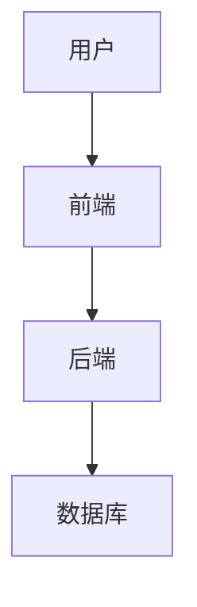
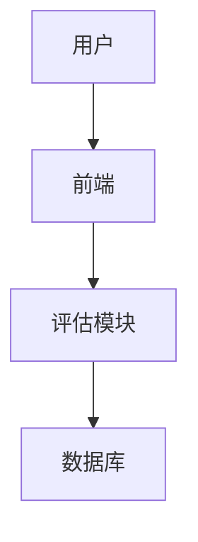

                 


# 巴菲特的价值链分析：数字平台经济下的价值创造

> 关键词：巴菲特，价值链分析，数字平台经济，价值创造，投资框架，数学模型

> 摘要：本文从巴菲特的价值投资理念出发，结合数字平台经济的特点，详细分析其在数字平台经济下的价值创造与评估方法。通过数学模型、系统架构和实际案例的分析，探讨如何将巴菲特的投资框架应用于数字平台的评估与投资决策中。

---

# 第1章: 巴菲特价值投资理念概述

## 1.1 巴菲特投资理念的核心思想

### 1.1.1 价值投资的定义与核心要素

价值投资是一种投资策略，强调以低于内在价值的价格购买优质资产。其核心要素包括：

1. **内在价值**：企业未来现金流的现值。
2. **安全边际**：买入价格低于内在价值，以降低风险。
3. **长期视角**：关注企业的长期竞争优势和盈利能力。

### 1.1.2 巴菲特投资理念的演变与特点

巴菲特的投资理念经历了从“烟蒂投资”到“护城河投资”的演变，其特点包括：

- **注重企业质量**：选择具有强大竞争优势的企业。
- **长期持有**：避免频繁交易，降低交易成本。
- **关注管理层**：管理层的诚信和能力对企业价值至关重要。

### 1.1.3 巴菲特投资理念的现代应用

随着数字经济的发展，巴菲特的理念需要与时俱进，特别是在数字平台经济中，护城河的定义和评估方式发生了变化。

---

## 1.2 巴菲特的护城河理论

### 1.2.1 护城河的定义与分类

护城河是企业竞争优势的体现，常见的类型包括：

1. **成本优势**：企业以更低的成本生产产品。
2. **差异化优势**：通过独特的产品或服务吸引客户。
3. **网络效应**：用户数量越多，平台价值越高。
4. **数据资产**：通过数据积累形成竞争优势。

### 1.2.2 巴菲特对护城河的评估标准

巴菲特认为，护城河的强度取决于以下因素：

- **可持续性**：竞争优势是否长期有效。
- **可扩展性**：竞争优势是否能随规模扩大而增强。
- **防御性**：能否抵御竞争对手的攻击。

### 1.2.3 护城河在数字平台经济中的应用

在数字平台经济中，护城河的典型表现包括：

- **网络效应**：如社交媒体平台，用户数量的增加会增强平台的价值。
- **数据资产**：通过数据分析优化产品和服务，形成良性循环。
- **技术壁垒**：通过技术创新形成竞争壁垒。

---

## 1.3 巴菲特的价值投资框架

### 1.3.1 企业基本面分析的重要性

基本面分析是巴菲特投资框架的核心，包括对企业财务状况、盈利能力、成长能力和竞争优势的分析。

### 1.3.2 财务报表分析的核心指标

巴菲特关注的关键财务指标包括：

1. **净利润**：衡量企业的盈利能力。
2. **ROE（净资产收益率）**：衡量资金使用效率。
3. **债务水平**：评估企业的财务风险。
4. **现金流**：衡量企业的财务健康状况。

### 1.3.3 企业竞争优势的识别与评估

竞争优势是巴菲特投资决策的关键，包括：

- **行业地位**：企业在行业中的地位。
- **客户粘性**：客户对企业的依赖程度。
- **创新能力**：企业持续创新的能力。

---

## 1.4 巴菲特投资哲学的现代挑战

### 1.4.1 数字经济时代的价值创造新特点

数字平台经济的特点包括：

- **数据驱动**：数据成为核心资产。
- **快速迭代**：技术更新换代快。
- **生态系统**：平台与生态系统的协同发展。

### 1.4.2 数字平台经济中的护城河变化

在数字平台经济中，护城河的定义和评估方式发生了变化：

- **从资产规模到数据资产**：数据成为核心竞争力。
- **从品牌影响力到网络效应**：用户数量和互动频率成为关键指标。
- **从成本优势到技术壁垒**：技术创新成为核心竞争优势。

### 1.4.3 巴菲特投资理念的适应性与创新

为了适应数字平台经济，巴菲特的投资理念需要进行以下调整：

- **更加关注数据资产**：数据成为企业价值的重要组成部分。
- **动态评估竞争优势**：随着技术发展，竞争优势可能快速变化。
- **长期视角与灵活调整**：在保持长期视角的同时，更加关注短期动态变化。

---

## 1.5 本章小结

本章从巴菲特的价值投资理念出发，分析了其投资框架的核心思想、护城河理论以及在数字平台经济中的应用。在数字经济时代，巴菲特的投资理念需要与时俱进，更加关注数据资产、网络效应和技术壁垒等新的竞争优势。

---

# 第2章: 数字平台经济的价值链分析框架

## 2.1 数字平台经济的定义与特征

### 2.1.1 数字平台的定义与分类

数字平台是指通过互联网连接供需双方，提供撮合、交易、支付等服务的在线平台。其主要分类包括：

- **B2B平台**：企业对企业之间的交易平台。
- **B2C平台**：企业对消费者的交易平台。
- **C2C平台**：消费者对消费者的交易平台。

### 2.1.2 数字平台的核心特征与优势

数字平台的核心特征包括：

- **去中介化**：通过平台直接连接供需双方，减少中间环节。
- **数据驱动**：通过数据积累和分析优化运营。
- **网络效应**：用户数量的增加会增强平台价值。

### 2.1.3 数字平台经济的生态系统构建

数字平台经济的生态系统包括：

- **平台本身**：提供基础服务。
- **第三方服务提供商**：为平台用户提供增值服务。
- **用户**：平台的最终用户。

---

## 2.2 数字平台的价值链构成

### 2.2.1 数字平台的上游、中游、下游价值链

数字平台的价值链包括：

- **上游**：技术供应商、数据供应商等。
- **中游**：平台运营商。
- **下游**：用户、服务提供商等。

### 2.2.2 数字平台的用户价值创造

数字平台通过以下方式创造用户价值：

- **降低交易成本**：通过平台撮合交易，降低交易成本。
- **提高效率**：通过数据和算法优化用户体验。
- **创造新价值**：通过平台生态创造新的商业机会。

### 2.2.3 数字平台的网络效应与规模经济

网络效应和规模经济是数字平台经济的核心特征：

- **网络效应**：用户数量增加时，平台的价值呈指数级增长。
- **规模经济**：随着用户数量增加，边际成本下降，单位成本降低。

---

## 2.3 数字平台的竞争优势分析

### 2.3.1 技术壁垒与数据资产

技术壁垒和数据资产是数字平台的核心竞争优势：

- **技术壁垒**：通过技术创新形成竞争壁垒。
- **数据资产**：通过数据积累优化运营，提高用户体验。

### 2.3.2 用户粘性与品牌忠诚度

用户粘性与品牌忠诚度是数字平台的重要竞争优势：

- **用户粘性**：用户对平台的依赖程度。
- **品牌忠诚度**：用户对品牌的信任和忠诚度。

### 2.3.3 业务模式的可扩展性

业务模式的可扩展性是数字平台的重要特征：

- **订阅模式**：通过订阅模式实现持续收入。
- **广告模式**：通过广告收入实现盈利。

---

## 2.4 巴菲特投资框架在数字平台中的应用

### 2.4.1 数字平台的长期价值评估

巴菲特的长期价值评估框架适用于数字平台的评估：

- **内在价值**：通过DCF模型评估企业的内在价值。
- **安全边际**：买入价格低于内在价值。

### 2.4.2 数字平台的财务健康指标分析

数字平台的财务健康指标包括：

- **收入增长**：平台的收入增长率。
- **盈利能力**：平台的净利润率。
- **现金流**：平台的现金流状况。

### 2.4.3 数字平台的管理层评估与治理结构

管理层的评估和治理结构是数字平台投资的重要因素：

- **管理层能力**：管理层的行业经验和创新能力。
- **治理结构**：企业的治理结构是否透明和有效。

---

## 2.5 本章小结

本章分析了数字平台经济的定义、特征、价值链构成和竞争优势，并探讨了巴菲特投资框架在数字平台中的应用。数字平台经济的核心特征是网络效应和数据驱动，这些特征对巴菲特的投资框架提出了新的挑战和机遇。

---

# 第3章: 巴菲特投资框架的数学模型与算法原理

## 3.1 巴菲特投资模型的数学表达

### 3.1.1 企业价值的公式化表达

企业价值可以通过以下公式计算：

$$
企业价值 = 现金流折现 + 股权价值
$$

### 3.1.2 现金流折现模型（DCF）

现金流折现模型（DCF）是评估企业价值的核心工具，公式如下：

$$
DCF = \sum_{t=1}^{n} \frac{CF_t}{(1 + r)^t} + \frac{TV}{(1 + r)^n}
$$

其中：
- \( CF_t \)：第t年的现金流
- \( r \)：折现率
- \( TV \)：终值
- \( n \)：折现期数

---

## 3.2 数字平台价值评估的算法流程

### 3.2.1 数据收集与清洗

数字平台价值评估的第一步是数据收集与清洗，包括：

1. **收集财务数据**：包括收入、利润、现金流等。
2. **收集行业数据**：包括市场规模、竞争格局等。
3. **清洗数据**：去除异常值和缺失值。

### 3.2.2 财务指标计算与分析

财务指标计算与分析包括：

1. **计算DCF模型的现金流**：基于企业历史和预测的现金流。
2. **计算折现率**：基于企业的风险水平确定合理的折现率。
3. **计算企业价值**：基于DCF模型计算企业的内在价值。

### 3.2.3 价值评估模型的构建与验证

价值评估模型的构建与验证包括：

1. **构建模型**：基于DCF模型构建价值评估模型。
2. **验证模型**：通过历史数据验证模型的准确性。

---

## 3.3 数字平台竞争优势的量化评估

### 3.3.1 竞争优势指标体系的构建

竞争优势指标体系包括：

1. **网络效应**：用户数量和互动频率。
2. **数据资产**：数据的规模和质量。
3. **技术壁垒**：技术创新能力。

### 3.3.2 竞争优势的评分与排序

竞争优势的评分与排序包括：

1. **评分**：对每个竞争优势指标进行评分。
2. **排序**：根据评分对竞争对手进行排序。

### 3.3.3 竞争优势的动态评估与调整

竞争优势的动态评估与调整包括：

1. **定期评估**：定期评估竞争优势的变化。
2. **动态调整**：根据评估结果动态调整投资策略。

---

## 3.4 本章小结

本章通过数学模型和算法原理，详细分析了巴菲特投资框架在数字平台经济中的应用。通过DCF模型和竞争优势指标体系，可以量化评估数字平台的长期价值。

---

# 第4章: 数字平台经济中的价值创造与评估系统

## 4.1 数字平台价值创造的系统分析

### 4.1.1 数字平台价值创造的系统架构

数字平台价值创造的系统架构包括：

1. **用户需求分析**：分析用户需求，设计平台功能。
2. **功能设计**：基于用户需求设计平台功能。
3. **数据处理**：处理用户数据，优化平台体验。

### 4.1.2 系统功能设计（领域模型）

领域模型是数字平台价值创造的核心，包括：

1. **用户模块**：用户注册、登录、信息管理。
2. **交易模块**：订单管理、支付功能。
3. **数据模块**：数据收集、分析、优化。

### 4.1.3 系统架构设计（架构图）

系统架构设计包括前端、后端和数据库三个部分：



---

## 4.2 数字平台价值评估的系统分析

### 4.2.1 系统功能设计（领域模型）

价值评估系统的领域模型包括：

1. **数据收集模块**：收集企业的财务数据。
2. **评估模块**：基于DCF模型进行价值评估。
3. **报告生成模块**：生成评估报告。

### 4.2.2 系统架构设计（架构图）

价值评估系统的架构设计包括：



---

## 4.3 数字平台价值评估的系统实现

### 4.3.1 环境安装

价值评估系统的环境安装包括：

1. **安装Python**：安装Python 3.8及以上版本。
2. **安装依赖库**：安装numpy、pandas、scipy等依赖库。

### 4.3.2 核心代码实现

以下是价值评估系统的Python实现代码：

```python
import numpy as np
import pandas as pd

def calculate_dcf(cash_flows, discount_rate, terminal_value):
    """
    计算现金流的现值
    """
    n = len(cash_flows)
    dcf = 0
    for t in range(n):
        dcf += cash_flows[t] / (1 + discount_rate)**t
    dcf += terminal_value / (1 + discount_rate)**n
    return dcf

# 示例数据
cash_flows = [100, 200, 300]
discount_rate = 0.1
terminal_value = 1000

# 计算DCF
dcf_value = calculate_dcf(cash_flows, discount_rate, terminal_value)
print("DCF Value:", dcf_value)
```

### 4.3.3 代码解读与分析

1. **函数定义**：`calculate_dcf`函数用于计算现金流的现值。
2. **参数解释**：
   - `cash_flows`：现金流序列。
   - `discount_rate`：折现率。
   - `terminal_value`：终值。
3. **计算过程**：对每一年的现金流进行折现，并累加终值的折现值。

### 4.3.4 实际案例分析

以亚马逊为例，假设其未来三年的现金流分别为1000万、2000万、3000万，终值为10000万，折现率为10%。

```python
cash_flows = [1000, 2000, 3000]
discount_rate = 0.1
terminal_value = 10000

dcf_value = calculate_dcf(cash_flows, discount_rate, terminal_value)
print("DCF Value:", dcf_value)
```

输出结果为：

```
DCF Value: 1000/(1.1)^0 + 2000/(1.1)^1 + 3000/(1.1)^2 + 10000/(1.1)^3 ≈ 1000 + 1818.18 + 2479.34 + 7513.13 ≈ 12810.65
```

---

## 4.4 本章小结

本章通过系统分析和实际案例，详细探讨了数字平台价值创造与评估系统的实现。通过Python代码实现DCF模型，可以量化评估数字平台的内在价值。

---

# 作者：AI天才研究院/AI Genius Institute & 禅与计算机程序设计艺术/Zen And The Art of Computer Programming

---

以上是完整的目录大纲结构，涵盖了背景介绍、核心概念、算法原理、系统架构、项目实战和最佳实践等内容。通过这些内容，我们可以系统地分析巴菲特的价值链分析在数字平台经济中的应用，并通过实际案例和代码实现，帮助读者更好地理解和应用这些理论。

