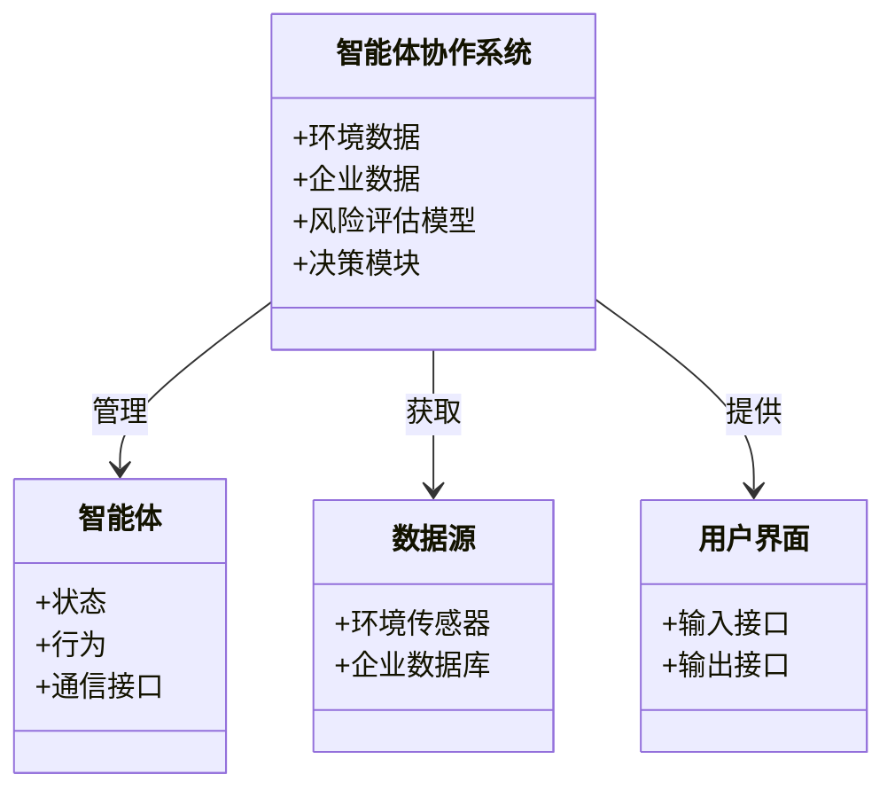
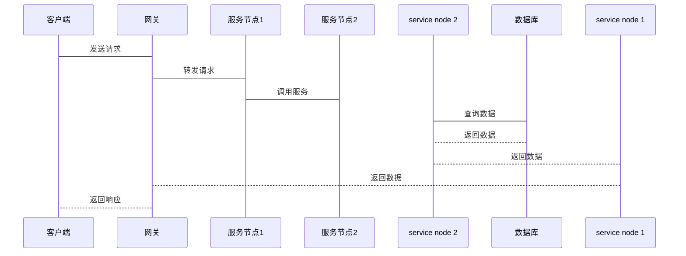

                 


# 智能体协作评估公司的环境适应能力：应对气候变化风险

**关键词**：智能体协作、环境适应能力、气候变化风险、企业评估、风险管理

**摘要**：  
随着气候变化的加剧，企业面临的环境风险日益增加。本文探讨了如何利用智能体协作技术来评估公司的环境适应能力，以有效应对气候变化带来的挑战。通过分析智能体协作的核心概念、算法原理和系统架构，本文提供了从理论到实践的全面指导，帮助企业提升环境适应能力，实现可持续发展。

---

## 第一部分：背景介绍

### 第1章：智能体协作与环境适应能力概述

#### 1.1 智能体协作的背景与意义

**1.1.1 智能体协作的定义与概念**  
智能体协作是指多个智能体通过协同工作，共同完成特定任务的过程。智能体可以是软件程序、算法或物理设备，具备感知、决策和执行能力。协作的关键在于信息共享和任务分配，以实现整体目标的最优达成。

**1.1.2 智能体协作在环境适应能力评估中的作用**  
环境适应能力是指企业在面对外部环境变化时，能够灵活调整策略和资源分配的能力。智能体协作通过分布式计算和数据共享，能够实时评估企业对气候变化的适应能力，提供数据支持和决策建议。

**1.1.3 智能体协作与气候变化风险应对的关联**  
气候变化导致极端天气事件频发，对企业运营和供应链造成重大影响。智能体协作通过实时数据共享和多智能体协同，能够快速识别和应对潜在风险，帮助企业制定有效的应对策略。

#### 1.2 环境适应能力的定义与评估

**1.2.1 环境适应能力的定义**  
环境适应能力是指企业在面对外部环境变化时，能够调整自身策略和资源分配，以维持或提升绩效的能力。这种能力涵盖企业的运营、供应链、市场响应等多个方面。

**1.2.2 环境适应能力的核心要素**  
- **数据采集**：收集环境变化数据，如温度、湿度、降水量等。
- **数据分析**：利用机器学习和大数据技术，分析数据以识别潜在风险。
- **决策制定**：基于分析结果，制定应对策略，如调整供应链、优化库存等。
- **实时监控**：持续监控环境变化，确保企业能够及时响应。

**1.2.3 环境适应能力与企业可持续发展的关系**  
企业环境适应能力的强弱直接影响其在气候变化中的生存能力。具备强大环境适应能力的企业能够更好地应对风险，实现可持续发展，增强市场竞争力。

#### 1.3 气候变化风险的概述

**1.3.1 气候变化的定义与影响**  
气候变化是指长期气候模式的显著变化，包括温度上升、降水模式改变等。它对企业的影响包括供应链中断、运营成本增加、市场需求变化等。

**1.3.2 气候变化对企业环境适应能力的挑战**  
气候变化增加了企业的不确定性，企业需要具备快速响应和调整的能力。智能体协作通过分布式计算和信息共享，帮助企业应对这些挑战。

**1.3.3 气候变化风险的分类与评估方法**  
- **直接风险**：如极端天气对企业设施的破坏。
- **间接风险**：如供应链中断导致的生产延误。
- **声誉风险**：企业未能应对气候变化可能导致品牌形象受损。

---

## 第二部分：智能体协作的核心概念

### 第2章：智能体协作的基本原理

#### 2.1 智能体的定义与分类

**2.1.1 智能体的定义**  
智能体是指能够感知环境、做出决策并采取行动的实体。它可以是一个软件程序、一个机器人或一个传感器网络。

**2.1.2 智能体的分类**  
- **简单反射型智能体**：基于预定义规则做出反应。
- **基于模型的反应型智能体**：利用内部模型做出决策。
- **目标驱动型智能体**：基于目标进行规划和行动。
- **实用驱动型智能体**：基于效用函数优化决策。

**2.1.3 不同类型智能体的特点与应用场景**  
- 简单反射型智能体适用于任务简单、规则明确的场景。
- 基于模型的反应型智能体适用于复杂环境中的实时决策。
- 目标驱动型智能体适用于需要长期规划的任务。
- 实用驱动型智能体适用于需要优化决策的场景。

#### 2.2 智能体协作的机制与特点

**2.2.1 智能体协作的机制**  
智能体协作通过通信协议共享信息，进行任务分配和协调。常见的协作机制包括分布式计算、信息共享和协同决策。

**2.2.2 协作智能体的特征**  
- **自主性**：智能体能够独立决策。
- **反应性**：能够实时感知环境变化并做出反应。
- **协作性**：通过通信和共享信息实现协作。
- **适应性**：能够根据环境变化调整策略。

**2.2.3 智能体协作的优势与局限性**  
- **优势**：提高效率、增强灵活性、实现复杂任务。
- **局限性**：通信延迟、信息不一致、协作冲突。

#### 2.3 智能体协作与环境适应能力的关联

**2.3.1 智能体协作在环境适应能力评估中的应用**  
智能体协作通过实时数据共享和协同决策，帮助企业快速评估环境适应能力，制定应对策略。

**2.3.2 智能体协作如何提升企业应对气候变化的能力**  
通过智能体协作，企业可以实时监控环境变化，快速调整供应链和资源分配，降低气候变化带来的风险。

**2.3.3 智能体协作与其他协作方式的对比**  
与其他协作方式相比，智能体协作具有更高的灵活性和实时性，能够更好地应对复杂环境变化。

---

## 第三部分：环境适应能力评估模型

### 第3章：环境适应能力评估模型构建

#### 3.1 环境适应能力评估模型的构建方法

**3.1.1 数据收集与处理**  
数据收集是模型构建的基础。需要收集包括气候变化数据、企业运营数据、供应链数据等多源数据，并进行清洗和预处理。

**3.1.2 模型构建的步骤与方法**  
- **数据预处理**：清洗数据，处理缺失值和异常值。
- **特征提取**：提取关键特征，如气候变化指标、企业绩效指标。
- **模型选择**：选择适合的算法，如回归分析、决策树、神经网络等。
- **模型训练**：使用训练数据训练模型，调整参数以优化性能。
- **模型验证**：通过验证数据测试模型性能，调整模型结构。

**3.1.3 模型验证与优化**  
通过交叉验证和网格搜索等方法，优化模型参数，提高模型的准确性和泛化能力。

---

## 第四部分：气候变化风险分析与应对策略

### 第4章：气候变化风险的分析与应对

#### 4.1 气候变化风险的分类与评估

**4.1.1 气候变化风险的分类**  
- **物理风险**：如极端天气事件对企业设施的破坏。
- **转型风险**：如政策变化对企业运营的影响。
- **声誉风险**：企业未能应对气候变化导致的品牌形象受损。

**4.1.2 气候变化风险的评估方法**  
- **情景分析法**：基于不同气候变化情景，评估企业可能面临的风险。
- **定量评估法**：通过数学模型量化风险的影响程度。
- **定性评估法**：通过专家判断和经验分析风险。

**4.1.3 气候变化风险与企业环境适应能力的关系**  
企业环境适应能力越强，应对气候变化风险的能力越强，能够有效降低风险带来的损失。

#### 4.2 应对气候变化风险的智能体协作策略

**4.2.1 智能体协作在风险评估中的应用**  
通过智能体协作，企业可以实时监控气候变化数据，快速识别潜在风险，制定应对策略。

**4.2.2 智能体协作在风险应对中的作用**  
智能体协作通过分布式计算和信息共享，能够快速调整企业资源分配，优化应对措施。

**4.2.3 智能体协作与企业战略调整的结合**  
智能体协作不仅帮助企业应对短期风险，还能够支持长期战略调整，增强企业的环境适应能力。

---

## 第五部分：系统架构与算法实现

### 第5章：系统架构设计

#### 5.1 系统功能设计

**5.1.1 领域模型设计**  
领域模型是系统设计的核心，描述了系统的功能和数据流。以下是领域模型的Mermaid类图：



**5.1.2 系统架构设计**  
以下是系统架构的Mermaid架构图：


**5.1.3 接口设计与交互流程**  
以下是系统交互的Mermaid序列图：



#### 5.2 算法实现

**5.2.1 环境适应能力评估模型的数学模型**  
以下是一个简单的线性回归模型，用于评估环境适应能力：

$$
y = \beta_0 + \beta_1x_1 + \beta_2x_2 + \ldots + \beta_nx_n + \epsilon
$$

其中，$y$ 是环境适应能力评估结果，$x_i$ 是各影响因素，$\beta_i$ 是回归系数，$\epsilon$ 是误差项。

**5.2.2 风险评估算法的实现**  
以下是基于决策树的气候风险评估算法的Python实现示例：

```python
from sklearn.tree import DecisionTreeClassifier
import pandas as pd

# 加载数据
data = pd.read_csv('climate_risk.csv')

# 特征和标签
X = data.drop('risk_level', axis=1)
y = data['risk_level']

# 模型训练
model = DecisionTreeClassifier()
model.fit(X, y)

# 预测
predictions = model.predict(X)
print("模型预测结果：", predictions)
```

---

## 第六部分：项目实战与最佳实践

### 第6章：项目实战

#### 6.1 环境安装与配置

**6.1.1 安装必要的依赖**  
确保安装Python、Pandas、Scikit-learn、Mermaid等工具。

```bash
pip install python-mermaid sklearn pandas
```

#### 6.2 系统核心功能实现

**6.2.1 智能体协作模块实现**  
以下是智能体协作的核心代码：

```python
class Agent:
    def __init__(self, id):
        self.id = id
        self.state = None
        self.communication_channel = CommunicationChannel()

    def receive_message(self, message):
        self.state = message
        return self.state

class CommunicationChannel:
    def send(self, sender, receiver, message):
        receiver.receive_message(message)
```

**6.2.2 风险评估模块实现**  
以下是风险评估模块的代码：

```python
def assess_risk(data):
    # 数据预处理
    data = data.dropna()
    # 模型预测
    model = DecisionTreeClassifier()
    model.fit(data.drop('risk_level', axis=1), data['risk_level'])
    return model.predict(data.drop('risk_level', axis=1))
```

#### 6.3 实际案例分析

**6.3.1 案例背景**  
某制造企业面临气候变化导致的供应链中断风险，希望通过智能体协作评估环境适应能力，优化供应链管理。

**6.3.2 数据分析与模型应用**  
通过收集气候数据和企业运营数据，构建风险评估模型，识别关键风险点，并制定应对策略。

**6.3.3 案例分析结果**  
模型成功预测了供应链中断的风险，并帮助企业优化了库存管理和供应商选择，降低了风险带来的损失。

---

## 第七部分：总结与展望

### 第7章：总结与展望

#### 7.1 最佳实践

- **数据质量管理**：确保数据的准确性和完整性。
- **模型优化**：定期更新模型，适应环境变化。
- **智能体协作优化**：提升通信效率和决策速度。

#### 7.2 小结

通过智能体协作技术，企业能够实时评估环境适应能力，有效应对气候变化风险。智能体协作不仅提高了企业的抗风险能力，还为企业实现可持续发展提供了有力支持。

#### 7.3 注意事项

- **数据隐私**：确保数据的安全性和隐私性。
- **模型可解释性**：提升模型的可解释性，便于决策者理解。
- **系统维护**：定期维护系统，确保其稳定运行。

---

## 作者信息

**作者：AI天才研究院/AI Genius Institute & 禅与计算机程序设计艺术 /Zen And The Art of Computer Programming**

---

**注**：本文由AI天才研究院与“禅与计算机程序设计艺术”联合撰写，内容涵盖了智能体协作、环境适应能力评估和气候变化风险管理的深度分析，旨在为企业提供实用的技术指导和实践案例。

