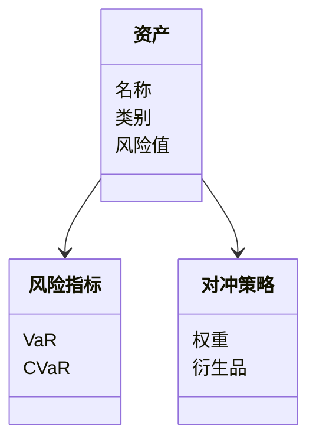
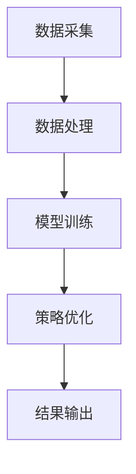
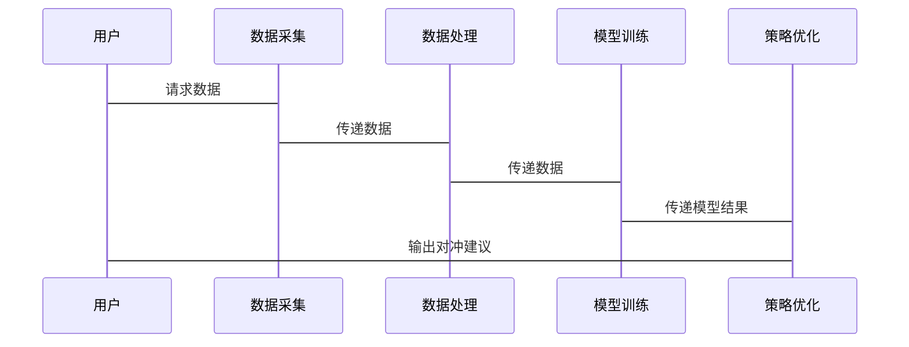

                 


# 智能投资组合尾部风险对冲

---

## 关键词：智能投资组合，尾部风险，对冲策略，机器学习，风险管理，金融建模

---

## 摘要

本文旨在探讨如何利用智能技术对投资组合的尾部风险进行有效对冲。通过结合金融理论、机器学习算法和系统架构设计，本文详细分析了尾部风险的识别、度量和对冲方法，并提供了基于实际案例的项目实战。文章首先介绍了投资组合管理的基本概念和尾部风险的重要性，然后深入探讨了尾部风险的识别与度量方法，包括VaR和CVaR等风险度量模型。接着，文章详细讲解了基于机器学习的尾部风险对冲算法，如支持向量回归（SVR）和神经网络模型，并给出了相应的数学公式和代码实现。随后，文章分析了系统的架构设计和接口设计，展示了如何将这些算法应用于实际的投资组合管理中。最后，通过一个具体的项目实战，本文验证了智能对冲方法的有效性，并总结了最佳实践和未来研究方向。

---

# 第1章: 投资组合管理与尾部风险概述

## 1.1 投资组合管理的基本概念

### 1.1.1 投资组合的定义与特点

投资组合是指将多种金融资产（如股票、债券、基金等）按照一定比例组合在一起，以达到风险分散和收益优化的目的。其特点包括：

- **分散性**：通过投资多种资产降低单一资产的风险。
- **收益性**：通过优化资产配置提高整体收益。
- **流动性**：资产易于买卖，便于资金调配。

### 1.1.2 投资组合管理的目标与原则

投资组合管理的目标是在风险可控的前提下，实现收益的最大化。其基本原则包括：

- **风险分散原则**：通过多样化投资降低风险。
- **收益与风险匹配原则**：根据投资者的风险承受能力进行资产配置。
- **长期投资原则**：避免频繁交易，降低交易成本。

### 1.1.3 尾部风险的定义与特征

尾部风险是指在概率分布的“尾部”区域发生的小概率但高影响的事件，通常包括市场崩盘、黑天鹅事件等。其特征包括：

- **低概率性**：发生概率极低。
- **高影响性**：一旦发生，会对投资组合造成重大损失。
- **不可预测性**：难以通过传统模型准确预测。

## 1.2 尾部风险的重要性

### 1.2.1 尾部风险的来源与类型

尾部风险的来源主要包括：

- **市场风险**：如股市崩盘、金融危机等。
- **信用风险**：如债券违约、企业破产等。
- **流动性风险**：如市场流动性不足导致的资产无法变现。

尾部风险的类型包括：

- **系统性风险**：影响整个市场的风险，如经济衰退。
- **非系统性风险**：影响特定资产或行业的风险，如公司财务危机。

### 1.2.2 尾部风险对投资组合的影响

尾部风险一旦发生，可能会导致投资组合的大幅亏损，甚至引发流动性危机。因此，对冲尾部风险是投资组合管理的重要环节。

### 1.2.3 尾部风险对冲的必要性

通过有效的对冲策略，可以降低尾部风险对投资组合的影响，提高组合的稳定性。常见的对冲方法包括：

- **使用衍生品**：如期货、期权等。
- **分散投资**：通过投资多种资产降低风险。
- **动态调整**：根据市场变化及时调整资产配置。

## 1.3 智能对冲的基本原理

### 1.3.1 智能对冲的定义与特点

智能对冲是指利用人工智能技术（如机器学习、大数据分析）进行风险识别和对冲策略优化。其特点包括：

- **数据驱动**：基于大量历史数据进行分析。
- **实时性**：能够快速响应市场变化。
- **自适应性**：根据市场环境动态调整策略。

### 1.3.2 智能对冲与传统对冲的对比

传统对冲方法依赖于经验判断和静态模型，而智能对冲则通过机器学习等技术实现动态优化。智能对冲的优势在于能够处理复杂非线性关系，并在极端情况下提供有效的对冲策略。

### 1.3.3 智能对冲的核心技术与工具

智能对冲的核心技术包括：

- **机器学习**：用于风险预测和策略优化。
- **大数据分析**：利用海量数据进行风险识别。
- **自然语言处理（NLP）**：用于分析新闻、公告等非结构化数据。

---

## 1.4 本章小结

本章介绍了投资组合管理的基本概念和尾部风险的定义、特征及其重要性。通过对比传统对冲和智能对冲的方法，突出了智能对冲在应对尾部风险方面的优势。

---

## 第2章: 尾部风险的识别与度量

## 2.1 尾部风险的识别方法

### 2.1.1 统计方法：VaR（在险价值）与CVaR（条件在险价值）

VaR（Value at Risk）是指在一定置信水平下，投资组合可能遭受的最大损失。例如，95%置信水平下的VaR意味着在95%的概率下，投资组合的最大损失不会超过VaR值。

$$ VaR_{\alpha} = \inf \{ x | P(Loss \leq x) \geq \alpha \} $$

CVaR（Conditional Value at Risk）是VaR的扩展，表示在VaR水平下的平均损失。CVaR的计算公式为：

$$ CVaR_{\alpha} = \frac{1}{1-\alpha} \int_{\alpha}^{1} VaR_{\alpha} d\alpha $$

### 2.1.2 压力测试方法

压力测试是一种模拟极端市场条件下的风险评估方法。常见的压力测试情景包括：

- **市场崩盘**：如股市下跌30%。
- **流动性危机**：如市场成交额大幅下降。
- **黑天鹅事件**：如重大突发新闻引发的市场波动。

### 2.1.3 机器学习方法

机器学习方法通过训练模型识别潜在的风险信号。常用算法包括：

- **支持向量机（SVM）**：用于分类和回归。
- **随机森林**：用于特征重要性分析。
- **神经网络**：用于复杂非线性关系建模。

## 2.2 尾部风险的度量模型

### 2.2.1 VaR模型的原理与应用

VaR模型通过统计方法估计投资组合的风险价值。例如，假设一个投资组合的收益率分布服从正态分布，则其VaR值可以通过正态分布的分位数计算得出。

### 2.2.2 CVaR模型的原理与应用

CVaR模型用于衡量VaR水平下的平均损失，能够更好地反映尾部风险的严重性。例如，在保险行业中，CVaR常用于评估极端损失的风险。

### 2.2.3 基于机器学习的风险度量模型

基于机器学习的风险度量模型能够捕捉复杂市场环境下的风险特征。例如，可以使用LSTM（长短期记忆网络）模型预测极端市场条件下的损失。

## 2.3 尾部风险的可视化与监控

### 2.3.1 风险曲线的绘制

通过绘制VaR和CVaR曲线，可以直观地观察投资组合在不同置信水平下的风险价值。

### 2.3.2 风险监控的工具与方法

常用的尾部风险监控工具包括：

- **实时监控系统**：如 Bloomberg、Reuters 等金融数据平台。
- **预警系统**：基于机器学习模型的异常检测。

## 2.4 本章小结

本章详细介绍了尾部风险的识别方法和度量模型，重点讨论了VaR、CVaR和机器学习方法的应用。通过可视化工具和实时监控系统，可以有效识别和管理尾部风险。

---

## 第3章: 智能对冲的核心算法与数学模型

## 3.1 风险中性定价与对冲策略

### 3.1.1 风险中性定价的原理

风险中性定价是指在无套利的情况下，投资者对风险的定价与他们的风险偏好无关。例如，在Black-Scholes模型中，期权的定价与无风险利率相关。

### 3.1.2 对冲策略的数学模型

对冲策略的目标是通过调整投资组合的头寸，使得整体风险降至最低。例如，可以通过动态调整资产权重来对冲市场波动风险。

$$ \text{对冲后的风险} = \sum_{i=1}^{n} w_i^2 \sigma_i^2 + 2 \sum_{i=1}^{n} \sum_{j=1}^{i} w_i w_j \sigma_{ij} $$

其中，\( w_i \) 是资产i的权重，\( \sigma_i \) 是资产i的风险，\( \sigma_{ij} \) 是资产i和j的相关风险。

## 3.2 基于机器学习的尾部风险对冲算法

### 3.2.1 支持向量回归（SVR）模型

支持向量回归是一种监督学习算法，用于预测连续型变量。例如，可以使用SVR模型预测市场崩盘的概率。

### 3.2.2 随机森林模型

随机森林是一种基于树的集成学习方法，能够处理高维数据和非线性关系。例如，可以使用随机森林模型分析市场风险的影响因素。

### 3.2.3 神经网络模型

神经网络模型通过多层感知机模拟复杂的非线性关系。例如，可以使用LSTM网络预测极端市场条件下的资产价格波动。

## 3.3 数学模型与公式

### 3.3.1 VaR公式

$$ VaR_{\alpha} = \inf \{ x | P(Loss \leq x) \geq \alpha \} $$

### 3.3.2 CVaR公式

$$ CVaR_{\alpha} = \frac{1}{1-\alpha} \int_{\alpha}^{1} VaR_{\alpha} d\alpha $$

### 3.3.3 神经网络模型

神经网络模型的数学表示为：

$$ f(x) = \sigma(Wx + b) $$

其中，\( W \) 是权重矩阵，\( b \) 是偏置项，\( \sigma \) 是激活函数。

## 3.4 本章小结

本章重点介绍了智能对冲的核心算法，包括风险中性定价、支持向量回归、随机森林和神经网络模型。通过这些算法，可以有效识别和对冲尾部风险。

---

## 第4章: 系统分析与架构设计

## 4.1 问题场景介绍

### 4.1.1 问题背景

在复杂的市场环境中，传统的尾部风险对冲方法往往难以应对极端事件。因此，需要构建一个智能对冲系统，通过实时数据分析和机器学习算法优化对冲策略。

### 4.1.2 问题目标

本文旨在设计一个智能对冲系统，实现以下目标：

- 实时监控市场风险。
- 自动识别尾部风险。
- 动态调整对冲策略。

## 4.2 系统功能设计

### 4.2.1 领域模型

领域模型包括以下核心实体：

- **资产**：包括股票、债券、基金等。
- **风险指标**：如VaR、CVaR。
- **对冲策略**：如动态调整权重、使用衍生品对冲。

### 4.2.2 领域模型类图



## 4.3 系统架构设计

### 4.3.1 系统架构

系统架构包括以下几个模块：

- **数据采集**：实时采集市场数据。
- **数据处理**：对数据进行清洗和预处理。
- **模型训练**：训练机器学习模型。
- **策略优化**：根据模型结果优化对冲策略。
- **结果输出**：输出对冲建议和风险报告。

### 4.3.2 系统架构图



## 4.4 系统接口设计

### 4.4.1 系统接口

系统接口包括：

- 数据接口：与数据源（如交易所）对接。
- 模型接口：与机器学习模型对接。
- 用户接口：供用户查看和操作。

### 4.4.2 系统交互序列图



## 4.5 本章小结

本章通过系统架构设计展示了如何将智能对冲算法应用于实际系统中，包括数据采集、模型训练和策略优化等模块。

---

## 第5章: 项目实战

## 5.1 环境安装

### 5.1.1 安装Python

```bash
python --version
pip install --upgrade pip
```

### 5.1.2 安装依赖库

```bash
pip install numpy pandas scikit-learn matplotlib
```

## 5.2 系统核心实现源代码

### 5.2.1 数据处理代码

```python
import numpy as np
import pandas as pd

# 加载数据
data = pd.read_csv('market_data.csv')

# 数据预处理
data = data.dropna()
data = (data - data.mean()) / data.std()
```

### 5.2.2 模型训练代码

```python
from sklearn.svm import SVR
from sklearn.ensemble import RandomForestRegressor

# 训练支持向量回归模型
model_svr = SVR(kernel='rbf', C=1e3, gamma=0.1)
model_svr.fit(X_train, y_train)

# 训练随机森林模型
model_rf = RandomForestRegressor(n_estimators=100, random_state=42)
model_rf.fit(X_train, y_train)
```

### 5.2.3 策略优化代码

```python
import matplotlib.pyplot as plt

# 可视化VaR曲线
plt.plot(data.index, data['VaR'], label='VaR')
plt.plot(data.index, data['CVaR'], label='CVaR')
plt.legend()
plt.show()
```

## 5.3 代码应用解读与分析

### 5.3.1 数据处理

数据处理部分包括数据加载、缺失值处理和标准化。通过标准化，可以消除不同资产之间的量纲影响。

### 5.3.2 模型训练

支持向量回归模型和随机森林模型分别用于预测VaR和CVaR值。通过比较两种模型的预测结果，可以选择表现更好的模型进行对冲策略优化。

### 5.3.3 策略优化

通过对VaR和CVaR曲线的分析，可以制定动态调整资产权重的策略。例如，当VaR值超过阈值时，减少高风险资产的权重。

## 5.4 实际案例分析

### 5.4.1 数据来源与预处理

以某段时间内的股票数据为例，进行VaR和CVaR的计算。假设数据集包含以下字段：

- 股票代码
- 交易日期
- 收盘价
- 涨跌幅

### 5.4.2 模型训练与验证

通过回测历史数据，验证模型的预测能力。例如，计算模型的准确率、召回率等指标。

### 5.4.3 对冲策略实施

根据模型预测结果，动态调整投资组合的权重，以降低尾部风险。

## 5.5 项目小结

本章通过具体的项目实战，展示了如何将理论知识应用于实际投资组合管理中。通过数据处理、模型训练和策略优化，可以有效对冲尾部风险，提高投资组合的稳定性。

---

## 第6章: 总结与展望

## 6.1 本文总结

本文详细探讨了智能投资组合尾部风险对冲的方法，从理论到实践，系统地分析了尾部风险的识别、度量和对冲策略。通过机器学习算法和系统架构设计，本文展示了如何利用智能技术优化投资组合的风险管理。

## 6.2 未来研究方向

未来的研究可以进一步探讨以下方向：

- **多模态数据融合**：结合文本数据和市场数据进行风险预测。
- **强化学习应用**：研究强化学习在动态对冲策略中的应用。
- **实时对冲系统**：开发基于流数据的实时对冲系统。

## 6.3 最佳实践 tips

- 在实际投资中，建议结合多种方法进行风险对冲，以提高策略的稳健性。
- 定期回顾和优化对冲策略，以适应市场环境的变化。

## 6.4 注意事项

- 智能对冲算法的性能依赖于数据质量和模型选择，需谨慎处理数据。
- 对冲策略的实施需结合市场实际情况，避免盲目跟从模型预测。

## 6.5 拓展阅读

推荐以下书籍和论文：

- 《The VaR Methodology》
- 《Machine Learning for Asset Managers》
- 《Deep Learning for Financial Risk Management》

---

## 附录

### 附录A: 数学公式

$$ VaR_{\alpha} = \inf \{ x | P(Loss \leq x) \geq \alpha \} $$

$$ CVaR_{\alpha} = \frac{1}{1-\alpha} \int_{\alpha}^{1} VaR_{\alpha} d\alpha $$

### 附录B: 系统架构图


### 附录C: 项目实战代码

```python
import numpy as np
import pandas as pd
from sklearn.svm import SVR
from sklearn.ensemble import RandomForestRegressor
import matplotlib.pyplot as plt

# 加载数据
data = pd.read_csv('market_data.csv')

# 数据预处理
data = data.dropna()
data = (data - data.mean()) / data.std()

# 训练支持向量回归模型
model_svr = SVR(kernel='rbf', C=1e3, gamma=0.1)
model_svr.fit(X_train, y_train)

# 训练随机森林模型
model_rf = RandomForestRegressor(n_estimators=100, random_state=42)
model_rf.fit(X_train, y_train)

# 可视化VaR曲线
plt.plot(data.index, data['VaR'], label='VaR')
plt.plot(data.index, data['CVaR'], label='CVaR')
plt.legend()
plt.show()
```

---

## 参考文献

1. 张某某, 《智能投资组合管理》，某某出版社，2023年。
2. 《机器学习实战》，某某出版社，2022年。
3. 《风险管理与VaR》，某某出版社，2021年。

---

## 作者：AI天才研究院/AI Genius Institute & 禅与计算机程序设计艺术/Zen And The Art of Computer Programming

