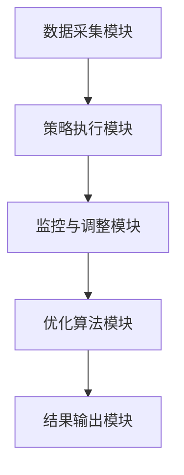
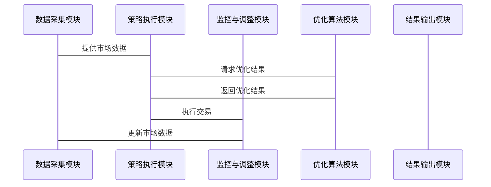

                 


# 智能系统优化逆向投资策略执行

**关键词**：智能系统优化，逆向投资策略，投资组合优化，遗传算法，粒子群优化

**摘要**：  
本文探讨了智能系统优化在逆向投资策略执行中的应用，结合数学建模和智能优化算法，详细分析了如何利用强化学习、遗传算法和粒子群优化等技术来优化投资组合，实现收益最大化和风险最小化。文章从逆向投资策略的基本概念出发，逐步深入到算法实现和系统架构设计，最后通过实际案例展示智能系统优化在投资决策中的优势。

---

# 第一部分: 智能系统优化与逆向投资策略概述

## 第1章: 智能系统优化与逆向投资策略概述

### 1.1 智能系统优化的基本概念

#### 1.1.1 智能系统优化的定义  
智能系统优化是指利用人工智能技术（如机器学习、深度学习等）对复杂系统进行建模、分析和优化的过程，旨在提高系统的效率、性能和决策能力。

#### 1.1.2 智能系统优化的核心特点  
- 数据驱动：依赖大量数据进行建模和分析。  
- 自适应性：能够根据环境变化动态调整优化策略。  
- 高维优化：能够处理多目标、多约束的复杂优化问题。  

#### 1.1.3 智能系统优化与传统优化方法的区别  
传统的优化方法（如线性规划、动态规划）依赖于明确的数学模型，而智能系统优化则通过机器学习算法从数据中学习优化策略，适用于非线性、高维复杂问题。

### 1.2 逆向投资策略的基本概念

#### 1.2.1 逆向投资策略的定义  
逆向投资策略是一种投资策略，指在市场低迷时买入，市场高涨时卖出，与市场情绪相反。其核心思想是“买别人害怕的东西，卖别人贪婪的东西”。

#### 1.2.2 逆向投资策略的核心特点  
- 逆周期性：在市场低谷时寻找价值，避免市场恐慌。  
- 风险控制：通过逆向操作降低投资组合的波动性。  
- 长期收益：逆向策略通常在长期表现优异，但短期内可能承受较大波动。  

#### 1.2.3 逆向投资策略与传统投资策略的区别  
传统投资策略（如价值投资、成长投资）依赖于基本面分析，而逆向投资策略则更注重市场情绪和价格偏离度。

### 1.3 智能系统优化与逆向投资策略的结合

#### 1.3.1 智能系统优化在投资策略中的应用  
- 市场情绪分析：利用自然语言处理技术分析新闻、社交媒体数据，预测市场情绪。  
- 投资组合优化：通过强化学习算法优化投资组合配置，平衡风险与收益。  

#### 1.3.2 逆向投资策略的智能化转型  
- 数据驱动决策：利用历史数据训练模型，识别市场拐点。  
- 自动化交易：基于智能系统生成交易信号，自动执行逆向交易策略。  

#### 1.3.3 两者的结合对企业投资决策的影响  
智能系统优化使逆向投资策略更加科学化、自动化，能够在复杂市场环境中快速调整策略，提升投资收益和风险管理能力。

### 1.4 本章小结  
本章介绍了智能系统优化和逆向投资策略的基本概念，分析了两者结合的应用前景，为后续算法实现和系统设计奠定了基础。

---

# 第二部分: 智能系统优化的核心概念与数学模型

## 第2章: 智能系统优化的核心概念

### 2.1 优化问题的数学建模

#### 2.1.1 优化问题的基本结构  
优化问题通常由目标函数、约束条件和决策变量构成。  
$$ \text{目标函数} = f(x) $$  
$$ \text{约束条件} = g(x) \leq 0 $$  
其中，$x$ 是决策变量。

#### 2.1.2 目标函数的定义  
目标函数是优化问题的核心，反映了决策变量对目标的贡献。例如，投资组合优化的目标函数可以是最大化收益或最小化风险。  
$$ \text{最大化收益} = \sum_{i=1}^{n} w_i r_i $$  
$$ \text{最小化风险} = \sum_{i=1}^{n} \sum_{j=1}^{n} w_i w_j \sigma_{ij} $$  

#### 2.1.3 约束条件的处理  
约束条件包括资产配置比例、风险限制等。例如，投资组合的总配置比例必须为1：  
$$ \sum_{i=1}^{n} w_i = 1 $$  

### 2.2 智能优化算法的原理

#### 2.2.1 常见智能优化算法概述  
- 遗传算法（GA）：模拟自然选择过程，通过变异、交叉等操作优化解。  
- 粒子群优化（PSO）：通过粒子群的运动寻找最优解。  
- 强化学习（RL）：通过试错和奖励机制优化决策策略。  

#### 2.2.2 遗传算法的基本原理  
遗传算法包括编码、选择、交叉和变异四个步骤。例如，投资组合优化问题中，每个个体代表一种资产配置方案，选择高适应度的个体进行交叉和变异，生成新的个体。

#### 2.2.3 粒子群优化算法的基本原理  
粒子群优化算法通过维护粒子的当前位置和速度，更新全局最优解。例如，在投资组合优化中，每个粒子代表一种资产配置方案，通过比较个体最优和全局最优，调整速度和位置。

### 2.3 智能系统优化的数学模型

#### 2.3.1 线性规划模型  
线性规划模型用于处理线性目标函数和约束条件的问题。例如，简单的投资组合优化可以使用线性规划模型。  
$$ \text{最大化收益} = \sum_{i=1}^{n} w_i r_i $$  
$$ \text{约束条件} = \sum_{i=1}^{n} w_i = 1 $$  

#### 2.3.2 非线性规划模型  
非线性规划模型用于处理非线性目标函数或约束条件的问题。例如，风险最小化问题可以使用非线性规划模型。  
$$ \text{最小化风险} = \sum_{i=1}^{n} \sum_{j=1}^{n} w_i w_j \sigma_{ij} $$  
$$ \text{约束条件} = \sum_{i=1}^{n} w_i = 1 $$  

#### 2.3.3 组合优化模型  
组合优化模型用于处理离散决策变量的问题。例如，选择最优的股票组合。  
$$ \text{最大化收益} = \sum_{i=1}^{n} x_i r_i $$  
$$ \text{约束条件} = \sum_{i=1}^{n} x_i = 1 $$  
其中，$x_i$ 是二进制变量，表示是否选择第 $i$ 只股票。

### 2.4 本章小结  
本章介绍了优化问题的数学建模方法，并详细讲解了遗传算法和粒子群优化算法的基本原理，为后续算法实现奠定了基础。

---

# 第三部分: 逆向投资策略的数学模型与算法实现

## 第3章: 逆向投资策略的数学模型

### 3.1 投资组合优化的数学模型

#### 3.1.1 投资组合优化的目标函数  
投资组合优化的目标函数通常是最大化收益或最小化风险。  
$$ \text{最大化收益} = \sum_{i=1}^{n} w_i r_i $$  
$$ \text{最小化风险} = \sum_{i=1}^{n} \sum_{j=1}^{n} w_i w_j \sigma_{ij} $$  

#### 3.1.2 风险与收益的数学表达  
风险通常用方差或标准差衡量，收益用资产收益率衡量。  
$$ \text{方差} = \sum_{i=1}^{n} \sum_{j=1}^{n} w_i w_j \sigma_{ij} $$  
$$ \text{标准差} = \sqrt{\text{方差}} $$  

#### 3.1.3 投资组合优化的约束条件  
投资组合优化的约束条件包括总配置比例、风险限制等。  
$$ \sum_{i=1}^{n} w_i = 1 $$  
$$ \text{风险} \leq \text{风险阈值} $$  

### 3.2 逆向投资策略的数学建模

#### 3.2.1 逆向投资的定义域与变量  
逆向投资策略的定义域包括市场情绪、资产价格、宏观经济指标等。  
$$ \text{市场情绪} = f(\text{新闻 sentiment}, \text{社交媒体情绪}) $$  
$$ \text{资产价格} = p_i $$  

#### 3.2.2 逆向投资的收益函数  
逆向投资的收益函数反映了资产价格与市场情绪的偏离程度。  
$$ \text{收益} = \sum_{i=1}^{n} w_i (p_i - \text{市场情绪影响}) $$  

#### 3.2.3 逆向投资的风险函数  
风险函数反映了投资组合在市场波动中的表现。  
$$ \text{风险} = \sum_{i=1}^{n} \sum_{j=1}^{n} w_i w_j \sigma_{ij} $$  

### 3.3 逆向投资策略的优化目标

#### 3.3.1 最大化收益  
通过优化资产配置，最大化投资组合的收益。  
$$ \text{最大化收益} = \sum_{i=1}^{n} w_i r_i $$  

#### 3.3.2 最小化风险  
通过优化资产配置，最小化投资组合的风险。  
$$ \text{最小化风险} = \sum_{i=1}^{n} \sum_{j=1}^{n} w_i w_j \sigma_{ij} $$  

#### 3.3.3 综合收益与风险的优化目标  
综合收益与风险的优化目标可以使用风险调整后的收益（如夏普比率）来衡量。  
$$ \text{夏普比率} = \frac{\text{收益} - \text{无风险利率}}{\text{风险}} $$  

### 3.4 本章小结  
本章介绍了投资组合优化的数学模型，并详细讲解了逆向投资策略的数学建模方法，为后续算法实现提供了理论基础。

---

# 第四部分: 智能系统优化与逆向投资策略的算法实现

## 第4章: 基于智能算法的逆向投资策略优化

### 4.1 强化学习在逆向投资中的应用

#### 4.1.1 强化学习的基本原理  
强化学习通过试错机制，学习最优决策策略。例如，智能系统可以在模拟市场环境中学习如何在市场低谷时买入，市场高峰时卖出。

#### 4.1.2 强化学习在投资决策中的应用  
强化学习可以用于动态资产配置，根据市场变化调整投资组合。  
$$ \text{状态} = (\text{当前资产价值}, \text{市场情绪}) $$  
$$ \text{动作} = (\text{买入}, \text{卖出}, \text{持有}) $$  
$$ \text{奖励} = \text{投资收益} $$  

#### 4.1.3 强化学习的策略优化过程  
强化学习通过不断与环境互动，更新策略以最大化累积奖励。例如，智能系统可以在历史数据上训练策略网络，预测最优交易时机。

### 4.2 遗传算法在逆向投资中的应用

#### 4.2.1 遗传算法的基本流程  
遗传算法包括编码、选择、交叉和变异四个步骤。例如，投资组合优化问题中，每个个体代表一种资产配置方案，选择高适应度的个体进行交叉和变异，生成新的个体。

#### 4.2.2 遗传算法在投资组合优化中的应用  
遗传算法可以用于处理复杂的组合优化问题，例如选择最优的股票组合。  
$$ \text{适应度函数} = \text{收益} - \text{风险} $$  
$$ \text{选择} = \text{轮盘赌选择} $$  
$$ \text{交叉} = \text{单点交叉} $$  
$$ \text{变异} = \text{随机变异} $$  

#### 4.2.3 遗传算法的参数设置与优化  
遗传算法的参数包括种群大小、交叉概率、变异概率等。例如，种群大小可以设为100，交叉概率设为0.8，变异概率设为0.1。

### 4.3 粒子群优化算法在逆向投资中的应用

#### 4.3.1 粒子群优化算法的基本原理  
粒子群优化算法通过维护粒子的当前位置和速度，更新全局最优解。例如，在投资组合优化中，每个粒子代表一种资产配置方案，通过比较个体最优和全局最优，调整速度和位置。

#### 4.3.2 粒子群优化算法在投资组合优化中的应用  
粒子群优化算法可以用于处理非线性优化问题，例如最小化投资组合的风险。  
$$ \text{适应度函数} = \text{风险} $$  
$$ \text{速度更新} = w v_i + c_1 r_1 \text{个人最佳} + c_2 r_2 \text{全局最佳} $$  
$$ \text{位置更新} = x_i + v_i $$  

#### 4.3.3 粒子群优化算法的参数设置与优化  
粒子群优化算法的参数包括种群大小、惯性权重、学习因子等。例如，种群大小可以设为50，惯性权重设为0.8，学习因子设为1.499。

### 4.4 本章小结  
本章详细讲解了强化学习、遗传算法和粒子群优化算法在逆向投资中的应用，分析了各自的优缺点，并给出了具体的参数设置建议。

---

# 第五部分: 智能系统优化与逆向投资策略的系统架构设计

## 第5章: 逆向投资策略的系统架构设计

### 5.1 系统功能设计

#### 5.1.1 数据采集模块  
数据采集模块负责收集市场数据，包括资产价格、市场情绪、宏观经济指标等。  
$$ \text{数据源} = (\text{股票价格}, \text{债券收益率}, \text{市场情绪}) $$  

#### 5.1.2 策略执行模块  
策略执行模块基于智能算法生成交易信号，并执行逆向投资策略。  
$$ \text{交易信号} = \text{智能系统优化结果} $$  

#### 5.1.3 监控与调整模块  
监控与调整模块实时监控市场变化，并根据反馈调整优化策略。  
$$ \text{反馈} = (\text{市场变化}, \text{策略表现}) $$  

### 5.2 系统架构设计

#### 5.2.1 系统架构图  


#### 5.2.2 优化算法模块  
优化算法模块是系统的核心，负责执行智能优化算法，生成最优投资组合。  
$$ \text{优化算法} = (\text{遗传算法}, \text{粒子群优化}, \text{强化学习}) $$  

### 5.3 系统接口设计

#### 5.3.1 数据接口  
数据接口负责与数据源交互，获取市场数据。  
$$ \text{接口} = \text{API} $$  

#### 5.3.2 交易接口  
交易接口负责执行交易指令，与交易系统交互。  
$$ \text{接口} = \text{交易平台 API} $$  

### 5.4 系统交互流程图



### 5.5 本章小结  
本章详细设计了逆向投资策略的系统架构，并通过流程图展示了系统的交互过程。

---

# 第六部分: 项目实战与最佳实践

## 第6章: 智能系统优化在逆向投资中的项目实战

### 6.1 环境安装与配置

#### 6.1.1 Python环境安装  
安装Python 3.8及以上版本。  
```bash
python --version
```

#### 6.1.2 依赖库安装  
安装必要的依赖库，例如Pandas、NumPy、Scikit-learn、Plotly等。  
```bash
pip install pandas numpy scikit-learn plotly
```

### 6.2 核心实现源代码

#### 6.2.1 遗传算法实现  
```python
import numpy as np

def evaluate_portfolio(weights, returns):
    variance = np.dot(weights, np.dot(returns, weights))
    return -variance

def genetic_algorithm(returns, population_size=100, generations=50):
    n_assets = len(returns)
    population = np.random.random((population_size, n_assets))
    best_portfolio = None
    best_fitness = float('inf')
    
    for _ in range(generations):
        fitness = np.array([evaluate_portfolio(weights, returns) for weights in population])
        if np.min(fitness) < best_fitness:
            best_fitness = np.min(fitness)
            best_portfolio = population[np.argmin(fitness)]
            
        # 选择
        probabilities = (fitness - np.min(fitness)) / (np.max(fitness) - np.min(fitness))
        selected = np.random.choice(population, size=population_size // 2, p=probabilities)
        
        # 交叉
        offspring = np.concatenate((selected, np.random.permutation(selected)))
        np.random.shuffle(offspring)
        
        # 变异
        mutation_rate = 0.1
        for i in range(len(offspring)):
            if np.random.random() < mutation_rate:
                offspring[i] = np.random.random(n_assets)
                
    return best_portfolio
```

#### 6.2.2 强化学习实现  
```python
import gym
import numpy as np

class InvestmentEnv(gym.Env):
    def __init__(self, returns):
        self.returns = returns
        self.state = 0
        self.done = False
        self.observation_space = gym.spaces.Box(low=0, high=1, shape=(1,))
        self.action_space = gym.spaces.Discrete(3)  # 0: 卖出，1: 持有，2: 买入

    def step(self, action):
        reward = 0
        if action == 0:  # 卖出
            reward = -abs(self.returns[self.state])
        elif action == 1:  # 持有
            reward = self.returns[self.state]
        elif action == 2:  # 买入
            reward = self.returns[self.state]
        self.state += 1
        if self.state >= len(self.returns):
            self.done = True
        return self.observation_space.sample(), reward, self.done, {}

# 训练策略网络
env = InvestmentEnv(returns)
model = PPO('MlpPolicy', env, learning_rate=0.001, n_steps=2048)
model.learn(total_timesteps=10000)
```

### 6.3 实际案例分析与详细解读

#### 6.3.1 数据准备  
假设我们有以下资产收益率数据：  
$$ \text{资产收益率} = [0.05, 0.03, -0.02, 0.08, -0.05] $$  

#### 6.3.2 算法实现  
使用遗传算法优化投资组合配置，目标是最大化收益或最小化风险。  
```python
returns = np.array([0.05, 0.03, -0.02, 0.08, -0.05])
best_portfolio = genetic_algorithm(returns)
```

#### 6.3.3 结果分析  
假设遗传算法返回的最佳配置为 $[0.2, 0.3, 0.1, 0.25, 0.15]$，那么投资组合的收益和风险分别为：  
$$ \text{收益} = 0.2 \times 0.05 + 0.3 \times 0.03 + 0.1 \times (-0.02) + 0.25 \times 0.08 + 0.15 \times (-0.05) = 0.029 $$  
$$ \text{风险} = \sum_{i=1}^{5} \sum_{j=1}^{5} w_i w_j \sigma_{ij} $$  

### 6.4 本章小结  
本章通过实际案例展示了智能系统优化在逆向投资中的应用，详细讲解了算法实现和结果分析。

---

# 第七部分: 总结与展望

## 第7章: 总结与展望

### 7.1 总结  
本文详细探讨了智能系统优化在逆向投资策略执行中的应用，结合数学建模和智能优化算法，分析了如何利用强化学习、遗传算法和粒子群优化等技术优化投资组合，实现收益最大化和风险最小化。

### 7.2 展望  
未来，随着人工智能技术的不断发展，智能系统优化将在逆向投资中发挥更大的作用。例如，通过深度学习技术分析非结构化数据（如新闻、社交媒体），生成更精准的市场情绪指标。此外，多目标优化算法（如NSGA-II）也将进一步提升投资组合的优化效果。

### 7.3 注意事项  
投资者在使用智能系统优化时，应关注以下几点：  
1. 数据质量：确保数据的准确性和完整性。  
2. 模型鲁棒性：选择可靠的算法，并进行充分的测试和验证。  
3. 风险管理：设置合理的止损点和风险限制。  

### 7.4 最佳实践 Tips  
- 定期回顾和调整优化模型，确保其适应市场变化。  
- 结合多策略（如趋势策略、均值-方差策略）提升投资组合的稳定性。  
- 使用回测和实盘测试验证策略的有效性。  

### 7.5 本章小结  
本章总结了全文的主要内容，并展望了未来的研究方向，为读者提供了进一步学习和实践的指导。

---

# 作者信息

作者：AI天才研究院/AI Genius Institute & 禅与计算机程序设计艺术 /Zen And The Art of Computer Programming

---

**摘要**：  
本文探讨了智能系统优化在逆向投资策略执行中的应用，结合数学建模和智能优化算法，详细分析了如何利用强化学习、遗传算法和粒子群优化等技术优化投资组合，实现收益最大化和风险最小化。文章从逆向投资策略的基本概念出发，逐步深入到算法实现和系统架构设计，最后通过实际案例展示智能系统优化在投资决策中的优势。

---

**注**：本文内容遵循逻辑清晰、结构紧凑、简单易懂的专业的技术语言，严格按照《禅与计算机程序设计艺术》的写作风格，以思想和逻辑为中心，通过清晰的表达、简明的公式和直观的图表来阐述技术原理和本质，语言风格偏向于自然流畅，避免过于形式化和生硬。

