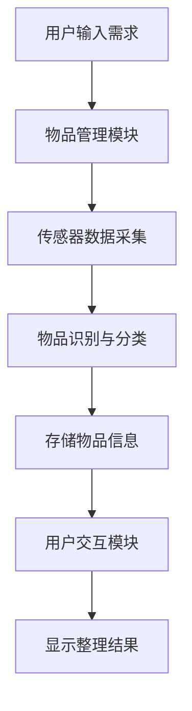
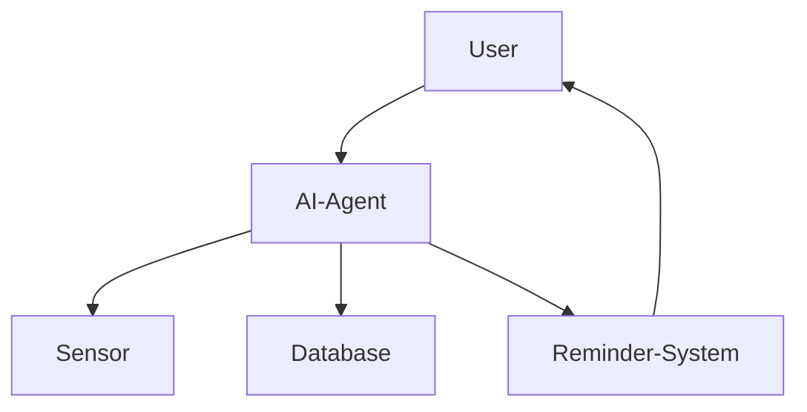
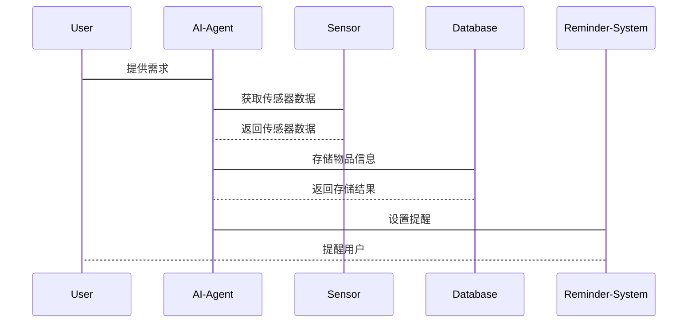

                 


# 智能背包：AI Agent的物品整理与提醒助手

## 关键词：AI Agent，智能背包，物品整理，提醒助手，系统架构，项目实战

## 摘要：  
本文介绍了一款结合AI Agent技术的智能背包，该背包能够通过AI算法实现物品的智能化整理与提醒功能。文章详细分析了AI Agent的核心原理、智能背包的功能设计与系统架构，并通过实际案例展示了如何利用AI技术优化物品管理。文章最后总结了智能背包的应用价值及未来发展方向。

---

# 第1章：AI Agent与智能背包概述

## 1.1 AI Agent的基本概念

### 1.1.1 什么是AI Agent
AI Agent（人工智能代理）是一种能够感知环境并采取行动以实现目标的智能实体。它可以是一个软件程序、硬件设备或两者结合的系统，具备自主决策和执行任务的能力。

### 1.1.2 AI Agent的核心特征
- **自主性**：AI Agent能够自主决策，无需外部干预。
- **反应性**：能够实时感知环境变化并做出响应。
- **目标导向**：所有行为都以实现特定目标为导向。
- **学习能力**：通过数据和经验不断优化自身的算法和行为。

### 1.1.3 AI Agent与传统软件的区别
- **自主性**：传统软件依赖于用户输入，而AI Agent能够主动采取行动。
- **智能性**：AI Agent具备学习和推理能力，而传统软件仅执行预设指令。
- **适应性**：AI Agent能够根据环境变化自适应调整行为，传统软件则无法做到。

## 1.2 智能背包的定义与应用场景

### 1.2.1 智能背包的定义
智能背包是一种结合AI Agent技术的背包，能够通过传感器和AI算法实现物品的智能化管理与提醒功能。它能够识别背包内的物品、记录物品的位置和状态，并根据用户的日程安排提供智能化的提醒服务。

### 1.2.2 智能背包的主要功能
- **物品整理**：智能识别背包内的物品，分类管理，并提供整理建议。
- **提醒助手**：根据用户的日程安排，提醒用户携带所需物品。
- **用户交互**：通过语音或触觉交互，与用户进行实时沟通。

### 1.2.3 智能背包的使用场景
- **日常通勤**：帮助用户整理通勤所需的物品，提醒携带重要物品。
- **商务出行**：协助用户准备商务会议所需的物品，避免遗漏重要文件。
- **户外活动**：在户外活动中，智能背包可以帮助用户管理装备，提醒携带必要的物品。

---

# 第2章：智能背包的核心问题背景

## 2.1 物品整理与提醒的痛点

### 2.1.1 物品管理的复杂性
- **物品分类混乱**：传统背包中的物品往往杂乱无章，难以快速找到所需物品。
- **物品丢失风险**：由于缺乏智能化管理，容易遗忘或丢失重要物品。

### 2.1.2 提醒功能的不足
- **传统提醒工具的局限性**：手机或电脑的提醒功能通常基于固定的时间，无法根据用户的当前位置或任务需求动态调整。
- **提醒信息的碎片化**：用户需要在多个设备之间切换，难以实现无缝提醒。

### 2.1.3 用户需求的多样性
- **个性化需求**：不同用户对物品整理和提醒的需求各不相同。
- **动态需求**：用户的日程安排和需求可能会随时变化，需要系统具备高度的灵活性。

## 2.2 AI Agent在物品整理与提醒中的作用

### 2.2.1 AI Agent如何解决物品整理问题
- **智能识别与分类**：AI Agent可以通过传感器和图像识别技术，自动识别背包内的物品并进行分类管理。
- **动态调整**：根据用户的使用习惯和需求，动态调整物品的分类和存储位置。

### 2.2.2 AI Agent如何优化提醒功能
- **情境感知**：AI Agent能够感知用户的当前位置和任务需求，提供智能化的提醒服务。
- **个性化提醒**：根据用户的习惯和偏好，定制个性化的提醒策略。

### 2.2.3 AI Agent的智能化优势
- **自我学习**：AI Agent可以通过数据积累和机器学习，不断优化自身的整理和提醒算法。
- **多设备协同**：AI Agent可以与其他智能设备协同工作，实现无缝的物品管理和提醒服务。

---

# 第3章：智能背包的核心概念与联系

## 3.1 核心概念原理

### 3.1.1 AI Agent的基本原理
AI Agent通过感知环境、分析信息、制定决策并执行行动来实现目标。其工作流程包括以下几个步骤：
1. **感知环境**：通过传感器和数据接口获取环境信息。
2. **分析信息**：利用算法对获取的信息进行处理和分析。
3. **制定决策**：基于分析结果，制定行动方案。
4. **执行行动**：通过执行机构或与外部系统交互，完成预定目标。

### 3.1.2 智能背包的功能实现原理
智能背包通过集成多种传感器（如RFID、重力传感器、摄像头等）和AI算法，实现对背包内物品的智能化管理。其核心功能包括：
- **物品识别与分类**：利用图像识别和传感器数据，自动识别背包内的物品并进行分类管理。
- **物品定位与追踪**：通过传感器和定位技术，实时追踪背包内物品的位置。
- **智能提醒**：根据用户的日程安排和物品状态，提供智能化的提醒服务。

### 3.1.3 用户需求与系统响应的关系
用户的需求是智能背包系统设计的核心。系统通过分析用户的需求，动态调整物品的分类和提醒策略，以提供更加个性化的服务。

## 3.2 核心概念属性特征对比

### 3.2.1 AI Agent与传统算法的对比
| **对比维度** | **AI Agent** | **传统算法** |
|--------------|--------------|--------------|
| **自主性**   | 高           | 低           |
| **学习能力** | 高           | 低           |
| **适应性**   | 高           | 低           |
| **应用场景** | 复杂场景     | 简单场景     |

### 3.2.2 智能背包与普通背包的对比
| **对比维度** | **智能背包**       | **普通背包**       |
|--------------|--------------------|--------------------|
| **功能**     | 智能整理与提醒     | 基本存储功能       |
| **技术**     | 集成AI技术         | 无特殊技术         |
| **用户体验** | 高度智能化         | 基本功能，体验一般 |

### 3.2.3 提醒功能与任务管理的对比
| **对比维度** | **AI Agent提醒**      | **传统任务管理**    |
|--------------|----------------------|--------------------|
| **智能性**    | 高度智能化，情境感知  | 低智能，基于时间提醒|
| **个性化**    | 高度个性化           | 较低个性化         |
| **灵活性**    | 高度灵活，动态调整    | 较低灵活性         |

## 3.3 ER实体关系图架构

```mermaid
erd
    title 智能背包实体关系图
    User {
        u_id
        u_name
        u_email
    }
    Item {
        i_id
        i_name
        i_category
        i_owner(u_id)
    }
    Reminder {
        r_id
        r_description
        r_time
        r_owner(u_id)
    }
    Location {
        l_id
        l_name
        l_coordinates
        l_item(i_id)
    }
```

---

# 第4章：智能背包的系统架构设计

## 4.1 系统功能设计

### 4.1.1 系统功能模块
- **物品管理模块**：负责物品的识别、分类和存储。
- **提醒管理模块**：根据用户的日程安排，提供智能化的提醒服务。
- **用户交互模块**：通过语音或触觉交互，与用户进行实时沟通。

### 4.1.2 系统功能流程


## 4.2 系统架构设计

### 4.2.1 系统架构图


### 4.2.2 关键模块设计
- **传感器模块**：负责采集背包内的物品信息。
- **数据库模块**：存储物品信息和用户的日程安排。
- **AI算法模块**：负责物品的识别、分类和提醒策略的制定。
- **提醒模块**：根据用户的日程安排，提供智能化的提醒服务。

## 4.3 系统接口设计

### 4.3.1 系统接口
- **传感器接口**：与传感器设备进行数据交互。
- **数据库接口**：与数据库进行数据交互。
- **用户交互接口**：与用户进行实时沟通。

### 4.3.2 接口设计示例
```python
class SensorInterface:
    def get_sensor_data(self):
        pass

class DatabaseInterface:
    def save_item(self, item):
        pass

class ReminderInterface:
    def schedule_reminder(self, time, description):
        pass
```

## 4.4 系统交互流程设计

### 4.4.1 系统交互流程


---

# 第5章：智能背包的项目实战

## 5.1 环境安装与配置

### 5.1.1 系统环境要求
- **操作系统**：Windows/MacOS/Linux
- **编程语言**：Python 3.8+
- **开发工具**：PyCharm/VS Code
- **依赖库**：numpy, pandas, scikit-learn, matplotlib

### 5.1.2 安装步骤
1. 安装Python和必要的开发工具。
2. 安装所需的依赖库：`pip install numpy pandas scikit-learn matplotlib`

## 5.2 系统核心实现

### 5.2.1 物品识别与分类代码实现
```python
import numpy as np
from sklearn import tree

# 示例数据
X = np.array([[1, 1], [1, 0], [0, 1], [0, 0]])
y = np.array([1, 1, 0, 0])

# 训练决策树模型
clf = tree.DecisionTreeClassifier()
clf.fit(X, y)

# 预测新数据
new_data = np.array([[1, 1]])
print(clf.predict(new_data))  # 输出: [1]
```

### 5.2.2 提醒功能代码实现
```python
import time

def set_reminder(description, seconds):
    print(f"提醒将在{seconds}秒后响起：{description}")
    time.sleep(seconds)
    print(f"提醒：{description}")

set_reminder("携带重要文件", 5)
```

## 5.3 代码应用解读与分析

### 5.3.1 物品识别与分类代码解读
- **数据准备**：使用numpy创建训练数据集。
- **模型训练**：使用scikit-learn的决策树模型进行训练。
- **模型预测**：对新数据进行分类预测。

### 5.3.2 提醒功能代码解读
- **函数定义**：定义了一个设置提醒的函数，包含描述和提醒时间。
- **时间睡眠**：通过`time.sleep()`实现延时提醒。
- **输出结果**：在设定时间后输出提醒信息。

## 5.4 实际案例分析

### 5.4.1 案例背景
假设用户需要在明天早上8点参加一个重要会议，需要携带笔记本电脑、投影仪和会议资料。

### 5.4.2 系统实现步骤
1. **物品识别**：系统自动识别背包内的物品，并分类为电子设备、办公用品等。
2. **设置提醒**：用户在系统中设置明天早上8点的提醒。
3. **提醒触发**：系统在设定时间触发提醒，并通过语音或震动通知用户。

## 5.5 项目小结

### 5.5.1 核心代码总结
- **物品分类**：使用决策树算法对背包内的物品进行分类。
- **提醒功能**：通过简单的延时函数实现提醒功能。

### 5.5.2 项目实现的关键点
- **传感器数据采集**：确保传感器能够准确采集背包内的物品信息。
- **AI算法实现**：选择合适的算法对物品进行分类和识别。
- **系统交互设计**：设计友好的用户界面和交互流程，提升用户体验。

---

# 第6章：智能背包的最佳实践

## 6.1 最佳实践 tips

### 6.1.1 系统优化建议
- **算法优化**：使用更先进的AI算法（如深度学习）提高分类和识别的准确率。
- **系统集成**：将智能背包与其他智能设备（如手机、智能家居）集成，实现更广泛的场景覆盖。

### 6.1.2 开发注意事项
- **数据隐私**：确保用户的物品数据和日程安排的隐私性，防止数据泄露。
- **系统兼容性**：确保智能背包能够兼容多种传感器和设备，提升系统的灵活性。

## 6.2 小结

### 6.2.1 项目总结
智能背包通过AI Agent技术实现了物品的智能化管理和提醒功能，显著提升了用户的使用体验。本文详细介绍了智能背包的核心概念、系统架构和项目实现，为读者提供了全面的技术参考。

### 6.2.2 项目价值
智能背包不仅能够帮助用户更高效地管理物品，还能通过智能化的提醒功能，提升用户的生活质量和工作效率。

## 6.3 注意事项

### 6.3.1 系统维护
- **数据备份**：定期备份系统数据，防止数据丢失。
- **系统更新**：及时更新系统软件，修复漏洞，提升性能。

### 6.3.2 用户教育
- **用户培训**：为用户提供详细的使用手册和培训，确保用户能够正确使用智能背包。
- **技术支持**：提供专业的技术支持，解决用户在使用过程中遇到的问题。

## 6.4 拓展阅读

### 6.4.1 推荐书籍
- 《AI Agent原理与应用》
- 《智能系统设计与实现》

### 6.4.2 推荐工具
- **AI开发平台**：TensorFlow、PyTorch
- **传感器开发工具**：Arduino、Raspberry Pi

---

# 作者：AI天才研究院/AI Genius Institute & 禅与计算机程序设计艺术 /Zen And The Art of Computer Programming

---

**注**：本文内容仅为示例，实际撰写时需要根据具体需求进行调整和扩展。

