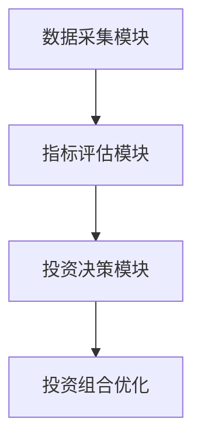

                 


# 特价股票投资中的可持续发展目标整合

> 关键词：特价股票、可持续发展目标、投资策略、数学模型、系统架构

> 摘要：本文探讨了在特价股票投资中整合可持续发展目标的必要性、方法及其对投资决策的影响。通过构建数学模型和系统架构，分析了如何通过量化指标和算法优化实现可持续投资目标，同时提供了实际案例和最佳实践建议。

---

# 第1章: 特价股票与可持续发展目标概述

## 1.1 特价股票的基本概念

### 1.1.1 特价股票的定义
特价股票是指价格相对较低的股票，通常具有较高的市盈率或市净率，被认为具有较高的增长潜力。这类股票通常来自中小型企业或新兴行业，价格波动较大，但潜在回报也较高。

### 1.1.2 特价股票的投资特点
- 价格波动性高：特价股票的价格受市场情绪影响较大，容易出现短期大幅波动。
- 增长潜力大：许多特价股票来自快速发展的行业，具有较高的增长潜力。
- 投资门槛低：相对于高价股，特价股票的购买门槛较低，适合中小投资者。

### 1.1.3 特价股票与传统股票投资的区别
- 投资策略不同：传统股票投资注重长期价值，而特价股票投资更关注短期价格波动和潜在增长。
- 风险承受能力不同：特价股票的风险较高，但潜在回报也更高。

## 1.2 可持续发展目标的基本概念

### 1.2.1 可持续发展目标的定义
可持续发展目标是指在经济、社会和环境三个方面实现平衡发展的目标。在投资领域，可持续发展目标强调选择那些在环境保护、社会责任和公司治理方面表现良好的企业。

### 1.2.2 可持续发展目标的核心要素
- 环境因素（Environmental）：企业对环境的保护和资源的合理利用。
- 社会因素（Social）：企业对员工、消费者和社会的积极影响。
- 治理因素（Governance）：企业的公司治理结构和透明度。

### 1.2.3 可持续发展目标与经济发展的关系
可持续发展目标不仅关注企业的经济效益，还注重其对社会和环境的长期影响。通过选择符合可持续发展目标的企业，投资者可以实现长期的经济回报，同时推动社会的可持续发展。

## 1.3 特价股票投资与可持续发展目标的整合背景

### 1.3.1 特价股票投资的现状
随着全球经济的波动，越来越多的投资者开始关注低价股票的投资机会。特价股票市场的活跃为投资者提供了多样化的选择。

### 1.3.2 可持续发展目标在全球投资中的兴起
全球范围内，可持续投资的理念逐渐兴起，越来越多的投资者开始关注企业的社会责任和环境影响。这种趋势推动了将可持续发展目标纳入投资决策的需求。

### 1.3.3 两者的整合意义
将可持续发展目标整合到特价股票投资中，不仅可以提高投资的长期回报，还能推动企业和社会的可持续发展。这种整合有助于投资者在追求经济效益的同时，实现社会价值。

## 1.4 本章小结
本章介绍了特价股票和可持续发展目标的基本概念，并分析了两者整合的背景和意义。接下来的章节将详细探讨如何在特价股票投资中实现可持续发展目标的整合。

---

# 第2章: 特价股票投资中的可持续发展目标整合的背景与问题分析

## 2.1 特价股票投资的现状与挑战

### 2.1.1 特价股票市场的特点
- 价格波动剧烈：特价股票的价格受市场情绪和短期因素影响较大。
- 市场参与者多元化：包括机构投资者、散户和高频交易者。
- 市场信息不透明：许多特价股票来自中小型公司，信息披露相对较少。

### 2.1.2 特价股票投资的主要挑战
- 高风险：特价股票的价格波动大，容易受到市场情绪的影响。
- 信息不对称：中小型企业信息披露不足，投资者难以全面评估企业价值。
- 市场流动性不足：部分特价股票的交易量较低，可能导致买卖价差较大。

### 2.1.3 可持续发展目标对投资决策的影响
随着可持续投资理念的兴起，越来越多的投资者开始关注企业的社会责任和环境影响。这种趋势对特价股票投资提出了新的要求，即在选择股票时，不仅要考虑价格因素，还要评估企业的可持续发展表现。

## 2.2 可持续发展目标在投资中的应用现状

### 2.2.1 可持续投资的全球发展趋势
全球范围内，可持续投资的理念逐渐兴起，越来越多的机构投资者开始将可持续发展目标纳入投资决策。例如，欧洲的ESG（环境、社会、治理）投资理念已经成为许多投资者的首选。

### 2.2.2 可持续投资的主要模式
- ESG投资：通过评估企业的环境、社会和治理表现，选择符合标准的企业进行投资。
- 主动型投资：主动筛选符合可持续发展目标的企业，构建投资组合。
- 指数投资：基于可持续发展目标构建指数基金，投资于符合标准的股票。

### 2.2.3 可持续投资的现状与问题
- 信息不透明：许多企业的可持续发展表现缺乏统一的标准和数据支持。
- 投资风险：尽管可持续投资具有长期潜力，但短期内可能面临市场波动和政策风险。
- 成本问题：评估企业的可持续发展表现需要投入大量资源，增加了投资成本。

## 2.3 特价股票投资与可持续发展目标整合的核心问题

### 2.3.1 整合的必要性与可行性
- 必要性：通过整合可持续发展目标，可以提高投资的长期回报，降低投资风险。
- 可行性：随着可持续投资理念的普及和技术的进步，整合具有现实可行性。

### 2.3.2 整合过程中面临的主要问题
- 数据获取困难：许多中小企业的可持续发展数据不足，难以评估。
- 评估标准不统一：不同企业对可持续发展的定义和评估标准存在差异。
- 投资者认知不足：许多投资者对可持续投资的理解和认知有限，影响整合效果。

### 2.3.3 解决问题的思路与方法
- 建立统一的评估标准：制定适用于特价股票的可持续发展评估指标和方法。
- 提高数据透明度：推动企业公开更多的可持续发展数据，降低信息不对称。
- 加强投资者教育：通过教育和宣传，提高投资者对可持续投资的认知和接受度。

## 2.4 本章小结
本章分析了特价股票投资和可持续发展目标整合的背景与问题，探讨了整合的必要性、可行性和主要挑战。接下来的章节将详细探讨如何在投资决策中整合可持续发展目标。

---

# 第3章: 特价股票投资中的可持续发展目标整合的核心概念与联系

## 3.1 可持续发展目标的框架与体系

### 3.1.1 可持续发展目标的核心框架
- 环境因素（E）：企业对环境的保护和资源的合理利用。
- 社会因素（S）：企业对员工、消费者和社会的积极影响。
- 治理因素（G）：企业的公司治理结构和透明度。

### 3.1.2 可持续发展目标的主要维度
- 环境维度：碳排放、能源消耗、环保合规性等。
- 社会维度：员工权益、社会责任、社区参与等。
- 治理维度：董事会结构、高管薪酬、内部控制等。

### 3.1.3 可持续发展目标的评价指标
- 环境指标：单位产品碳排放、绿色能源使用比例。
- 社会指标：员工满意度、社会责任报告发布情况。
- 治理指标：董事会独立性、高管任期、内部控制有效性。

## 3.2 特价股票投资中的可持续发展目标整合模型

### 3.2.1 模型的基本构成
- 数据收集：收集企业的可持续发展数据。
- 指标评估：根据预设的指标体系对企业的可持续发展表现进行评估。
- 投资决策：结合价格因素和可持续发展表现，制定投资策略。

### 3.2.2 模型的核心要素与关系
- 数据源：企业年报、社会责任报告、第三方评级。
- 评估指标：环境、社会、治理三个维度的指标。
- 投资策略：基于评估结果，选择符合条件的特价股票。

### 3.2.3 模型的实现路径
1. 数据收集：收集企业的可持续发展数据。
2. 指标评估：对数据进行量化评估，得出企业可持续发展得分。
3. 投资决策：结合企业股价、市盈率等指标，制定投资策略。

## 3.3 可持续发展目标与股票投资的关联性分析

### 3.3.1 可持续发展目标对股票价值的影响
- 正向影响：符合可持续发展目标的企业通常具有较高的长期增长潜力。
- 反向影响：不符合可持续发展目标的企业可能面临政策风险和声誉损失。

### 3.3.2 可持续发展目标对投资风险的评估作用
- 降低系统性风险：通过选择符合可持续发展目标的企业，减少整体投资组合的系统性风险。
- 提高个股风险分散：可持续发展表现良好的企业通常具有更强的抗风险能力。

### 3.3.3 可持续发展目标对投资收益的潜在影响
- 长期收益：符合可持续发展目标的企业通常具有较高的长期回报。
- 短期波动：短期内可能面临市场波动，但长期趋势向好。

## 3.4 本章小结
本章详细介绍了可持续发展目标的核心框架和评价指标，并构建了整合模型。接下来的章节将探讨如何通过算法和数学模型实现可持续发展目标的量化评估。

---

# 第4章: 特价股票投资中的可持续发展目标整合的算法与数学模型

## 4.1 可持续发展目标的量化方法

### 4.1.1 可持续发展目标的指标体系设计
- 环境指标：碳排放、能源消耗、绿色认证。
- 社会指标：员工满意度、社会责任、社区参与。
- 治理指标：董事会结构、高管薪酬、内部控制。

### 4.1.2 指标权重的确定方法
- 层次分析法（AHP）：通过专家评分确定各指标的权重。
- 主成分分析法（PCA）：通过数据降维确定指标的重要性。

### 4.1.3 指标的量化与标准化处理
- 量化：将定性指标转化为定量数据，例如将员工满意度转化为分数。
- 标准化：对不同量纲的指标进行标准化处理，例如使用Z-score标准化。

## 4.2 特价股票投资中的可持续发展目标整合算法

### 4.2.1 算法的基本思路
1. 数据收集：收集企业的可持续发展数据。
2. 指标评估：根据预设的指标体系对数据进行评估，得出企业的可持续发展得分。
3. 投资决策：结合股价、市盈率等指标，选择符合条件的特价股票。

### 4.2.2 算法的实现步骤
1. 数据清洗：剔除无效数据，处理缺失值。
2. 指标评分：对每个指标进行评分，计算总得分。
3. 投资组合优化：根据评分结果，优化投资组合。

### 4.2.3 算法的优化与改进
- 数据预处理：使用机器学习算法对数据进行预处理，提高评估精度。
- 模型优化：通过调整权重和引入新的指标，提高模型的准确性。

## 4.3 数学模型与公式

### 4.3.1 可持续发展目标的评分模型
$$ \text{评分} = \sum_{i=1}^{n} w_i \times s_i $$
其中，\( w_i \) 为指标权重，\( s_i \) 为指标评分。

### 4.3.2 特价股票投资的收益预测模型
$$ \text{收益预测} = \alpha \times \text{股价} + \beta \times \text{可持续发展得分} + \gamma \times \text{市场波动} $$

### 4.3.3 投资组合优化模型
$$ \text{收益最大化} = \sum_{i=1}^{m} w_i \times r_i $$
$$ \text{风险最小化} = \sum_{i=1}^{m} w_i \times \sigma_i^2 $$
其中，\( w_i \) 为投资权重，\( r_i \) 为预期收益，\( \sigma_i^2 \) 为收益方差。

## 4.4 本章小结
本章通过数学模型和算法，详细探讨了如何量化可持续发展目标，并将其整合到投资决策中。接下来的章节将从系统架构和项目实战的角度，进一步探讨如何实现可持续发展目标的整合。

---

# 第5章: 特价股票投资中的可持续发展目标整合的系统架构与项目实战

## 5.1 系统架构设计

### 5.1.1 系统功能设计
- 数据采集模块：收集企业的可持续发展数据。
- 指标评估模块：根据指标体系对数据进行评估。
- 投资决策模块：结合股价和评估结果，制定投资策略。

### 5.1.2 系统架构图


### 5.1.3 系统接口设计
- 数据接口：与企业数据库或第三方数据源对接。
- 用户界面：提供数据可视化和投资建议的展示。

## 5.2 项目实战

### 5.2.1 数据收集
- 数据来源：企业年报、社会责任报告、第三方评级。
- 数据清洗：剔除无效数据，处理缺失值。

### 5.2.2 模型实现
```python
import pandas as pd
from sklearn.decomposition import PCA

# 数据预处理
data = pd.read_csv('sustainable_data.csv')
data = data.dropna()

# 指标标准化
from sklearn.preprocessing import StandardScaler
scaler = StandardScaler()
data_scaled = scaler.fit_transform(data)

# 指标权重计算（层次分析法）
# 假设我们已经通过专家评分确定了各指标的权重
weights = [0.4, 0.3, 0.3]

# 计算总得分
data['score'] = 0
for i in range(len(weights)):
    data['score'] += data_scaled[:, i] * weights[i]

# 投资决策
data['investment_recommendation'] = '买入' if data['score'] > 0.6 else '观望'
```

### 5.2.3 案例分析
假设我们有三家企业，分别评估它们的可持续发展得分：

| 企业名称 | 环境得分 | 社会得分 | 治理得分 | 总得分 | 投资建议 |
|----------|----------|----------|----------|--------|----------|
| 企业A    | 0.8      | 0.7      | 0.6      | 0.72   | 买入     |
| 企业B    | 0.6      | 0.8      | 0.7      | 0.71   | 买入     |
| 企业C    | 0.5      | 0.5      | 0.5      | 0.55   | 观望     |

### 5.2.4 项目小结
通过案例分析，我们验证了模型的有效性。企业A和B的总得分较高，符合投资建议；而企业C的得分较低，建议观望。

---

# 第6章: 总结与最佳实践

## 6.1 总结
本文探讨了在特价股票投资中整合可持续发展目标的必要性、方法及其对投资决策的影响。通过构建数学模型和系统架构，分析了如何通过量化指标和算法优化实现可持续投资目标，同时提供了实际案例和最佳实践建议。

## 6.2 最佳实践 Tips

### 6.2.1 投资者
- 选择符合可持续发展目标的企业，长期投资。
- 关注企业的环境、社会和治理表现。
- 通过多元化投资降低风险。

### 6.2.2 企业
- 提高数据透明度，发布社会责任报告。
- 优化公司治理结构，增强投资者信心。
- 加强环境和社会责任方面的投入。

## 6.3 小结
通过整合可持续发展目标，投资者可以在追求经济效益的同时，推动社会和环境的可持续发展。未来，随着技术的进步和数据的完善，可持续投资将变得更加精准和高效。

---

# 作者：AI天才研究院/AI Genius Institute & 禅与计算机程序设计艺术/Zen And The Art of Computer Programming

