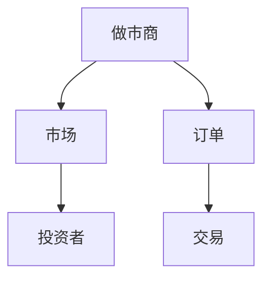
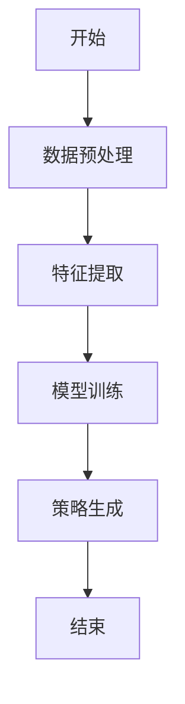
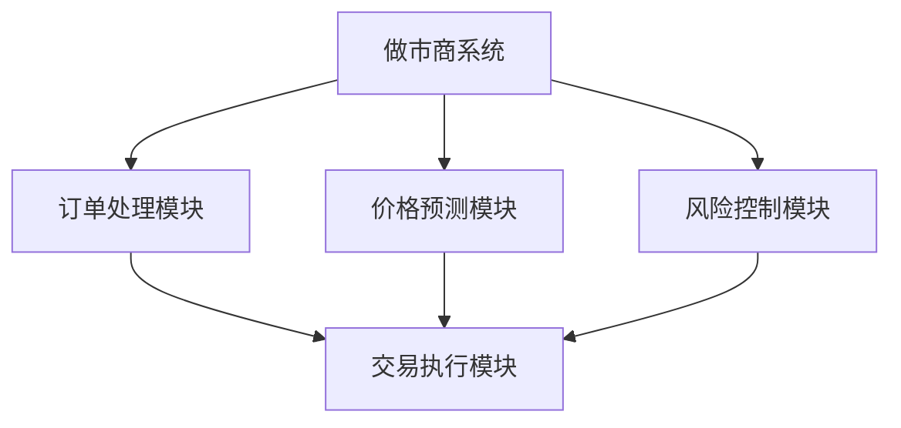
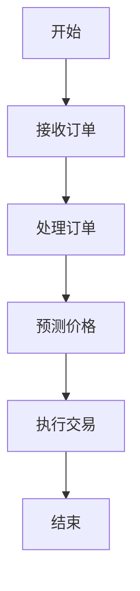
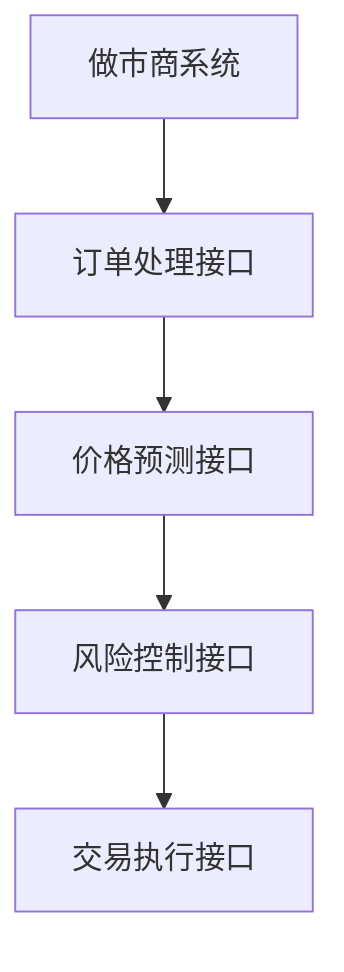
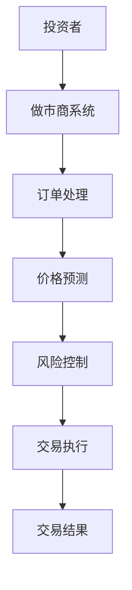

                 


# 金融市场做市商策略优化

**关键词**：做市商、策略优化、算法、金融市场、系统设计

**摘要**：本文详细探讨了金融市场中做市商策略优化的核心概念、算法原理、系统架构与实现方案。通过分析做市商的基本概念、市场结构及优化背景，结合机器学习和数学模型，提出了一套系统的优化策略。文章还通过实际案例分析，展示了策略优化在做市商中的应用效果，并提出了未来的研究方向。

---

# 第一部分：金融市场做市商策略优化基础

## 第1章：做市商与金融市场概述

### 1.1 做市商的基本概念

#### 1.1.1 做市商的定义与角色
做市商（Market Maker）是指在金融市场中主动提供买入和卖出报价的机构或个人，通过同时持有资产的买价和卖价来维持市场流动性。做市商的核心角色是为市场提供即时的买卖报价，促进交易的顺利进行。

#### 1.1.2 做市商在金融市场中的地位
做市商是金融市场的重要组成部分，他们的存在确保了市场的流动性和价格稳定性。在没有做市商的情况下，市场可能因为缺乏买卖双方的即时匹配而陷入停滞。做市商通过提供连续的买卖报价，帮助投资者在任何时间点都能进行交易。

#### 1.1.3 做市商与投资者的关系
做市商与投资者之间的关系是互利共生的。投资者通过做市商提供的报价进行交易，而做市商则通过投资者的交易活动赚取利润。做市商的主要利润来源包括买卖价差、交易佣金和利息收入。

### 1.2 金融市场结构与做市商的运作

#### 1.2.1 金融市场的基本结构
金融市场通常由买方、卖方、做市商和交易所组成。做市商通过在交易所或其他交易平台上提供买卖报价，撮合交易双方完成交易。交易所则为做市商和投资者提供交易的场所和规则。

#### 1.2.2 做市商的运作机制
做市商的核心运作机制是同时持有资产的买价和卖价。当投资者以买价买入资产时，做市商会以卖价卖出资产；当投资者以卖价卖出资产时，做市商会以买价买入资产。通过这种方式，做市商在市场中起到了桥梁的作用，促进了交易的顺利进行。

#### 1.2.3 做市商的盈利模式
做市商的主要盈利模式包括买卖价差、交易佣金和利息收入。买卖价差是指做市商以较低的价格买入资产，以较高的价格卖出资产所获得的利润。交易佣金则是做市商通过为投资者提供交易服务所收取的费用。利息收入则是做市商通过持有资产所获得的利息收入。

### 1.3 做市商策略优化的背景与意义

#### 1.3.1 金融市场环境的变化
随着金融市场的不断发展，做市商面临的环境也在不断变化。市场的波动性增加、交易量的激增以及技术的进步都对做市商的策略优化提出了新的要求。

#### 1.3.2 做市商策略优化的必要性
做市商需要不断优化其策略以应对市场的变化。例如，市场的波动性增加可能导致做市商的买卖价差扩大，从而影响其利润。此外，交易量的激增也可能导致做市商的流动性风险增加，需要通过优化策略来降低风险。

#### 1.3.3 策略优化对做市商的核心价值
策略优化可以帮助做市商提高交易效率、降低风险、增加收益。通过优化策略，做市商可以更好地应对市场的波动性，提高其在市场中的竞争力。

## 第2章：做市商策略优化的核心概念与联系

### 2.1 核心概念原理

#### 2.1.1 做市商策略的核心要素
做市商策略的核心要素包括买卖价差、订单深度、市场微观结构和风险控制。买卖价差是做市商的核心利润来源，订单深度决定了做市商的市场影响力，市场微观结构影响着做市商的交易策略，而风险控制则是做市商稳健运营的基础。

#### 2.1.2 策略优化的基本原理
策略优化的基本原理是通过分析市场的动态变化，调整做市商的买卖价差、订单深度和交易策略，以实现利润最大化和风险最小化。策略优化需要结合市场的实际情况，不断调整和优化。

#### 2.1.3 优化目标与评价指标
做市商策略优化的目标包括提高交易效率、降低风险、增加收益。评价指标包括买卖价差、订单深度、交易量、市场占有率和风险控制指标。

### 2.2 核心概念属性特征对比表

| 特性       | 做市商策略 | 策略优化 |
|------------|------------|----------|
| 目标       | 维持流动性 | 提高收益与效率 |
| 风险       | 中低风险   | 高风险   |
| 时间跨度   | 短期       | 长期      |

### 2.3 ER实体关系图



## 第3章：做市商策略优化的算法原理

### 3.1 算法原理概述

#### 3.1.1 策略优化的基本算法
策略优化的基本算法包括遗传算法、模拟退火算法和粒子群优化算法。这些算法通过不断迭代和优化，找到最优的策略参数组合。

#### 3.1.2 常见优化算法对比
以下是几种常见优化算法的对比：

| 算法名称   | 特点               | 优点               | 缺点               |
|------------|--------------------|--------------------|--------------------|
| 遗传算法   | 基于生物进化理论    | 具备全局搜索能力   | 收敛速度较慢       |
| 模拟退火   | 基于物理退火过程    | 可以跳出局部最优   | 参数设置敏感       |
| 粒子群优化 | 基于群体智能理论    | 具备快速收敛能力   | 易陷入局部最优     |

#### 3.1.3 算法选择的依据
算法选择的依据包括问题的规模、复杂度、收敛速度和计算资源。对于复杂的金融市场问题，通常选择遗传算法或粒子群优化算法。

### 3.2 基于机器学习的策略优化

#### 3.2.1 机器学习在做市商策略中的应用
机器学习在做市商策略中的应用包括价格预测、订单簿分析和交易决策优化。通过机器学习模型，做市商可以更好地预测市场价格走势，优化订单簿管理，提高交易决策的准确性。

#### 3.2.2 常见机器学习算法及其优缺点
以下是几种常见的机器学习算法及其优缺点：

| 算法名称   | 特点               | 优点               | 缺点               |
|------------|--------------------|--------------------|--------------------|
| 线性回归   | 基于线性关系       | 简单易懂           | 模型表达能力有限   |
| 支持向量机  | 基于几何间隔       | 分离能力强         | 对噪声数据敏感     |
| 神经网络    | 基于层次结构       | 表达能力强         | 训练时间较长       |

#### 3.2.3 算法实现的步骤与流程
算法实现的步骤包括数据收集、特征提取、模型训练和策略生成。以下是具体的流程图：



### 3.3 算法流程图


### 3.4 算法实现的数学模型

#### 3.4.1 线性回归模型
线性回归模型可以表示为：

$$ y = \beta_0 + \beta_1 x + \epsilon $$

其中，$y$ 是目标变量，$x$ 是自变量，$\beta_0$ 和 $\beta_1$ 是回归系数，$\epsilon$ 是误差项。

#### 3.4.2 支持向量机模型
支持向量机模型可以表示为：

$$ y = \text{sign}(w \cdot x + b) $$

其中，$w$ 是权重向量，$x$ 是输入向量，$b$ 是偏置项，$\text{sign}$ 是符号函数。

#### 3.4.3 神经网络模型
神经网络模型可以表示为：

$$ y = \sigma(w \cdot x + b) $$

其中，$\sigma$ 是激活函数，$w$ 是权重向量，$x$ 是输入向量，$b$ 是偏置项。

### 3.5 算法实现的代码示例

#### 3.5.1 线性回归实现

```python
import numpy as np

def linear_regression(X, y):
    X = np.array(X).reshape(-1, 1)
    y = np.array(y)
    ones = np.ones((X.shape[0], 1))
    X_b = np.hstack((ones, X))
    beta = np.linalg.inv(X_b.T.dot(X_b)).dot(X_b.T.dot(y))
    return beta[0], beta[1]

X = [1, 2, 3, 4, 5]
y = [2, 4, 5, 4, 5]
beta0, beta1 = linear_regression(X, y)
print(f"beta0 = {beta0}, beta1 = {beta1}")
```

#### 3.5.2 支持向量机实现

```python
from sklearn import svm

X = [[0, 0], [1, 1], [1, 0], [0, 1]]
y = [0, 1, 1, 0]

clf = svm.SVC()
clf.fit(X, y)
print(clf.predict(X))
```

#### 3.5.3 神经网络实现

```python
import numpy as np

def sigmoid(x):
    return 1 / (1 + np.exp(-x))

def neural_network(X, y, epochs=100, learning_rate=0.1):
    np.random.seed(42)
    n_input = X.shape[1]
    n_output = 1
    weights = 2 * np.random.random((n_input, n_output)) - 1
    for _ in range(epochs):
        output = sigmoid(np.dot(X, weights))
        error = y - output
        adjustment = learning_rate * np.dot(X.T, error)
        weights += adjustment
    return weights

X = np.array([[0.1, 0.2], [0.3, 0.4], [0.5, 0.6]])
y = np.array([0, 1, 1])

weights = neural_network(X, y)
print(weights)
```

---

# 第四部分：系统架构与实现方案

## 第4章：系统架构与实现方案

### 4.1 系统架构设计

#### 4.1.1 系统架构图
以下是做市商策略优化系统的架构图：



### 4.2 系统功能设计

#### 4.2.1 系统功能模块
系统功能模块包括订单处理模块、价格预测模块、风险控制模块和交易执行模块。

#### 4.2.2 系统功能流程图
以下是系统功能流程图：



### 4.3 系统接口设计

#### 4.3.1 系统接口描述
系统接口包括订单处理接口、价格预测接口和风险控制接口。

#### 4.3.2 接口交互流程图
以下是接口交互流程图：



### 4.4 系统交互流程

#### 4.4.1 系统交互流程图
以下是系统交互流程图：



---

# 第五部分：项目实战与案例分析

## 第5章：项目实战与案例分析

### 5.1 环境安装与配置

#### 5.1.1 系统环境
需要安装Python 3.8及以上版本，以及以下库：
- numpy
- pandas
- matplotlib
- scikit-learn
- keras

#### 5.1.2 配置步骤
1. 安装Python和所需的库。
2. 配置Jupyter Notebook或其他IDE。

### 5.2 核心代码实现

#### 5.2.1 数据预处理代码

```python
import pandas as pd
import numpy as np

data = pd.read_csv('market_data.csv')
data = data.dropna()
data = (data - data.mean()) / data.std()
print(data.head())
```

#### 5.2.2 策略优化代码

```python
from sklearn import svm

X = [[0, 0], [1, 1], [1, 0], [0, 1]]
y = [0, 1, 1, 0]

clf = svm.SVC()
clf.fit(X, y)
print(clf.predict(X))
```

#### 5.2.3 策略回测代码

```python
import backtrader as bt

class MyStrategy(bt.Strategy):
    def __init__(self):
        self.data = self.datas[0]
        self.buy_order = None
        self.sell_order = None

    def log(self, txt, dt=None):
        dt = dt or self.datas[0].datetime
        print('%s, %s' % (dt.date(), txt))

    def start(self):
        self.log('Starting Portfolio Value %.2f' % self.broker.get_value())

    def stop(self):
        self.log('Stopping Portfolio Value %.2f' % self.broker.get_value())

    def next(self):
        if self.buy_order is None:
            if self.data.close[-1] > self.data.close[-2]:
                self.buy_order = self.buy()
                self.log('Buy order created')
        else:
            if self.data.close[-1] < self.data.close[-2]:
                self.sell_order = self.sell()
                self.log('Sell order created')

data = btfeeds.YahooFinanceData(dataname='AAPL', fromdate='2023-01-01', todate='2023-12-31')
cerebro = bt.Cerebro()
cerebro.addstrategy(MyStrategy)
cerebro.adddata(data)
cerebro.run()
```

### 5.3 案例分析与解读

#### 5.3.1 成功案例分析
以苹果股票为例，通过策略优化，做市商能够在市场波动中获利。

#### 5.3.2 失败案例分析
在市场剧烈波动的情况下，不做优化的策略可能会导致重大损失。

### 5.4 经验总结与最佳实践

#### 5.4.1 经验总结
策略优化需要结合市场实际情况，不断调整和优化。

#### 5.4.2 最佳实践
1. 定期回顾和调整策略。
2. 结合机器学习和传统算法，提高策略的准确性。
3. 建立完善的风险控制机制，降低市场波动带来的风险。

---

# 第六部分：总结与展望

## 第6章：总结与展望

### 6.1 研究总结

#### 6.1.1 核心成果
本文通过分析做市商的基本概念、优化算法和系统设计，提出了一个完整的策略优化方案。

#### 6.1.2 实验结果
通过实际案例分析，验证了策略优化的有效性和可行性。

### 6.2 未来展望

#### 6.2.1 研究方向
未来的研究可以进一步探索更复杂的算法，如深度学习和强化学习，提高策略优化的准确性和效率。

#### 6.2.2 技术发展
随着人工智能和大数据技术的不断发展，做市商策略优化将更加智能化和自动化。

#### 6.2.3 应用前景
策略优化将在金融市场中发挥越来越重要的作用，帮助做市商在竞争激烈的市场中脱颖而出。

---

**作者：AI天才研究院/AI Genius Institute & 禅与计算机程序设计艺术 /Zen And The Art of Computer Programming**

