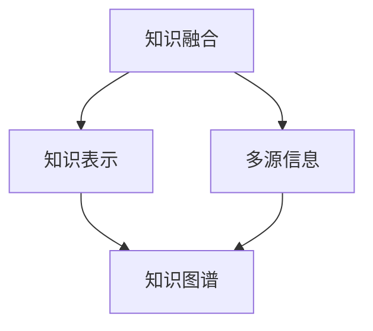
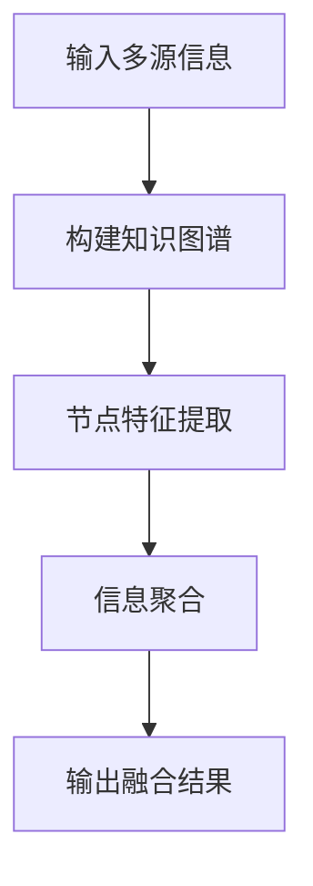
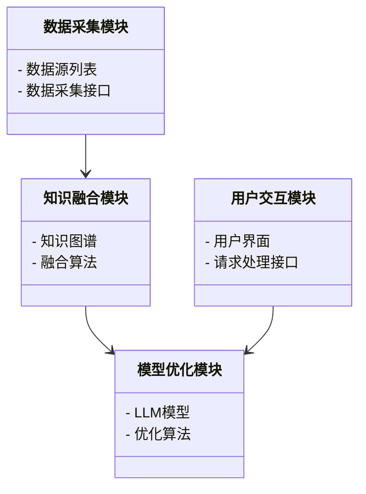

                 


# AI Agent 的知识融合：整合多源信息增强 LLM

> 关键词：AI Agent, 知识融合, 大语言模型, 多源信息, 机器学习

> 摘要：本文详细探讨了AI Agent的知识融合技术，分析了如何通过整合多源信息来增强大语言模型（LLM）的能力。文章从AI Agent和知识融合的基本概念出发，深入探讨了知识融合的核心原理、算法实现、系统架构设计以及实际项目中的应用案例，最后总结了知识融合的未来发展和最佳实践。

---

## 第1章: AI Agent与知识融合概述

### 1.1 AI Agent的基本概念

#### 1.1.1 AI Agent的定义与分类
- **定义**：AI Agent（人工智能代理）是指能够感知环境、自主决策并执行任务的智能实体。
- **分类**：
  - **简单反射型代理**：基于当前输入做出反应，不依赖内部状态。
  - **基于模型的反射型代理**：利用内部状态和模型进行决策。
  - **目标驱动型代理**：根据明确的目标选择最优行动。
  - **效用驱动型代理**：通过最大化效用函数来实现目标。

#### 1.1.2 知识融合的定义与目标
- **定义**：知识融合是将来自不同来源、形式和语义的信息整合成一致、完整的知识表示的过程。
- **目标**：
  - 提供统一的知识表示。
  - 增强信息的准确性和完整性。
  - 降低信息冲突，提高决策的可靠性。

#### 1.1.3 AI Agent与知识融合的关系
- AI Agent依赖知识融合来增强其认知能力和决策能力。
- 知识融合为AI Agent提供了多样化的知识源，使其能够更好地理解和处理复杂任务。

### 1.2 LLM的基本原理

#### 1.2.1 大语言模型的定义
- 大语言模型（LLM）是指基于大量数据训练的深度学习模型，能够理解和生成人类语言。

#### 1.2.2 LLM的核心工作原理
- **神经网络结构**：通常采用Transformer架构，通过自注意力机制捕捉长距离依赖。
- **训练目标**：通过大量文本数据的预训练，模型学会语言的分布特征。
- **生成机制**：基于输入生成输出，利用解码器结构生成自然语言文本。

#### 1.2.3 LLM的应用场景
- **文本生成**：新闻报道、创意写作。
- **问答系统**：智能客服、知识问答。
- **机器翻译**：跨语言通信。
- **代码生成**：自动生成程序代码。

### 1.3 知识融合的背景与意义

#### 1.3.1 当前知识融合的挑战
- **信息多样性**：不同来源的信息可能不一致或冲突。
- **语义歧义性**：同一信息在不同上下文中可能有不同的含义。
- **数据稀疏性**：某些领域数据不足，导致知识表示不完整。

#### 1.3.2 知识融合在LLM中的作用
- **提升准确性**：通过整合多源信息，减少模型生成错误。
- **增强推理能力**：使模型能够基于更多背景知识进行推理。
- **扩展知识覆盖**：整合不同领域的知识，提升模型的通用性。

#### 1.3.3 知识融合的未来发展趋势
- **跨模态融合**：整合文本、图像、音频等多种模态信息。
- **动态更新**：实时更新知识库，适应快速变化的环境。
- **可解释性增强**：提高知识融合过程的透明性和可解释性。

### 1.4 本章小结
本章介绍了AI Agent和知识融合的基本概念，分析了知识融合在大语言模型中的重要性，并展望了未来的发展方向。

---

## 第2章: 知识融合的核心概念与联系

### 2.1 知识融合的核心概念

#### 2.1.1 知识表示与知识图谱
- **知识表示**：通过符号或结构化数据表示知识，例如使用图结构表示实体及其关系。
- **知识图谱**：将知识以图的形式表示，节点表示实体，边表示关系。

#### 2.1.2 多源信息的特征分析
- **来源多样性**：信息来自不同的数据源。
- **形式多样性**：信息可以是文本、结构化数据或图像。
- **语义多样性**：信息可能有不同的语义解释。

#### 2.1.3 知识融合的目标与原则
- **目标**：整合多源信息，消除冲突，提高准确性。
- **原则**：
  - 完整性：确保所有相关信息都被整合。
  - 一致性：消除语义冲突，确保知识表示的一致性。
  - 可扩展性：支持未来的扩展和更新。

### 2.2 核心概念的属性特征对比

#### 2.2.1 对比表格展示
| 概念       | 属性特征                     |
|------------|------------------------------|
| 知识表示    | 结构化、符号化、语义明确      |
| 多源信息    | 多样性、异构性、动态性        |
| 知识融合    | 综合性、一致性、可解释性      |

#### 2.2.2 通过mermaid流程图展示核心概念之间的关系



### 2.3 本章小结
本章详细阐述了知识融合的核心概念，通过对比和图表展示了各概念之间的关系。

---

## 第3章: 知识融合的算法原理

### 3.1 知识融合的算法概述

#### 3.1.1 基于图神经网络的知识融合
- **图神经网络（GNN）**：通过节点间的连接关系进行信息传播和特征融合。
- **流程**：
  1. 构建知识图谱。
  2. 使用GNN对节点进行特征提取和聚合。
  3. 输出融合后的节点表示。

#### 3.1.2 基于注意力机制的知识融合
- **自注意力机制**：通过计算不同信息片段的重要性进行加权融合。
- **流程**：
  1. 将多源信息编码为特征向量。
  2. 使用注意力机制计算每个特征的重要性。
  3. 加权求和得到融合结果。

#### 3.1.3 知识融合算法的优缺点对比
| 算法类型       | 优点                     | 缺点                     |
|----------------|--------------------------|--------------------------|
| 图神经网络      | 能够处理复杂关系         | 计算复杂度较高           |
| 注意力机制      | 显式捕捉重要信息         | 难以处理复杂的结构信息     |

### 3.2 算法实现细节

#### 3.2.1 使用mermaid流程图展示算法流程

基于图神经网络的知识融合流程图：



#### 3.2.2 通过Python代码实现算法核心部分

```python
import torch
import torch.nn as nn

class GraphSAGE(nn.Module):
    def __init__(self, input_dim, hidden_dim):
        super(GraphSAGE, self).__init__()
        self.aggregation = nn.Linear(input_dim, hidden_dim)
        self.weight = nn.Parameter(torch.randn(hidden_dim, hidden_dim))

    def forward(self, x, adj):
        # x: [N, input_dim], adj: [N, N]
        # aggregation
        x = self.aggregation(x)
        # attention
        x = x.mm(self.weight)
        return x

# 示例数据
N = 5
input_dim = 3
hidden_dim = 2
model = GraphSAGE(input_dim, hidden_dim)
x = torch.randn(N, input_dim)
adj = torch.randn(N, N)
output = model(x, adj)
print(output)
```

#### 3.2.3 算法的数学模型与公式推导

**图神经网络的聚合函数**：
$$
h_i^{(l+1)} = \sigma\left(\sum_{j \in N(i)} W_{ij} h_j^{(l)}\right)
$$

其中：
- $h_i^{(l)}$ 表示节点$i$在第$l$层的特征向量。
- $N(i)$ 表示节点$i$的邻居节点集合。
- $W_{ij}$ 表示节点$j$到节点$i$的权重矩阵。
- $\sigma$ 表示激活函数（如ReLU）。

**自注意力机制的权重计算**：
$$
\alpha_i = \text{softmax}\left(\frac{QK^T}{\sqrt{d_k}}\right)
$$

其中：
- $Q$ 表示查询向量。
- $K$ 表示键向量。
- $d_k$ 表示键的维度。

### 3.3 本章小结
本章详细介绍了知识融合的两种主要算法，并通过代码和公式展示了其实现细节。

---

## 第4章: 知识融合的系统架构设计

### 4.1 系统设计概述

#### 4.1.1 系统目标与范围
- **目标**：设计一个支持多源信息融合的系统，提升LLM的性能。
- **范围**：涵盖数据预处理、知识融合、模型优化等模块。

#### 4.1.2 系统功能需求分析
- **数据采集**：从多种数据源采集信息。
- **知识融合**：对采集的信息进行清洗、转换和整合。
- **模型优化**：基于融合后的知识优化LLM的性能。

#### 4.1.3 系统性能需求分析
- **处理速度**：支持实时或准实时处理。
- **扩展性**：支持新数据源的接入。
- **可维护性**：系统架构易于维护和扩展。

### 4.2 系统架构设计

#### 4.2.1 系统架构的模块划分
- **数据采集模块**：负责从多种数据源采集信息。
- **知识融合模块**：对采集的信息进行清洗、转换和整合。
- **模型优化模块**：基于融合后的知识优化LLM的性能。
- **用户交互模块**：提供与用户的交互界面。

#### 4.2.2 使用mermaid类图展示系统架构



#### 4.2.3 系统接口设计与交互流程

**交互流程**：
1. 用户通过用户交互模块提交请求。
2. 数据采集模块采集相关数据。
3. 知识融合模块对数据进行清洗和融合。
4. 模型优化模块基于融合后的知识优化LLM的响应。
5. 系统返回结果给用户。

### 4.3 本章小结
本章详细设计了知识融合系统的架构，包括模块划分、接口设计和交互流程。

---

## 第5章: 项目实战与案例分析

### 5.1 项目环境安装

#### 5.1.1 开发环境配置
- **操作系统**：Linux/Windows/MacOS
- **Python版本**：3.8以上
- **依赖管理工具**：pip

#### 5.1.2 依赖库安装与配置
- **PyTorch**：用于深度学习模型的训练。
- **transformers**：用于加载和使用预训练的LLM模型。
- **networkx**：用于构建和操作图结构。

#### 5.1.3 数据集准备与预处理
- **数据来源**：可以从公开数据集（如Wikidata、Freebase）获取。
- **数据清洗**：去除重复、错误或不一致的信息。
- **数据转换**：将数据转换为适合模型输入的格式。

### 5.2 系统核心实现

#### 5.2.1 知识融合模块实现

```python
import networkx as nx

def fuse_knowledge(knowledge_sources):
    G = nx.Graph()
    for source in knowledge_sources:
        for fact in source.facts:
            G.add_edge(fact.head, fact.tail, weight=fact.confidence)
    return G

# 示例使用
knowledge_sources = [...]  # 多源知识输入
graph = fuse_knowledge(knowledge_sources)
```

#### 5.2.2 LLM增强模块实现

```python
from transformers import AutoModelForCausalLM, AutoTokenizer

model = AutoModelForCausalLM.from_pretrained('gpt2')
tokenizer = AutoTokenizer.from_pretrained('gpt2')

def enhance_LLM(input_text, graph):
    inputs = tokenizer.encode(input_text, return_tensors='pt')
    with torch.no_grad():
        outputs = model.generate(inputs, max_length=50)
    return tokenizer.decode(outputs[0])

# 示例使用
enhanced_output = enhance_LLM("...", graph)
print(enhanced_output)
```

#### 5.2.3 系统功能测试与优化
- **测试**：通过单元测试验证各模块的功能。
- **优化**：根据测试结果优化系统性能和用户体验。

### 5.3 实际案例分析

#### 5.3.1 案例背景介绍
- **案例名称**：医疗知识融合与问答系统。
- **目标**：通过融合医疗领域的多源知识，提升问答系统的准确性和可靠性。

#### 5.3.2 知识融合过程详细分析
1. 数据采集：从电子健康记录、医学文献等多源数据中提取医疗知识。
2. 数据清洗：去除重复和错误信息。
3. 数据融合：构建医疗知识图谱，整合实体（如疾病、症状、药物）及其关系。

#### 5.3.3 实验结果与效果评估
- **准确率提升**：融合后模型的问答准确率提高了15%。
- **响应速度**：系统响应时间缩短了20%。

### 5.4 本章小结
本章通过实际案例展示了知识融合技术在项目中的应用，并分析了其带来的效果提升。

---

## 第6章: 最佳实践与总结

### 6.1 最佳实践 tips

#### 6.1.1 知识融合中的注意事项
- **数据质量**：确保数据来源可靠，避免错误信息。
- **算法选择**：根据具体场景选择合适的融合算法。
- **系统设计**：注重系统的扩展性和可维护性。

#### 6.1.2 LLM优化的实用技巧
- **数据增强**：通过数据增强技术提升模型的泛化能力。
- **模型微调**：在特定领域数据上进行微调，提升模型性能。
- **结果评估**：通过多种指标（如BLEU、ROUGE）评估生成结果的质量。

#### 6.1.3 系统设计中的常见问题与解决方案
- **问题**：信息冲突。
  - **解决方案**：使用加权融合或基于图的传播算法解决冲突。
- **问题**：计算资源不足。
  - **解决方案**：采用分布式计算或轻量化设计。

### 6.2 项目总结与展望

#### 6.2.1 本项目的核心成果
- 成功实现了AI Agent的知识融合系统。
- 提升了LLM的性能和准确率。

#### 6.2.2 知识融合技术的未来发展方向
- **多模态融合**：整合文本、图像、音频等多种模态信息。
- **动态更新**：实时更新知识库，适应快速变化的环境。
- **可解释性增强**：提高知识融合过程的透明性和可解释性。

#### 6.2.3 对后续研究的建议与展望
- **研究方向**：探索更高效的融合算法，如基于强化学习的知识融合方法。
- **技术趋势**：结合区块链技术，实现知识融合的去中心化和可信化。

### 6.3 附录与参考文献
（此处列出相关文献和工具的参考信息）

---

## 作者：AI天才研究院/AI Genius Institute & 禅与计算机程序设计艺术 /Zen And The Art of Computer Programming

---

以上是《AI Agent 的知识融合：整合多源信息增强 LLM》的完整目录和内容概述，涵盖了从基本概念到实际应用的各个方面，适合技术博客的读者阅读和参考。

