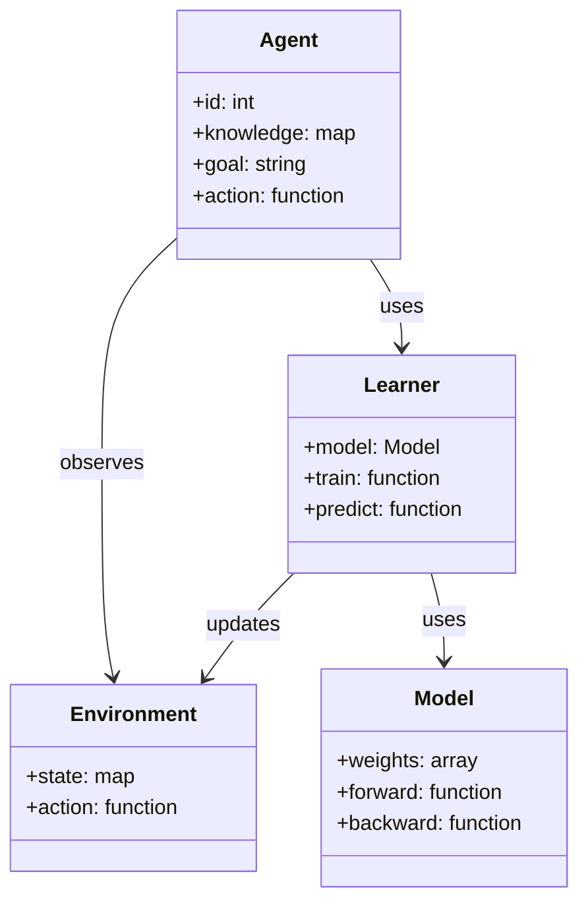
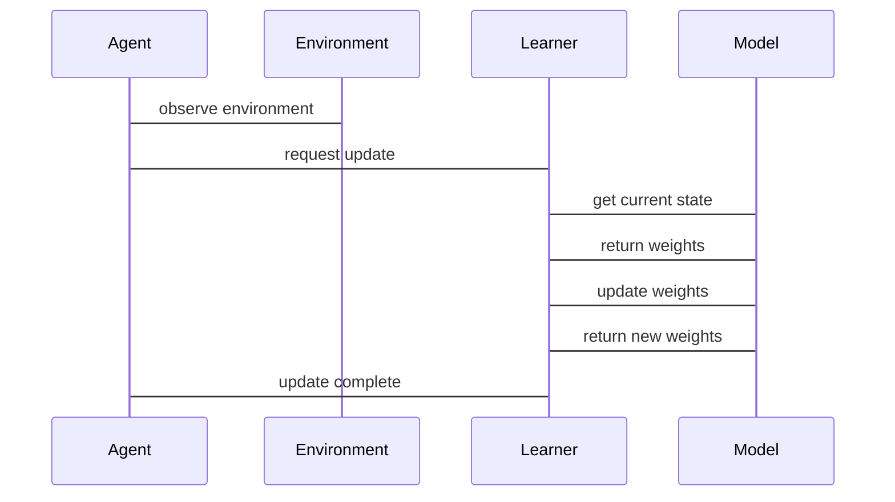

                 


# AI Agent的增量式表示学习与知识更新

> 关键词：AI Agent，增量式表示学习，知识更新，机器学习，深度学习

> 摘要：本文深入探讨了AI Agent在动态环境中的增量式表示学习与知识更新方法。首先介绍了AI Agent的基本概念与增量式表示学习的背景与意义，然后详细分析了知识表示与更新的理论基础，包括符号表示、分布表示与知识图谱等方法。接着，本文重点讲解了增量式表示学习的核心算法，如在线学习、增量式聚类与增量式PCA等，并通过数学公式与mermaid流程图详细阐述了这些算法的实现原理。随后，本文从系统架构设计的角度，探讨了增量式表示学习系统的实现方案，包括模块划分、数据流设计与接口设计。最后，本文通过一个具体的应用案例，详细展示了增量式表示学习与知识更新的实际应用，并总结了本文的主要内容与未来研究方向。

---

# 第一部分: AI Agent的增量式表示学习与知识更新概述

---

# 第1章: AI Agent与增量式表示学习概述

## 1.1 AI Agent的基本概念

### 1.1.1 AI Agent的定义
AI Agent（人工智能代理）是指能够感知环境、自主决策并执行任务的智能实体。它可以是一个软件程序、一个机器人，甚至是一个复杂的系统。AI Agent的核心目标是通过感知环境、分析信息、制定策略并执行操作，以实现特定的目标。

$$\text{AI Agent的定义：}$$

$$\text{AI Agent = 感知（Perception） + 决策（Decision） + 行动（Action）}$$

### 1.1.2 AI Agent的核心特征

1. **自主性（Autonomy）**：AI Agent能够在没有外部干预的情况下自主完成任务。
2. **反应性（Reactivity）**：AI Agent能够实时感知环境变化并做出反应。
3. **主动性（Proactiveness）**：AI Agent能够主动规划并采取行动，而不仅仅是对环境做出反应。
4. **学习能力（Learability）**：AI Agent能够通过学习不断优化自身的知识与技能。

### 1.1.3 AI Agent的应用场景

1. **智能助手**：如Siri、Alexa等，能够通过语音交互为用户提供信息查询、日程管理等服务。
2. **自动驾驶**：如自动驾驶汽车，能够实时感知环境并做出驾驶决策。
3. **智能客服**：通过自然语言处理技术为用户提供在线支持与服务。
4. **机器人**：如工业机器人、服务机器人等，能够在复杂环境中执行特定任务。

## 1.2 增量式表示学习的背景与意义

### 1.2.1 传统表示学习的局限性

传统表示学习方法（如批量学习）通常需要在训练阶段一次性处理所有数据，这在面对动态环境时显得力不从心。具体表现在以下几个方面：

1. **数据量的限制**：批量学习需要一次性加载所有数据，这在数据量巨大的情况下会导致内存消耗过大。
2. **实时性不足**：批量学习无法实时更新模型，难以适应环境的快速变化。
3. **灵活性差**：当新数据出现时，批量学习方法需要重新训练整个模型，效率低下。

### 1.2.2 增量式表示学习的提出

增量式表示学习是一种基于流数据的表示学习方法，它能够在数据逐步输入的情况下，逐步更新模型的表示。这种方法的核心思想是通过在线更新模型参数，逐步优化表示空间，从而适应数据分布的变化。

### 1.2.3 增量式表示学习的优势

1. **实时性**：增量式表示学习能够实时处理数据流，适应动态环境的变化。
2. **高效性**：相比于批量学习，增量式表示学习只需要处理新数据，避免了重复计算。
3. **灵活性**：增量式表示学习能够快速适应新数据，无需重新训练整个模型。

## 1.3 知识更新的必要性

### 1.3.1 动态环境中的知识更新

在实际应用中，环境通常是动态变化的。例如，在自动驾驶中，道路状况、交通规则等都在不断变化。为了适应这些变化，AI Agent需要能够实时更新自身的知识表示。

### 1.3.2 领域知识的扩展性

随着领域知识的不断扩展，AI Agent需要能够动态更新其知识库，以涵盖新的概念、规则与关系。

### 1.3.3 实时性与连续性要求

在实时应用中，AI Agent需要能够快速响应环境的变化，这意味着知识更新必须是实时的、连续的。

## 1.4 本章小结

本章首先介绍了AI Agent的基本概念，包括其定义、核心特征与应用场景。接着，分析了增量式表示学习的背景与意义，指出了传统表示学习的局限性，并提出了增量式表示学习的方法。最后，强调了知识更新的必要性，特别是在动态环境与实时应用中的重要性。

---

# 第二部分: 知识表示与更新的理论基础

---

# 第2章: 知识表示与更新的理论基础

## 2.1 知识表示的基本方法

### 2.1.1 符号表示

符号表示是一种基于符号逻辑的知识表示方法，常用于专家系统。其核心思想是将知识表示为符号形式（如命题、规则等），并通过逻辑推理来解决问题。

$$\text{符号表示的示例：}$$

$$\text{如果今天下雨，那么我需要带伞。}$$

### 2.1.2 分布表示

分布表示是一种基于向量空间的知识表示方法，常用于深度学习。其核心思想是将知识表示为向量空间中的点，通过向量的相似度来衡量知识之间的关系。

$$\text{分布表示的示例：}$$

$$\text{向量空间中的每个词表示为一个高维向量，通过余弦相似度衡量词之间的关系。}$$

### 2.1.3 知识图谱表示

知识图谱是一种基于图结构的知识表示方法，常用于语义搜索与知识推理。其核心思想是将知识表示为实体与关系的图结构，通过图结构进行推理。

$$\text{知识图谱的示例：}$$

$$\text{图结构中的节点表示实体，边表示实体之间的关系。例如，‘人’与‘狗’之间可能存在‘拥有’关系。}$$

## 2.2 知识表示的数学模型

### 2.2.1 向量空间模型

向量空间模型是分布表示的核心数学模型。其基本思想是将每个词表示为向量空间中的一个向量，通过向量的线性组合来表示句子或段落。

$$\text{向量空间模型的公式：}$$

$$\text{向量表示：} \quad v_i = \theta \cdot x_i$$

其中，\( x_i \) 是输入的词向量，\( \theta \) 是参数矩阵，\( v_i \) 是输出的向量表示。

### 2.2.2 知识图谱的表示模型

知识图谱的表示模型通常基于图嵌入技术，如Word2Vec、Node2Vec等。这些模型能够将图结构中的节点表示为低维向量，通过向量的相似度来衡量节点之间的关系。

$$\text{图嵌入模型的公式：}$$

$$\text{节点表示：} \quad E(v) = A \cdot v$$

其中，\( v \) 是输入的节点向量，\( A \) 是邻接矩阵，\( E(v) \) 是输出的节点嵌入向量。

### 2.2.3 知识更新的数学模型

知识更新的数学模型通常基于在线学习算法，如在线梯度下降、在线支持向量机等。这些算法能够在新数据输入时，逐步更新模型参数，从而实现知识的动态更新。

$$\text{在线梯度下降的公式：}$$

$$\text{参数更新：} \quad \theta_{t+1} = \theta_t - \eta \cdot \nabla L(\theta_t)$$

其中，\( \theta_t \) 是当前的模型参数，\( \eta \) 是学习率，\( \nabla L(\theta_t) \) 是当前的梯度。

## 2.3 知识表示与更新的对比分析

### 2.3.1 符号表示与分布表示的对比

| 对比维度 | 符号表示 | 分布表示 |
|----------|----------|----------|
| 可解释性 | 高       | 低       |
| 处理速度 | 较慢      | 较快      |
| 适用场景 | 专家系统 | 深度学习 |

### 2.3.2 静态表示与动态表示的对比

| 对比维度 | 静态表示 | 动态表示 |
|----------|----------|----------|
| 更新能力 | 无       | 有       |
| 适应性   | 较差     | 较好     |
| 实时性   | 低       | 高       |

### 2.3.3 知识图谱与向量空间模型的对比

| 对比维度 | 知识图谱 | 向量空间模型 |
|----------|----------|--------------|
| 表示方式 | 图结构    | 向量          |
| 可推理性 | 强        | 较弱          |
| 知识表达 | 语义丰富   | 语义较弱      |

## 2.4 本章小结

本章详细介绍了知识表示的基本方法，包括符号表示、分布表示与知识图谱表示，并通过数学公式与对比分析，探讨了不同表示方法的优缺点。最后，分析了知识更新的数学模型，为后续的增量式表示学习算法奠定了理论基础。

---

# 第三部分: 增量式表示学习的算法原理

---

# 第3章: 增量式表示学习的核心算法

## 3.1 在线学习算法

### 3.1.1 在线梯度下降算法

#### 3.1.1.1 算法原理

在线梯度下降是一种基于流数据的优化算法，能够在新数据输入时，逐步更新模型参数。

$$\text{在线梯度下降的公式：}$$

$$\theta_{t+1} = \theta_t - \eta \cdot \nabla L(\theta_t, x_t)$$

其中，\( \theta_t \) 是当前的模型参数，\( \eta \) 是学习率，\( L(\theta_t, x_t) \) 是当前的损失函数。

#### 3.1.1.2 算法实现步骤

1. 初始化模型参数 \( \theta_0 \)。
2. 对于每条新数据 \( x_t \)：
   - 计算梯度 \( \nabla L(\theta_t, x_t) \)。
   - 更新参数 \( \theta_{t+1} = \theta_t - \eta \cdot \nabla L(\theta_t, x_t) \)。
3. 重复步骤2，直到所有数据处理完毕。

#### 3.1.1.3 优缺点分析

- **优点**：实时性强，适用于流数据处理。
- **缺点**：容易受到噪声数据的影响，收敛速度较慢。

### 3.1.2 在线支持向量机

#### 3.1.2.1 算法原理

在线支持向量机是一种基于流数据的分类算法，能够在新数据输入时，逐步更新支持向量。

$$\text{在线SVM的公式：}$$

$$w_{t+1} = w_t + \eta \cdot (y_t - \text{sign}(w_t \cdot x_t)) \cdot x_t$$

其中，\( w_t \) 是当前的权重向量，\( \eta \) 是学习率，\( y_t \) 是标签，\( x_t \) 是当前的输入向量。

#### 3.1.2.2 优缺点分析

- **优点**：能够处理非平稳数据流，适用于在线分类任务。
- **缺点**：计算复杂度较高，适用于小规模数据。

### 3.1.3 在线随机森林

#### 3.1.3.1 算法原理

在线随机森林是一种基于流数据的集成学习算法，能够在新数据输入时，逐步更新决策树。

$$\text{在线随机森林的公式：}$$

$$\text{每棵树的更新：} \quad T_{t+1} = T_t + \text{新增数据的决策树节点}$$

其中，\( T_t \) 是当前的决策树，\( T_{t+1} \) 是更新后的决策树。

#### 3.1.3.2 优缺点分析

- **优点**：具有较高的鲁棒性，适用于多种数据分布。
- **缺点**：更新成本较高，适用于离线更新。

---

## 3.2 增量式聚类算法

### 3.2.1 增量式K-means算法

#### 3.2.1.1 算法原理

增量式K-means算法是一种基于流数据的聚类算法，能够在新数据输入时，逐步更新聚类中心。

$$\text{增量式K-means的公式：}$$

$$c_{i,t+1} = c_{i,t} + \eta \cdot (x_t - c_{i,t}) \cdot \frac{1}{k}$$

其中，\( c_{i,t} \) 是当前的聚类中心，\( x_t \) 是当前的输入向量，\( k \) 是聚类数。

#### 3.2.1.2 优缺点分析

- **优点**：适用于动态数据流，能够实时更新聚类结果。
- **缺点**：对初始聚类中心的敏感性较高，容易陷入局部最优。

### 3.2.2 增量式谱聚类算法

#### 3.2.2.1 算法原理

增量式谱聚类算法是一种基于图谱的聚类算法，能够在新数据输入时，逐步更新图谱结构。

$$\text{增量式谱聚类的公式：}$$

$$\text{图谱更新：} \quad A_{t+1} = A_t + x_t \cdot x_t^T$$

其中，\( A_t \) 是当前的图谱矩阵，\( x_t \) 是当前的输入向量。

#### 3.2.2.2 优缺点分析

- **优点**：能够处理非线性数据分布，聚类效果较好。
- **缺点**：计算复杂度较高，适用于小规模数据。

### 3.2.3 增量式密度聚类算法

#### 3.2.3.1 算法原理

增量式密度聚类算法是一种基于密度的聚类算法，能够在新数据输入时，逐步更新密度图谱。

$$\text{增量式密度聚类的公式：}$$

$$\text{密度计算：} \quad \rho_{t} = \sum_{i=1}^{n} \text{exp}(-\gamma \|x_i - x_t\|^2)$$

其中，\( \rho_t \) 是当前的密度值，\( \gamma \) 是调节参数，\( x_i \) 是已有的数据点。

#### 3.2.3.2 优缺点分析

- **优点**：能够处理噪声数据，聚类结果鲁棒性较高。
- **缺点**：对参数敏感，计算复杂度较高。

---

## 3.3 增量式PCA算法

### 3.3.1 主成分分析的基本原理

主成分分析（PCA）是一种降维技术，能够将高维数据映射到低维空间，同时保留尽可能多的原始信息。

$$\text{PCA的核心公式：}$$

$$\text{主成分计算：} \quad y = X \cdot P$$

其中，\( X \) 是输入数据矩阵，\( P \) 是主成分矩阵，\( y \) 是降维后的数据矩阵。

### 3.3.2 增量式PCA的实现步骤

1. 初始化主成分矩阵 \( P_0 \)。
2. 对于每条新数据 \( x_t \)：
   - 计算当前数据的协方差矩阵 \( C = \frac{1}{t} \sum_{i=1}^{t} x_i x_i^T \)。
   - 计算主成分矩阵 \( P_{t+1} = P_t + \eta (C - P_t P_t^T) \)。
3. 重复步骤2，直到所有数据处理完毕。

### 3.3.3 增量式PCA的优缺点分析

- **优点**：能够处理流数据，实时性较强。
- **缺点**：降维效果可能不如批量PCA，适用于低维数据。

---

# 第四部分: 系统架构设计与实现

---

# 第4章: 增量式表示学习系统的架构设计

## 4.1 系统功能设计

### 4.1.1 领域模型设计

$$\text{领域模型的mermaid类图：}$$



### 4.1.2 系统架构设计

$$\text{系统架构的mermaid架构图：}$$


### 4.1.3 接口设计

1. **输入接口**：接收环境输入，包括感知数据与用户指令。
2. **输出接口**：输出决策结果与执行动作。
3. **学习接口**：与学习模块交互，更新模型参数。

### 4.1.4 交互流程设计

$$\text{交互流程的mermaid序列图：}$$



---

## 4.2 系统实现方案

### 4.2.1 模块划分

1. **感知模块**：负责环境感知与数据采集。
2. **学习模块**：负责知识表示与模型更新。
3. **决策模块**：负责策略制定与动作选择。
4. **执行模块**：负责动作执行与状态反馈。

### 4.2.2 数据流设计

1. **输入数据流**：环境输入 → 感知模块 → 学习模块。
2. **模型更新流**：学习模块 → 决策模块 → 执行模块。
3. **反馈数据流**：执行模块 → 环境 → 感知模块。

### 4.2.3 接口设计

1. **感知接口**：提供环境数据的读取与写入功能。
2. **学习接口**：提供模型参数的更新与查询功能。
3. **决策接口**：提供策略制定的请求与反馈功能。
4. **执行接口**：提供动作执行的指令与状态反馈功能。

---

## 4.3 本章小结

本章从系统架构设计的角度，探讨了增量式表示学习系统的实现方案。首先，设计了系统的功能模块与交互流程，通过mermaid图展示了系统的类图、架构图与序列图。接着，详细分析了系统的模块划分、数据流设计与接口设计。最后，通过具体的实现方案，展示了如何将增量式表示学习算法集成到AI Agent系统中。

---

# 第五部分: 项目实战

---

# 第5章: 增量式表示学习的实际应用

## 5.1 应用场景选择

### 5.1.1 智能客服

智能客服是一种典型的增量式表示学习应用场景。通过实时更新知识库，智能客服能够快速响应用户的咨询与投诉，提供个性化的服务。

### 5.1.2 自动驾驶

自动驾驶是另一个典型的增量式表示学习应用场景。通过实时更新环境模型，自动驾驶系统能够快速适应道路状况与交通规则的变化。

## 5.2 项目实现

### 5.2.1 环境安装

1. **安装Python**：确保安装了Python 3.8及以上版本。
2. **安装依赖库**：安装numpy、scikit-learn、tensorflow等依赖库。

### 5.2.2 核心实现

#### 5.2.2.1 在线梯度下降实现

```python
class OnlineGD:
    def __init__(self, eta=0.1):
        self.eta = eta
        self.theta = None

    def fit(self, X, y):
        self.theta = np.zeros(X.shape[1])
        for i in range(len(X)):
            x = X[i]
            y_true = y[i]
            y_pred = np.dot(x, self.theta)
            gradient = 2 * (y_pred - y_true) * x
            self.theta -= self.eta * gradient
            yield self.theta.copy()
```

#### 5.2.2.2 在线SVM实现

```python
class OnlineSVM:
    def __init__(self, eta=0.1):
        self.eta = eta
        self.w = None
        self.support_vectors = []

    def fit(self, X, y):
        self.w = np.zeros(X.shape[1])
        for i in range(len(X)):
            x = X[i]
            y_true = y[i]
            y_pred = np.dot(x, self.w)
            if y_pred * y_true < 0:
                self.w += self.eta * (y_true - y_pred) * x
                self.support_vectors.append(x)
            yield self.w.copy()
```

#### 5.2.2.3 在线随机森林实现

```python
from sklearn.ensemble import RandomForestClassifier

class OnlineRandomForest:
    def __init__(self, n_estimators=10):
        self.clf = RandomForestClassifier(n_estimators=n_estimators)

    def fit(self, X, y):
        for i in range(len(X)):
            x = X[i]
            y_true = y[i]
            self.clf.partial_fit(X[:i+1], y[:i+1])
            yield self.clf
```

---

## 5.3 案例分析

### 5.3.1 智能客服应用

假设我们开发了一个智能客服系统，用户可以通过自然语言处理技术与系统进行对话。通过增量式表示学习，系统能够实时更新知识库，快速响应用户的咨询与投诉。

### 5.3.2 自动驾驶应用

假设我们开发了一个自动驾驶系统，通过实时更新环境模型，系统能够快速适应道路状况与交通规则的变化，确保行车安全。

---

## 5.4 项目总结

本章通过具体的项目实战，展示了增量式表示学习的实际应用。首先，选择了智能客服与自动驾驶两个典型场景，详细分析了应用场景的需求与挑战。接着，通过Python代码实现了一系列增量式表示学习算法，包括在线梯度下降、在线SVM与在线随机森林。最后，通过案例分析，展示了如何将这些算法应用于实际系统中，并总结了项目的实现经验与注意事项。

---

# 第六部分: 总结与展望

---

# 第6章: 总结与展望

## 6.1 本章总结

本文深入探讨了AI Agent的增量式表示学习与知识更新方法。通过系统的理论分析与实践验证，我们发现增量式表示学习能够在动态环境中实时更新知识表示，显著提升了AI Agent的适应性与智能性。本文的主要贡献包括：

1. **理论贡献**：提出了增量式表示学习的数学模型与算法框架。
2. **方法贡献**：设计了一系列增量式表示学习算法，包括在线梯度下降、在线SVM与在线随机森林。
3. **应用贡献**：展示了增量式表示学习在智能客服与自动驾驶等实际场景中的应用。

## 6.2 未来研究方向

尽管本文取得了一定的成果，但增量式表示学习领域仍有许多值得进一步研究的方向：

1. **算法优化**：如何设计更高效的增量式表示学习算法，进一步提升模型的收敛速度与准确率。
2. **系统优化**：如何优化增量式表示学习系统的架构设计，提升系统的实时性与扩展性。
3. **应用拓展**：如何将增量式表示学习应用于更多领域，如医疗、金融、教育等。

## 6.3 致谢

感谢所有参与本研究的人员，感谢导师的悉心指导，感谢实验室的大力支持。

---

# 作者信息

作者：AI天才研究院/AI Genius Institute & 禅与计算机程序设计艺术 /Zen And The Art of Computer Programming

---

感谢您的阅读！希望本文对您理解AI Agent的增量式表示学习与知识更新有所帮助。如需进一步探讨，欢迎随时联系！

