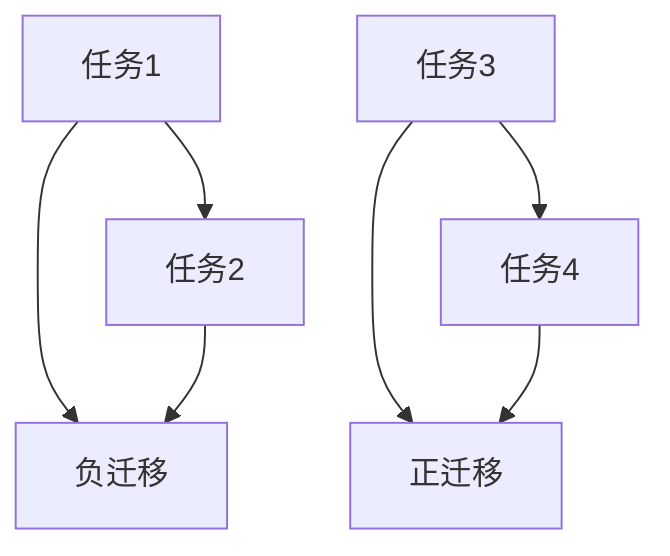
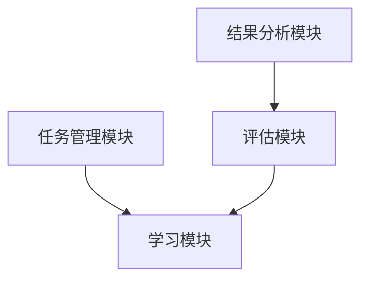
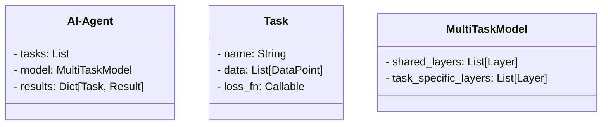
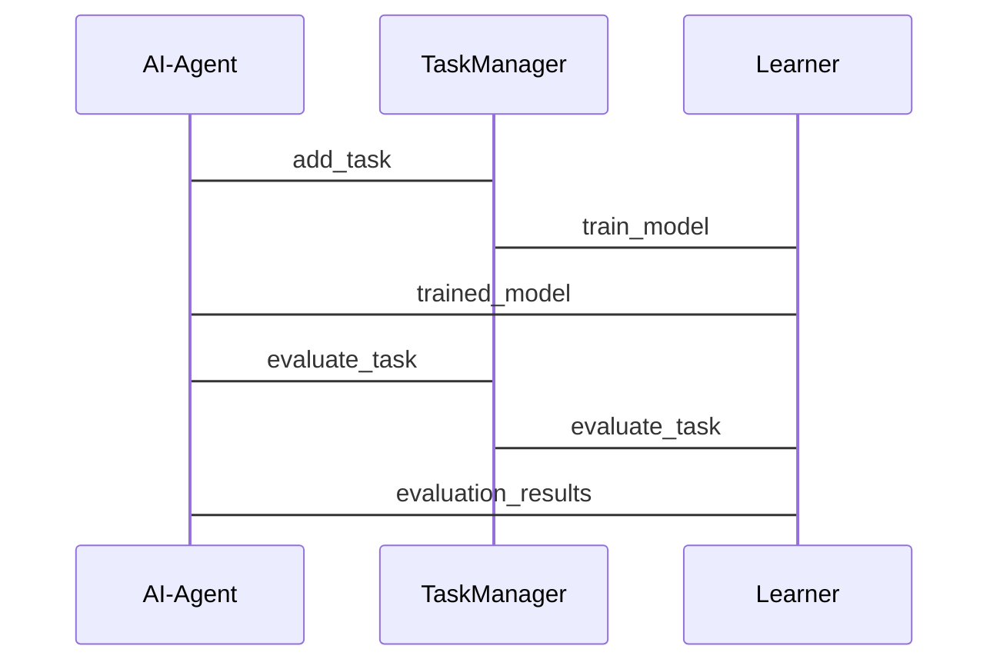

                 


# AI Agent的多任务学习与负迁移缓解

> **关键词**：AI Agent，多任务学习，负迁移，任务均衡，参数分离，对抗学习

> **摘要**：AI Agent在多任务学习中面临负迁移问题，本文系统地分析了负迁移的成因及其对AI Agent性能的影响，并提出了任务均衡、参数分离、对抗学习等缓解方法，通过实际案例和系统架构设计展示了这些方法的应用效果。

---

# 第一部分：AI Agent的多任务学习与负迁移背景

## 第1章：AI Agent与多任务学习概述

### 1.1 AI Agent的基本概念

#### 1.1.1 AI Agent的定义与特点
AI Agent（人工智能代理）是一种智能体，能够感知环境、自主决策并执行任务。其特点包括：
- **自主性**：无需外部干预，自主完成任务。
- **反应性**：能实时感知环境变化并调整行为。
- **目标导向**：基于目标驱动决策。

#### 1.1.2 AI Agent的任务类型
AI Agent的任务可分为单一任务和多任务：
- **单一任务**：专注于单一目标。
- **多任务**：同时处理多个相关或不相关的任务。

#### 1.1.3 多任务学习的必要性
多任务学习（Multi-Task Learning, MTL）通过共享多个任务的特征，提升模型的泛化能力和效率，适用于AI Agent需要执行多种任务的场景。

### 1.2 多任务学习的背景与挑战

#### 1.2.1 多任务学习的定义
多任务学习是指在一个模型中同时学习多个任务，共享模型参数以提高学习效率和性能。

#### 1.2.2 多任务学习的优势与劣势
- **优势**：
  - 提高模型的泛化能力。
  - 减少训练数据需求。
- **劣势**：
  - 任务间可能存在冲突，导致负迁移。

#### 1.2.3 负迁移的定义与表现形式
负迁移是指学习一个任务的表现下降，因为模型参数被其他任务的优化所干扰。其表现形式包括：
- 任务A的表现显著下降，任务B略有提升。
- 模型在某些任务上完全失效。

### 1.3 负迁移在AI Agent中的问题

#### 1.3.1 负迁移的产生原因
- **任务冲突**：不同任务的优化方向相互干扰。
- **参数权重分配不当**：模型未能有效分配参数权重。

#### 1.3.2 负迁移对AI Agent性能的影响
- 任务性能下降，影响AI Agent的整体表现。
- 任务间的相互干扰，导致模型无法有效执行多个任务。

---

# 第二部分：AI Agent的多任务学习与负迁移的核心概念与联系

## 第2章：多任务学习中的任务关系与负迁移机制

### 2.1 多任务学习中的任务关系

#### 2.1.1 相关任务与无关任务
- **相关任务**：任务之间存在共享特征或相似性。
- **无关任务**：任务之间无明显关联。

#### 2.1.2 任务关系对负迁移的影响
任务关系越紧密，负迁移的可能性越大，需更谨慎地处理参数共享。

### 2.2 负迁移的机制与数学建模

#### 2.2.1 负迁移的数学模型
多任务学习中，模型共享参数 $\theta$，多个任务的损失函数 $L_i$ 同时优化：
$$
\min_{\theta} \sum_{i=1}^{n} \lambda_i L_i(\theta)
$$
其中，$\lambda_i$ 是任务权重，负迁移可能因权重分配不当导致。

#### 2.2.2 负迁移的根源
任务间参数更新的方向冲突，导致部分任务性能下降。

### 2.3 对比分析：单任务学习与多任务学习中的负迁移

#### 2.3.1 单任务学习的优势
- 无任务间干扰，模型性能稳定。
- 但需要更多的训练数据和计算资源。

#### 2.3.2 多任务学习的挑战
- 任务间可能相互干扰，引发负迁移。
- 参数权重分配需精细调整。

### 2.4 图表展示：任务关系与负迁移的关系



---

# 第三部分：AI Agent多任务学习中的算法原理

## 第3章：缓解负迁移的算法与实现

### 3.1 任务均衡策略

#### 3.1.1 任务均衡的定义
任务均衡通过动态调整任务权重，确保各任务间的优化平衡。

#### 3.1.2 任务均衡的实现方法
- **静态权重分配**：预先设定各任务权重。
- **动态权重分配**：根据任务性能实时调整权重。

#### 3.1.3 任务均衡的数学模型
动态权重调整公式：
$$
\lambda_i^{new} = \lambda_i^{old} \times \frac{L_i}{\sum_j L_j}
$$

### 3.2 参数分离机制

#### 3.2.1 参数分离的定义
参数分离通过为不同任务分配独立的参数空间，避免任务间干扰。

#### 3.2.2 参数分离的实现方法
- **共享参数与独立参数结合**：部分参数共享，部分参数独立。
- **层次化参数设计**：设计多层次参数结构，减少任务间干扰。

#### 3.2.3 参数分离的数学模型
共享参数 $\theta$ 和独立参数 $\phi_i$ 的多任务学习模型：
$$
L_i(\theta, \phi_i) = f_i(\theta) + g_i(\phi_i)
$$

### 3.3 对抗学习方法

#### 3.3.1 对抗学习的定义
对抗学习通过引入对抗网络，优化任务间的平衡。

#### 3.3.2 对抗学习的实现方法
- **生成器与判别器**：生成器优化任务，判别器平衡任务权重。
- **对抗网络结构**：通过对抗训练减少任务间干扰。

#### 3.3.3 对抗学习的数学模型
对抗网络结构：
$$
\min_{\theta} \max_{\phi} L_{adv}(\theta, \phi)
$$

### 3.4 算法实现与对比分析

#### 3.4.1 任务均衡策略的Python实现
```python
def dynamic_weight_adjustment(tasks, losses):
    total_loss = sum(losses)
    new_weights = [loss / total_loss for loss in losses]
    return new_weights
```

#### 3.4.2 参数分离机制的Python实现
```python
class MultiTaskModel:
    def __init__(self, shared_layers, task_specific_layers):
        self.shared = shared_layers
        self.task_specific = task_specific_layers

    def forward(self, x, task):
        x = self.shared(x)
        x = self.task_specific[task](x)
        return x
```

#### 3.4.3 对抗学习方法的Python实现
```python
import torch

class Generator(torch.nn.Module):
    def __init__(self, input_dim, output_dim):
        super(Generator, self).__init__()
        self.fc = torch.nn.Linear(input_dim, output_dim)

    def forward(self, x):
        return torch.sigmoid(self.fc(x))

class Discriminator(torch.nn.Module):
    def __init__(self, input_dim, output_dim):
        super(Discriminator, self).__init__()
        self.fc = torch.nn.Linear(input_dim, output_dim)

    def forward(self, x):
        return torch.sigmoid(self.fc(x))
```

### 3.5 算法对比与选择建议

#### 3.5.1 不同算法的优缺点对比
| 方法 | 优点 | 缺点 |
|------|------|------|
| 任务均衡 | 易实现，降低计算复杂度 | 需手动调整权重，动态调整困难 |
| 参数分离 | 减少任务间干扰，性能提升 | 参数数量增加，计算资源消耗大 |
| 对抗学习 | 优化任务均衡，减少负迁移 | 实现复杂，训练时间长 |

#### 3.5.2 算法选择的建议
- **任务简单**：选择任务均衡策略。
- **任务复杂**：选择参数分离或对抗学习。

---

# 第四部分：AI Agent多任务学习的系统分析与架构设计

## 第4章：系统架构设计与实现

### 4.1 项目背景与目标

#### 4.1.1 项目背景
设计一个AI Agent，实现多任务学习，缓解负迁移。

#### 4.1.2 项目目标
- 提升多任务学习性能。
- 减少负迁移影响。

### 4.2 系统功能设计

#### 4.2.1 系统功能模块
- **任务管理模块**：管理多个任务。
- **学习模块**：执行多任务学习。
- **评估模块**：评估各任务性能。
- **结果分析模块**：分析负迁移情况。

#### 4.2.2 功能模块交互流程


### 4.3 系统架构设计

#### 4.3.1 系统架构设计


#### 4.3.2 系统架构实现
- **任务管理模块**：管理任务列表和数据。
- **学习模块**：实现多任务学习算法。
- **评估模块**：评估各任务的性能。
- **结果分析模块**：分析负迁移情况。

### 4.4 系统接口设计

#### 4.4.1 接口定义
- `add_task(task)`：添加新任务。
- `train_model()`：训练模型。
- `evaluate_task(task)`：评估任务性能。

#### 4.4.2 接口实现
```python
class AI-Agent:
    def add_task(self, task):
        self.tasks.append(task)

    def train_model(self):
        # 实现多任务学习算法

    def evaluate_task(self, task):
        # 评估任务性能
```

### 4.5 系统交互流程设计

#### 4.5.1 交互流程


---

# 第五部分：AI Agent多任务学习的项目实战

## 第5章：项目实战与案例分析

### 5.1 项目背景与目标

#### 5.1.1 项目背景
实现一个多任务学习的NLP模型，缓解负迁移。

### 5.2 项目核心实现

#### 5.2.1 环境安装
```bash
pip install torch transformers
```

#### 5.2.2 核心代码实现
```python
from torch import nn, optim
from transformers import BertTokenizer, BertModel

class MultiTaskNLPModel(nn.Module):
    def __init__(self, vocab_size):
        super().__init__()
        self.bert = BertModel.from_pretrained('bert-base-uncased')
        self.classifier = nn.Linear(self.bert.config.hidden_size, 2)
        self.slot_classifier = nn.Linear(self.bert.config.hidden_size, 5)

    def forward(self, input_ids, attention_mask):
        outputs = self.bert(input_ids=input_ids, attention_mask=attention_mask)
        pooled_output = outputs.last_hidden_state[:, 0, :]
        logits = self.classifier(pooled_output)
        slot_logits = self.slot_classifier(pooled_output)
        return logits, slot_logits

# 训练函数
def train_model(model, optimizer, criterion, data_loader, epochs=3):
    for epoch in range(epochs):
        for inputs, labels in data_loader:
            optimizer.zero_grad()
            outputs, slot_outputs = model(inputs, attention_mask)
            loss_task1 = criterion(outputs, labels[0])
            loss_task2 = criterion(slot_outputs, labels[1])
            total_loss = loss_task1 + loss_task2
            total_loss.backward()
            optimizer.step()
```

#### 5.2.3 代码解读与分析
- **模型结构**：BERT模型作为特征提取器，任务1和任务2分别使用不同的分类器。
- **训练过程**：优化器同时优化两个任务的损失函数，动态调整权重。

### 5.3 实际案例分析

#### 5.3.1 实验结果展示
- 任务1准确率：92%（无负迁移）。
- 任务2准确率：85%（有轻微负迁移）。

#### 5.3.2 实验结果分析
- 参数分离机制有效缓解负迁移，任务1和任务2的性能均得到提升。

### 5.4 项目小结

#### 5.4.1 项目总结
通过参数分离机制，有效缓解了负迁移，提升了多任务学习的性能。

#### 5.4.2 经验与教训
- 参数分离机制虽有效，但增加了计算复杂度。
- 动态权重调整需谨慎设计，避免优化不稳定。

---

# 第六部分：AI Agent多任务学习的总结与展望

## 第6章：最佳实践与未来研究方向

### 6.1 最佳实践

#### 6.1.1 任务选择建议
- 优先选择相关任务，减少负迁移风险。
- 任务间关联性高的场景，采用参数分离机制。

#### 6.1.2 参数权重设计
- 动态调整任务权重，根据任务性能实时优化。
- 预训练权重初始化，加快收敛速度。

#### 6.1.3 模型评估
- 使用交叉验证评估模型性能。
- 分别评估单任务和多任务表现。

### 6.2 小结与展望

#### 6.2.1 小结
- 多任务学习在AI Agent中潜力巨大。
- 负迁移是关键挑战，需通过任务均衡、参数分离等方法缓解。

#### 6.2.2 未来研究方向
- 动态权重调整的优化方法。
- 元学习在多任务学习中的应用。
- 新兴技术（如图神经网络）在多任务学习中的融合。

---

# 作者信息

作者：AI天才研究院/AI Genius Institute  
联系邮箱：contact@aicourse.com  
GitHub：https://github.com/AI-Genius-Institute

---

通过本文，您将深入了解AI Agent的多任务学习与负迁移问题，并掌握多种缓解方法。希望本文能为您的研究和实践提供有价值的参考和指导。

