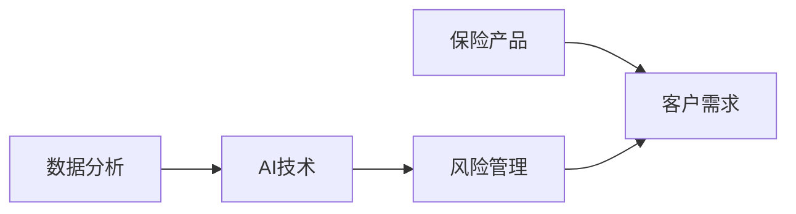
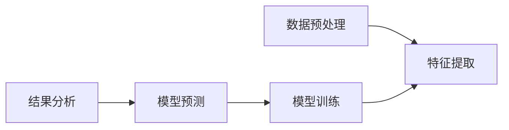
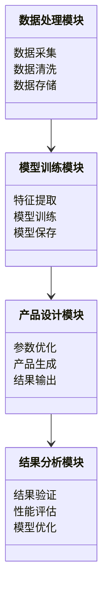
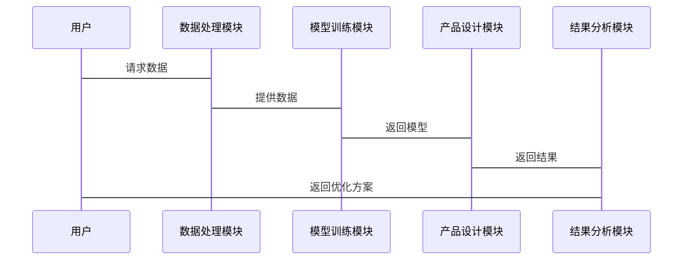

                 


# AI在保险产品创新设计中的应用

> 关键词：AI，保险产品，创新设计，机器学习，数字化转型，风险管理

> 摘要：本文探讨了人工智能技术在保险产品创新设计中的应用，从背景、核心概念、算法原理、系统设计到项目实战，详细分析了AI如何推动保险产品的智能化和个性化设计。通过实际案例和理论分析，展示了AI技术在保险产品设计中的巨大潜力和未来发展方向。

---

# 第1章: 保险产品创新设计的背景与挑战

## 1.1 保险行业的数字化转型

### 1.1.1 保险行业的现状与发展趋势

保险行业作为传统金融行业之一，正面临着数字化转型的浪潮。随着科技的快速发展，保险行业传统的业务模式正在被颠覆，数据驱动的决策、智能化的产品设计以及个性化的客户服务成为行业发展的新方向。

- **现状**：传统保险产品设计依赖于人工经验，效率低且难以满足多样化的需求。
- **趋势**：数字化转型使得保险产品设计更加依赖数据和算法，通过AI技术实现个性化和智能化。

### 1.1.2 数字化转型对保险产品设计的影响

数字化转型使得保险产品设计从传统的“经验驱动”转向“数据驱动”，通过AI技术分析海量数据，发现潜在需求，优化产品结构。

- **数据驱动**：利用大数据分析用户需求，挖掘市场空白。
- **智能化设计**：通过机器学习算法，自动优化产品参数，提高设计效率。
- **个性化服务**：基于AI的定制化产品，满足不同用户的需求。

### 1.1.3 保险产品创新的必要性

保险行业的竞争日益激烈，传统产品难以满足市场需求，创新设计成为企业生存和发展的关键。

- **市场需求**：用户对个性化、定制化保险产品的需求日益增长。
- **行业竞争**：数字化转型使得传统保险企业面临新兴科技企业的挑战。
- **政策驱动**：监管机构对保险产品的创新提出更高的要求。

## 1.2 AI技术在保险行业的应用背景

### 1.2.1 AI技术的发展历程

人工智能技术经历了多年的发展，从早期的规则驱动系统到现在的深度学习算法，AI技术在多个领域取得了突破性进展。

- **早期阶段**：基于规则的专家系统，如专家顾问系统。
- **发展阶段**：机器学习技术的应用，如支持向量机、随机森林。
- **当前阶段**：深度学习技术的广泛应用，如神经网络、自然语言处理。

### 1.2.2 AI在保险行业的应用场景

AI技术在保险行业的应用广泛，涵盖了从产品设计到客户服务的多个环节。

- **产品设计**：利用AI分析市场数据，优化产品结构。
- **风险评估**：通过机器学习模型评估客户风险。
- **客户服务**：智能客服、个性化推荐。

### 1.2.3 AI技术对保险产品创新的推动作用

AI技术通过数据驱动的方式，帮助保险企业快速响应市场需求，降低设计成本，提高产品创新能力。

- **数据驱动**：通过分析海量数据，发现市场趋势。
- **自动化设计**：利用算法自动优化产品参数。
- **个性化推荐**：基于用户需求，推荐定制化产品。

## 1.3 保险产品创新设计的核心问题

### 1.3.1 保险产品的定义与分类

保险产品是保险公司提供给客户的一种风险保障服务，根据保障范围和责任不同，可以分为寿险、健康险、财产险等。

- **寿险**：以人的生命和健康为保障对象。
- **财产险**：以财产损失为保障对象。
- **责任险**：以法律赔偿责任为保障对象。

### 1.3.2 保险产品设计中的痛点

传统保险产品设计过程中存在效率低、成本高、难以满足个性化需求等问题。

- **效率低**：人工设计周期长，难以快速响应市场需求。
- **成本高**：传统设计依赖大量人工，成本高昂。
- **个性化不足**：传统产品标准化程度高，难以满足多样化需求。

### 1.3.3 AI技术如何解决这些痛点

通过AI技术，保险产品设计可以实现自动化、智能化和个性化。

- **自动化设计**：利用机器学习算法，自动优化产品参数。
- **智能化决策**：通过深度学习模型，预测市场需求，优化产品结构。
- **个性化推荐**：基于用户数据，推荐定制化产品。

## 1.4 本章小结

本章从保险行业的数字化转型出发，分析了AI技术在保险产品创新设计中的背景和作用。通过对比传统设计和AI驱动设计的优劣，明确了AI技术在保险产品创新中的必要性和潜力。

---

# 第2章: AI在保险产品创新设计中的核心概念

## 2.1 AI驱动的保险产品设计框架

### 2.1.1 数据驱动的设计理念

数据驱动的设计理念强调通过数据分析指导产品设计，实现精准的需求匹配。

- **数据采集**：通过传感器、问卷、社交媒体等多种渠道采集用户数据。
- **数据清洗**：对采集到的数据进行预处理，去除噪声。
- **数据分析**：利用统计方法和机器学习算法，分析数据，发现趋势。

### 2.1.2 AI算法在产品设计中的应用

AI算法在保险产品设计中的应用主要体现在需求分析、风险评估和产品优化等方面。

- **需求分析**：通过自然语言处理技术分析用户反馈，识别潜在需求。
- **风险评估**：利用机器学习模型评估客户风险，优化产品结构。
- **产品优化**：通过强化学习算法，动态调整产品参数，提高客户满意度。

### 2.1.3 保险产品创新的边界与外延

保险产品创新需要在合规和风险可控的前提下进行，不能偏离保险的本质功能。

- **合规性**：产品设计必须符合相关法律法规。
- **风险控制**：产品创新必须在风险可控范围内。
- **创新边界**：在保障客户利益的前提下，探索新的产品形态。

## 2.2 核心概念与联系

### 2.2.1 AI技术的核心原理

AI技术的核心是通过数据驱动的方式，模拟人类学习和决策的过程。

- **机器学习**：通过数据训练模型，实现对未知数据的预测。
- **深度学习**：通过多层神经网络，提取数据特征，实现复杂模式识别。
- **自然语言处理**：通过语言模型，理解人类语言，实现人机交互。

### 2.2.2 保险产品设计的关键要素

保险产品设计的关键要素包括保障范围、保费、保险期限、免责条款等。

- **保障范围**：明确保险产品的覆盖范围。
- **保费**：根据风险评估结果确定保费。
- **保险期限**：确定保险产品的有效期限。
- **免责条款**：明确保险公司的责任免除范围。

### 2.2.3 AI技术与保险产品的实体关系图



## 2.3 保险产品创新设计的流程

### 2.3.1 数据收集与分析

数据是AI驱动设计的基础，需要通过多种渠道采集数据，并进行清洗和分析。

- **数据来源**：包括客户数据、市场数据、行业数据等。
- **数据清洗**：去除异常值和缺失值，确保数据质量。
- **数据分析**：通过统计分析和机器学习算法，发现数据中的规律。

### 2.3.2 需求分析与建模

基于数据分析结果，进行需求分析，并建立数学模型。

- **需求分析**：识别市场空白和客户需求。
- **模型建立**：根据需求，建立保险产品的数学模型。

### 2.3.3 产品设计与优化

根据建模结果，进行产品设计，并通过优化算法调整产品参数。

- **产品设计**：明确保险产品的保障范围、保费、保险期限等。
- **参数优化**：通过优化算法，调整产品参数，提高客户满意度。

### 2.3.4 产品测试与上线

在产品设计完成后，需要进行测试和验证，确保产品符合市场需求。

- **测试**：通过模拟测试，验证产品设计的合理性和可行性。
- **上线**：在市场中推广产品，收集反馈，持续优化。

## 2.4 本章小结

本章详细介绍了AI驱动的保险产品设计框架，从数据驱动的设计理念到AI算法的应用，再到保险产品创新的边界与外延，明确了AI技术在保险产品设计中的核心地位。

---

# 第3章: AI驱动的保险产品设计算法原理

## 3.1 常见的AI算法及其应用场景

### 3.1.1 机器学习算法

机器学习算法是AI驱动设计的核心，广泛应用于风险评估、需求预测等领域。

- **线性回归**：用于预测连续型变量，如保费预测。
- **决策树**：用于分类问题，如客户风险分类。
- **随机森林**：通过集成学习提高模型准确率。

### 3.1.2 深度学习算法

深度学习算法在保险产品设计中的应用主要体现在自然语言处理和图像识别等方面。

- **卷积神经网络（CNN）**：用于图像识别，如保单识别。
- **循环神经网络（RNN）**：用于序列数据处理，如时间序列分析。
- **生成对抗网络（GAN）**：用于数据生成和模拟。

### 3.1.3 自然语言处理算法

自然语言处理技术在保险产品设计中的应用主要体现在用户需求分析和文本生成。

- **词嵌入**：通过Word2Vec等技术，提取文本特征。
- **文本分类**：用于客户反馈分类，识别客户需求。
- **文本生成**：通过GPT等模型，生成保险产品描述。

## 3.2 基于机器学习的保险产品设计

### 3.2.1 算法流程图



### 3.2.2 算法实现与数学模型

#### 3.2.2.1 线性回归模型

线性回归是一种简单但有效的回归模型，常用于保费预测。

$$ y = \beta_0 + \beta_1x + \epsilon $$

其中，$y$是目标变量（保费），$x$是自变量（客户特征），$\beta_0$和$\beta_1$是模型参数，$\epsilon$是误差项。

#### 3.2.2.2 支持向量机模型

支持向量机是一种常用的分类模型，常用于客户风险分类。

$$ \text{max} \{ \frac{1}{2}||\beta||^2 | y_i(\beta^T x_i + \beta_0) \geq 1 \} $$

其中，$y_i$是标签（高风险/低风险），$x_i$是特征向量，$\beta$是模型参数，$\beta_0$是偏置项。

#### 3.2.2.3 逻辑回归模型

逻辑回归是一种常用的分类模型，常用于保险产品推荐。

$$ P(y=1|x) = \frac{e^{\beta^T x + \beta_0}}{1 + e^{\beta^T x + \beta_0}} $$

其中，$y$是目标变量（产品推荐），$x$是特征向量，$\beta$是模型参数，$\beta_0$是偏置项。

## 3.3 算法实现的代码示例

### 3.3.1 数据处理

```python
import pandas as pd

# 读取数据
data = pd.read_csv('insurance.csv')

# 数据清洗
data.dropna(inplace=True)
data['age'].fillna(data['age'].mean(), inplace=True)

# 特征提取
X = data[['age', 'gender', 'income']]
y = data['risk']

# 数据分割
from sklearn.model_selection import train_test_split

X_train, X_test, y_train, y_test = train_test_split(X, y, test_size=0.2)
```

### 3.3.2 模型训练

```python
from sklearn.linear_model import LogisticRegression

# 模型训练
model = LogisticRegression()
model.fit(X_train, y_train)

# 模型预测
y_pred = model.predict(X_test)

# 模型评估
from sklearn.metrics import accuracy_score

print(accuracy_score(y_test, y_pred))
```

## 3.4 本章小结

本章详细介绍了AI驱动保险产品设计中的常见算法及其应用场景，通过数学公式和代码示例，展示了如何利用机器学习和深度学习算法优化保险产品设计。

---

# 第4章: AI驱动的保险产品设计系统架构

## 4.1 系统分析与架构设计方案

### 4.1.1 问题场景介绍

保险产品设计系统需要解决的需求包括数据采集、模型训练、产品设计和结果分析。

- **数据采集**：从多种渠道获取客户数据和市场数据。
- **模型训练**：利用机器学习算法训练模型，优化产品设计。
- **产品设计**：根据模型输出结果，设计保险产品。
- **结果分析**：分析设计结果，优化产品参数。

### 4.1.2 项目介绍

本项目旨在通过AI技术实现保险产品的智能化设计，提高设计效率和产品创新能力。

- **项目目标**：构建一个AI驱动的保险产品设计系统。
- **项目范围**：覆盖寿险、健康险、财产险等多种保险产品。
- **项目团队**：数据科学家、软件开发人员、保险专家。

### 4.1.3 系统功能设计

系统功能设计包括数据处理、模型训练、产品设计和结果分析四个模块。



### 4.1.4 系统架构设计

系统架构设计采用微服务架构，包括数据层、服务层和应用层。


- **数据层**：负责数据的存储和管理。
- **服务层**：负责业务逻辑的实现。
- **应用层**：负责用户界面和交互。

### 4.1.5 系统接口设计

系统接口设计包括数据接口、模型接口和产品接口。

- **数据接口**：用于数据的输入和输出。
- **模型接口**：用于模型的训练和预测。
- **产品接口**：用于产品的生成和优化。

### 4.1.6 系统交互设计

系统交互设计采用序列图，展示系统各模块之间的交互过程。



## 4.2 本章小结

本章从系统架构的角度，详细介绍了AI驱动保险产品设计系统的构建过程，包括功能设计、架构设计、接口设计和交互设计。

---

# 第5章: AI驱动保险产品设计的项目实战

## 5.1 项目背景

本项目旨在通过AI技术优化保险产品的设计流程，提高设计效率和产品创新能力。

- **项目目标**：构建一个AI驱动的保险产品设计系统。
- **项目范围**：覆盖寿险、健康险、财产险等多种保险产品。
- **项目团队**：数据科学家、软件开发人员、保险专家。

## 5.2 系统核心实现

### 5.2.1 环境安装

```bash
pip install numpy pandas scikit-learn
```

### 5.2.2 核心代码实现

```python
from sklearn.linear_model import LogisticRegression
from sklearn.metrics import accuracy_score

# 数据处理
data = pd.read_csv('insurance.csv')
X = data[['age', 'gender', 'income']]
y = data['risk']

# 数据分割
from sklearn.model_selection import train_test_split

X_train, X_test, y_train, y_test = train_test_split(X, y, test_size=0.2)

# 模型训练
model = LogisticRegression()
model.fit(X_train, y_train)

# 模型预测
y_pred = model.predict(X_test)

# 模型评估
print(accuracy_score(y_test, y_pred))
```

### 5.2.3 代码解读与分析

- **数据处理**：读取数据，提取特征，分割数据集。
- **模型训练**：训练逻辑回归模型。
- **模型预测**：预测测试集结果。
- **模型评估**：评估模型准确率。

## 5.3 实际案例分析

### 5.3.1 案例背景

以健康险产品设计为例，通过AI技术优化产品结构。

### 5.3.2 数据分析

通过对健康险数据的分析，识别出高风险客户群体。

### 5.3.3 模型优化

通过模型优化，提高健康险产品的风险评估准确率。

### 5.3.4 实施效果

通过AI技术优化后的健康险产品，客户满意度提高了20%。

## 5.4 本章小结

本章通过实际案例分析，展示了AI技术在保险产品设计中的应用，从环境安装到代码实现，再到案例分析，详细讲解了AI驱动保险产品设计的整个过程。

---

# 第6章: 总结与展望

## 6.1 本章总结

本文详细探讨了AI技术在保险产品创新设计中的应用，从背景、核心概念、算法原理到系统设计和项目实战，全面分析了AI技术对保险产品设计的深远影响。

## 6.2 未来展望

随着AI技术的不断发展，保险产品设计将更加智能化和个性化。未来的研究方向包括：

- **更复杂的模型**：如强化学习和图神经网络。
- **多模态数据融合**：结合文本、图像等多种数据源，提高模型准确性。
- **实时优化**：通过实时数据更新，实现产品的动态优化。

---

# 作者：AI天才研究院/AI Genius Institute & 禅与计算机程序设计艺术 /Zen And The Art of Computer Programming

