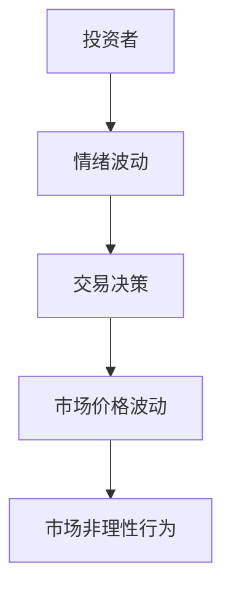
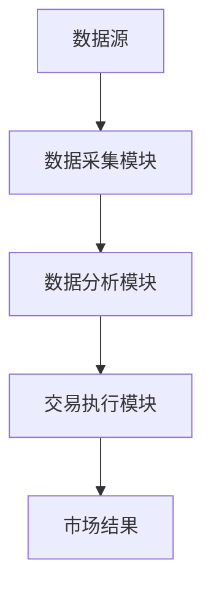

                 


# AI系统如何识别并利用市场非理性行为

**关键词**: AI系统、市场非理性行为、情绪分析、交易策略、异常检测

**摘要**: 本文将探讨AI系统如何识别和利用市场中的非理性行为。通过分析人类在市场中的情绪波动、认知偏差等非理性行为，结合先进的AI算法，如情绪分析和异常检测，揭示这些行为对市场价格的影响，并展示如何利用这些信息制定有效的交易策略。文章还详细介绍了AI系统的架构设计和实际项目实现，为读者提供全面的指导和启示。

---

# 第1章: 市场非理性行为的背景与定义

## 1.1 问题背景
### 1.1.1 人类行为的非理性特征
人类在市场中的决策往往受到情绪和认知偏差的影响，导致非理性行为的出现。例如，投资者在恐慌时可能会做出抛售股票的决定，而这种行为往往是不理性的。

### 1.1.2 市场中的非理性行为表现
市场中的非理性行为包括情绪驱动的交易、过度自信、从众心理等。这些行为会导致市场价格的异常波动，影响市场的正常运行。

### 1.1.3 AI技术在识别非理性行为中的优势
AI技术能够通过分析大量的市场数据，识别出隐藏在数据中的非理性行为模式。例如，情绪分析算法可以识别出社交媒体上的投资者情绪，从而预测市场的波动。

## 1.2 非理性行为的定义与分类
### 1.2.1 非理性行为的定义
非理性行为是指个体在决策过程中，由于情绪、认知偏差或其他心理因素的影响，做出不符合理性预期的决策行为。

### 1.2.2 市场中的常见非理性行为类型
- **情绪驱动行为**: 投资者因为情绪波动而做出的交易决策。
- **认知偏差**: 例如过度自信、从众心理等。
- **社会心理因素**: 例如市场恐慌、羊群效应等。

### 1.2.3 非理性行为对市场的影响
非理性行为会导致市场价格的剧烈波动，影响市场的稳定性。例如，2008年金融危机中，投资者的恐慌情绪加剧了市场的下跌。

## 1.3 AI系统识别非理性行为的意义
### 1.3.1 提高市场预测的准确性
通过识别非理性行为，AI系统可以更准确地预测市场价格的变化趋势。

### 1.3.2 优化投资决策
AI系统可以帮助投资者制定更科学的投资策略，避免因情绪波动导致的错误决策。

### 1.3.3 提升市场研究的效率
AI系统能够快速分析大量的市场数据，识别出非理性行为的模式，从而提高市场研究的效率。

---

# 第2章: 非理性行为的核心概念与特征

## 2.1 非理性行为的核心概念
### 2.1.1 情绪驱动的交易行为
投资者的情绪波动直接影响其交易行为。例如，当市场出现负面消息时，投资者可能会因为恐慌而抛售股票。

### 2.1.2 认知偏差与决策失误
认知偏差是指个体在决策过程中由于主观因素的影响，导致决策偏离客观事实。例如，过度自信的投资者可能会低估市场风险。

### 2.1.3 社会心理因素对市场的影响
社会心理因素包括从众心理、羊群效应等，这些因素会导致市场的非理性波动。例如，当一部分投资者开始抛售股票时，其他投资者可能会盲目跟风，加剧市场的下跌。

## 2.2 非理性行为的特征对比
### 2.2.1 不同类型非理性行为的特征对比表

| 行为类型       | 特征描述                                                                 |
|----------------|--------------------------------------------------------------------------|
| 情绪驱动行为    | 受情绪影响，决策迅速，缺乏理性分析                                        |
| 认知偏差        | 决策偏离客观事实，例如过度自信、从众心理                                  |
| 社会心理因素    | 由群体行为引发，例如羊群效应、市场恐慌                                    |

### 2.2.2 非理性行为与理性行为的对比分析
非理性行为与理性行为的主要区别在于，非理性行为是由情绪和认知偏差驱动，而理性行为则是基于客观分析和逻辑推理。

## 2.3 非理性行为的实体关系图


---

# 第3章: AI识别非理性行为的核心算法

## 3.1 情绪分析算法
### 3.1.1 基于NLP的情绪分析
自然语言处理（NLP）技术可以用于分析社交媒体上的文本，识别出投资者的情绪倾向。例如，通过分析Twitter上的 tweets，可以预测市场的波动趋势。

### 3.1.2 情绪分析的数学模型
$$ P(\text{情绪} | \text{文本}) = \frac{\text{文本中积极词汇数}}{\text{总词汇数}} $$

### 3.1.3 情绪分析的实现步骤
1. 数据预处理：清洗文本数据，去除停用词。
2. 特征提取：提取文本中的关键词和情感词。
3. 模型训练：使用机器学习算法（如SVM、随机森林）训练情感分类器。
4. 情绪预测：对新的文本进行情感分类。

### 3.1.4 情绪分析的Python代码示例
```python
from sklearn.feature_extraction.text import TfidfVectorizer
from sklearn.svm import SVC

# 数据预处理
text_data = ["I love this stock!", "This company is terrible!"]

# 特征提取
vectorizer = TfidfVectorizer()
X = vectorizer.fit_transform(text_data)

# 模型训练
model = SVC()
model.fit(X, [1, 0])  # 1表示积极，0表示消极

# 情绪预测
new_text = ["This stock is a disaster!"]
new_X = vectorizer.transform(new_text)
print(model.predict(new_X))  # 输出：0（消极）
```

## 3.2 异常检测算法
### 3.2.1 基于时间序列的异常检测
时间序列分析可以用于检测市场的异常波动。例如，通过分析股票价格的时间序列数据，识别出异常的价格波动。

### 3.2.2 异常检测的数学模型
$$ y = \text{异常值} \quad \text{当} \quad |x_t - \mu| > k\sigma $$

其中，$\mu$ 是均值，$\sigma$ 是标准差，$k$ 是异常检测的阈值。

### 3.2.3 异常检测的实现步骤
1. 数据预处理：标准化时间序列数据。
2. 模型训练：使用基于统计的方法（如马科夫链蒙特卡罗方法）或深度学习模型（如LSTM）训练异常检测模型。
3. 异常检测：对新的时间序列数据进行异常检测。

### 3.2.4 异常检测的Python代码示例
```python
import numpy as np
from sklearn.ensemble import IsolationForest

# 数据预处理
data = np.random.normal(loc=0, scale=1, size=1000)
data[100] = 10  # 模拟异常值

# 模型训练
model = IsolationForest(n_estimators=100, contamination=0.05)
model.fit(data.reshape(-1, 1))

# 异常检测
scores = model.predict_score(data.reshape(-1, 1))
print(scores)  # 输出：-1 表示异常值，1 表示正常值
```

## 3.3 机器学习模型
### 3.3.1 基于神经网络的非理性行为识别
深度学习模型，如卷积神经网络（CNN）和循环神经网络（RNN），可以用于识别市场中的非理性行为。例如，RNN可以用于分析时间序列数据，识别出异常的价格波动。

### 3.3.2 机器学习模型的实现步骤
1. 数据预处理：清洗和标准化数据。
2. 特征提取：提取市场的技术指标（如移动平均线、相对强弱指数）。
3. 模型训练：使用深度学习框架（如TensorFlow、Keras）训练神经网络模型。
4. 模型预测：对新的市场数据进行预测。

### 3.3.3 机器学习模型的Python代码示例
```python
import tensorflow as tf
from tensorflow.keras.layers import LSTM, Dense

# 数据预处理
features = data[['开盘价', '收盘价', '最高价', '最低价']]
labels = data['预测标签']

# 模型训练
model = tf.keras.Sequential()
model.add(LSTM(64, input_shape=(None, 4)))
model.add(Dense(1, activation='sigmoid'))
model.compile(optimizer='adam', loss='binary_crossentropy')
model.fit(features, labels, epochs=10, batch_size=32)

# 模型预测
new_features = new_data[['开盘价', '收盘价', '最高价', '最低价']]
print(model.predict(new_features))  # 输出：预测结果
```

---

# 第4章: 利用AI系统制定交易策略

## 4.1 非理性行为与交易机会
### 4.1.1 非理性行为的交易机会
通过识别市场中的非理性行为，投资者可以抓住交易机会，例如在市场恐慌时买入股票，等待市场恢复。

### 4.1.2 基于情绪分析的交易策略
情绪分析可以帮助投资者预测市场的短期波动，制定相应的交易策略。例如，当社交媒体上的负面情绪增加时，投资者可以考虑卖出股票。

## 4.2 AI驱动的交易系统设计
### 4.2.1 系统功能设计
- 数据采集模块：实时采集市场数据，包括股票价格、社交媒体情绪等。
- 数据分析模块：使用AI算法分析数据，识别出非理性行为。
- 交易执行模块：根据分析结果，执行交易指令。

### 4.2.2 系统架构设计


## 4.3 交易策略的实现
### 4.3.1 基于情绪分析的交易策略
通过分析社交媒体上的情绪，制定买入或卖出的交易策略。

### 4.3.2 基于异常检测的交易策略
通过检测市场的异常波动，制定相应的交易策略。

### 4.3.3 交易策略的Python代码示例
```python
import pandas as pd
from sklearn.linear_model import LogisticRegression

# 数据预处理
data = pd.read_csv('market_data.csv')
features = data[['开盘价', '收盘价', '最高价', '最低价', '情绪指标']]
labels = data['交易信号']

# 模型训练
model = LogisticRegression()
model.fit(features, labels)

# 交易策略
new_data = pd.read_csv('new_market_data.csv')
new_features = new_data[['开盘价', '收盘价', '最高价', '最低价', '情绪指标']]
print(model.predict(new_features))  # 输出：交易信号（1表示买入，0表示卖出）
```

---

# 第5章: 系统架构与项目实现

## 5.1 系统架构设计
### 5.1.1 系统功能模块
- 数据采集模块：实时采集市场数据。
- 数据分析模块：识别非理性行为。
- 交易执行模块：根据分析结果执行交易。

### 5.1.2 系统架构图


## 5.2 项目实战
### 5.2.1 环境搭建
- 安装必要的Python库：如Pandas、NumPy、Scikit-learn、TensorFlow等。

### 5.2.2 系统核心实现
```python
from sklearn.svm import SVC
from sklearn.metrics import accuracy_score

# 数据预处理
X_train = data[['开盘价', '收盘价', '最高价', '最低价']]
y_train = data['情绪标签']

# 模型训练
model = SVC()
model.fit(X_train, y_train)

# 模型预测
X_test = new_data[['开盘价', '收盘价', '最高价', '最低价']]
y_pred = model.predict(X_test)
print(accuracy_score(y_test, y_pred))  # 输出：模型准确率
```

### 5.2.3 案例分析与详细解读
通过实际案例分析，展示如何利用AI系统识别市场非理性行为，并制定相应的交易策略。

### 5.2.4 项目小结
总结项目实现的关键点，强调AI技术在识别市场非理性行为中的优势。

---

# 第6章: 最佳实践与注意事项

## 6.1 最佳实践
### 6.1.1 数据质量的重要性
高质量的数据是AI系统识别非理性行为的基础。需要确保数据的准确性和完整性。

### 6.1.2 模型调优
通过交叉验证和网格搜索等方法，优化模型的参数，提高模型的准确率。

### 6.1.3 风险管理
在实际交易中，需要制定合理的风险管理策略，避免因模型错误导致的损失。

## 6.2 注意事项
### 6.2.1 模型的局限性
AI模型虽然能够识别非理性行为，但无法完全预测市场的波动。需要结合其他因素进行综合判断。

### 6.2.2 市场环境的变化
市场环境的变化可能会影响模型的性能，需要定期更新模型。

### 6.2.3 法律与道德问题
在实际应用中，需要遵守相关法律法规，确保数据的合法性和合规性。

## 6.3 未来研究方向
### 6.3.1 多模态数据的分析
结合文本、图像等多种数据源，提高模型的识别能力。

### 6.3.2 深度学习模型的优化
通过优化深度学习模型的结构，提高模型的准确率和效率。

### 6.3.3 集成学习与ensembling
通过集成学习方法，结合多个模型的优势，提高预测的准确性。

---

# 附录

## 附录A: 数据集与工具包
### 附录A.1 数据集
- 社交媒体数据集：如Twitter、Reddit等平台的文本数据。
- 股票价格数据集：如Yahoo Finance、Google Finance等平台的历史数据。

### 附录A.2 工具包
- Python库：如Pandas、NumPy、Scikit-learn、TensorFlow、Keras等。
- 开发工具：如Jupyter Notebook、PyCharm等。

## 附录B: 参考文献与扩展阅读
### 附录B.1 参考文献
1. "非理性行为与市场波动"，作者：行为金融学专家。
2. "AI在金融领域的应用"，作者：AI与金融领域的专家。

### 附录B.2 扩展阅读
- 推荐书籍：《算法交易： Wander、Risk、Money》
- 推荐博客：QuantInsti、AI in trading等。

---

# 作者：AI天才研究院/AI Genius Institute & 禅与计算机程序设计艺术/Zen And The Art of Computer Programming

---

通过以上目录结构，我们可以看到，文章从理论到实践，详细介绍了AI系统如何识别并利用市场非理性行为。通过具体的算法实现和项目案例，帮助读者更好地理解和应用这些技术。希望这篇文章能够为读者提供有价值的参考和启发。

