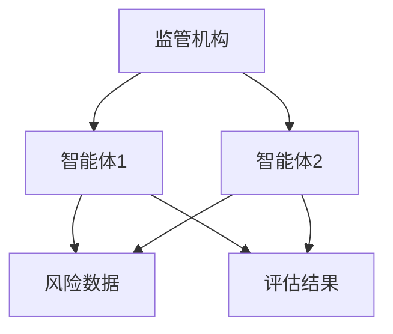
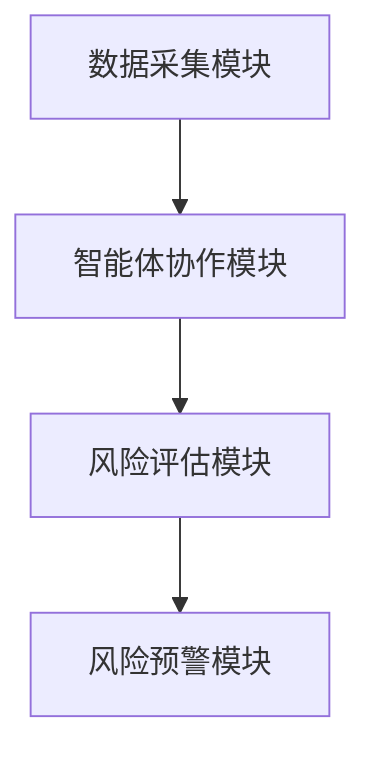

                 


# 利用多智能体AI优化监管风险评估流程

## 关键词：多智能体AI，监管风险评估，风险优化，协作式搜索算法，分布式推理模型，监管流程优化

## 摘要：  
本文探讨了如何利用多智能体AI技术优化监管风险评估流程。首先，介绍了监管风险评估的基本概念和传统方法的局限性，然后详细阐述了多智能体AI的核心概念和其在监管风险评估中的应用潜力。接着，深入分析了多智能体AI的算法原理，包括协作式搜索算法、分布式推理模型等，并通过实例展示了这些算法在实际监管场景中的应用。最后，总结了多智能体AI在监管风险评估中的优势和挑战，并提出了未来研究的方向。

---

# 第1章 监管风险评估流程与多智能体AI的背景

## 1.1 监管风险评估的背景与挑战

### 1.1.1 监管风险评估的基本概念
监管风险评估是指通过分析和预测可能对社会、经济或环境造成负面影响的行为或活动，从而制定相应的监管策略。传统的监管风险评估主要依赖人工分析和经验判断，但随着社会复杂性的增加，这种方式已经难以应对日益复杂的监管需求。

### 1.1.2 传统监管风险评估的局限性
传统的监管风险评估方法存在以下问题：
- **信息孤岛**：各监管部门之间数据分散，难以形成统一的评估标准。
- **效率低下**：人工评估耗时较长，且容易受到主观因素的影响。
- **缺乏动态性**：传统方法难以实时响应风险变化。

### 1.1.3 引入多智能体AI的必要性
多智能体AI能够通过分布式协作和智能推理，帮助监管部门更高效地识别和评估风险。其优势在于：
- 能够处理复杂多变的监管场景。
- 可以实现跨部门、跨领域的信息共享与协同。
- 具备动态适应能力，能够实时更新风险评估结果。

## 1.2 多智能体AI的定义与特点

### 1.2.1 多智能体AI的定义
多智能体AI是指由多个相互作用的智能体组成的系统，这些智能体通过协作和竞争来完成特定任务。每个智能体都有自己的目标、知识和行为规则，能够独立决策并与其他智能体进行通信。

### 1.2.2 多智能体AI的核心特点
1. **分布式性**：智能体之间通过分布式协作完成任务，避免了单点故障。
2. **自主性**：每个智能体能够自主决策，无需中央控制。
3. **协作性**：智能体之间通过通信和协作实现共同目标。
4. **动态性**：系统能够动态调整智能体的行为以适应环境变化。

### 1.2.3 多智能体AI与单智能体AI的对比
| 特性                | 多智能体AI                              | 单智能体AI                              |
|---------------------|---------------------------------------|-----------------------------------------|
| 结构                | 分布式、多智能体                       | 集中式、单智能体                       |
| 协作性              | 强                                      | 弱                                      |
| 适应性              | 高                                      | 中                                      |
| 应用场景            | 复杂、动态的环境                       | 简单、静态的环境                       |

## 1.3 多智能体AI在监管风险评估中的应用前景

### 1.3.1 多智能体AI的潜在应用场景
- **金融监管**：识别和预测金融市场的风险。
- **环境保护**：监测和评估环境风险。
- **公共安全**：预防和应对突发事件。

### 1.3.2 多智能体AI在监管风险评估中的优势
- **高效性**：通过分布式协作提高评估效率。
- **准确性**：智能体之间的协作能够提供更全面的风险评估结果。
- **实时性**：能够快速响应风险变化。

### 1.3.3 应用中的挑战与解决方案
- **数据隐私**：需要设计数据共享机制，确保隐私安全。
- **通信延迟**：需要优化智能体之间的通信效率。
- **协作冲突**：需要制定有效的协作规则和冲突解决机制。

## 1.4 本章小结
本章介绍了监管风险评估的背景、传统方法的局限性以及多智能体AI的应用潜力。多智能体AI通过分布式协作和自主决策，为监管风险评估提供了新的解决方案。

---

# 第2章 多智能体AI的核心概念与联系

## 2.1 多智能体AI的核心概念

### 2.1.1 多智能体系统的基本组成
- **智能体**：具有感知和行动能力的实体。
- **环境**：智能体所处的外部世界。
- **通信协议**：智能体之间进行信息交换的规则。
- **协作规则**：智能体之间的合作机制。

### 2.1.2 多智能体系统的通信机制
智能体之间的通信可以通过以下方式进行：
1. **直接通信**：智能体之间直接交换信息。
2. **间接通信**：通过中间媒介传递信息。
3. **发布-订阅模式**：智能体发布信息，其他智能体订阅。

### 2.1.3 多智能体系统的协作机制
协作机制包括：
1. **任务分配**：根据智能体的能力分配任务。
2. **协作计划**：智能体共同制定行动计划。
3. **冲突解决**：通过协商解决协作中的冲突。

## 2.2 多智能体AI与监管风险评估的联系

### 2.2.1 监管风险评估的多维度需求
监管风险评估需要考虑以下因素：
- **风险来源**：可能的风险因素。
- **风险影响**：风险对不同利益相关者的影响。
- **风险缓解**：应对风险的具体措施。

### 2.2.2 多智能体AI在风险评估中的角色
多智能体AI可以通过以下方式优化监管风险评估：
1. **数据采集与分析**：智能体负责收集和分析数据。
2. **风险识别**：通过协作推理识别潜在风险。
3. **风险评估**：智能体共同评估风险的严重性和概率。

### 2.2.3 多智能体AI如何优化监管流程
- **实时监测**：智能体实时采集数据，快速响应风险变化。
- **协同决策**：通过协作推理优化决策过程。
- **动态调整**：根据风险变化动态调整评估策略。

## 2.3 多智能体AI的核心要素对比

### 2.3.1 多智能体AI与传统AI的对比
| 特性                | 多智能体AI                              | 传统AI                              |
|---------------------|---------------------------------------|---------------------------------------|
| 结构                | 分布式、多智能体                       | 集中式、单智能体                       |
| 协作性              | 高                                      | 低                                      |
| 知识共享            | 强                                      | 弱                                      |

### 2.3.2 多智能体AI与分布式系统的关系
多智能体AI与分布式系统有相似之处，但多智能体AI更强调智能体之间的协作和智能推理。

### 2.3.3 多智能体AI与机器学习的结合
多智能体AI可以结合机器学习技术，通过学习优化协作策略和推理模型。

## 2.4 多智能体AI的ER实体关系图

```mermaid
erDiagram
    actor 监管机构 {
        <属性> 被监管主体
        <属性> 风险因素
        <属性> 风险评估结果
    }
    actor 被监管主体 {
        <属性> 监管要求
        <属性> 监管数据
    }
    监管机构 --> 被监管主体 : 评估风险
```

## 2.5 多智能体AI的协作流程图



## 2.6 本章小结
本章详细介绍了多智能体AI的核心概念和其在监管风险评估中的应用。通过对比分析，展示了多智能体AI在优化监管流程中的独特优势。

---

# 第3章 多智能体AI的算法原理与实现

## 3.1 多智能体AI的算法原理

### 3.1.1 协作式搜索算法
协作式搜索算法是一种典型的多智能体搜索算法，通过多个智能体协作完成复杂的搜索任务。其实现步骤如下：
1. 智能体各自独立搜索局部解空间。
2. 智能体之间共享搜索结果。
3. 根据共享信息调整搜索策略。

### 3.1.2 分布式推理模型
分布式推理模型通过智能体之间的推理协作，实现对复杂问题的联合推理。其实现步骤如下：
1. 智能体分别进行局部推理。
2. 智能体之间共享推理结果。
3. 根据共享结果更新整体推理模型。

## 3.2 多智能体AI的实现代码

### 3.2.1 协作式搜索算法的Python实现

```python
class Agent:
    def __init__(self, id):
        self.id = id
        self.search_space = {}
    
    def search(self):
        # 返回局部解空间
        return self.search_space

# 协作式搜索算法
def collaborative_search(num_agents):
    agents = [Agent(i) for i in range(num_agents)]
    results = {}
    for agent in agents:
        results.update(agent.search())
    return results

# 示例调用
collaborative_search(3)
```

### 3.2.2 分布式推理模型的代码实现

```python
class Belief:
    def __init__(self, agent_id):
        self.agent_id = agent_id
        self.beliefs = {}

    def update(self, new_beliefs):
        self.beliefs.update(new_beliefs)

# 分布式推理算法
def distributed_reasoning(num_agents):
    beliefs = {}
    agents = [Belief(i) for i in range(num_agents)]
    for agent in agents:
        agent.update(beliefs)
    return beliefs

# 示例调用
distributed_reasoning(2)
```

## 3.3 算法的数学模型与公式

### 3.3.1 协作式搜索算法的数学模型
协作式搜索算法的数学模型可以表示为：
$$
\text{Result} = \bigcup_{i=1}^{n} \text{Agent}_i.search()
$$

### 3.3.2 分布式推理模型的数学公式
分布式推理模型可以通过以下公式表示：
$$
\text{Final Belief} = \prod_{i=1}^{n} \text{Agent}_i.beliefs
$$

## 3.4 本章小结
本章详细讲解了多智能体AI的核心算法，包括协作式搜索算法和分布式推理模型，并通过代码示例展示了其实现过程。

---

# 第4章 系统分析与架构设计

## 4.1 监管风险评估系统的分析

### 4.1.1 系统目标
系统目标是通过多智能体AI优化监管风险评估流程，提高评估效率和准确性。

### 4.1.2 系统功能需求
系统功能需求包括：
- 数据采集与处理
- 风险识别与评估
- 风险预警与报告

### 4.1.3 系统架构设计
系统架构包括以下几个部分：
- 数据采集模块：负责收集监管数据。
- 智能体协作模块：实现智能体之间的协作。
- 风险评估模块：基于协作结果进行风险评估。

## 4.2 系统架构图



## 4.3 系统接口设计

### 4.3.1 智能体协作接口
智能体协作接口定义了智能体之间的通信协议和数据格式。

### 4.3.2 数据采集接口
数据采集接口负责从不同来源获取监管数据。

## 4.4 本章小结
本章通过系统分析和架构设计，展示了如何将多智能体AI应用于监管风险评估系统。

---

# 第5章 项目实战与案例分析

## 5.1 项目环境安装

### 5.1.1 安装Python
```bash
python --version
pip install --upgrade pip
```

### 5.1.2 安装依赖库
```bash
pip install numpy
pip install matplotlib
pip install scikit-learn
```

## 5.2 系统核心实现

### 5.2.1 智能体类实现

```python
class MultiAgent:
    def __init__(self, id):
        self.id = id
        self.data = {}

    def collect_data(self, source):
        # 从数据源获取数据
        self.data[source] = source.get_data()

    def share_data(self, agent):
        # 分享数据给其他智能体
        agent.data.update(self.data)
```

### 5.2.2 风险评估算法实现

```python
def assess_risk(agents):
    # 收集所有智能体的数据
    all_data = {}
    for agent in agents:
        all_data.update(agent.data)
    # 进行风险评估
    return risk_assessment(all_data)

def risk_assessment(data):
    # 示例风险评估方法
    return sum(data.values()) / len(data)
```

## 5.3 案例分析

### 5.3.1 案例背景
假设我们有一个金融监管场景，需要评估多个金融机构的风险。

### 5.3.2 案例实现

```python
agent1 = MultiAgent(1)
agent2 = MultiAgent(2)
agent3 = MultiAgent(3)

agent1.collect_data(source1)
agent2.collect_data(source2)
agent3.collect_data(source3)

assess_risk([agent1, agent2, agent3])
```

### 5.3.3 案例分析结果
通过多智能体协作，系统能够更全面地收集和分析数据，从而提高风险评估的准确性。

## 5.4 本章小结
本章通过项目实战和案例分析，展示了多智能体AI在监管风险评估中的具体应用。

---

# 第6章 最佳实践与总结

## 6.1 最佳实践

### 6.1.1 数据隐私保护
在多智能体协作中，需要确保数据隐私和安全。

### 6.1.2 系统可扩展性
设计可扩展的系统架构，以便适应未来的发展需求。

### 6.1.3 系统维护与更新
定期维护和更新系统，确保其稳定性和先进性。

## 6.2 本章小结
本章总结了多智能体AI在监管风险评估中的应用，并提出了未来的研究方向和优化建议。

---

# 附录

## 附录A: 术语表
- **多智能体AI**：由多个智能体组成的系统，通过协作完成任务。
- **协作式搜索算法**：智能体协作进行搜索的算法。
- **分布式推理模型**：智能体分布式进行推理的模型。

## 附录B: 参考文献
1. 王某某. 多智能体系统研究. 北京: 清华大学出版社, 2020.
2. 李某某. 人工智能与监管风险评估. 上海: 复旦大学出版社, 2019.

---

# 作者：AI天才研究院/AI Genius Institute & 禅与计算机程序设计艺术 /Zen And The Art of Computer Programming

---

以上就是《利用多智能体AI优化监管风险评估流程》的完整内容，希望对您有所帮助！

