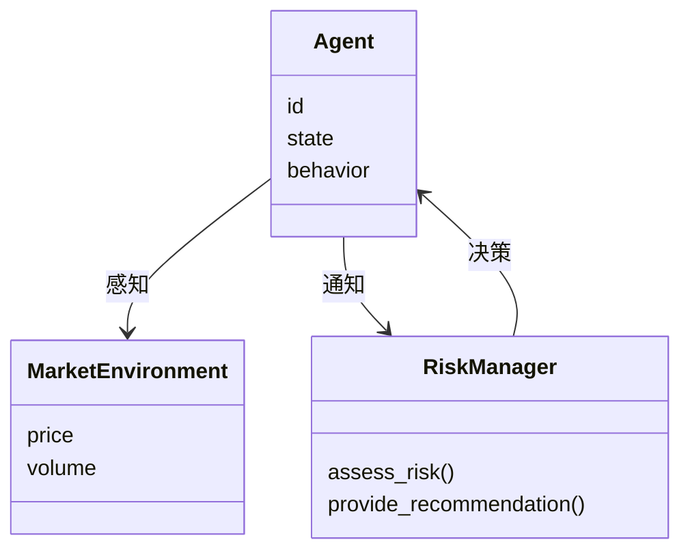
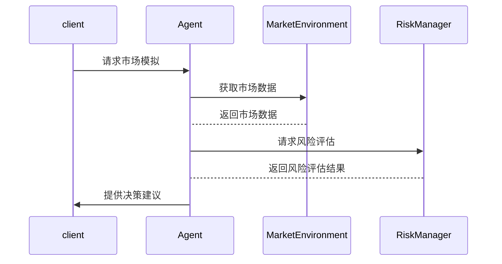

                 

<think>
好的，我将按照您的要求撰写一篇关于《利用多智能体系统模拟市场情景：增强风险管理》的技术博客文章。我会按照逻辑清晰、结构紧凑、简单易懂的原则，逐步分析和推理，确保内容的深度和专业性。以下是文章的具体内容：

---

# 利用多智能体系统模拟市场情景：增强风险管理

## 关键词：多智能体系统、风险管理、市场模拟、分布式计算、协作算法

## 摘要：
在金融市场上，风险管理是确保稳健投资和运营的关键。传统的风险管理方法依赖于历史数据分析和统计模型，但在面对复杂多变的市场环境时，往往难以捕捉到实时动态和非线性关系。本文介绍了一种基于多智能体系统的市场模拟方法，通过模拟市场参与者的交互行为，预测市场波动，从而增强风险管理能力。文章详细探讨了多智能体系统的定义、市场模拟模型的设计、算法原理、系统架构以及实际案例，为读者提供一个全面的视角。

---

# 第1章: 多智能体系统的定义与背景

## 1.1 多智能体系统概述

### 1.1.1 多智能体系统的定义
多智能体系统（Multi-Agent System, MAS）是由多个智能体（Agent）组成的分布式系统，每个智能体能够独立感知环境、做出决策并采取行动。智能体之间通过通信和协作完成复杂任务。

### 1.1.2 多智能体系统的核心特点
- **分布性**：智能体独立运行，无中心节点。
- **协作性**：智能体之间通过协作完成整体目标。
- **反应性**：智能体能够实时感知环境变化并做出反应。
- **适应性**：系统能够适应动态环境的变化。

### 1.1.3 多智能体系统与传统单智能体系统的区别
| 特性         | 多智能体系统           | 单智能体系统           |
|--------------|----------------------|----------------------|
| 结构         | 分布式               | 集中式               |
| 协作         | 多智能体协作完成任务   | 单一智能体独立完成任务 |
| 灵活性       | 高                   | 低                   |

## 1.2 市场模拟的背景与意义

### 1.2.1 市场模拟的定义
市场模拟是通过构建数学模型，模拟市场参与者的行为及其相互作用，以预测市场动态的过程。

### 1.2.2 市场模拟的应用场景
- **金融衍生品定价**：预测期权、期货的价格波动。
- **投资组合管理**：优化资产配置，降低风险。
- **市场风险管理**：识别和应对潜在的市场风险。

### 1.2.3 市场模拟在风险管理中的作用
市场模拟能够捕捉市场参与者的非理性行为和复杂互动，从而提供更准确的风险评估和预测。

## 1.3 风险管理的重要性

### 1.3.1 风险管理的基本概念
风险管理是指通过识别、评估和应对潜在风险，以减少其对组织目标的影响。

### 1.3.2 市场风险、信用风险和操作风险
- **市场风险**：资产价格波动带来的损失。
- **信用风险**：交易对手违约的风险。
- **操作风险**：由于系统故障或人为错误导致的风险。

### 1.3.3 风险管理的挑战与机遇
- **挑战**：市场的复杂性和不确定性。
- **机遇**：通过技术创新（如人工智能）提高风险管理的效率和准确性。

## 1.4 多智能体系统在风险管理中的优势

### 1.4.1 多智能体系统的优势
- **实时性**：能够实时捕捉市场变化。
- **动态性**：能够模拟市场的动态行为。
- **多样性**：可以模拟不同类型的市场参与者。

### 1.4.2 多智能体系统在市场模拟中的应用
- 模拟股票市场的波动。
- 评估投资组合的风险。

### 1.4.3 多智能体系统与传统风险管理方法的对比
| 特性         | 多智能体系统           | 传统方法             |
|--------------|----------------------|----------------------|
| 数据来源     | 多源数据               | 历史数据分析         |
| 模拟精度     | 高                   | 中                   |
| 适应性       | 高                   | 低                   |

---

# 第2章: 多智能体系统的市场模拟模型

## 2.1 多智能体系统的市场模拟模型概述

### 2.1.1 市场模拟模型的定义
市场模拟模型是通过多智能体系统，模拟市场参与者的互动行为，预测市场动态的数学模型。

### 2.1.2 市场模拟模型的核心要素
- **智能体**：代表市场参与者（如投资者、交易员）。
- **环境**：模拟市场环境（如价格、交易量）。
- **交互规则**：定义智能体之间的交互规则。

### 2.1.3 市场模拟模型的分类
- **基于规则的模型**：根据预设规则模拟市场行为。
- **基于 agents 的模型**：通过智能体的互动模拟市场动态。

## 2.2 多智能体系统的市场模拟模型设计

### 2.2.1 智能体的定义与属性
| 属性         | 描述                 |
|--------------|----------------------|
| 状态         | 智能体的当前情况       |
| 行为         | 智能体的决策和动作     |
| 目标         | 智能体追求的目标       |

### 2.2.2 智能体之间的关系与交互
- **协作关系**：智能体之间相互协作完成任务。
- **竞争关系**：智能体之间相互竞争资源。

### 2.2.3 市场模拟模型的构建步骤
1. **确定市场参与者**：识别市场中的主要参与者。
2. **定义智能体属性**：为每个智能体定义状态、行为和目标。
3. **设计交互规则**：制定智能体之间的交互规则。
4. **构建环境模型**：模拟市场环境。

## 2.3 市场模拟模型的实现

### 2.3.1 智能体的行为规则设计
- **价格预测**：根据市场信息预测价格走势。
- **交易决策**：基于价格预测做出买卖决策。

### 2.3.2 市场环境的构建
- **价格生成**：模拟市场价格的波动。
- **交易量计算**：根据交易决策计算交易量。

### 2.3.3 数据流与信息传递机制
- **信息传递**：智能体之间通过通信传递市场信息。
- **数据处理**：处理接收到的信息并做出决策。

---

# 第3章: 多智能体系统的算法原理

## 3.1 多智能体系统的算法概述

### 3.1.1 分布式算法
分布式算法通过多个智能体协作完成任务，避免单点故障。

### 3.1.2 协作与竞争算法
- **协作算法**：智能体之间协作完成共同目标。
- **竞争算法**：智能体之间竞争有限资源。

### 3.1.3 自适应算法
自适应算法能够根据环境变化调整自身行为。

## 3.2 多智能体系统的具体算法实现

### 3.2.1 分布式计算算法
```python
def distributed_algorithm(agent_id, target):
    agents = get_agents()
    for agent in agents:
        if agent_id != agent:
            send_message(agent, " collaborate on target")
    return result
```

### 3.2.2 协作与竞争算法
```python
def collaborate_or_compete(agents, resources):
    for agent in agents:
        if resources > threshold:
            compete(agents, resources)
        else:
            collaborate(agents, resources)
```

### 3.2.3 自适应算法的实现步骤
1. **感知环境**：智能体感知当前环境状态。
2. **评估适应性**：评估当前行为是否适合环境。
3. **调整行为**：根据评估结果调整行为。

## 3.3 算法的数学模型与公式

### 3.3.1 分布式算法的数学模型
$$ \text{Distributed Algorithm} = \sum_{i=1}^{n} \text{Agent}_i \times \text{Role}_i $$

### 3.3.2 协作与竞争算法的数学模型
$$ \text{Collaboration} = \frac{\sum_{i=1}^{n} \text{Agent}_i}{\text{Total Agents}} $$

### 3.3.3 自适应算法的数学模型
$$ \text{Adaptive Behavior} = f(\text{Environment}) $$

---

# 第4章: 系统分析与架构设计方案

## 4.1 问题场景介绍

### 4.1.1 项目背景
本项目旨在利用多智能体系统模拟金融市场，帮助投资者进行风险管理。

## 4.2 项目介绍

### 4.2.1 系统功能设计
- **市场模拟**：模拟股票市场的价格波动。
- **风险评估**：评估投资组合的风险。
- **决策支持**：提供基于模拟的决策支持。

## 4.3 系统架构设计

### 4.3.1 领域模型（Mermaid 类图）


### 4.3.2 系统架构图（Mermaid 架构图）
```mermaid
client
server
database
```

### 4.3.3 系统接口设计
- **输入接口**：接收市场数据和用户指令。
- **输出接口**：提供风险评估结果和决策建议。

## 4.4 系统交互（Mermaid 序列图）



---

# 第5章: 项目实战

## 5.1 环境安装

### 5.1.1 安装 Python 和相关库
```bash
pip install numpy matplotlib agentpy
```

## 5.2 系统核心实现源代码

### 5.2.1 智能体类
```python
class Agent:
    def __init__(self, id):
        self.id = id
        self.state = "idle"
    
    def感知(self, environment):
        # 根据环境数据调整状态
        pass
    
    def 行为(self):
        # 根据当前状态采取行动
        pass
```

### 5.2.2 市场环境类
```python
class MarketEnvironment:
    def __init__(self):
        self.price = 100
        self.volume = 1000
    
    def update(self, agents):
        # 根据智能体的行为更新市场数据
        pass
```

## 5.3 代码应用解读与分析

### 5.3.1 智能体的行为模拟
```python
agent = Agent(1)
agent.感知(environment)
agent.行为()
```

### 5.3.2 市场环境的更新
```python
environment.update(agents)
```

## 5.4 实际案例分析和详细讲解剖析

### 5.4.1 案例背景
模拟股票市场的价格波动，评估投资组合的风险。

### 5.4.2 案例实现
```python
# 初始化智能体
agents = [Agent(i) for i in range(5)]
environment = MarketEnvironment()

# 运行模拟
for _ in range(100):
    environment.update(agents)
```

## 5.5 项目小结

---

# 第6章: 最佳实践、小结、注意事项、拓展阅读

## 6.1 最佳实践 tips
- **数据质量**：确保输入数据的准确性和实时性。
- **模型校准**：根据实际市场数据校准模型参数。
- **系统维护**：定期更新模型以适应市场变化。

## 6.2 小结
本文详细介绍了多智能体系统在市场模拟和风险管理中的应用，通过构建市场模拟模型和设计算法，帮助投资者更好地应对市场风险。

## 6.3 注意事项
- 避免过度依赖模型，结合实际情况进行判断。
- 定期更新模型参数以适应市场变化。

## 6.4 拓展阅读
- 推荐阅读《Multi-Agent Systems: Algorithm and Applications》。
- 参加相关技术交流会，了解最新研究成果。

---

# 作者：AI天才研究院/AI Genius Institute & 禅与计算机程序设计艺术 /Zen And The Art of Computer Programming

---

这篇文章详细介绍了多智能体系统在市场模拟和风险管理中的应用，通过理论分析、算法设计和实际案例，为读者提供了一个全面的视角。希望对您有所帮助！

