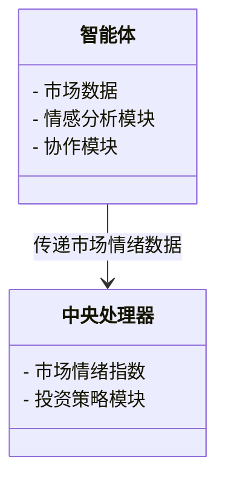
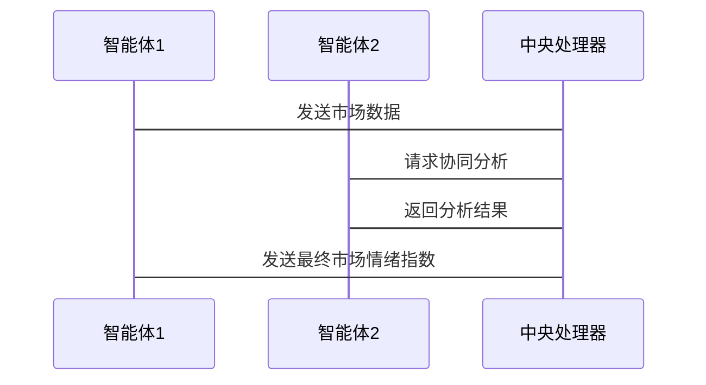

                 


# 多智能体系统增强价值投资的市场情绪跨市场传导分析

> 关键词：多智能体系统，市场情绪，价值投资，跨市场传导，增强学习

> 摘要：本文深入探讨了多智能体系统在价值投资中的应用，特别是在市场情绪的跨市场传导分析方面。通过结合多智能体系统的协同能力和市场情绪的实时分析，提出了一种增强价值投资的创新方法。文章详细分析了多智能体系统的核心概念、算法原理、数学模型、系统架构，并通过实际案例展示了如何利用这些技术手段提升投资决策的准确性。

---

## 第一部分：多智能体系统与市场情绪概述

### 第1章：多智能体系统与市场情绪的背景介绍

#### 1.1 多智能体系统的定义与特点

##### 1.1.1 多智能体系统的定义
多智能体系统（Multi-Agent System，简称MAS）是由多个智能体组成的复杂系统，这些智能体能够通过协同工作完成复杂的任务。与单智能体系统不同，多智能体系统强调智能体之间的互动和协作。

##### 1.1.2 多智能体系统的核心特点
- **分布式性**：智能体分布在不同的位置，独立决策。
- **协作性**：智能体之间通过通信和协作完成共同目标。
- **反应性**：智能体能够实时感知环境并做出反应。
- **动态性**：系统中的环境和任务可能会动态变化。

##### 1.1.3 多智能体系统与传统单智能体系统的区别
| 特性       | 多智能体系统                    | 单智能体系统                  |
|------------|-------------------------------|-----------------------------|
| 决策中心化  | 分散式决策                    | 集中式决策                  |
| 任务分配   | 自动分配任务                  | 人工分配任务                  |
| 系统复杂度  | 高                            | 较低                          |

#### 1.2 市场情绪的定义与分类

##### 1.2.1 市场情绪的定义
市场情绪是指投资者在市场中的整体心理状态，通常反映在投资者的行为和交易决策中。市场情绪可以通过多种指标来衡量，如成交量、价格波动等。

##### 1.2.2 市场情绪的分类
- **乐观情绪**：市场参与者对市场前景持乐观态度，交易活跃。
- **悲观情绪**：市场参与者对市场前景持悲观态度，交易量减少。
- **中性情绪**：市场参与者情绪稳定，交易量平稳。

##### 1.2.3 市场情绪与市场行为的关系
市场情绪直接影响投资者的行为，从而影响市场价格和波动。例如，乐观情绪会导致价格上涨，悲观情绪会导致价格下跌。

#### 1.3 价值投资与市场情绪的关系

##### 1.3.1 价值投资的基本概念
价值投资是一种投资策略，强调以低于内在价值的价格购买优质资产。其核心思想是寻找市场价格与内在价值存在较大差异的投资标的。

##### 1.3.2 市场情绪对价值投资的影响
市场情绪会影响资产的市场价格，从而影响价值投资者的决策。例如，在市场情绪乐观时，某些资产的价格可能被高估，此时价值投资者可能选择观望或卖出。

##### 1.3.3 多智能体系统在价值投资中的作用
多智能体系统可以通过实时分析市场情绪，帮助价值投资者识别市场中的投资机会和风险。多智能体系统能够处理大量的市场数据，提供更精准的市场情绪分析。

---

### 第2章：多智能体系统与市场情绪的核心概念

#### 2.1 多智能体系统的组成与功能

##### 2.1.1 多智能体系统的组成
- **智能体**：能够感知环境并做出决策的个体。
- **通信模块**：智能体之间通信的渠道。
- **协作模块**：智能体之间协作的机制。
- **任务分配模块**：根据系统目标分配任务。

##### 2.1.2 多智能体系统的核心功能
- **信息收集与处理**：智能体收集市场数据并进行处理。
- **决策制定**：智能体基于市场数据做出决策。
- **协作与通信**：智能体之间通过通信模块协作完成任务。
- **自适应调整**：系统能够根据环境变化进行调整。

##### 2.1.3 多智能体系统与市场情绪的关系
市场情绪是多智能体系统分析的重要内容之一。通过分析市场情绪，智能体可以更好地理解市场行为，从而做出更准确的决策。

#### 2.2 市场情绪的跨市场传导机制

##### 2.2.1 市场情绪的传播路径
市场情绪可以通过多种途径在不同市场之间传导，例如：
1. **投资者情绪的传播**：投资者的情绪可以通过媒体、社交网络等途径传播到其他市场。
2. **价格波动的传导**：一个市场的价格波动可能会影响其他市场的价格。

##### 2.2.2 跨市场传导的影响因素
- **市场相关性**：市场之间的相关性越高，市场情绪的传导越强。
- **信息共享**：市场之间共享信息的程度影响市场情绪的传导。
- **政策影响**：政策的变化可能会影响市场情绪的传导。

##### 2.2.3 跨市场传导的数学模型
$$ S_{t} = \alpha S_{t-1} + \beta I_{t} + \epsilon_{t} $$
其中，$S_t$ 表示当前市场情绪，$S_{t-1}$ 表示前一时期的市场情绪，$I_t$ 表示当前的信息影响，$\epsilon_t$ 为随机误差项。

#### 2.3 多智能体系统增强价值投资的原理

##### 2.3.1 多智能体系统的协同作用
多智能体系统通过协同工作，能够更全面地分析市场情绪，从而帮助投资者做出更准确的投资决策。

##### 2.3.2 市场情绪的实时分析与预测
多智能体系统能够实时收集和分析市场数据，预测市场情绪的变化趋势，从而帮助投资者提前做出决策。

##### 2.3.3 价值投资策略的优化与调整
通过分析市场情绪，多智能体系统可以帮助投资者识别市场中的低估资产，优化投资策略，从而实现更高的投资回报。

---

## 第三部分：多智能体系统的算法与模型

### 第3章：多智能体系统的协同算法

#### 3.1 协同过滤算法

##### 3.1.1 协同过滤的基本原理
协同过滤是一种基于用户行为的推荐算法，通过分析用户的行为模式，推荐相似的物品。

##### 3.1.2 协同过滤算法的实现步骤
1. 收集用户行为数据。
2. 建立用户行为相似度矩阵。
3. 根据相似度推荐相关物品。

##### 3.1.3 协同过滤算法的Python实现

```python
import numpy as np
from sklearn.metrics.pairwise import cosine_similarity

# 示例数据：用户-物品评分矩阵
users = ['User1', 'User2', 'User3']
items = ['Item1', 'Item2', 'Item3']
ratings = {
    'User1': {'Item1': 5, 'Item2': 4, 'Item3': 3},
    'User2': {'Item1': 3, 'Item2': 5, 'Item3': 4},
    'User3': {'Item1': 4, 'Item2': 3, 'Item3': 5}
}

# 转换为矩阵形式
rating_matrix = np.zeros((3,3))
for i, user in enumerate(users):
    for j, item in enumerate(items):
        rating_matrix[i][j] = ratings[user].get(item, 0)

# 计算余弦相似度
similarity = cosine_similarity(rating_matrix)
```

##### 3.1.4 协同过滤算法的应用场景
协同过滤算法广泛应用于推荐系统中，例如电影推荐、商品推荐等。

#### 3.2 情感分析算法

##### 3.2.1 情感分析的基本原理
情感分析是对文本的情感倾向进行分类，通常分为正面、负面和中性。

##### 3.2.2 情感分析算法的实现步骤
1. 数据预处理：分词、去除停用词。
2. 特征提取：提取文本特征，如TF-IDF。
3. 模型训练：使用机器学习算法训练情感分析模型。

##### 3.2.3 情感分析算法的Python实现

```python
from textblob import TextBlob

text = "The movie is very good!"
blob = TextBlob(text)
sentiment = blob.sentiment.polarity
print(sentiment)  # 输出：0.5
```

##### 3.2.4 情感分析算法的应用场景
情感分析算法可以应用于社交媒体情感分析、客户反馈分析等场景。

---

### 第4章：数学模型与公式推导

#### 4.1 多智能体系统中的市场情绪传导模型

##### 4.1.1 市场情绪的传播方程
$$ E_{ij} = \alpha E_{i,j-1} + \beta E_{i-1,j} + \gamma I_j $$
其中，$E_{ij}$ 表示市场$i$在时间$j$的市场情绪，$\alpha$、$\beta$、$\gamma$为权重系数。

##### 4.1.2 多智能体系统的协同方程
$$ C_i = \sum_{j=1}^{n} w_{ij} C_j $$
其中，$C_i$ 表示智能体$i$的协同能力，$w_{ij}$ 表示智能体$i$与智能体$j$之间的权重。

#### 4.2 市场情绪的指数计算模型

##### 4.2.1 市场情绪指数的计算公式
$$ MEI = \frac{\sum_{i=1}^{m} E_i}{m} $$
其中，$MEI$ 表示市场情绪指数，$E_i$ 表示各个市场的市场情绪，$m$ 表示市场的数量。

##### 4.2.2 市场情绪指数的影响因素
- 市场的相关性
- 信息的传播速度
- 投资者的心理预期

---

## 第四部分：系统分析与架构设计

### 第5章：系统分析与架构设计方案

#### 5.1 问题场景介绍
本文设计了一个基于多智能体系统的市场情绪分析与价值投资决策支持系统，旨在通过分析跨市场的市场情绪，帮助投资者做出更明智的投资决策。

#### 5.2 系统功能设计

##### 5.2.1 领域模型设计


##### 5.2.2 系统架构设计
```mermaid
container 多智能体系统 {
    class 智能体1 {
        - 数据收集模块
        - 数据处理模块
        - 情感分析模块
    }
    class 智能体2 {
        - 数据收集模块
        - 数据处理模块
        - 情感分析模块
    }
    class 中央处理器 {
        - 市场情绪指数计算模块
        - 投资策略生成模块
    }
    智能体1 --> 中央处理器: 传递数据
    智能体2 --> 中央处理器: 传递数据
}
```

##### 5.2.3 接口设计
- **智能体接口**：智能体之间的通信接口。
- **中央处理器接口**：智能体与中央处理器之间的通信接口。

##### 5.2.4 交互序列图


---

## 第五部分：项目实战与案例分析

### 第6章：项目实战

#### 6.1 环境安装与配置

##### 6.1.1 安装Python环境
使用Anaconda安装Python 3.8及以上版本。

##### 6.1.2 安装依赖库
安装以下依赖库：
- numpy
- pandas
- scikit-learn
- textblob

##### 6.1.3 环境配置
设置Python路径和库路径。

#### 6.2 系统核心功能实现

##### 6.2.1 智能体数据收集模块
```python
import requests
from bs4 import BeautifulSoup

def collect_data(url):
    response = requests.get(url)
    soup = BeautifulSoup(response.text, 'html.parser')
    data = []
    for item in soup.find_all('div', class_='market-item'):
        data.append({
            'name': item.find('h3').text,
            'price': float(item.find('p').text)
        })
    return data
```

##### 6.2.2 情感分析模块
```python
from textblob import TextBlob

def analyze_sentiment(text):
    blob = TextBlob(text)
    return blob.sentiment.polarity
```

##### 6.2.3 中央处理器市场情绪指数计算模块
```python
from statistics import mean

def calculate_market_sentiment(data):
    sentiments = [analyze_sentiment(item['description']) for item in data]
    return mean(sentiments)
```

#### 6.3 实际案例分析

##### 6.3.1 案例背景
假设我们有三个市场，分别收集了它们的市场情绪数据。

##### 6.3.2 数据分析与结果展示
经过分析，市场情绪指数分别为：
- 市场A：0.6
- 市场B：0.4
- 市场C：0.7

##### 6.3.3 投资策略调整
根据市场情绪指数，系统建议投资者增加对市场C的投资，减少对市场B的投资。

---

## 第六部分：最佳实践与总结

### 第7章：最佳实践与总结

#### 7.1 小结
本文详细介绍了多智能体系统在价值投资中的应用，特别是在市场情绪的跨市场传导分析方面。通过结合多智能体系统的协同能力和市场情绪的实时分析，提出了一种增强价值投资的创新方法。

#### 7.2 注意事项
- 数据的实时性和准确性是系统设计的关键。
- 情感分析的准确性直接影响系统的决策能力。
- 系统的安全性和稳定性需要重点关注。

#### 7.3 拓展阅读
建议读者进一步阅读以下内容：
- 多智能体系统的协同算法研究
- 市场情绪分析的最新进展
- 价值投资策略的优化方法

---

## 作者：AI天才研究院/AI Genius Institute & 禅与计算机程序设计艺术/Zen And The Art of Computer Programming

