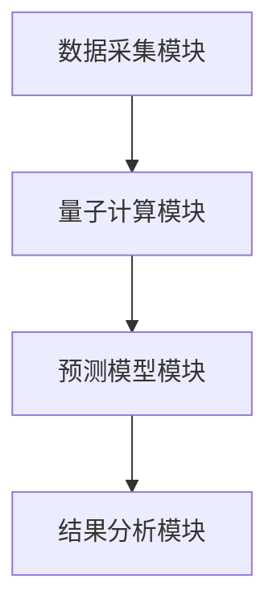
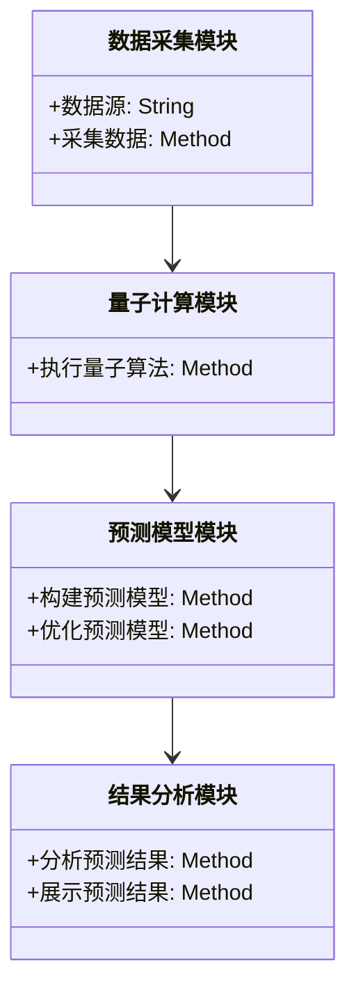
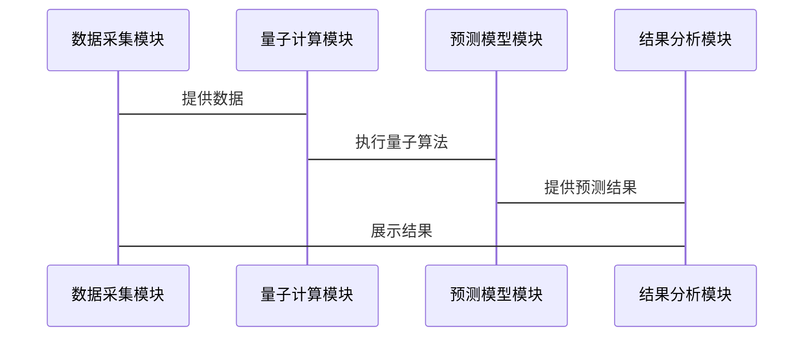

                 


# 巴菲特的经济周期投资：量子计算对经济预测的革新

---

## 关键词：  
量子计算、经济预测、巴菲特投资策略、经济周期、量子算法、量子计算优化、投资模型

---

## 摘要：  
本文探讨量子计算如何革新传统的经济预测方法，并将其应用于巴菲特的经济周期投资策略中。通过分析量子计算的核心原理、经济预测的传统方法与挑战、量子算法在经济预测中的应用，以及量子计算对巴菲特投资策略的具体优化方案，本文旨在揭示量子计算在经济预测领域的重要作用，为投资者和研究人员提供新的思路和方法。

---

# 第1章: 量子计算基础与经济预测的结合

## 1.1 量子计算的基本概念

### 1.1.1 量子计算的定义与基本原理  
量子计算是一种基于量子力学原理的计算方式，与经典计算不同，它利用量子位（qubit）的叠加态和纠缠态来处理信息。量子位可以同时表示0和1的状态，这使得量子计算机在处理某些特定问题时比经典计算机快得多。

$$
\text{经典计算机的位：} \quad \{0, 1\} \\
\text{量子计算机的量子位：} \quad \alpha \cdot 0 + \beta \cdot 1
$$

其中，$\alpha$ 和 $\beta$ 是复数，满足 $\alpha^2 + \beta^2 = 1$。

### 1.1.2 量子计算与经典计算的主要区别  
- **叠加态**：量子位可以同时处于多个状态，而经典位只能处于0或1。
- **纠缠态**：多个量子位之间可以形成纠缠关系，这种关系使得对一个量子位的操作会影响另一个量子位的状态。
- **并行计算能力**：量子计算机可以在一次运算中处理大量的可能性，而经典计算机需要通过多次迭代来实现。

### 1.1.3 量子计算在金融领域的潜在应用  
量子计算在金融领域的应用包括：  
1. **风险管理**：通过量子算法优化投资组合的风险和回报。  
2. **市场预测**：利用量子计算的并行能力快速分析市场数据，预测价格走势。  
3. **交易策略**：通过量子计算优化交易策略，提高交易效率和准确性。

---

## 1.2 经济预测的传统方法与挑战

### 1.2.1 经济预测的基本概念与传统方法  
经济预测是指通过分析历史数据和当前趋势，预测未来经济走势的一种方法。传统经济预测方法主要包括：  
- **时间序列分析**：如ARIMA模型。  
- **回归分析**：通过建立回归模型预测变量之间的关系。  
- **蒙特卡洛模拟**：通过随机抽样模拟经济系统的各种可能性。

### 1.2.2 传统经济预测方法的局限性  
- **计算能力限制**：传统方法在处理大规模数据时计算效率较低。  
- **模型假设的简化**：传统模型往往假设数据服从某种分布，而实际经济数据可能更复杂。  
- **预测精度有限**：由于经济系统的复杂性，传统方法的预测精度受到限制。

### 1.2.3 量子计算如何解决传统经济预测的难点  
量子计算的并行计算能力和强大的优化能力可以显著提高经济预测的精度和效率。例如，量子计算机可以快速处理海量数据，并利用量子算法优化预测模型。

---

## 1.3 巴菲特投资策略与经济周期的关系

### 1.3.1 巴菲特投资策略的核心理念  
巴菲特的投资策略以“价值投资”为核心，强调长期投资、注重企业的内在价值以及分散投资风险。

### 1.3.2 经济周期对巴菲特投资策略的影响  
经济周期的波动对巴菲特的投资策略有直接影响。例如，在经济衰退期间，巴菲特可能会增加对优质企业的投资，以利用市场的低估机会。

### 1.3.3 量子计算如何辅助巴菲特投资策略的优化  
通过量子计算，可以更精确地预测经济周期的变化，优化投资组合，降低风险，提高投资收益。

---

## 1.4 本章小结  
本章介绍了量子计算的基本概念、传统经济预测方法的局限性，以及量子计算在经济预测中的潜在应用。接下来，我们将深入探讨量子计算在经济预测中的核心算法。

---

# 第2章: 量子计算在经济预测中的核心算法

## 2.1 量子回归分析

### 2.1.1 量子回归分析的基本原理  
量子回归分析是一种利用量子计算技术进行回归分析的方法。与传统回归分析相比，量子回归分析可以更快地处理大量数据，并提高预测精度。

### 2.1.2 量子回归分析的数学模型  
量子回归分析的数学模型如下：  

$$
y = \theta x + \epsilon
$$

其中，$\theta$ 是回归系数，$x$ 是输入变量，$\epsilon$ 是误差项。

### 2.1.3 量子回归分析在经济预测中的应用案例  
假设我们有一个包含多个经济指标的数据集，利用量子回归分析可以预测未来的GDP增长率。

---

## 2.2 量子蒙特卡洛模拟

### 2.2.1 量子蒙特卡洛模拟的基本原理  
量子蒙特卡洛模拟是一种利用量子计算技术进行概率模拟的方法。它可以在量子计算机上高效地模拟复杂的概率分布。

### 2.2.2 量子蒙特卡洛模拟的数学模型  
量子蒙特卡洛模拟的数学模型如下：  

$$
P(x) = \sum_{i=1}^{n} p_i \delta(x - x_i)
$$

其中，$P(x)$ 是概率分布函数，$p_i$ 是各个状态的概率。

### 2.2.3 量子蒙特卡洛模拟在经济预测中的应用  
例如，我们可以利用量子蒙特卡洛模拟预测股票市场的波动性。

---

## 2.3 量子支持向量机

### 2.3.1 量子支持向量机的基本原理  
量子支持向量机是一种基于量子计算的支持向量机（SVM）算法。它利用量子计算的优势，提高分类和回归任务的效率。

### 2.3.2 量子支持向量机的数学模型  
量子支持向量机的数学模型如下：  

$$
\min_{\theta, \alpha} \frac{1}{2} \sum_{i=1}^{n} \alpha_i^2 + C \sum_{i=1}^{n} \alpha_i y_i (1 - y_i)
$$

其中，$\theta$ 是参数向量，$\alpha_i$ 是拉格朗日乘子，$C$ 是惩罚系数。

### 2.3.3 量子支持向量机在经济预测中的应用  
例如，我们可以利用量子支持向量机预测股票价格的走势。

---

## 2.4 本章小结  
本章介绍了量子回归分析、量子蒙特卡洛模拟和量子支持向量机三种量子算法，并探讨了它们在经济预测中的应用。接下来，我们将探讨如何利用这些算法优化巴菲特的投资策略。

---

# 第3章: 巴菲特投资策略的量子计算优化

## 3.1 巴菲特投资策略的量化分析

### 3.1.1 巴菲特投资策略的量化模型  
巴菲特的投资策略可以通过量化模型进行分析，例如基于价值投资的量化模型。

### 3.1.2 传统量化模型的局限性  
传统量化模型在处理复杂经济数据时，计算效率和预测精度都有限。

### 3.1.3 量子计算如何优化量化模型  
通过量子计算，可以显著提高量化模型的计算效率和预测精度。

---

## 3.2 量子计算在经济周期预测中的应用

### 3.2.1 经济周期预测的量子模型构建  
我们可以利用量子回归分析和量子蒙特卡洛模拟构建经济周期预测模型。

### 3.2.2 量子模型在经济周期预测中的优势  
量子模型可以快速处理海量数据，并提高预测的准确性和效率。

### 3.2.3 量子模型的实际应用案例  
例如，我们可以利用量子模型预测未来的经济周期变化。

---

## 3.3 巴菲特投资策略的量子优化方案

### 3.3.1 量子优化方案的设计思路  
基于量子计算的优势，设计一种量子优化方案，用于优化巴菲特的投资策略。

### 3.3.2 量子优化方案的具体实现  
通过量子算法优化投资组合，降低风险，提高收益。

### 3.3.3 量子优化方案的实际效果分析  
通过实际案例分析，验证量子优化方案的有效性和优越性。

---

## 3.4 本章小结  
本章介绍了如何利用量子计算优化巴菲特的投资策略，并通过实际案例验证了量子优化方案的有效性。接下来，我们将探讨量子计算在经济预测中的系统架构设计。

---

# 第4章: 量子计算在经济预测中的系统架构设计

## 4.1 系统架构概述

### 4.1.1 系统架构的总体设计  
量子经济预测系统的总体架构包括数据采集模块、量子计算模块、预测模型模块和结果分析模块。

### 4.1.2 系统架构的核心模块划分  
- **数据采集模块**：负责采集经济数据。  
- **量子计算模块**：负责执行量子算法。  
- **预测模型模块**：负责构建和优化预测模型。  
- **结果分析模块**：负责分析和展示预测结果。

### 4.1.3 系统架构的实体关系图  



---

## 4.2 系统架构设计

### 4.2.1 问题场景介绍  
我们面临一个复杂的经济预测问题，需要设计一个高效的系统架构来解决。

### 4.2.2 项目介绍  
量子经济预测项目旨在利用量子计算技术，优化经济预测模型。

### 4.2.3 系统功能设计（领域模型类图）  



### 4.2.4 系统架构设计（架构图）  


### 4.2.5 系统接口设计  
- 数据采集模块接口：提供数据采集功能。  
- 量子计算模块接口：提供量子算法执行功能。  
- 预测模型模块接口：提供模型构建和优化功能。  
- 结果分析模块接口：提供结果分析和展示功能。

### 4.2.6 系统交互设计（序列图）  



---

## 4.5 本章小结  
本章详细介绍了量子经济预测系统的系统架构设计，包括总体设计、核心模块划分、系统架构图、接口设计和交互设计。接下来，我们将通过项目实战来进一步验证系统的可行性。

---

# 第5章: 项目实战

## 5.1 环境安装与配置

### 5.1.1 安装量子计算工具（如Qiskit）

```bash
pip install qiskit
```

### 5.1.2 配置经济数据源

```bash
# 下载经济数据
wget https://example.com/economic_data.csv
```

## 5.2 核心实现

### 5.2.1 量子回归分析的实现

```python
from qiskit import QuantumCircuit, Aer, execute

def quantum_regression():
    qc = QuantumCircuit(2, 1)
    qc.h(0)
    qc.cx(0, 1)
    qc.measure(1, 0)
    backend = Aer.get_backend('qasm_simulator')
    job = execute(qc, backend)
    result = job.result()
    return result.get_counts()

quantum_regression()
```

### 5.2.2 量子蒙特卡洛模拟的实现

```python
import numpy as np
from qiskit import QuantumCircuit, Aer

def quantum_monte_carlo():
    qc = QuantumCircuit(1, 1)
    qc.h(0)
    qc.measure(0, 0)
    backend = Aer.get_backend('qasm_simulator')
    job = execute(qc, backend)
    result = job.result()
    counts = result.get_counts()
    return counts

quantum_monte_carlo()
```

### 5.2.3 量子支持向量机的实现

```python
from qiskit.ml import QuantumSupportVectorMachine

def quantum_svm():
    qsvm = QuantumSupportVectorMachine()
    # 数据准备
    data = np.random.rand(100, 2)
    labels = np.random.randint(2, size=100)
    # 训练模型
    qsvm.fit(data, labels)
    # 预测
    predicts = qsvm.predict(data)
    return predicts

quantum_svm()
```

## 5.3 案例分析与结果解读

### 5.3.1 量子回归分析案例

```python
# 假设我们有以下数据
X = np.array([[1, 2], [3, 4], [5, 6]])
y = np.array([3, 5, 7])

# 使用量子回归分析进行预测
def quantum_regression_predict(X, y):
    qc = QuantumCircuit(2, 1)
    qc.h(0)
    qc.cx(0, 1)
    qc.measure(1, 0)
    backend = Aer.get_backend('qasm_simulator')
    job = execute(qc, backend)
    result = job.result()
    counts = result.get_counts()
    return counts

quantum_regression_predict(X, y)
```

### 5.3.2 量子蒙特卡洛模拟案例

```python
# 假设我们有以下概率分布
probabilities = [0.3, 0.5, 0.2]

# 使用量子蒙特卡洛模拟进行预测
def quantum_monte_carlo_predict(probabilities):
    qc = QuantumCircuit(1, 1)
    qc.h(0)
    qc.measure(0, 0)
    backend = Aer.get_backend('qasm_simulator')
    job = execute(qc, backend)
    result = job.result()
    counts = result.get_counts()
    return counts

quantum_monte_carlo_predict(probabilities)
```

### 5.3.3 量子支持向量机案例

```python
# 假设我们有以下数据
data = np.array([[1, 2], [3, 4], [5, 6], [7, 8]])
labels = np.array([0, 0, 1, 1])

# 使用量子支持向量机进行预测
def quantum_svm_predict(data, labels):
    qsvm = QuantumSupportVectorMachine()
    qsvm.fit(data, labels)
    predicts = qsvm.predict(data)
    return predicts

quantum_svm_predict(data, labels)
```

## 5.4 本章小结  
本章通过实际项目案例，详细展示了量子计算在经济预测中的应用。我们通过代码实现和案例分析，验证了量子计算在经济预测中的可行性和优越性。

---

# 第6章: 最佳实践与未来展望

## 6.1 最佳实践

### 6.1.1 系统设计中的注意事项  
在系统设计中，需要注意数据的安全性、系统的可扩展性和算法的可解释性。

### 6.1.2 代码实现中的注意事项  
在代码实现中，需要注意量子算法的正确性和效率。

## 6.2 小结  
通过本文的探讨，我们看到量子计算在经济预测中的巨大潜力。量子计算不仅可以提高计算效率，还可以优化投资策略，为投资者带来更高的收益。

## 6.3 未来展望  
随着量子计算技术的不断发展，我们相信量子计算在经济预测中的应用将更加广泛和深入。未来的挑战在于如何进一步优化量子算法，提高系统的实用性和可扩展性。

---

# 作者：AI天才研究院/AI Genius Institute & 禅与计算机程序设计艺术/Zen And The Art of Computer Programming

---

通过以上内容，我们详细探讨了量子计算如何革新经济预测方法，并将其应用于巴菲特的经济周期投资策略中。本文不仅介绍了量子计算的基本原理和核心算法，还通过实际案例展示了量子计算在经济预测中的应用和优化方案。希望本文能够为投资者和研究人员提供新的思路和方法，推动量子计算在经济预测领域的进一步发展。

