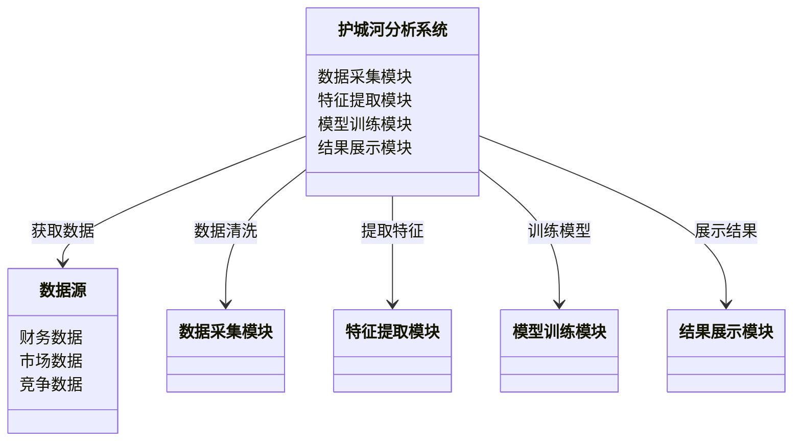

                 


# 智能算法辅助巴菲特护城河分析

> 关键词：智能算法，巴菲特护城河，数据分析，机器学习，投资策略

> 摘要：本文探讨了如何利用智能算法辅助分析巴菲特护城河，通过详细分析护城河的核心概念、智能算法的原理及其在护城河分析中的应用，展示了如何利用技术手段提升投资决策的准确性与效率。

---

## 第一部分: 智能算法辅助巴菲特护城河分析的背景与概念

### 第1章: 智能算法与巴菲特护城河分析的背景

#### 1.1 什么是巴菲特的护城河

##### 1.1.1 护城河的定义与核心要素

护城河是指公司在竞争市场中形成的独特优势，能够有效阻止竞争对手进入或削弱其市场份额。核心要素包括：

1. **成本优势**：公司以低于竞争对手的成本提供产品或服务。
2. **品牌优势**：强大的品牌影响力吸引客户，形成客户忠诚度。
3. **网络效应**：产品或服务的价值随着用户数量的增加而增加。
4. **技术壁垒**：拥有独特的技术或专利，难以被复制。
5. **政策支持**：依赖政府政策或法规获得的竞争优势。

##### 1.1.2 护城河的类型与特征

护城河的类型主要分为以下几种：

1. **竞争优势型**：通过技术创新或成本控制形成竞争优势。
2. **市场准入型**：通过专利、许可证等限制竞争对手进入市场。
3. **客户粘性型**：通过客户关系管理（CRM）或网络效应增强客户粘性。
4. **资源控制型**：控制关键资源或原材料，确保供应链安全。

##### 1.1.3 护城河分析的重要性

护城河分析是投资决策中的关键环节，能够帮助投资者识别具有长期竞争优势的公司，降低投资风险，提高投资回报率。

---

#### 1.2 智能算法的定义与特点

##### 1.2.1 智能算法的基本概念

智能算法是一种基于数据驱动的计算方法，能够通过学习和推理，自动优化解决方案。它通常结合了机器学习、深度学习、自然语言处理等多种技术，具备以下特点：

1. **数据驱动**：依赖大量数据进行训练和推理。
2. **自适应性**：能够根据数据变化自动调整模型参数。
3. **高效率**：通过并行计算和优化算法，提高处理速度。

##### 1.2.2 智能算法的核心技术

智能算法的核心技术包括：

1. **机器学习**：通过训练数据，模型能够自动识别模式。
2. **深度学习**：利用多层神经网络进行特征提取和分类。
3. **自然语言处理**：处理和理解人类语言，应用于文本分析。
4. **图算法**：用于复杂关系的建模和分析。

##### 1.2.3 智能算法的优势与局限性

优势：
1. **高效性**：能够在短时间内处理大量数据。
2. **准确性**：通过数据训练，提高预测的准确性。
3. **可扩展性**：适用于不同规模和类型的数据集。

局限性：
1. **数据依赖性**：需要大量高质量的数据进行训练。
2. **计算成本**：训练和推理过程需要大量计算资源。
3. **黑箱问题**：部分算法的决策过程难以解释。

---

#### 1.3 智能算法在护城河分析中的作用

##### 1.3.1 护城河分析的传统方法与挑战

传统的护城河分析方法主要依赖人工经验和定性分析，存在以下挑战：

1. **主观性**：分析结果受到分析师个人经验的影响。
2. **低效性**：手动分析耗时且效率低下。
3. **片面性**：难以全面考虑多维度因素。

##### 1.3.2 智能算法如何提升护城河分析的效率

智能算法通过以下方式提升护城河分析的效率：

1. **数据挖掘**：自动从海量数据中提取有价值的信息。
2. **模式识别**：识别潜在的竞争优势和市场趋势。
3. **实时监控**：实时跟踪市场变化，及时调整分析结果。

##### 1.3.3 智能算法在护城河分析中的应用场景

1. **竞争对手分析**：识别竞争对手的护城河，制定应对策略。
2. **市场趋势预测**：通过数据分析预测市场未来趋势。
3. **投资决策支持**：为投资者提供数据支持，优化投资决策。

---

#### 1.4 本章小结

本章介绍了巴菲特护城河的定义、核心要素和类型，阐述了智能算法的基本概念、核心技术及其在护城河分析中的作用。通过智能算法的应用，能够显著提升护城河分析的效率和准确性，为投资决策提供有力支持。

---

## 第二部分: 智能算法辅助护城河分析的核心概念与联系

### 第2章: 护城河分析的核心概念

#### 2.1 护城河分析的理论基础

##### 2.1.1 护城河的五力模型

五力模型由迈克尔·波特提出，包括：

1. **潜在进入者的威胁**：新进入者的威胁取决于行业的进入壁垒。
2. **替代品的威胁**：替代品的价格和质量对行业的影响。
3. **供应商的议价能力**：供应商是否能够提高价格或降低质量。
4. **购买者的议价能力**：购买者是否能够压低价格或要求更高的产品质量。
5. **行业内竞争者的竞争程度**：行业内竞争的激烈程度。

##### 2.1.2 护城河的动态变化

护城河并非一成不变，会随着市场环境的变化而动态调整。例如，技术创新可以增强技术壁垒，而市场竞争加剧可能导致成本优势被削弱。

---

#### 2.2 智能算法的核心原理

##### 2.2.1 数据驱动的智能算法

数据驱动的智能算法通过大量数据训练模型，提取数据中的潜在规律。

##### 2.2.2 模型驱动的智能算法

模型驱动的智能算法基于特定的理论或假设构建模型，用于分析和预测。

---

#### 2.3 护城河分析与智能算法的联系

##### 2.3.1 数据的获取与处理

智能算法需要收集与护城河相关的数据，包括财务数据、市场数据、竞争数据等，并进行清洗和预处理。

##### 2.3.2 算法的选择与优化

根据分析目标选择合适的算法，并通过参数调优和模型优化提高分析效果。

##### 2.3.3 结果的可视化与解释

通过可视化工具展示分析结果，并对结果进行解释，帮助用户理解护城河的构成和变化。

---

#### 2.4 本章小结

本章阐述了护城河分析的理论基础和智能算法的核心原理，分析了两者之间的联系，为后续的算法实现和系统设计奠定了基础。

---

## 第三部分: 智能算法辅助护城河分析的算法原理

### 第3章: 常见智能算法及其在护城河分析中的应用

#### 3.1 机器学习算法

##### 3.1.1 监督学习算法

**线性回归**：用于预测连续型变量，例如股票价格预测。

$$ y = \beta_0 + \beta_1x + \epsilon $$

**逻辑回归**：用于分类问题，例如预测公司是否具备护城河。

$$ P(y=1|x) = \frac{e^{\beta_0 + \beta_1x}}{1 + e^{\beta_0 + \beta_1x}} $$

##### 3.1.2 无监督学习算法

**聚类分析**：将公司按照护城河类型进行分组。

**K-means算法**：目标函数为：

$$ \min_{\textbf{v}_k} \sum_{i=1}^{n} \min_{k} \|x_i - \textbf{v}_k\|^2 $$

##### 3.1.3 强化学习算法

**Q-Learning**：用于动态环境下的决策优化。

$$ Q(s, a) = r + \gamma \max Q(s', a') $$

#### 3.2 自然语言处理算法

##### 3.2.1 文本分类算法

**朴素贝叶斯分类**：用于分析公司新闻的情感倾向。

##### 3.2.2 实体识别算法

**CRF（条件随机场）**：用于识别文本中的公司名称、产品名称等实体。

##### 3.2.3 情感分析算法

**词嵌入模型（如Word2Vec）**：通过词向量表示情感倾向。

#### 3.3 图算法

##### 3.3.1 图的最短路径算法

**Dijkstra算法**：用于分析市场中的最短供应链路径。

##### 3.3.2 图的聚类算法

**Louvain算法**：用于发现市场中的竞争网络社区。

##### 3.3.3 图的推荐算法

**基于邻居的推荐算法**：用于推荐具有相似护城河的公司。

---

## 第四部分: 智能算法辅助护城河分析的系统架构与设计

### 第4章: 系统分析与架构设计方案

#### 4.1 问题场景介绍

护城河分析系统需要处理以下问题场景：

1. **数据获取**：从多个数据源获取公司数据。
2. **特征提取**：从数据中提取护城河相关的特征。
3. **模型训练**：训练智能算法模型进行护城河分析。
4. **结果展示**：将分析结果以可视化形式展示。

#### 4.2 系统功能设计

##### 4.2.1 数据采集模块

负责从数据库、网络爬虫等多种数据源获取数据。

##### 4.2.2 特征提取模块

提取与护城河相关的特征，例如财务指标、市场份额等。

##### 4.2.3 模型训练模块

训练机器学习模型，进行护城河分类或预测。

##### 4.2.4 结果展示模块

将分析结果以图表、报告等形式展示。

---

#### 4.3 系统架构设计

##### 4.3.1 领域模型（Mermaid 类图）



##### 4.3.2 系统架构（Mermaid 架构图）


---

## 第五部分: 智能算法辅助护城河分析的项目实战

### 第5章: 项目实战与详细分析

#### 5.1 环境安装与配置

##### 5.1.1 安装Python

```bash
python --version
pip install --upgrade pip
```

##### 5.1.2 安装依赖库

```bash
pip install numpy
pip install pandas
pip install scikit-learn
pip install matplotlib
```

#### 5.2 核心代码实现

##### 5.2.1 数据预处理

```python
import pandas as pd

# 读取数据
data = pd.read_csv('company_data.csv')

# 数据清洗
data = data.dropna()
data = data.drop_duplicates()
```

##### 5.2.2 特征提取

```python
from sklearn.preprocessing import StandardScaler

scaler = StandardScaler()
scaled_data = scaler.fit_transform(data[['revenue', 'profit', 'market_share']])
```

##### 5.2.3 模型训练

```python
from sklearn.model_selection import train_test_split
from sklearn.ensemble import RandomForestClassifier

X_train, X_test, y_train, y_test = train_test_split(scaled_data, data['has_moat'], test_size=0.2)

model = RandomForestClassifier()
model.fit(X_train, y_train)
```

##### 5.2.4 结果展示

```python
import matplotlib.pyplot as plt

importances = model.feature_importances_
indices = np.argsort(importances)[::-1]

plt.title('Feature Importances')
plt.bar(range(X_train.shape[1]), importances[indices])
plt.xticks(range(X_train.shape[1]), indices)
plt.show()
```

#### 5.3 实际案例分析

以亚马逊为例，分析其护城河：

1. **数据获取**：从亚马逊财报和市场报告中提取数据。
2. **特征提取**：提取收入、利润、市场份额等特征。
3. **模型训练**：使用随机森林模型进行护城河分类。
4. **结果展示**：展示亚马逊的护城河特征及其重要性。

---

## 第六部分: 智能算法辅助护城河分析的最佳实践与总结

### 第6章: 最佳实践与总结

#### 6.1 最佳实践

##### 6.1.1 数据质量管理

确保数据的准确性和完整性，避免噪声数据对模型的影响。

##### 6.1.2 算法选择

根据具体问题选择合适的算法，避免盲目使用复杂模型。

##### 6.1.3 结果解释

对模型的输出结果进行合理的解释，避免决策的盲目性。

#### 6.2 小结

智能算法辅助护城河分析为投资决策提供了强大的技术支持，通过数据驱动的方式，能够更准确地识别公司的竞争优势和潜在风险。

#### 6.3 注意事项

1. **数据隐私**：确保数据处理符合相关法律法规。
2. **模型解释性**：选择可解释性较强的模型，便于结果解读。
3. **持续优化**：定期更新模型，适应市场变化。

#### 6.4 拓展阅读

1. 《巴菲特选股之道》：深入理解巴菲特的投资理念。
2. 《机器学习实战》：学习更多机器学习算法及其应用。

---

## 作者：AI天才研究院 & 禅与计算机程序设计艺术

---

通过以上目录和内容，您可以逐步撰写完整的文章。每一章的内容都需要根据上述结构进行详细展开，确保逻辑清晰，内容丰富。

