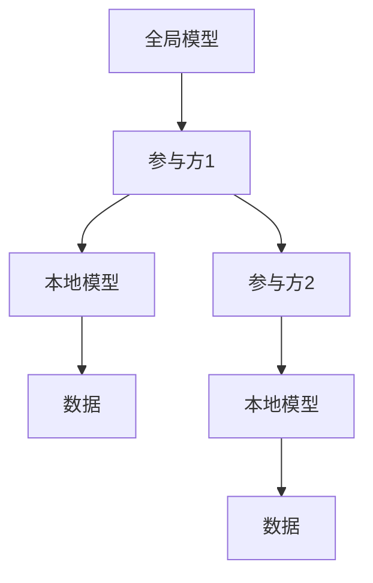
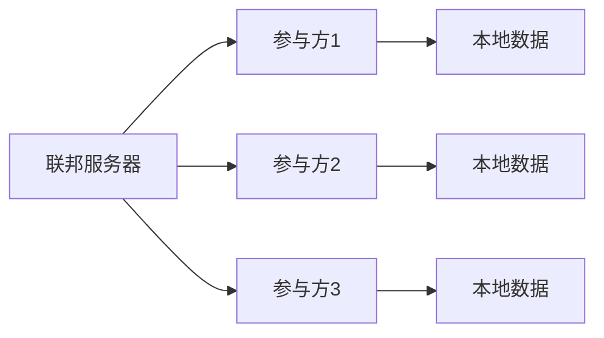

                 


# 联邦学习在AI Agent隐私保护中的高级应用

## 关键词：联邦学习, AI Agent, 隐私保护, 多方安全计算, 联邦学习算法

## 摘要：
随着人工智能技术的快速发展，AI Agent在各种场景中的应用越来越广泛。然而，AI Agent对数据的依赖性使其面临着严重的隐私保护挑战。联邦学习作为一种分布式机器学习技术，能够在保护数据隐私的前提下，实现多方数据的协作训练。本文详细探讨了联邦学习在AI Agent隐私保护中的高级应用，从核心概念、算法原理到系统设计和项目实战，全面解析如何在AI Agent中应用联邦学习技术，确保数据隐私的同时提升模型性能。

---

## 第1章: 联邦学习与AI Agent的背景介绍

### 1.1 联邦学习的定义与特点
#### 1.1.1 联邦学习的基本概念
联邦学习（Federated Learning）是一种分布式机器学习技术，允许多个参与方在不共享原始数据的情况下，协作训练一个共同的模型。其核心思想是“数据不动，模型动”，即数据保留在各自的计算节点上，仅交换模型参数或中间结果。

#### 1.1.2 联邦学习的核心特点
- **数据隐私保护**：数据不出域，确保原始数据不被泄露。
- **分布式协作**：多个参与方协作训练，避免数据集中化带来的风险。
- **模型更新高效**：通过联邦学习算法，快速迭代模型，提升性能。

#### 1.1.3 联邦学习的背景与重要性
随着数据隐私法规的日益严格（如GDPR），联邦学习在保护隐私的同时实现数据协作的需求日益增长。特别是在医疗、金融等领域，联邦学习能够有效解决数据孤岛问题，同时满足合规要求。

### 1.2 AI Agent的基本概念与功能
#### 1.2.1 AI Agent的定义
AI Agent（人工智能代理）是指在特定环境中能够感知并自主决策的智能实体。它可以是一个软件程序、机器人或其他智能设备，具备自主性、反应性、目标导向等特性。

#### 1.2.2 AI Agent的核心功能
- **感知环境**：通过传感器或数据接口获取环境信息。
- **决策与推理**：基于感知信息进行推理和决策。
- **执行动作**：根据决策结果执行具体操作。
- **学习与适应**：通过与环境交互不断优化自身行为。

#### 1.2.3 AI Agent的应用场景
AI Agent广泛应用于自动驾驶、智能助手、智能推荐系统等领域。例如，自动驾驶汽车通过AI Agent实时感知环境并做出驾驶决策，而智能助手（如Siri、Alexa）则通过AI Agent与用户交互并提供服务。

### 1.3 联邦学习在AI Agent隐私保护中的重要性
#### 1.3.1 隐私保护的重要性
AI Agent通常需要处理大量敏感数据（如用户行为数据、位置信息等），数据泄露可能导致严重的隐私风险。

#### 1.3.2 联邦学习如何解决隐私问题
通过联邦学习，AI Agent可以在不共享原始数据的情况下，与其他AI Agent协作训练模型，从而在保护隐私的前提下提升模型性能。

#### 1.3.3 联邦学习与AI Agent结合的优势
- **数据可用性**：联邦学习允许AI Agent在保护数据隐私的前提下利用多方数据。
- **模型性能**：通过协作训练，AI Agent可以利用更丰富的数据集，提升模型的泛化能力。
- **合规性**：符合数据隐私保护的法律法规要求。

---

## 第2章: 联邦学习与AI Agent的核心概念与联系

### 2.1 联邦学习的核心原理
#### 2.1.1 联邦学习的基本流程
1. **初始化**：各参与方初始化本地模型参数。
2. **本地训练**：各参与方在本地数据上训练模型，更新本地参数。
3. **模型聚合**：通过通信协议将各参与方的模型参数聚合，生成全局模型。
4. **模型更新**：将全局模型分发给各参与方，进行下一轮训练。

#### 2.1.2 联邦学习的关键技术
- **模型聚合**：通过加法平均、异步更新等方法聚合各参与方的模型参数。
- **通信协议**：设计安全的通信机制，确保模型参数在传输过程中不被窃取。
- **隐私保护**：通过加密技术（如同态加密、差分隐私）保护模型参数和数据。

#### 2.1.3 联邦学习的数学模型
$$ \text{全局模型参数更新：} \theta_{\text{global}} = \frac{1}{N} \sum_{i=1}^{N} \theta_{\text{local}}^i $$

其中，$\theta_{\text{global}}$ 是全局模型参数，$N$ 是参与方数量，$\theta_{\text{local}}^i$ 是第 $i$ 个参与方的本地模型参数。

### 2.2 AI Agent的核心原理
#### 2.2.1 AI Agent的感知与决策过程
AI Agent通过传感器或数据接口获取环境信息，经过内部推理机制做出决策，并通过执行器执行动作。

#### 2.2.2 AI Agent的自主学习能力
AI Agent可以通过强化学习、监督学习等方法，在与环境的交互中不断优化自身的决策策略。

#### 2.2.3 AI Agent的多智能体协作
在多智能体系统中，多个AI Agent需要通过通信与协作，共同完成复杂任务。

### 2.3 联邦学习与AI Agent的联系
#### 2.3.1 联邦学习为AI Agent提供数据协作能力
通过联邦学习，多个AI Agent可以在不共享数据的情况下，协作训练共享模型，提升各自的决策能力。

#### 2.3.2 AI Agent为联邦学习提供分布式计算能力
AI Agent作为分布式节点，可以参与联邦学习的模型训练，同时保持数据的隐私性。

#### 2.3.3 联邦学习与AI Agent的结合架构


### 2.4 联邦学习与AI Agent的核心属性对比
| 属性 | 联邦学习 | AI Agent |
|------|----------|----------|
| 数据存储 | 分布式存储 | 本地存储 |
| 数据共享 | 不共享原始数据 | 可选择共享数据或模型 |
| 计算能力 | 分布式计算 | 单点或分布式计算 |
| 隐私保护 | 强化隐私保护 | 根据需求选择保护方式 |

---

## 第3章: 联邦学习在AI Agent中的算法原理

### 3.1 联邦学习的算法流程
#### 3.1.1 联邦学习的通信机制
各参与方通过安全通信通道交换模型参数，常见的通信方式包括同步更新和异步更新。

#### 3.1.2 联邦学习的模型聚合方法
- **加法平均**：将各参与方的模型参数相加后求平均。
- **加权聚合**：根据参与方的数据量或模型性能赋予不同的权重。

#### 3.1.3 联邦学习的隐私保护技术
- **同态加密**：允许在加密数据上进行计算，确保数据隐私。
- **差分隐私**：通过添加噪声干扰，保护数据的隐私性。

### 3.2 AI Agent中的联邦学习实现
#### 3.2.1 AI Agent的本地训练过程
AI Agent在本地数据上训练模型，更新本地参数，并将更新后的模型参数发送到联邦服务器。

#### 3.2.2 AI Agent的模型聚合过程
通过联邦服务器聚合各参与方的模型参数，生成全局模型，并将全局模型分发给各参与方。

#### 3.2.3 AI Agent的隐私保护机制
- **数据加密**：对本地数据进行加密，确保数据在传输过程中的安全性。
- **模型加密**：对本地模型参数进行加密，防止模型被逆向分析。

### 3.3 联邦学习算法的数学模型
$$ \theta_{\text{global}}^{(t+1)} = \theta_{\text{global}}^{(t)} + \sum_{i=1}^{N} \lambda_i (\theta_{\text{local}}^i - \theta_{\text{global}}^{(t)}) $$

其中，$\theta_{\text{global}}$ 是全局模型参数，$\lambda_i$ 是第 $i$ 个参与方的权重系数。

---

## 第4章: 系统分析与架构设计

### 4.1 系统应用场景
#### 4.1.1 医疗领域
多个医疗机构协作训练医疗诊断模型，保护患者隐私的同时提升诊断准确率。

#### 4.1.2 金融领域
多家金融机构协作训练风险评估模型，防范金融欺诈，同时保护客户隐私。

### 4.2 系统功能设计
#### 4.2.1 数据预处理模块
对本地数据进行清洗、归一化等预处理，确保数据质量。

#### 4.2.2 模型训练模块
在本地数据上训练模型，更新本地参数。

#### 4.2.3 模型聚合模块
通过联邦服务器聚合各参与方的模型参数，生成全局模型。

#### 4.2.4 模型更新模块
将全局模型分发给各参与方，进行下一轮训练。

### 4.3 系统架构设计


### 4.4 系统交互流程
```mermaid
sequenceDiagram
    participant 联邦服务器
    participant 参与方1
    participant 参与方2
    联邦服务器 -> 参与方1: 获取模型参数
    参与方1 -> 联邦服务器: 返回模型参数
    联邦服务器 -> 参与方2: 获取模型参数
    参与方2 -> 联邦服务器: 返回模型参数
    联邦服务器: 聚合模型参数
    联邦服务器 -> 参与方1: 更新全局模型
    联邦服务器 -> 参与方2: 更新全局模型
```

---

## 第5章: 项目实战

### 5.1 环境安装与配置
#### 5.1.1 安装依赖
安装必要的Python库，如`flask`、`numpy`、`tensorflow`等。

#### 5.1.2 环境配置
配置本地开发环境，包括设置API端点、数据库连接等。

### 5.2 核心代码实现
#### 5.2.1 联邦服务器端
```python
from flask import Flask, request, jsonify
import numpy as np

app = Flask(__name__)

@app.route('/get_model', methods=['GET'])
def get_model():
    # 返回全局模型参数
    return jsonify({'weights': global_weights})

@app.route('/update_model', methods=['POST'])
def update_model():
    # 接收参与方的模型参数
    data = request.json
    global_weights = np.mean([global_weights, data['weights']], axis=0)
    return jsonify({'status': 'success'})

if __name__ == '__main__':
    app.run(port=5000)
```

#### 5.2.2 参与方端
```python
import numpy as np
from flask import Flask, request, jsonify

app = Flask(__name__)

@app.route('/train', methods=['POST'])
def train():
    # 获取本地数据
    data = request.json
    # 本地训练模型
    local_weights = train_model(data['data'])
    # 发送模型参数到联邦服务器
    response = requests.post('http://localhost:5000/update_model', json={'weights': local_weights})
    return jsonify({'status': 'success'})

if __name__ == '__main__':
    app.run(port=5001)
```

### 5.3 实际案例分析
#### 5.3.1 医疗领域的应用
多个医疗机构协作训练医疗诊断模型，保护患者隐私的同时提升诊断准确率。

#### 5.3.2 金融领域的应用
多家金融机构协作训练风险评估模型，防范金融欺诈，同时保护客户隐私。

### 5.4 项目小结
通过联邦学习技术，AI Agent可以在不共享原始数据的情况下，协作训练共享模型，提升模型性能，同时保护数据隐私。

---

## 第6章: 总结与展望

### 6.1 全文总结
本文详细探讨了联邦学习在AI Agent隐私保护中的高级应用，从核心概念、算法原理到系统设计和项目实战，全面解析了如何在AI Agent中应用联邦学习技术，确保数据隐私的同时提升模型性能。

### 6.2 未来展望
随着联邦学习技术的不断发展，其在AI Agent中的应用将更加广泛。未来的研究方向包括：
- **隐私保护技术的优化**：进一步提升数据加密和隐私保护技术，确保数据的安全性。
- **多模态数据的处理**：研究如何在多模态数据下实现联邦学习，提升模型的泛化能力。
- **跨领域应用**：探索联邦学习在更多领域的应用，如自动驾驶、智能城市等。

### 6.3 最佳实践
- **数据安全**：在联邦学习中，数据安全是重中之重，需要采用多种加密技术保护数据隐私。
- **算法优化**：针对不同的应用场景，优化联邦学习算法，提升模型训练效率。
- **跨领域协作**：在AI Agent的协作过程中，需要不同领域专家的共同参与，确保系统的顺利运行。

---

## 附录: 作者信息

作者：AI天才研究院/AI Genius Institute & 禅与计算机程序设计艺术 /Zen And The Art of Computer Programming

---

通过以上思考过程，我整理出了这篇文章的详细目录和内容安排。接下来，我将根据这个大纲，逐步撰写每一部分的具体内容，确保文章的完整性和逻辑性。

