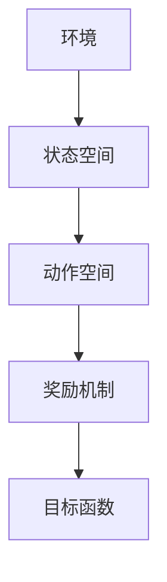
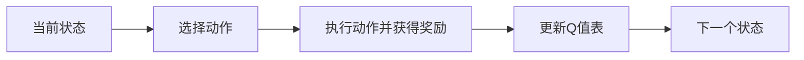
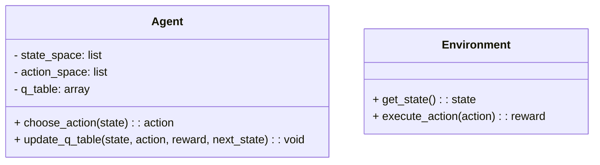
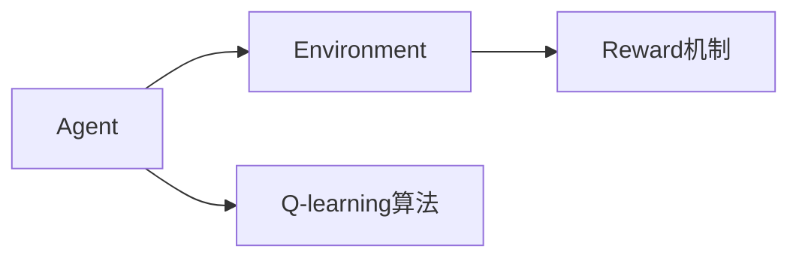
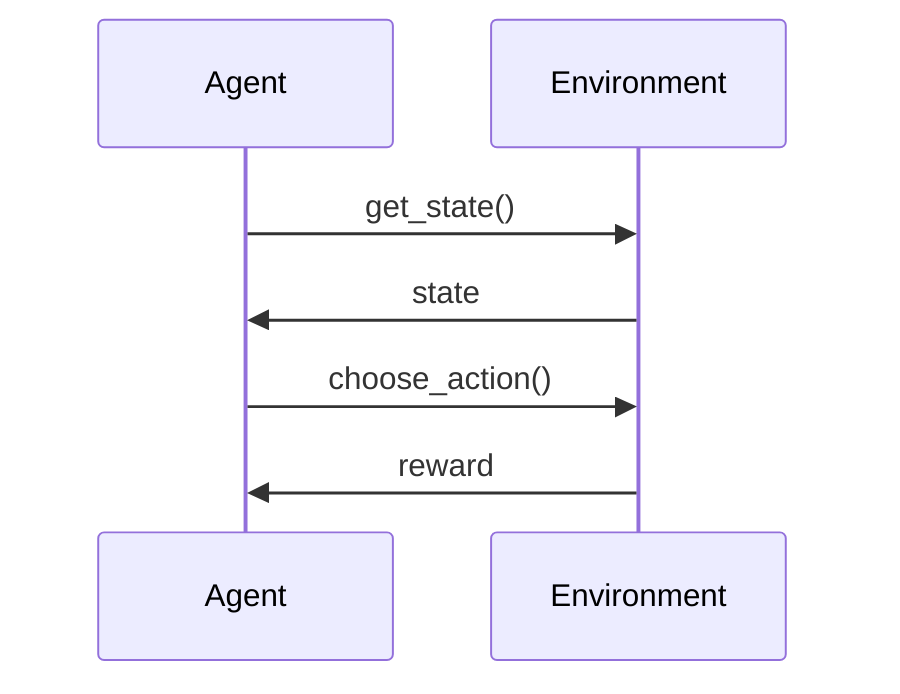

                 


# 自主学习型AI Agent：持续进化的智能体

## 关键词：自主学习型AI Agent, 持续进化, 智能体, 强化学习, 自适应算法, 系统架构

## 摘要：本文深入探讨了自主学习型AI Agent的设计与实现，从核心概念到算法原理，再到系统架构和项目实战，详细解析了如何构建一个能够持续进化的智能体。通过Q-learning算法、强化学习和自适应优化机制的结合，本文展示了如何使AI Agent在复杂环境中自我学习和适应，实现持续进化。

---

## 第一部分：自主学习型AI Agent的背景与概念

### 第1章：自主学习型AI Agent的背景介绍

#### 1.1 问题背景

- **1.1.1 传统AI的局限性**  
  传统AI依赖于固定的规则和预训练的数据，无法在动态变化的环境中自主调整策略。当环境或任务发生变化时，传统AI往往需要人工干预或重新训练模型，这限制了其灵活性和适应性。

- **1.1.2 自主学习的需求与动机**  
  在现实世界中，环境通常是动态且不可预测的。为了使AI能够在复杂和不确定的环境中生存并完成任务，需要一种能够自主学习和适应的机制。这种机制使得AI能够根据反馈不断优化自身的行为策略。

- **1.1.3 持续进化智能体的应用场景**  
  自主学习型AI Agent广泛应用于机器人控制、自动驾驶、游戏AI、推荐系统等领域。例如，在自动驾驶中，AI需要实时感知环境并做出决策，而环境中的交通规则、道路状况和驾驶员行为都是动态变化的。

#### 1.2 问题描述

- **1.2.1 自主学习型AI Agent的核心目标**  
  自主学习型AI Agent的目标是在没有外部干预的情况下，通过与环境的交互，不断优化自身的行为策略，以实现特定目标或在动态环境中保持高性能。

- **1.2.2 持续进化过程中的关键挑战**  
  - 动态环境中的策略调整：环境的变化可能导致之前有效的策略失效，AI Agent需要快速识别变化并更新策略。  
  - 复杂任务的分解：复杂的任务可能需要分解成多个子任务，每个子任务都需要独立优化。  
  - 资源限制：在资源受限的环境中，AI Agent需要在计算资源和学习效率之间找到平衡。

- **1.2.3 现有解决方案的不足**  
  传统强化学习方法在静态环境中表现良好，但在动态或部分可观察的环境中容易出现策略漂移或收敛速度慢的问题。此外，现有的解决方案通常依赖于大量的训练数据和计算资源。

#### 1.3 问题解决

- **1.3.1 自主学习型AI Agent的定义**  
  自主学习型AI Agent是一种能够通过与环境交互，利用反馈信息（如奖励或惩罚）不断优化自身行为策略的智能体。它具备自我学习和适应能力，能够在动态环境中保持高性能。

- **1.3.2 持续进化机制的设计思路**  
  持续进化机制通过强化学习和自适应优化算法的结合，使AI Agent能够在与环境交互的过程中不断更新其策略。具体来说，强化学习用于学习策略，而自适应优化算法用于动态调整策略以应对环境变化。

- **1.3.3 自主学习的核心算法选择**  
  选择强化学习（Reinforcement Learning）作为核心算法，因为它能够通过与环境的交互学习策略，并通过奖励机制指导学习方向。同时，结合自适应优化算法（如遗传算法或进化策略）来增强策略的适应性。

#### 1.4 边界与外延

- **1.4.1 自主学习型AI Agent的边界条件**  
  - 环境动态性：环境的变化必须在AI Agent的能力范围内可预测或可适应。  
  - 资源限制：AI Agent的计算能力和传感器精度必须满足实时决策的需求。  
  - 任务复杂度：任务必须能够分解成可学习的子任务。

- **1.4.2 相关概念的对比与区分**  
  - 自主学习型AI Agent与传统强化学习的区别：自主学习型AI Agent具备自我进化能力，而传统强化学习依赖于固定的训练环境。  
  - 自主学习型AI Agent与监督学习的区别：自主学习型AI Agent通过与环境交互学习，而监督学习依赖于标记数据。

- **1.4.3 与其他AI范式的联系与区别**  
  - 与其他AI范式的联系：自主学习型AI Agent结合了强化学习和自适应优化算法，能够实现动态环境中的自主决策。  
  - 区别：自主学习型AI Agent强调持续进化和自我优化，而其他AI范式更注重特定任务的解决。

#### 1.5 核心要素组成

- **1.5.1 知识表示与状态空间**  
  知识表示是AI Agent理解环境和任务的基础。状态空间表示当前环境的状态，用于指导AI Agent的决策。例如，在自动驾驶中，状态可以包括车速、车道、周围车辆的位置等。

- **1.5.2 行为决策与动作空间**  
  行为决策是AI Agent根据当前状态选择最优动作的过程。动作空间定义了所有可能的动作，例如在自动驾驶中，动作可以包括加速、减速、转向等。

- **1.5.3 奖励机制与目标函数**  
  奖励机制是强化学习的核心，用于指导AI Agent的学习方向。目标函数定义了AI Agent的优化目标，例如在自动驾驶中，目标函数可以是到达目的地的时间最短且遵守交通规则。

---

## 第二部分：自主学习型AI Agent的核心概念与联系

### 第2章：核心概念与联系

#### 2.1 核心概念原理

- **2.1.1 自主学习型AI Agent的定义与实现机制**  
  自主学习型AI Agent通过强化学习和自适应优化算法的结合，实现持续进化。强化学习用于学习策略，而自适应优化算法用于动态调整策略以应对环境变化。

- **2.1.2 持续进化机制的核心算法**  
  选择Q-learning算法作为核心算法，因为它简单且适用于离散动作空间。Q-learning算法通过更新Q值表来学习最优策略。

#### 2.2 概念属性特征对比表格

| 概念                | 特征                |
|---------------------|--------------------|
| 自主学习型AI Agent   | 能够自主学习和适应   |
| 传统强化学习         | 需要固定的训练环境    |
| 自适应优化算法       | 动态调整策略         |

#### 2.3 ER实体关系图



---

## 第三部分：自主学习型AI Agent的算法原理

### 第3章：算法原理讲解

#### 3.1 Q-learning算法

- **3.1.1 Q-learning算法的流程图**



- **3.1.2 Q-learning算法的Python源代码实现**

```python
import random
import numpy as np

class QLearningAgent:
    def __init__(self, state_space_size, action_space_size, learning_rate=0.1, gamma=0.99):
        self.state_space_size = state_space_size
        self.action_space_size = action_space_size
        self.learning_rate = learning_rate
        self.gamma = gamma
        self.q_table = np.zeros((state_space_size, action_space_size))
    
    def choose_action(self, state, epsilon=0.1):
        if random.random() < epsilon:
            return random.randint(0, self.action_space_size - 1)
        else:
            return np.argmax(self.q_table[state])
    
    def update_q_table(self, state, action, reward, next_state):
        current_q = self.q_table[state][action]
        next_max_q = np.max(self.q_table[next_state])
        self.q_table[state][action] = current_q + self.learning_rate * (reward + self.gamma * next_max_q - current_q)
```

- **3.1.3 Q-learning算法的数学模型**

$$ Q(s, a) = Q(s, a) + \alpha (r + \gamma \max Q(s', a') - Q(s, a)) $$

其中，\( \alpha \) 是学习率，\( \gamma \) 是折扣因子。

#### 3.2 强化学习与自适应优化

- **3.2.1 强化学习的数学模型**

$$ Q(s, a) = Q(s, a) + \alpha (r + \gamma \max Q(s', a') - Q(s, a)) $$

- **3.2.2 自适应优化算法的数学模型**

$$ \theta_{t+1} = \theta_t + \alpha \nabla Q(s_t, a_t) $$

---

## 第四部分：自主学习型AI Agent的系统分析与架构设计

### 第4章：系统分析与架构设计

#### 4.1 问题场景介绍

- **4.1.1 系统需求分析**  
  系统需要具备自主学习和适应能力，能够在动态环境中优化行为策略。

- **4.1.2 系统设计目标**  
  - 实现自主学习型AI Agent的核心功能。  
  - 支持动态环境中的策略优化。  
  - 提供高效的计算能力和实时决策能力。

#### 4.2 系统功能设计

- **4.2.1 系统功能模块**



- **4.2.2 系统架构设计**



- **4.2.3 系统接口设计**



---

## 第五部分：自主学习型AI Agent的项目实战

### 第5章：项目实战

#### 5.1 环境安装与配置

- **5.1.1 系统需求**  
  - Python 3.8+  
  - NumPy  
  - Matplotlib

#### 5.2 核心代码实现

```python
import random
import numpy as np

class QLearningAgent:
    def __init__(self, state_space_size, action_space_size, learning_rate=0.1, gamma=0.99):
        self.state_space_size = state_space_size
        self.action_space_size = action_space_size
        self.learning_rate = learning_rate
        self.gamma = gamma
        self.q_table = np.zeros((state_space_size, action_space_size))
    
    def choose_action(self, state, epsilon=0.1):
        if random.random() < epsilon:
            return random.randint(0, self.action_space_size - 1)
        else:
            return np.argmax(self.q_table[state])
    
    def update_q_table(self, state, action, reward, next_state):
        current_q = self.q_table[state][action]
        next_max_q = np.max(self.q_table[next_state])
        self.q_table[state][action] = current_q + self.learning_rate * (reward + self.gamma * next_max_q - current_q)
```

#### 5.3 代码解读与分析

- **5.3.1 代码结构**  
  - `QLearningAgent`类：实现Q-learning算法的核心功能，包括选择动作和更新Q值表。  
  - `choose_action`方法：根据epsilon-greedy策略选择动作。  
  - `update_q_table`方法：根据当前状态、动作、奖励和下一个状态更新Q值表。

#### 5.4 案例分析与详细讲解

- **5.4.1 案例背景**  
  在一个模拟环境中，AI Agent需要学习如何在动态环境中导航。

- **5.4.2 实施步骤**  
  1. 初始化Q表。  
  2. 与环境交互，选择动作并执行。  
  3. 根据奖励更新Q值表。  
  4. 重复步骤2和3，直到达到目标或满足终止条件。

---

## 第六部分：自主学习型AI Agent的最佳实践与总结

### 第6章：最佳实践

#### 6.1 小结

- 自主学习型AI Agent通过强化学习和自适应优化算法的结合，能够在动态环境中实现持续进化。Q-learning算法是一种简单且有效的强化学习算法，适用于离散动作空间。

#### 6.2 注意事项

- **资源限制**：在资源受限的环境中，需要优化算法的计算效率。  
- **环境动态性**：需要设计有效的机制来检测和应对环境变化。  
- **任务复杂度**：复杂任务需要分解成可学习的子任务。

#### 6.3 拓展阅读

- **强化学习**：深入学习强化学习的核心概念和算法。  
- **自适应优化**：研究遗传算法和进化策略在AI Agent中的应用。  
- **持续进化智能体**：探索其他AI范式在持续进化中的应用，如基于神经进化的AI Agent。

---

## 作者

作者：AI天才研究院 & 禅与计算机程序设计艺术

---

这篇文章详细介绍了自主学习型AI Agent的设计与实现，从核心概念到算法原理，再到系统架构和项目实战，帮助读者全面理解如何构建一个能够持续进化的智能体。

