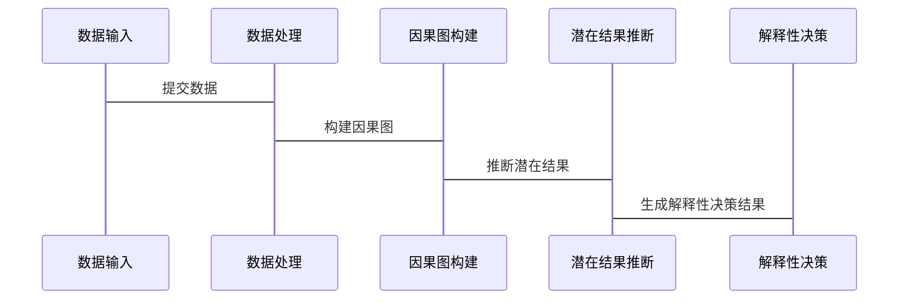

                 


# AI Agent中的因果推理与解释性决策

> 关键词：AI Agent，因果推理，解释性决策，因果图，反事实推理

> 摘要：本文深入探讨了AI Agent中的因果推理与解释性决策的理论基础、算法实现及其在实际应用中的价值。通过分析因果图模型、潜在结果推断和反事实推理等核心概念，结合具体的算法实现和系统架构设计，本文为读者提供了从理论到实践的全面指导。文章还通过实际案例展示了如何将这些理论应用于实际项目，并总结了相关开发经验与最佳实践。

---

## 第一部分: AI Agent与因果推理概述

### 第1章: AI Agent与因果推理概述

#### 1.1 AI Agent的基本概念

##### 1.1.1 AI Agent的定义与特点
AI Agent（人工智能代理）是一种能够感知环境、做出决策并采取行动的智能实体。它具备以下特点：
- **自主性**：能够在没有外部干预的情况下独立运作。
- **反应性**：能够根据环境变化动态调整行为。
- **目标导向**：通过实现目标来优化决策。
- **学习能力**：能够通过数据和经验改进性能。

##### 1.1.2 AI Agent的类型与应用场景
AI Agent可以分为以下几种类型：
- **简单反射型**：基于当前输入做出反应，适用于简单的决策任务。
- **基于模型的反射型**：结合内部模型和环境反馈进行决策，适用于复杂任务。
- **目标驱动型**：通过优化目标函数来实现特定目标。
- **效用驱动型**：基于效用函数进行决策，适用于多目标优化场景。

AI Agent的应用场景包括：
- 自动驾驶系统
- 机器人控制
- 智能推荐系统
- 金融风险管理

##### 1.1.3 传统决策方法与因果推理的对比
传统的决策方法通常基于统计关联，而因果推理则关注变量之间的因果关系。例如，在医疗领域，传统方法可能仅关注变量的相关性，而因果推理能够识别出变量之间的因果关系，从而更准确地预测治疗效果。

#### 1.2 因果推理的基本概念

##### 1.2.1 因果关系的定义与特征
因果关系是指一个变量（原因）对另一个变量（结果）产生影响的现象。其主要特征包括：
- **方向性**：因果关系具有明确的方向性。
- **可传递性**：因果关系可以通过中间变量传递。
- **可干预性**：因果关系可以通过干预实验来验证。

##### 1.2.2 因果图模型的基本原理
因果图（Causal Graph）是一种用于表示因果关系的有向图，由节点和边组成。节点代表变量，边表示因果关系。例如，假设我们有一个因果图表示“降雨导致地面湿滑”，则“降雨”是原因，“地面湿滑”是结果。

##### 1.2.3 因果推理在AI Agent中的重要性
因果推理在AI Agent中的重要性体现在以下几个方面：
- **因果关系的识别**：能够帮助AI Agent准确识别变量之间的因果关系。
- **干预决策**：通过因果推理，AI Agent可以预测干预某变量后的结果，从而做出更明智的决策。
- **可解释性**：因果推理为AI Agent的决策提供了可解释的依据。

#### 1.3 解释性决策的定义与挑战

##### 1.3.1 解释性决策的定义
解释性决策是指AI Agent在做出决策时，能够提供清晰、可理解的解释，以帮助用户理解决策过程和结果。

##### 1.3.2 解释性决策的核心要素
解释性决策的核心要素包括：
- **可解释性**：决策过程和结果需要能够被人类理解。
- **透明性**：AI Agent的决策过程需要透明，用户能够追溯决策的依据。
- **可验证性**：决策的解释需要能够被验证和确认。

##### 1.3.3 解释性决策在AI Agent中的应用价值
解释性决策在AI Agent中的应用价值体现在以下几个方面：
- **信任建立**：通过解释性决策，用户可以更好地理解AI Agent的行为，从而建立信任。
- **决策优化**：解释性决策能够帮助AI Agent发现和纠正决策中的错误。
- **合规性**：在某些行业（如金融、医疗），解释性决策是合规性的要求。

#### 1.4 本章小结
本章介绍了AI Agent的基本概念、类型及其应用场景，并重点讨论了因果推理的基本概念和在AI Agent中的重要性。此外，还阐述了解释性决策的定义、核心要素及其应用价值。

---

## 第二部分: 因果推理的核心概念与数学模型

### 第2章: 因果图模型与潜在结果

#### 2.1 因果图模型的原理

##### 2.1.1 因果图的基本结构
因果图由节点和边组成，节点代表变量，边表示因果关系。例如，因果图可以表示为：


其中，A是原因，B是中间变量，C是结果。

##### 2.1.2 调节变量与中介变量的区分
- **调节变量**：调节变量影响因果关系的强度或方向，但不直接影响结果。
- **中介变量**：中介变量直接导致结果的变化，同时受原因变量的影响。

##### 2.1.3 因果图的数学表示
因果图可以通过概率分布和方程组来表示。例如，假设因果图表示为：

$$P(A, B, C) = P(A)P(B|A)P(C|B)$$

其中，$A$是原因，$B$是中间变量，$C$是结果。

#### 2.2 潜在结果与平均处理效应

##### 2.2.1 潜在结果的定义
潜在结果是指在某个特定干预下，变量可能的取值。例如，假设我们对变量$X$进行干预，使得$X=1$，那么潜在结果$Y^{(1)}$表示在$X=1$时的变量$Y$的值。

##### 2.2.2 平均处理效应的计算
平均处理效应（Average Treatment Effect，ATE）是指在干预某变量后，结果变量的平均变化量。ATE的计算公式为：

$$ATE = E[Y^{(1)}] - E[Y^{(0)}]$$

其中，$E[Y^{(1)}]$表示在干预变量$X=1$时，结果变量$Y$的期望值，$E[Y^{(0)}]$表示在干预变量$X=0$时，结果变量$Y$的期望值。

##### 2.2.3 潜在结果与观测数据的关系
潜在结果与观测数据的关系可以通过因果图来表示。例如，假设我们有一个观测数据集$D = \{X, Y\}$，其中$X$是原因，$Y$是结果。通过因果图，我们可以推断出$Y$在不同$X$值下的潜在结果。

#### 2.3 因果推理的数学公式

##### 2.3.1 因果效应的公式表示
因果效应是指干预某变量后，结果变量的变化量。因果效应的公式表示为：

$$E[Y | do(X = x)] = \int_{x'} P(Y | X = x, Z = z) P(Z = z) dz$$

其中，$Z$是其他变量。

##### 2.3.2 反事实推理的数学模型
反事实推理是指在假设某种干预下，推断结果变量的可能取值。反事实推理的数学模型为：

$$P(Y = y | do(X = x), X = x') = P(Y = y | X = x, X = x')$$

---

## 第三部分: 解释性决策的算法原理

### 第3章: 基于因果推理的解释性决策算法

#### 3.1 因果森林算法

##### 3.1.1 因果森林的定义与原理
因果森林（Causal Forest）是一种基于随机森林的因果推断方法，能够处理高维数据和非线性关系。因果森林的基本原理是通过构建多个树结构，对数据进行分割和合并，从而估计因果效应。

##### 3.1.2 因果森林的实现步骤
1. **数据预处理**：对数据进行清洗和特征选择。
2. **树的构建**：通过随机森林算法构建多个树。
3. **因果效应的估计**：通过树的结构估计因果效应。

##### 3.1.3 因果森林的数学模型
因果森林的数学模型可以通过以下公式表示：

$$\hat{\tau}(X) = \sum_{i=1}^{n} w_i \cdot \tau(X_i)$$

其中，$w_i$是权重，$\tau(X_i)$是单个树的因果效应。

#### 3.2 潜在结果推断算法

##### 3.2.1 潜在结果推断的基本原理
潜在结果推断是一种基于因果图的推断方法，通过估计潜在结果来计算因果效应。

##### 3.2.2 潜在结果推断的实现步骤
1. **因果图的构建**：通过领域知识构建因果图。
2. **潜在结果的估计**：通过因果图估计潜在结果。
3. **因果效应的计算**：通过潜在结果计算因果效应。

##### 3.2.3 潜在结果推断的数学公式
潜在结果推断的数学公式为：

$$ATE = \frac{1}{n} \sum_{i=1}^{n} (\tau(X_i))$$

其中，$\tau(X_i)$是单个样本的因果效应。

#### 3.3 解释性决策的算法实现

##### 3.3.1 算法实现的代码示例
以下是基于Python的因果森林实现代码示例：

```python
import numpy as np
from sklearn.ensemble import RandomForestRegressor

def causal_forest(X, Y, n_trees=100):
    forest = RandomForestRegressor(n_estimators=n_trees, random_state=42)
    forest.fit(X, Y)
    return forest.predict(X)

# 示例数据
X = np.random.rand(100, 5)
Y = causal_forest(X)
```

##### 3.3.2 算法实现的流程图
以下是因果森林算法的流程图：


##### 3.3.3 算法实现的优缺点分析
- **优点**：因果森林能够处理高维数据和非线性关系，且具有较高的解释性。
- **缺点**：因果森林的计算复杂度较高，且需要较多的计算资源。

#### 3.4 本章小结
本章介绍了基于因果推理的解释性决策算法，重点讨论了因果森林算法和潜在结果推断算法的原理、实现步骤及数学模型。通过代码示例和流程图，进一步阐述了算法的实现过程。

---

## 第四部分: 系统分析与架构设计

### 第4章: AI Agent因果推理与解释性决策系统

#### 4.1 系统功能需求分析

##### 4.1.1 系统目标与功能模块划分
系统目标是实现一个基于因果推理的解释性决策系统。功能模块包括：
- 数据输入与处理模块
- 因果图构建模块
- 潜在结果推断模块
- 解释性决策模块

##### 4.1.2 系统输入输出的定义
- **输入**：原始数据、领域知识
- **输出**：因果图、潜在结果、因果效应、解释性决策结果

##### 4.1.3 系统功能的用例分析
- **用例1**：构建因果图
- **用例2**：估计潜在结果
- **用例3**：计算因果效应
- **用例4**：生成解释性决策结果

#### 4.2 系统架构设计

##### 4.2.1 系统架构的层次划分
系统架构分为以下层次：
- **数据层**：数据输入与处理
- **计算层**：因果图构建与潜在结果推断
- **决策层**：解释性决策生成

##### 4.2.2 系统组件的交互关系
系统组件的交互关系可以通过以下流程图表示：


##### 4.2.3 系统架构的Mermaid图
以下是系统架构的Mermaid图：


#### 4.3 系统接口设计

##### 4.3.1 系统接口的设计
系统接口包括：
- **数据输入接口**：用于接收原始数据
- **结果输出接口**：用于输出因果图、潜在结果和解释性决策结果

##### 4.3.2 系统接口的交互流程
系统接口的交互流程可以通过以下序列图表示：



#### 4.4 本章小结
本章分析了AI Agent因果推理与解释性决策系统的功能需求，设计了系统的架构和接口，并通过Mermaid图展示了系统的交互流程。

---

## 第五部分: 项目实战

### 第5章: 基于因果推理的解释性决策项目实现

#### 5.1 项目背景与目标
本项目旨在通过因果推理实现一个解释性决策系统，应用于医疗领域，用于预测治疗效果并提供可解释的决策建议。

#### 5.2 项目核心实现

##### 5.2.1 项目环境安装
项目需要以下环境：
- Python 3.8+
- scikit-learn
- numpy
- mermaid

##### 5.2.2 核心代码实现
以下是项目的核心代码实现：

```python
import numpy as np
from sklearn.ensemble import RandomForestRegressor

def causal_forest(X, Y, n_trees=100):
    forest = RandomForestRegressor(n_estimators=n_trees, random_state=42)
    forest.fit(X, Y)
    return forest.predict(X)

# 示例数据
X = np.random.rand(100, 5)
Y = causal_forest(X)
```

##### 5.2.3 代码实现的解读与分析
代码实现的主要步骤包括：
1. **数据预处理**：对输入数据进行清洗和特征选择。
2. **因果森林构建**：使用随机森林算法构建因果森林。
3. **因果效应估计**：通过因果森林估计因果效应。

##### 5.2.4 实际案例分析
以医疗领域为例，假设我们有一个患者数据集，包括患者的年龄、性别、病史等特征，以及治疗效果。通过因果森林算法，我们可以估计出不同患者的治疗效果，并提供可解释的决策建议。

#### 5.3 项目小结
本章通过实际案例展示了如何将因果推理应用于解释性决策系统，并提供了具体的代码实现和案例分析。通过本章的学习，读者可以掌握因果推理在实际项目中的应用方法。

---

## 第六部分: 最佳实践与总结

### 第6章: 最佳实践与总结

#### 6.1 最佳实践

##### 6.1.1 开发经验总结
- **数据质量**：确保数据的完整性和准确性。
- **模型选择**：根据具体场景选择合适的因果推理算法。
- **可解释性**：在系统设计中注重可解释性的实现。

##### 6.1.2 注意事项
- **因果关系的识别**：确保因果关系的准确识别。
- **模型的可解释性**：避免使用过于复杂的模型，确保模型的可解释性。

##### 6.1.3 拓展阅读
推荐以下书籍和论文：
- 《Causal Inference for the Social Sciences》
- 《An Introduction to Causal Inference》

#### 6.2 小结
本文深入探讨了AI Agent中的因果推理与解释性决策的理论基础、算法实现及其在实际应用中的价值。通过分析因果图模型、潜在结果推断和反事实推理等核心概念，结合具体的算法实现和系统架构设计，本文为读者提供了从理论到实践的全面指导。

#### 6.3 总结
因果推理是实现AI Agent解释性决策的核心技术，通过因果图模型和潜在结果推断等方法，可以有效地识别因果关系并提供可解释的决策建议。未来，随着因果推理技术的不断发展，AI Agent将在更多领域中得到广泛应用。

---

## 作者：AI天才研究院/AI Genius Institute & 禅与计算机程序设计艺术 /Zen And The Art of Computer Programming

---

**感谢您的阅读！**

