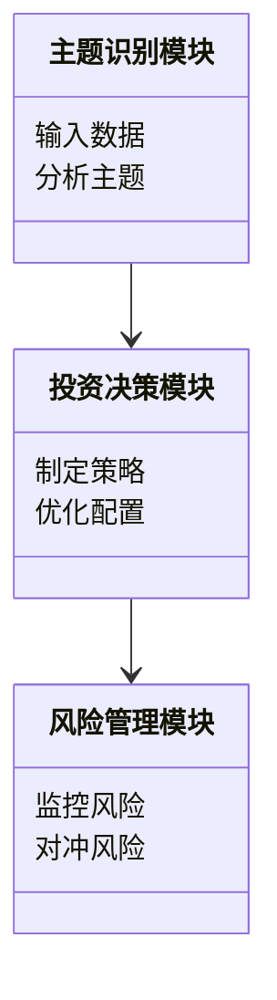
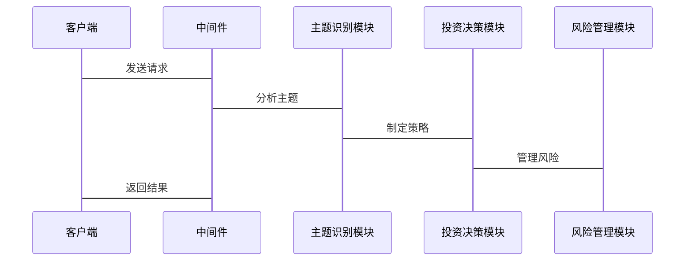

                 


# 多智能体协作进行宏观主题投资

## 关键词：多智能体协作、宏观主题投资、人工智能、量化投资、分布式系统

## 摘要：本文探讨了多智能体协作在宏观主题投资中的应用，详细分析了多智能体系统的概念、算法原理、系统架构，并通过实际案例展示了如何利用多智能体协作进行宏观主题投资。

---

## 第一部分: 多智能体协作与宏观主题投资背景

### 第1章: 多智能体协作与宏观主题投资概述

#### 1.1 多智能体协作的基本概念

##### 1.1.1 多智能体系统的定义

多智能体系统（Multi-Agent System, MAS）是由多个智能体组成的系统，这些智能体能够通过交互和协作完成复杂的任务。每个智能体都有自己的目标、知识和行为规则，能够独立决策和行动。

##### 1.1.2 多智能体系统的特征

- **自主性**：智能体能够自主决策，无需外部干预。
- **反应性**：智能体能够根据环境变化动态调整行为。
- **协作性**：智能体之间通过协作完成共同目标。
- **分布性**：智能体分布在网络中，可能位于不同的地理位置。

##### 1.1.3 多智能体与单智能体的对比

| 特性       | 多智能体系统 | 单智能体系统 |
|------------|--------------|--------------|
| 独立性      | 高           | 低           |
| 协作性      | 高           | 低           |
| 并行性      | 高           | 低           |
| 故障容错性  | 高           | 低           |

#### 1.2 宏观主题投资的定义与特点

##### 1.2.1 宏观主题投资的定义

宏观主题投资是一种投资策略，通过分析宏观经济趋势、行业动态和社会热点，识别具有长期增长潜力的主题或板块进行投资。

##### 1.2.2 宏观主题投资的核心要素

- **宏观经济分析**：包括GDP增长率、利率、通货膨胀率等。
- **行业动态**：行业政策、技术进步、市场趋势等。
- **社会热点**：如环保、人工智能、区块链等新兴主题。

##### 1.2.3 宏观主题投资与微观投资的对比

| 特性       | 宏观主题投资 | 微观投资 |
|------------|--------------|----------|
| 分析维度    | 宏观         | 微观     |
| 投资期限    | 长期         | 短期     |
| 风险分散性  | 高           | 中       |

#### 1.3 多智能体协作在宏观主题投资中的应用

##### 1.3.1 多智能体协作的优势

- **分布式计算能力**：多智能体能够同时处理大量数据，提高计算效率。
- **协作决策**：通过智能体之间的协作，能够做出更优的投资决策。
- **容错性**：单个智能体故障不会影响整个系统的运作。

##### 1.3.2 多智能体协作在宏观主题投资中的应用场景

- **主题识别**：智能体通过分析新闻、报告等信息，识别潜在的主题。
- **投资决策**：智能体协作制定投资策略，优化资产配置。
- **风险管理**：智能体实时监控市场变化，及时发现并规避风险。

##### 1.3.3 多智能体协作的挑战与解决方案

- **通信延迟**：通过分布式架构和异步通信减少延迟。
- **协调复杂性**：使用博弈论和分布式算法提高协作效率。
- **数据隐私**：采用加密技术和区块链确保数据安全。

#### 1.4 本章小结

本章介绍了多智能体系统的基本概念和特征，分析了宏观主题投资的核心要素和与微观投资的差异，探讨了多智能体协作在宏观主题投资中的应用及其优势和挑战。

---

### 第2章: 多智能体协作与宏观主题投资的核心概念

#### 2.1 多智能体协作的核心概念

##### 2.1.1 多智能体协作的数学模型

多智能体协作的数学模型可以用图论和博弈论来描述。每个智能体可以看作图中的节点，协作过程可以通过图的边来表示。

##### 2.1.2 多智能体协作的通信机制

智能体之间的通信可以通过消息传递机制实现。消息的内容可以是数据、请求或指令。

##### 2.1.3 多智能体协作的决策机制

智能体基于接收的信息和自身的知识，通过决策算法做出决策。常见的决策算法包括分布式算法和协商算法。

#### 2.2 宏观主题投资的核心概念

##### 2.2.1 宏观主题的识别与分类

主题识别可以通过自然语言处理技术分析文本数据，识别关键词和主题。主题分类可以通过聚类算法将相似的主题归为一类。

##### 2.2.2 宏观主题投资的量化方法

量化方法包括因子分析、回归分析和时间序列分析等。这些方法可以帮助投资者识别影响主题收益的关键因素。

##### 2.2.3 宏观主题投资的风险管理

风险管理包括风险评估、风险分散和风险对冲。智能体可以通过实时监控和反馈机制动态调整投资组合。

#### 2.3 多智能体协作与宏观主题投资的结合

##### 2.3.1 多智能体协作在主题识别中的应用

智能体可以通过分布式计算和协作学习提高主题识别的准确性和效率。

##### 2.3.2 多智能体协作在投资决策中的应用

智能体可以通过协商和协作制定最优的投资策略，优化资产配置。

##### 2.3.3 多智能体协作在风险管理中的应用

智能体可以通过实时信息共享和协同决策，及时发现和应对潜在风险。

#### 2.4 本章小结

本章分析了多智能体协作和宏观主题投资的核心概念，探讨了它们之间的结合方式及其在主题识别、投资决策和风险管理中的应用。

---

### 第3章: 多智能体协作与宏观主题投资的核心概念联系

#### 3.1 多智能体协作的数学模型与属性对比

##### 3.1.1 多智能体

**数学模型**：多智能体系统可以用图论表示，其中智能体是节点，协作关系是边。

**属性对比**：与单智能体相比，多智能体系统具有更高的容错性和协作性。

##### 3.1.2 宏观主题投资

**数学模型**：宏观主题投资可以用时间序列分析模型，如ARIMA模型。

**属性对比**：与微观投资相比，宏观主题投资具有更长的投资周期和更高的风险分散性。

#### 3.2 多智能体协作与宏观主题投资的结合

##### 3.2.1 多智能体协作在主题识别中的应用

智能体通过协作学习和分布式计算，提高主题识别的准确性和效率。

##### 3.2.2 多智能体协作在投资决策中的应用

智能体通过协商和协作，制定最优的投资策略，优化资产配置。

##### 3.2.3 多智能体协作在风险管理中的应用

智能体通过实时信息共享和协同决策，及时发现和应对潜在风险。

#### 3.3 本章小结

本章分析了多智能体协作与宏观主题投资的核心概念之间的联系，探讨了它们在主题识别、投资决策和风险管理中的应用。

---

## 第二部分: 多智能体协作与宏观主题投资的算法原理

### 第4章: 多智能体协作的算法原理

#### 4.1 多智能体协作的基本算法

##### 4.1.1 分布式计算算法

**分布式计算算法**：智能体通过分布式计算完成任务，如MapReduce算法。

##### 4.1.2 协商算法

**协商算法**：智能体通过协商达成一致，如共识算法。

#### 4.2 宏观主题投资的算法原理

##### 4.2.1 主题识别算法

**主题识别算法**：如LDA主题模型，用于从文本数据中识别主题。

##### 4.2.2 投资决策算法

**投资决策算法**：如马科维茨均值-方差模型，用于优化投资组合。

#### 4.3 多智能体协作与宏观主题投资的结合算法

##### 4.3.1 分布式主题识别算法

**分布式主题识别算法**：多个智能体分别处理数据，然后通过协作完成主题识别。

##### 4.3.2 分布式投资决策算法

**分布式投资决策算法**：多个智能体分别分析市场数据，然后通过协作制定投资策略。

#### 4.4 本章小结

本章分析了多智能体协作和宏观主题投资的基本算法，探讨了它们在主题识别和投资决策中的应用。

---

### 第5章: 多智能体协作与宏观主题投资的系统架构设计

#### 5.1 系统背景与需求分析

##### 5.1.1 项目背景

多智能体协作进行宏观主题投资是一个复杂的系统工程，需要设计高效的系统架构。

##### 5.1.2 项目需求

- **主题识别**：准确识别宏观主题。
- **投资决策**：制定最优的投资策略。
- **风险管理**：实时监控和应对风险。

#### 5.2 系统功能设计

##### 5.2.1 领域模型设计

**领域模型设计**：使用Mermaid类图展示系统的主要模块和它们之间的关系。



##### 5.2.2 系统架构设计

**系统架构设计**：使用Mermaid架构图展示系统的整体架构。


##### 5.2.3 系统接口设计

**系统接口设计**：定义智能体之间的通信接口，如REST API。

##### 5.2.4 系统交互设计

**系统交互设计**：使用Mermaid序列图展示系统交互流程。



#### 5.3 本章小结

本章设计了多智能体协作进行宏观主题投资的系统架构，包括领域模型、系统架构、接口设计和交互设计。

---

## 第三部分: 多智能体协作与宏观主题投资的项目实战

### 第6章: 多智能体协作与宏观主题投资的项目实战

#### 6.1 环境安装与配置

##### 6.1.1 安装Python环境

安装Python 3.8及以上版本，安装Jupyter Notebook用于开发和测试。

##### 6.1.2 安装依赖库

安装必要的库，如NumPy、Pandas、Scikit-learn、LDA主题模型库。

#### 6.2 系统核心实现

##### 6.2.1 多智能体协作实现

实现智能体的通信和协作，如通过消息队列实现异步通信。

##### 6.2.2 宏观主题识别实现

使用LDA主题模型从新闻数据中识别主题。

##### 6.2.3 投资决策实现

基于马科维茨模型优化投资组合。

#### 6.3 代码实现与解读

##### 6.3.1 多智能体协作代码

```python
import threading

class Agent:
    def __init__(self, id):
        self.id = id
        self.data = None

    def process_data(self):
        # 处理数据并返回结果
        pass

    def receive_data(self, data):
        self.data = data
        self.process_data()

# 创建多个智能体
agents = [Agent(i) for i in range(5)]

# 创建消息队列
import queue
data_queue = queue.Queue()

# 定义生产者线程
def producer():
    for i in range(10):
        data_queue.put(f"Data {i}")

# 定义消费者线程
def consumer(agent):
    while True:
        if not data_queue.empty():
            data = data_queue.get()
            agent.receive_data(data)

# 启动生产者和消费者线程
producer_thread = threading.Thread(target=producer)
producer_thread.start()

for agent in agents:
    consumer_thread = threading.Thread(target=consumer, args=(agent,))
    consumer_thread.start()
```

##### 6.3.2 宏观主题识别代码

```python
from sklearn.decomposition import LatentDirichletAllocation
import pandas as pd

# 加载数据
data = pd.read_csv('data.csv')

# 进行主题识别
lda = LatentDirichletAllocation(n_components=5, random_state=42)
lda.fit(data)

# 提取主题
topics = lda.transform(data)
```

##### 6.3.3 投资决策代码

```python
import numpy as np

# 定义收益和风险
returns = np.array([0.1, 0.2, 0.15, 0.05, 0.3])
variances = np.array([0.02, 0.03, 0.01, 0.05, 0.04])

# 使用马科维茨模型优化投资组合
def optimize_portfolio(returns, variances):
    # 简单实现，实际应用中需要更复杂的算法
    n = len(returns)
    return np.array([1/n]*n)

weights = optimize_portfolio(returns, variances)
```

#### 6.4 案例分析与详细讲解

##### 6.4.1 案例分析

假设我们有一个包含5个智能体的系统，每个智能体负责分析不同的市场数据。智能体之间通过消息队列通信，协作识别主题并制定投资策略。

##### 6.4.2 实际应用

通过代码实现，我们可以看到多智能体协作如何提高主题识别的准确性和投资决策的效率。

#### 6.5 项目小结

本章通过实际案例展示了如何利用多智能体协作进行宏观主题投资，从环境安装到代码实现，详细讲解了整个过程。

---

## 第四部分: 总结与展望

### 第7章: 总结与展望

#### 7.1 全文总结

本文探讨了多智能体协作在宏观主题投资中的应用，详细分析了多智能体系统的概念、算法原理和系统架构设计，并通过实际案例展示了系统的实现和应用。

#### 7.2 展望未来

未来，随着人工智能技术的发展，多智能体协作在宏观主题投资中的应用将更加广泛。智能体的协作能力将不断提高，投资策略将更加智能化和个性化。

#### 7.3 注意事项

在实际应用中，需要注意数据隐私、通信延迟和系统容错性等问题，确保系统的稳定性和高效性。

#### 7.4 拓展阅读

推荐阅读相关领域的书籍和论文，深入学习多智能体系统和量化投资的知识。

---

## 作者：AI天才研究院/AI Genius Institute & 禅与计算机程序设计艺术 /Zen And The Art of Computer Programming

---

这篇文章详细探讨了多智能体协作在宏观主题投资中的应用，从理论到实践，全面分析了系统的各个方面，为读者提供了丰富的知识和实用的指导。

