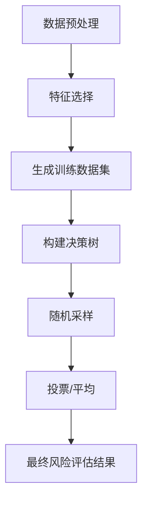
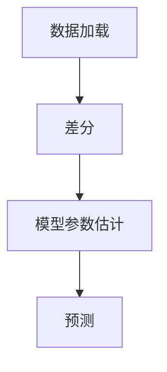
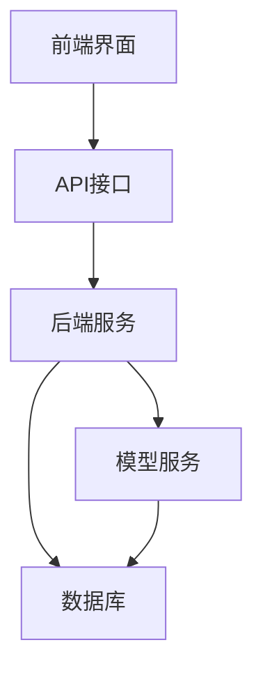
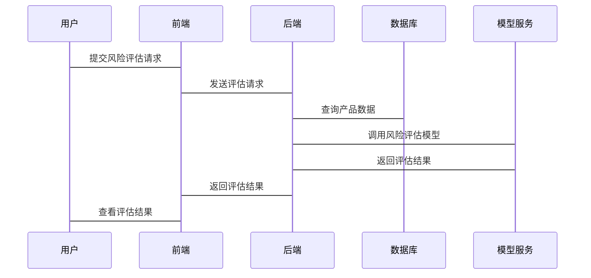

                 


# 开发智能化的金融产品生命周期风险评估平台

> 关键词：金融产品生命周期、风险评估、人工智能、大数据、系统架构设计、机器学习、金融风险管理

> 摘要：本文将详细探讨如何开发一个智能化的金融产品生命周期风险评估平台。从背景介绍、核心概念、算法原理到系统架构设计，再到项目实战，逐步分析并给出实现方案。通过本文，读者将深入了解如何利用人工智能和大数据技术，提升金融产品风险管理的效率和准确性。

---

## 第一部分: 金融产品生命周期与风险评估概述

### 第1章: 金融产品生命周期与风险评估概述

#### 1.1 金融产品生命周期的概念

##### 1.1.1 金融产品的定义与分类
金融产品是指金融机构提供的各种服务和工具，用于满足客户的金融需求。常见的金融产品包括银行存款、贷款、证券、基金、保险等。这些产品具有不同的风险特征和收益潜力。

##### 1.1.2 金融产品生命周期的阶段划分
金融产品的生命周期可以分为以下几个阶段：
- **研发阶段**：产品设计、风险评估、合规审查。
- **发行阶段**：产品上线、销售推广。
- **运行阶段**：监控产品表现、风险管理。
- **终止阶段**：产品赎回、清算。

##### 1.1.3 金融产品生命周期管理的重要性
有效的生命周期管理可以帮助金融机构及时识别和应对产品风险，确保产品合规性，提高客户满意度，并优化资源配置。

---

#### 1.2 风险评估在金融产品中的作用

##### 1.2.1 风险评估的基本概念
风险评估是通过分析金融产品的潜在风险，预测其对机构或客户的影响。常见的风险类型包括市场风险、信用风险、流动性风险等。

##### 1.2.2 金融产品生命周期中的风险类型
- **市场风险**：由于市场价格波动引起的风险。
- **信用风险**：由于债务人违约引起的风险。
- **流动性风险**：产品无法及时变现的风险。
- **操作风险**：由于内部操作失误引起的风险。

##### 1.2.3 风险评估对金融机构的价值
通过风险评估，金融机构可以优化产品设计、制定合理的风险定价策略，并在风险可控的前提下扩大业务规模。

---

#### 1.3 智能化风险评估的必要性

##### 1.3.1 传统风险评估方法的局限性
传统方法依赖人工分析，效率低、成本高，且难以应对复杂多变的市场环境。

##### 1.3.2 智能化技术在风险评估中的优势
人工智能和大数据技术可以提高风险评估的准确性和效率，帮助金融机构实时监控风险，及时调整策略。

##### 1.3.3 人工智能与大数据在金融领域的应用前景
随着技术的进步，智能化风险评估将成为金融机构的核心竞争力之一。

---

### 第2章: 金融产品生命周期风险评估平台的核心概念

#### 2.1 核心概念与定义

##### 2.1.1 金融产品生命周期管理系统的定义
这是一个整合了产品生命周期管理、风险评估、实时监控等功能的智能化平台。

##### 2.1.2 风险评估模型的定义与分类
风险评估模型是基于历史数据和实时数据，利用数学模型对金融产品的风险进行预测和评估。

##### 2.1.3 平台的核心功能模块
- 数据采集与处理模块
- 风险评估模型训练模块
- 风险监控与预警模块
- 报告生成模块

#### 2.2 核心概念之间的关系

##### 2.2.1 金融产品生命周期与风险评估的关系
金融产品的不同生命周期阶段面临的风险类型和程度不同，需要在每个阶段进行针对性的风险评估。

##### 2.2.2 数据流与风险评估模型的关系
数据流是风险评估模型的输入，模型通过对数据的分析，输出风险评估结果。

##### 2.2.3 平台功能模块之间的交互关系
各功能模块协同工作，形成一个完整的风险评估系统。

#### 2.3 核心概念的ER实体关系图

```mermaid
er
    entity 产品生命周期阶段 {
        id
        阶段名称
        阶段时间范围
    }
    entity 风险类型 {
        id
        风险名称
        风险描述
    }
    entity 风险评估模型 {
        id
        模型名称
        模型类型
    }
    entity 产品数据 {
        id
        产品名称
        产品类型
    }
    relation 被评估的阶段 (产品生命周期阶段) {
        关联关系：阶段 -> 模型
    }
    relation 数据输入 (产品数据) {
        关联关系：产品数据 -> 模型
    }
```

---

### 第3章: 金融产品生命周期风险评估平台的算法原理

#### 3.1 常用风险评估算法概述

##### 3.1.1 传统统计方法
- 方差分析（ANOVA）
- 回归分析

##### 3.1.2 机器学习算法
- 线性回归（Linear Regression）
- 支持向量机（SVM）
- 随机森林（Random Forest）
- XGBoost

#### 3.2 算法原理与实现

##### 3.2.1 随机森林算法

###### 3.2.1.1 算法原理
随机森林是一种基于决策树的集成学习算法，通过构建多棵决策树并进行投票或平均，提高模型的准确性和稳定性。

###### 3.2.1.2 算法实现步骤



###### 3.2.1.3 Python实现代码

```python
import pandas as pd
from sklearn.ensemble import RandomForestClassifier
from sklearn.model_selection import train_test_split
from sklearn.metrics import accuracy_score

# 数据加载与预处理
data = pd.read_csv('金融产品数据.csv')
X = data.drop('风险标签', axis=1)
y = data['风险标签']

# 数据分割
X_train, X_test, y_train, y_test = train_test_split(X, y, test_size=0.2, random_state=42)

# 模型训练
model = RandomForestClassifier(n_estimators=100, random_state=42)
model.fit(X_train, y_train)

# 模型预测
y_pred = model.predict(X_test)

# 模型评估
print('准确率:', accuracy_score(y_test, y_pred))
```

###### 3.2.1.4 数学公式
随机森林算法的投票机制可以表示为：
$$
\text{最终预测结果} = \arg\max_{i} \sum_{j=1}^{n} \text{树}_j(i)
$$

---

#### 3.3 时间序列分析算法

##### 3.3.1 ARIMA模型

###### 3.3.1.1 算法原理
ARIMA（自回归积分滑动平均）模型适用于时间序列数据的预测。

###### 3.3.1.2 算法实现步骤



###### 3.3.1.3 Python实现代码

```python
from statsmodels.tsa.arima_model import ARIMA
import pandas as pd

# 数据加载
data = pd.read_csv('时间序列数据.csv')
train_data = data['2020-01-01':'2022-12-31']
test_data = data['2023-01-01':'2023-12-31']

# 模型训练
model = ARIMA(train_data, order=(5, 1, 0))
model_fit = model.fit()

# 预测
forecast = model_fit.forecast(steps=len(test_data))

# 结果评估
print('预测值:', forecast)
```

###### 3.3.1.4 数学公式
ARIMA模型的差分方程为：
$$
\Delta^d x_t = \phi_1 \Delta^d x_{t-1} + \dots + \phi_p \Delta^d x_{t-p} + a_t
$$

---

## 第四部分: 系统分析与架构设计方案

### 第4章: 金融产品生命周期风险评估平台的系统架构设计

#### 4.1 问题场景介绍

##### 4.1.1 金融机构面临的挑战
金融机构需要实时监控金融产品的风险，但传统方法效率低、成本高。

##### 4.1.2 平台的目标
开发一个智能化的金融产品生命周期风险评估平台，实现风险的实时监控和预警。

#### 4.2 系统功能设计

##### 4.2.1 领域模型设计

```mermaid
classDiagram
    class 产品生命周期阶段 {
        id
        阶段名称
        阶段时间范围
    }
    class 风险类型 {
        id
        风险名称
        风险描述
    }
    class 风险评估模型 {
        id
        模型名称
        模型类型
    }
    class 产品数据 {
        id
        产品名称
        产品类型
    }
    产品生命周期阶段 -->> 风险评估模型
    产品数据 -->> 风险评估模型
```

##### 4.2.2 系统架构设计



##### 4.2.3 系统接口设计
- 前端接口：发送风险评估请求，接收评估结果。
- 后端接口：处理请求，调用模型服务进行评估。

##### 4.2.4 系统交互流程图



---

## 第五部分: 项目实战

### 第5章: 金融产品生命周期风险评估平台的实现

#### 5.1 环境安装与配置

##### 5.1.1 安装Python
- 使用Anaconda或Pyenv安装Python 3.8或更高版本。

##### 5.1.2 安装依赖库
```bash
pip install pandas numpy scikit-learn statsmodels
```

#### 5.2 系统核心实现源代码

##### 5.2.1 数据采集与处理

```python
import pandas as pd

# 加载数据
data = pd.read_csv('金融产品数据.csv')

# 数据清洗
data.dropna(inplace=True)
data = pd.get_dummies(data)
```

##### 5.2.2 风险评估模型训练

```python
from sklearn.ensemble import RandomForestClassifier
from sklearn.model_selection import train_test_split

# 数据分割
X_train, X_test, y_train, y_test = train_test_split(data.drop('风险标签', axis=1), data['风险标签'], test_size=0.2, random_state=42)

# 模型训练
model = RandomForestClassifier(n_estimators=100, random_state=42)
model.fit(X_train, y_train)

# 模型预测
y_pred = model.predict(X_test)
```

##### 5.2.3 风险监控与预警

```python
from statsmodels.tsa.arima_model import ARIMA

# 时间序列预测
model = ARIMA(train_data, order=(5, 1, 0))
model_fit = model.fit()

forecast = model_fit.forecast(steps=len(test_data))
```

#### 5.3 案例分析与详细解读

##### 5.3.1 案例背景
假设我们有一只债券产品，需要评估其信用风险。

##### 5.3.2 数据处理
加载债券产品的历史数据，包括收益率、评级、行业风险等因素。

##### 5.3.3 模型训练
使用随机森林模型进行信用风险分类，预测债券违约的可能性。

##### 5.3.4 预测结果分析
根据模型输出，判断债券产品的信用风险等级，并制定相应的风险管理策略。

---

## 第六部分: 总结与展望

### 第6章: 总结与展望

#### 6.1 总结
通过本文的介绍，我们详细探讨了如何开发一个智能化的金融产品生命周期风险评估平台。从背景介绍、核心概念、算法原理到系统架构设计，再到项目实战，逐步分析了实现方案。

#### 6.2 最佳实践
- 数据质量是模型准确性的重要保障。
- 模型调优和持续监控是确保系统稳定运行的关键。
- 风险评估结果的应用需要结合业务场景进行调整。

#### 6.3 注意事项
- 数据隐私和合规性是需要重点关注的问题。
- 模型的局限性需要在实际应用中进行充分考虑。

#### 6.4 拓展阅读
- 《机器学习实战》
- 《金融风险管理》
- 《大数据系统设计与实现》

---

## 作者

作者：AI天才研究院 & 禅与计算机程序设计艺术

---

这篇文章详细探讨了开发智能化的金融产品生命周期风险评估平台的各个方面，从理论到实践，为读者提供了全面的指导和深入的分析。希望对您有所帮助！

