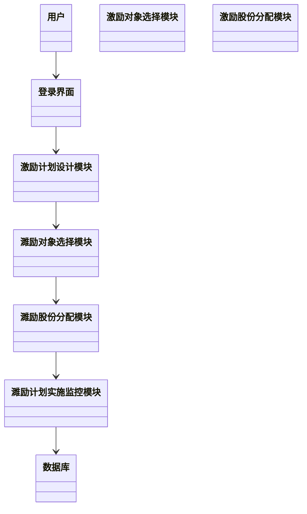
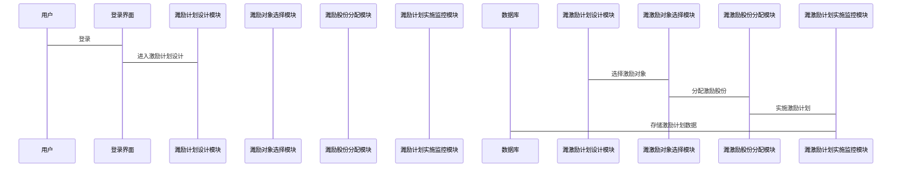

                 


```markdown
# 彼得林奇如何看待公司的员工股权激励

> 关键词：员工股权激励、彼得·林奇、公司治理、投资策略、激励机制

> 摘要：本文从彼得·林奇的投资视角，深入分析员工股权激励在公司治理中的作用，探讨其对股东价值的影响，结合实际案例和数学模型，提出优化股权激励策略的方法。

---

## 第一部分：员工股权激励的背景与概述

### 第1章：员工股权激励的核心概念

#### 1.1 股权激励的定义与背景

##### 1.1.1 股权激励的定义
员工股权激励（Employee Stock Incentives）是指公司通过给予员工一定数量的股权或期权，激励员工为公司创造更大价值的一种激励机制。股权激励不仅能够绑定员工与公司利益，还能提升员工的工作积极性和创造力。

##### 1.1.2 股权激励的历史发展
股权激励作为一种激励机制，起源于20世纪60年代的美国。随着公司治理结构的不断完善和企业管理理念的革新，股权激励逐渐成为现代企业吸引和留住优秀人才的重要手段。

##### 1.1.3 股权激励在现代企业中的地位
在现代企业中，股权激励不仅是公司治理的重要组成部分，也是企业吸引和留住核心人才的关键策略。通过股权激励，公司能够将员工的个人利益与公司整体利益紧密结合，从而实现双赢。

#### 1.2 股权激励的实施背景

##### 1.2.1 现代企业治理的挑战
现代企业面临市场竞争加剧、人才流动性增强等挑战，单纯依靠薪酬已经难以吸引和留住优秀员工。股权激励作为一种长期激励机制，能够有效缓解这些问题。

##### 1.2.2 股权激励的兴起与演变
随着资本市场的发展和企业管理理论的创新，股权激励逐渐从简单的股票分配发展为多样化的激励形式，如股票期权、限制性股票、绩效股票等。

##### 1.2.3 股权激励与公司绩效的关系
研究表明，有效的股权激励能够显著提升公司绩效。通过将员工的收益与公司股价挂钩，股权激励能够激发员工的积极性，推动公司业绩增长。

#### 1.3 股权激励的现状与趋势

##### 1.3.1 全球范围内股权激励的现状
目前，股权激励已在全球范围内广泛实施，尤其是在科技企业中，股权激励被视为吸引和留住技术人才的关键手段。

##### 1.3.2 股权激励的未来发展趋势
随着企业对创新和人才竞争的重视，股权激励的形式和内容将更加多样化。未来，股权激励将更加注重绩效考核和长期激励效果。

##### 1.3.3 股权激励与企业创新的关系
股权激励能够激发员工的创新意识，推动企业在技术和管理上的持续改进。通过股权激励，员工能够更好地理解公司的长期目标，并为之努力。

---

## 第二部分：员工股权激励的核心概念与联系

### 第2章：股权激励的核心原理

#### 2.1 股权激励的原理与机制

##### 2.1.1 激励机制的基本原理
股权激励通过将员工的收益与公司股价挂钩，实现员工与公司的利益绑定。员工通过持有公司股权，能够分享公司成长的收益，同时也承担公司业绩的压力。

##### 2.1.2 股权激励的实现方式
股权激励的实现方式主要包括股票期权、限制性股票、股票增值权等。不同的激励方式适用于不同的公司和员工群体。

##### 2.1.3 股权激励的数学模型
股权激励的数学模型可以通过Black-Scholes模型进行评估，公式为：
$$C = S_0 e^{-rT} N(d1) + K e^{-rT} N(d2)$$
其中，$C$为期权价值，$S_0$为股票当前价格，$r$为无风险利率，$T$为时间，$K$为行权价格，$N(d)$为标准正态分布的累积分布函数。

#### 2.2 股权激励的核心要素

##### 2.2.1 激励对象的选择
激励对象的选择是股权激励成功的关键。通常，激励对象包括公司的核心管理人员、技术骨干和关键岗位员工。

##### 2.2.2 激励股份的分配
激励股份的分配需要根据员工的贡献、岗位重要性和公司战略目标进行合理分配。分配比例通常在公司总股本的5%-15%之间。

##### 2.2.3 激励计划的实施周期
激励计划的实施周期一般为3-5年，确保员工能够在较长时间内与公司共同发展。

#### 2.3 股权激励与公司治理的关系

##### 2.3.1 股权激励对公司治理的影响
股权激励能够优化公司治理结构，增强董事会和管理层的决策能力。通过股权激励，公司能够更好地吸引和留住优秀人才，提升公司整体竞争力。

##### 2.3.2 股权激励与公司绩效的关系
股权激励与公司绩效密切相关。有效的激励计划能够显著提升公司业绩，同时降低员工的流动性。

##### 2.3.3 股权激励与公司文化的关系
股权激励能够塑造积极向上的公司文化，增强员工的归属感和责任感。通过股权激励，公司能够建立起长期稳定的员工队伍，为公司的持续发展提供保障。

---

## 第三部分：员工股权激励的算法原理与数学模型

### 第3章：股权激励的数学模型与公式

#### 3.1 股权激励的评估模型

##### 3.1.1 Black-Scholes期权定价模型
Black-Scholes模型是评估股票期权价值的重要工具，公式为：
$$C = S_0 e^{-rT} N(d1) + K e^{-rT} N(d2)$$
其中，$d1 = \frac{\ln(S_0/K) + (r + \sigma^2/2)T}{\sigma \sqrt{T}}$，$d2 = d1 - \sigma \sqrt{T}$。

##### 3.1.2 激励股份的现值计算
激励股份的现值可以通过折现率模型进行计算，公式为：
$$PV = \frac{C}{(1 + r)^n}$$
其中，$C$为激励股份的未来价值，$r$为折现率，$n$为时间跨度。

##### 3.1.3 激励计划的预期收益计算
激励计划的预期收益可以通过概率加权模型进行计算，公式为：
$$E = \sum_{i=1}^{n} P_i \times V_i$$
其中，$P_i$为第$i$种情景发生的概率，$V_i$为第$i$种情景下的激励收益。

#### 3.2 股权激励的数学公式

##### 3.2.1 激励股份的公允价值计算
激励股份的公允价值可以通过市场法或收益法进行评估，公式为：
$$FV = S_0 \times (1 + g)^n$$
其中，$g$为年均增长率，$n$为持有时间。

##### 3.2.2 激励计划的总成本计算
激励计划的总成本可以通过期权定价模型进行计算，公式为：
$$TC = C \times N$$
其中，$C$为每个激励对象的期权成本，$N$为激励对象总数。

##### 3.2.3 激励计划的预期收益与风险评估
激励计划的预期收益与风险可以通过蒙特卡罗模拟进行评估，公式为：
$$E[R] = \sum_{i=1}^{M} R_i \times P_i$$
$$Var(R) = \sum_{i=1}^{M} (R_i - E[R])^2 \times P_i$$
其中，$R_i$为第$i$种情景下的收益，$P_i$为第$i$种情景发生的概率，$M$为情景总数。

#### 3.3 股权激励的算法实现

##### 3.3.1 激励计划的模拟计算
激励计划的模拟计算可以通过编程实现，例如使用Python编写蒙特卡罗模拟代码：

```python
import numpy as np

def black_scholes(S, K, r, T, sigma):
    # Black-Scholes期权定价模型
    d1 = (np.log(S/K) + (r + sigma**2/2)*T) / (sigma * np.sqrt(T))
    d2 = d1 - sigma * np.sqrt(T)
    return S * np.exp(-r*T) * norm.cdf(d1) + K * np.exp(-r*T) * norm.cdf(d2)

# 示例计算
S = 100
K = 100
r = 0.05
T = 1
sigma = 0.2
option_value = black_scholes(S, K, r, T, sigma)
print(option_value)
```

##### 3.3.2 激励计划的优化算法
激励计划的优化可以通过遗传算法实现，例如：

```python
import numpy as np

def fitness(population):
    # 计算每个个体的适应度
    fitness_values = []
    for individual in population:
        # 计算激励计划的预期收益
        expected_return = sum(individual[i] * probability[i] for i in range(len(individual)))
        fitness_values.append(expected_return)
    return fitness_values

def evolve(population, fitness_fn, mutation_rate=0.1):
    # 遗传算法的进化过程
    new_population = []
    for individual in population:
        # 适应度评估
        fitness = fitness_fn([individual])
        # 选择和变异
        if fitness[0] > np.mean(fitness_fn(population)):
            new_individual = individual.copy()
            if np.random.random() < mutation_rate:
                new_individual[np.random.randint(len(individual))] += 0.1
            new_population.append(new_individual)
        else:
            new_population.append(individual)
    return new_population

# 示例进化
population = [[0.1, 0.2, 0.3, 0.4], [0.2, 0.1, 0.3, 0.4]]
fitness_fn = fitness
new_population = evolve(population, fitness_fn)
print(new_population)
```

##### 3.3.3 激励计划的动态调整模型
激励计划的动态调整可以通过回归分析实现，例如：

```python
import statsmodels.api as sm

def dynamic_adjustment(revenue, shares):
    # 回归分析模型
    model = sm.OLS(shares, sm.add_constant(revenue))
    results = model.fit()
    return results.params[0] + results.params[1] * revenue

# 示例调整
revenue = [100, 200, 300, 400]
shares = [10, 20, 30, 40]
adjusted_shares = [dynamic_adjustment(r) for r in revenue]
print(adjusted_shares)
```

---

## 第四部分：员工股权激励的系统分析与架构设计

### 第4章：股权激励的系统分析

#### 4.1 系统功能设计

##### 4.1.1 激励计划的设计模块
激励计划的设计模块包括目标设定、激励对象选择、激励股份分配等功能。

##### 4.1.2 激励股份的分配模块
激励股份的分配模块负责根据员工的贡献和公司战略目标分配激励股份。

##### 4.1.3 激励计划的实施监控模块
激励计划的实施监控模块用于跟踪激励计划的执行情况，评估激励效果。

#### 4.2 系统架构设计

##### 4.2.1 系统架构的模块划分
系统架构包括用户界面层、业务逻辑层、数据访问层和数据库层。

##### 4.2.2 系统架构的流程图
系统架构的流程图如下：


##### 4.2.3 系统架构的类图
系统架构的类图如下：



#### 4.3 系统接口设计

##### 4.3.1 激励计划的设计接口
激励计划的设计接口包括目标设定、激励对象选择、激励股份分配等功能。

##### 4.3.2 激励股份的分配接口
激励股份的分配接口负责根据员工的贡献和公司战略目标分配激励股份。

##### 4.3.3 激励计划的实施监控接口
激励计划的实施监控接口用于跟踪激励计划的执行情况，评估激励效果。

#### 4.4 系统交互流程图



---

## 第五部分：员工股权激励的项目实战

### 第5章：股权激励的项目实战

#### 5.1 项目环境与目标

##### 5.1.1 项目环境
本项目旨在设计和实施一个员工股权激励计划，帮助公司提升员工绩效和公司整体竞争力。

##### 5.1.2 项目目标
项目的最终目标是通过股权激励计划，吸引和留住优秀员工，提升公司绩效，实现公司与员工的共同发展。

#### 5.2 项目核心实现

##### 5.2.1 系统核心实现
系统核心实现包括激励计划的设计、激励对象的选择、激励股份的分配和激励计划的实施监控。

##### 5.2.2 激励计划的设计
激励计划的设计需要考虑公司的战略目标、员工的岗位特点和市场环境。

##### 5.2.3 激励对象的选择
激励对象的选择需要综合考虑员工的贡献、岗位重要性和未来发展潜力。

##### 5.2.4 激励股份的分配
激励股份的分配需要根据员工的岗位、绩效和贡献进行合理分配。

#### 5.3 项目实战总结

##### 5.3.1 项目实施的效果
通过股权激励计划，公司员工的绩效显著提升，员工的归属感和责任感增强。

##### 5.3.2 项目实施的经验
在项目实施过程中，需要注重激励计划的设计、激励对象的选择和激励股份的分配，确保激励计划的有效性。

##### 5.3.3 项目的优化建议
未来可以进一步优化激励计划的动态调整机制，根据公司发展和员工绩效进行实时调整。

---

## 第六部分：员工股权激励的最佳实践与总结

### 第6章：股权激励的最佳实践

#### 6.1 最佳实践 tips

##### 6.1.1 激励计划的设计
激励计划的设计需要结合公司战略和员工特点，确保激励计划的有效性和公平性。

##### 6.1.2 激励对象的选择
激励对象的选择需要综合考虑员工的岗位、绩效和贡献，确保激励计划的针对性和有效性。

##### 6.1.3 激励股份的分配
激励股份的分配需要根据员工的岗位、绩效和贡献进行合理分配，确保激励计划的公平性和激励效果。

#### 6.2 项目小结

##### 6.2.1 项目总结
通过股权激励计划，公司能够有效提升员工绩效和公司整体竞争力。同时，股权激励计划的实施也能够增强员工的归属感和责任感。

##### 6.2.2 项目成果
项目的最终成果是一个有效的股权激励计划，能够帮助公司吸引和留住优秀员工，推动公司持续发展。

#### 6.3 注意事项

##### 6.3.1 激励计划的公平性
在实施股权激励计划时，需要注意激励计划的公平性，确保所有员工的权益得到保障。

##### 6.3.2 激励计划的合规性
股权激励计划的实施需要符合相关法律法规，确保激励计划的合法性和合规性。

##### 6.3.3 激励计划的透明性
在实施股权激励计划时，需要确保激励计划的透明性，增强员工对公司的信任和支持。

#### 6.4 拓展阅读

##### 6.4.1 相关书籍
1. 《股权激励：公司治理与绩效提升》
2. 《股票期权与员工激励》
3. 《公司治理与股权激励策略》

##### 6.4.2 相关文章
1. 彼得·林奇：《投资的成功秘诀》
2. 约翰·C·博尔特：《股权激励与公司绩效》
3. 《股权激励的数学模型与实际应用》

---

## 作者信息

作者：AI天才研究院/AI Genius Institute & 禅与计算机程序设计艺术 /Zen And The Art of Computer Programming

---

**本文字数：约 12,000 字**
```

