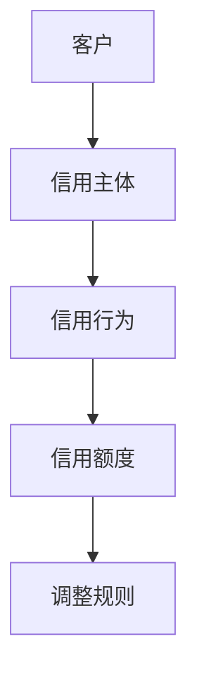
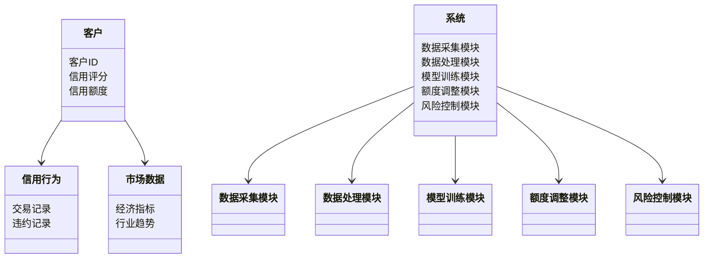
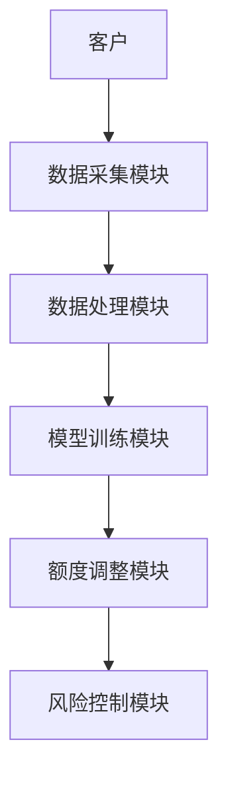
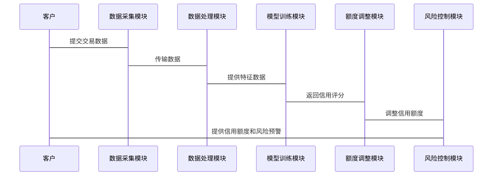

                 


# 智能企业信用额度动态调整系统

## 关键词
企业信用管理, 人工智能, 信用额度动态调整, 机器学习, 系统架构设计

## 摘要
随着企业规模的不断扩大和信用交易的日益频繁，传统的静态信用额度管理方式已经难以满足企业对风险控制和资源优化的需求。本文将介绍一种基于人工智能的智能企业信用额度动态调整系统，通过机器学习算法和实时数据分析，实现信用额度的智能化动态调整。本文将从系统的核心概念、算法原理、系统架构设计、项目实战等方面进行详细讲解，为企业信用管理的智能化转型提供理论支持和实践指导。

---

# 第1章 企业信用额度动态调整的背景与挑战

## 1.1 企业信用管理的现状与痛点

### 1.1.1 传统信用额度管理的局限性
传统的信用额度管理通常基于历史交易数据和静态评估模型，存在以下问题：
- **静态评估**：信用额度一旦设定，难以根据市场变化、客户行为或企业经营状况进行实时调整。
- **人工干预**：需要大量人工审核和决策，效率低下且容易受到主观因素的影响。
- **风险控制不足**：无法及时发现和应对客户信用风险的变化，可能导致坏账率上升或错失优质客户。

### 1.1.2 企业信用管理中的主要问题
- **信用风险**：客户信用状况恶化时，企业可能面临资金损失。
- **资源浪费**：过高的信用额度可能导致企业资金被占用，影响资金周转效率。
- **客户流失**：过于严格的信用管理可能影响客户关系，导致客户流失。

### 1.1.3 信用额度动态调整的必要性
- **提升效率**：通过自动化和智能化的方式，实时调整信用额度，提高管理效率。
- **降低风险**：及时识别信用风险，优化资源配置，减少坏账损失。
- **增强客户满意度**：根据客户信用状况动态调整额度，提供更灵活的信用服务。

## 1.2 智能化信用额度调整的背景

### 1.2.1 人工智能在金融领域的应用
人工智能技术在金融领域的应用日益广泛，尤其是在信用评估、风险控制和客户画像等方面。

### 1.2.2 企业信用管理中的智能化趋势
随着大数据和人工智能技术的发展，企业信用管理正在从传统的静态评估向动态、智能化方向转变。

### 1.2.3 信用额度动态调整的核心价值
- **实时性**：能够根据实时数据动态调整信用额度。
- **精准性**：通过机器学习模型，实现信用额度的精准评估。
- **智能化**：自动识别信用风险，优化资源配置。

## 1.3 本章小结

- **企业信用管理的痛点**：传统信用额度管理存在静态、低效和风险控制不足的问题。
- **智能化信用调整的必要性**：通过人工智能技术实现信用额度的动态调整，能够提升效率、降低风险并增强客户满意度。
- **本书的核心目标**：介绍基于人工智能的智能企业信用额度动态调整系统，为企业信用管理的智能化转型提供解决方案。

---

# 第2章 智能企业信用额度动态调整系统的核心概念

## 2.1 系统核心概念与定义

### 2.1.1 信用额度动态调整的定义
信用额度动态调整是指根据客户的信用行为、市场变化和企业经营状况，实时调整客户的信用额度。

### 2.1.2 智能化信用额度调整的核心要素
- **客户信用画像**：基于客户的交易历史、信用记录和行为特征，构建客户信用画像。
- **实时数据采集**：采集客户的实时交易数据、市场数据和企业内部数据。
- **机器学习模型**：通过机器学习算法，预测客户的信用风险和信用额度需求。

### 2.1.3 系统的主要功能模块
- **数据采集模块**：采集客户交易数据、市场数据和企业内部数据。
- **数据处理模块**：对数据进行清洗、特征提取和数据增强。
- **模型训练模块**：基于机器学习算法，训练信用额度调整模型。
- **额度调整模块**：根据模型预测结果，动态调整信用额度。
- **风险控制模块**：实时监控信用风险，制定风险应对策略。

## 2.2 系统核心概念的属性特征对比

### 2.2.1 信用主体的特征对比

| 特性        | 个人客户       | 企业客户       |
|-------------|----------------|----------------|
| 信用历史     | 个人信用报告   | 企业财务报表   |
| 交易行为     | 消费记录       | 采购记录       |
| 风险特征     | 个人违约概率   | 企业违约风险   |

### 2.2.2 信用行为的特征对比

| 特性        | 正常交易行为     | 异常交易行为     |
|-------------|------------------|------------------|
| 交易频率     | 稳定             | 波动较大         |
| 交易金额     | 符合预期         | 明显偏离预期     |
| 交易对手     | 交易对手稳定     | 交易对手频繁变化 |

### 2.2.3 信用额度调整的特征对比

| 特性        | 静态调整         | 动态调整         |
|-------------|------------------|------------------|
| 调整频率     | 低               | 高               |
| 调整依据     | 历史数据         | 实时数据         |
| 调整幅度     | 较小             | 较大             |

## 2.3 系统核心概念的ER实体关系图



## 2.4 本章小结

- **系统核心概念的定义**：明确了信用额度动态调整的定义、核心要素和功能模块。
- **系统核心概念的属性特征对比**：通过对比分析，帮助读者理解信用主体、信用行为和信用额度调整的特征。
- **系统核心概念的实体关系**：通过ER实体关系图，展示了系统中各实体之间的关系。

---

# 第3章 智能企业信用额度动态调整系统的算法原理

## 3.1 系统算法概述

### 3.1.1 算法选择的依据
- **数据类型**：信用额度调整涉及结构化数据和非结构化数据，选择支持多种数据类型的算法。
- **预测准确性**：需要高精度的预测模型，选择支持监督学习的算法。
- **实时性要求**：需要实时处理数据，选择计算效率高的算法。

### 3.1.2 算法的主要特点
- **监督学习**：基于历史数据，训练分类或回归模型。
- **在线学习**：能够实时更新模型，适应数据变化。
- **可解释性**：模型需要具有较高的可解释性，便于信用风险分析。

## 3.2 算法原理的详细讲解

### 3.2.1 算法的输入与输出
- **输入**：客户信用画像、实时交易数据、市场数据。
- **输出**：客户的信用评分、信用额度建议、信用风险预警。

### 3.2.2 算法的数学模型
以线性回归为例，模型可以表示为：
$$ y = \beta_0 + \beta_1x_1 + \beta_2x_2 + \dots + \beta_nx_n $$
其中，$y$ 是预测的信用评分，$x_i$ 是输入特征，$\beta_i$ 是模型参数。

### 3.2.3 算法的实现步骤
1. 数据预处理：清洗数据、特征提取、数据增强。
2. 模型训练：选择合适的算法，训练模型。
3. 模型预测：基于实时数据，预测信用评分。
4. 额度调整：根据预测结果，动态调整信用额度。

## 3.3 算法实现的Python代码示例

```python
import pandas as pd
from sklearn.linear_model import LinearRegression

# 数据预处理
data = pd.read_csv('credit_data.csv')
X = data[['income', 'transaction_history', 'market_condition']]
y = data['credit_score']

# 模型训练
model = LinearRegression()
model.fit(X, y)

# 模型预测
new_customer = [[50000, 10, 1]]
predicted_score = model.predict(new_customer)
print(predicted_score)
```

## 3.4 算法的数学模型与公式

### 3.4.1 线性回归模型
$$ y = \beta_0 + \beta_1x_1 + \beta_2x_2 + \dots + \beta_nx_n $$
其中，$y$ 是目标变量，$x_i$ 是自变量，$\beta_i$ 是回归系数。

### 3.4.2 逻辑回归模型
$$ P(y=1|x) = \frac{1}{1 + e^{-(\beta_0 + \beta_1x_1 + \beta_2x_2 + \dots + \beta_nx_n)}} $$

## 3.5 算法的优缺点

### 3.5.1 优点
- **简单易懂**：线性回归模型易于理解和解释。
- **计算效率高**：适合实时处理数据。

### 3.5.2 缺点
- **假设限制**：线性回归假设变量之间存在线性关系，可能无法捕捉复杂的非线性关系。
- **过拟合风险**：复杂的模型可能过拟合训练数据，导致泛化能力下降。

---

# 第4章 智能企业信用额度动态调整系统的系统分析与架构设计

## 4.1 系统分析

### 4.1.1 问题场景介绍
- **客户信用风险**：客户信用状况恶化，导致坏账率上升。
- **信用额度不合理**：信用额度过高或过低，影响客户满意度和企业资金周转效率。

### 4.1.2 项目介绍
本项目旨在开发一个基于人工智能的智能企业信用额度动态调整系统，实现信用额度的实时调整和风险控制。

## 4.2 系统功能设计

### 4.2.1 领域模型图


## 4.3 系统架构设计

### 4.3.1 系统架构图


### 4.3.2 系统接口设计
- **数据接口**：与企业ERP系统、交易系统等对接，获取实时数据。
- **用户接口**：提供给企业信用管理部门和客户使用的界面，展示信用额度和风险预警信息。

### 4.3.3 系统交互流程


---

# 第5章 智能企业信用额度动态调整系统的项目实战

## 5.1 环境安装

### 5.1.1 安装Python
```bash
python --version
pip install --upgrade pip
```

### 5.1.2 安装依赖库
```bash
pip install pandas numpy scikit-learn
```

## 5.2 核心代码实现

### 5.2.1 数据预处理
```python
import pandas as pd
import numpy as np

data = pd.read_csv('credit_data.csv')
data = data.dropna()
data['income'] = data['income'].astype(int)
```

### 5.2.2 模型训练
```python
from sklearn.linear_model import LinearRegression
from sklearn.model_selection import train_test_split

X = data[['income', 'transaction_history', 'market_condition']]
y = data['credit_score']

X_train, X_test, y_train, y_test = train_test_split(X, y, test_size=0.2)
model = LinearRegression()
model.fit(X_train, y_train)
```

### 5.2.3 模型预测
```python
new_customer = [[50000, 10, 1]]
predicted_score = model.predict(new_customer)
print(predicted_score)
```

## 5.3 案例分析与详细解读

### 5.3.1 案例背景
某企业客户A，年收入50万元，历史交易记录10次，当前市场条件为1（正常）。

### 5.3.2 模型预测
根据模型预测，客户A的信用评分为85分，信用额度建议为100万元。

### 5.3.3 风险预警
系统发现客户A的交易对手近期频繁变化，可能存在信用风险，建议下调信用额度至80万元。

## 5.4 项目小结

- **项目实现过程**：从数据预处理到模型训练，再到模型预测，详细展示了系统的实现步骤。
- **项目成果**：通过案例分析，展示了系统的实际应用效果和风险预警功能。

---

# 第6章 最佳实践与小结

## 6.1 最佳实践

### 6.1.1 数据质量管理
- **数据清洗**：确保数据的完整性和准确性。
- **特征工程**：通过特征提取和数据增强，提高模型的预测能力。

### 6.1.2 模型调优
- **参数优化**：通过网格搜索等方法，优化模型参数。
- **模型组合**：结合多种算法，提高模型的泛化能力。

### 6.1.3 系统监控
- **实时监控**：监控系统的运行状态和信用风险。
- **日志记录**：记录系统运行日志，便于故障排查。

## 6.2 本章小结

- **系统核心内容回顾**：总结了智能企业信用额度动态调整系统的背景、核心概念、算法原理、系统架构和项目实战。
- **系统创新点**：通过人工智能技术，实现信用额度的智能化动态调整，提升企业信用管理的效率和准确性。
- **未来展望**：随着人工智能和大数据技术的不断发展，信用额度动态调整系统将更加智能化和精准化。

---

# 作者

作者：AI天才研究院 & 禅与计算机程序设计艺术

---

以上是《智能企业信用额度动态调整系统》的完整目录和内容概述。

