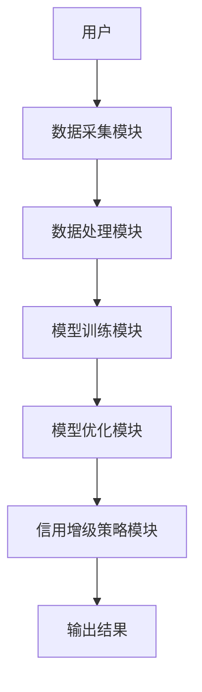
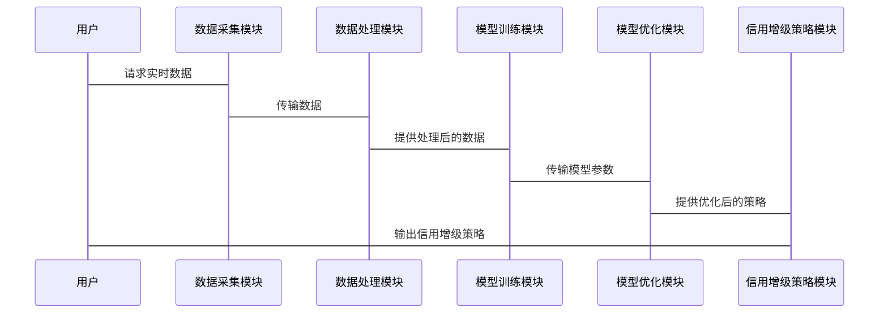

                 


# 构建智能化的资产证券化信用增级动态优化模型

## 关键词：资产证券化，信用增级，动态优化，智能算法，风险管理，金融建模

## 摘要：本文详细探讨了如何构建智能化的资产证券化信用增级动态优化模型，通过分析资产证券化的基本原理、信用增级的核心概念，结合动态优化模型的构建方法，提出了基于智能算法的优化策略。文章从理论基础到实际应用，结合具体案例，详细阐述了模型的设计、实现与优化过程，为读者提供了一套完整的解决方案。

---

# 正文

## 第1章: 资产证券化与信用增级概述

### 1.1 资产证券化的定义与特点
#### 1.1.1 资产证券化的定义
资产证券化（Asset Securitization）是指将流动性较低的资产转化为可以在市场上流通的证券的过程。通过将资产池中的资产打包成证券，投资者可以通过购买这些证券获得资产的收益。

#### 1.1.2 资产证券化的核心特点
- **资产独立性**：证券化后的资产与原始发行人隔离，投资者的权益仅限于证券本身。
- **流动性增强**：通过证券化，原本流动性较低的资产可以快速变现。
- **风险分散**：资产池中的资产种类多样化，降低了单一资产的风险。

#### 1.1.3 资产证券化与传统融资方式的区别
- **融资方式**：资产证券化是基于资产池的融资，而传统融资主要依赖于发行人的信用。
- **风险承担**：资产证券化将风险分散到不同的证券层次，而传统融资的风险集中在发行人身上。
- **资金成本**：资产证券化通常具有更低的资金成本，因为投资者基于资产池的风险定价。

### 1.2 信用增级的基本概念
#### 1.2.1 信用增级的定义
信用增级是指通过增加信用支持或改变证券的结构，提高证券信用等级的过程。信用增级的目的是为了降低投资者的风险，从而降低融资成本。

#### 1.2.2 信用增级的主要方式
- **优先级结构**：将资产池中的资产分为优先级和次级，优先级证券享有更高的信用评级。
- **信用增强工具**：如备用信用证、流动性支持等，用于增强证券的信用等级。
- **资产支持**：通过增加高质量的资产或减少低质量资产来提高整体资产池的信用质量。

#### 1.2.3 信用增级在资产证券化中的作用
信用增级是资产证券化过程中不可或缺的一部分。通过信用增级，可以提高证券的信用评级，降低投资者的顾虑，从而提高证券的市场吸引力。

### 1.3 资产证券化信用增级的动态优化需求
#### 1.3.1 动态优化的定义
动态优化是指在模型运行过程中，根据实时数据和市场变化，不断调整和优化模型参数，以实现最佳性能。

#### 1.3.2 动态优化在信用增级中的重要性
- **适应市场变化**：信用增级模型需要根据市场波动和资产池的变化进行实时调整。
- **提高模型精度**：动态优化可以不断优化模型参数，提高预测的准确性。
- **降低风险**：通过动态优化，可以及时发现和应对潜在风险，确保信用增级的稳定性。

#### 1.3.3 动态优化与传统信用增级方式的对比
- **传统方式**：基于静态模型，信用增级策略固定，无法根据市场变化进行调整。
- **动态优化方式**：基于智能算法，能够实时调整模型参数，适应市场变化。

### 1.4 本书的核心目标与结构安排
#### 1.4.1 本书的核心目标
通过构建智能化的资产证券化信用增级动态优化模型，实现对资产池的实时监控和动态调整，提高信用增级的效率和准确性。

#### 1.4.2 本书的章节安排
本书共分为七章，内容从理论到实践，涵盖资产证券化的基本原理、信用增级的核心概念、动态优化模型的构建与实现、系统架构设计、项目实战等。

#### 1.4.3 本书的阅读方法
建议读者从第一章开始，逐步深入理解资产证券化和信用增级的基本概念，再结合后续章节学习动态优化模型的构建与实现，最终通过项目实战巩固所学知识。

---

## 第2章: 资产证券化信用增级动态优化模型的核心概念

### 2.1 资产证券化信用增级的基本原理
#### 2.1.1 资产池的选择与风险评估
资产池的选择是资产证券化的核心，需要对资产池中的资产进行风险评估，确保资产池的稳定性和收益性。

#### 2.1.2 信用增级工具的设计与实现
信用增级工具的设计需要考虑资产池的风险特征，通过合理的结构设计，提高证券的信用等级。

#### 2.1.3 信用增级对资产证券化的影响
信用增级可以提高证券的信用评级，降低投资者的风险，从而提高资产证券化的市场吸引力。

### 2.2 动态优化模型的构建原理
#### 2.2.1 动态优化的基本概念
动态优化是指在模型运行过程中，根据实时数据和市场变化，不断调整和优化模型参数，以实现最佳性能。

#### 2.2.2 动态优化在信用增级中的应用
动态优化可以通过智能算法实时调整信用增级策略，提高信用增级的效率和准确性。

#### 2.2.3 动态优化模型的核心要素
- **输入变量**：资产池的特征、市场数据、信用评级等。
- **输出变量**：优化后的信用增级策略。
- **优化目标**：最大化信用增级效果，最小化风险。

### 2.3 资产证券化信用增级动态优化模型的数学表达
#### 2.3.1 模型的输入变量
$$
\text{输入变量} = \{x_1, x_2, ..., x_n\}
$$
其中，$x_i$ 表示第i个输入变量，例如资产池的风险评分、市场利率等。

#### 2.3.2 模型的输出变量
$$
\text{输出变量} = \{y_1, y_2, ..., y_m\}
$$
其中，$y_j$ 表示第j个输出变量，例如优化后的信用增级策略。

#### 2.3.3 模型的数学公式
$$
\text{优化目标} = \min_{\theta} \sum_{i=1}^{n} (y_i - \hat{y}_i)^2
$$
其中，$\theta$ 表示模型参数，$\hat{y}_i$ 表示预测值，$y_i$ 表示实际值。

### 2.4 模型的核心算法与实现
#### 2.4.1 算法的基本思路
动态优化模型可以通过机器学习算法（如随机森林、支持向量机等）进行训练，根据历史数据预测最优信用增级策略。

#### 2.4.2 算法的实现步骤
1. 数据预处理：清洗、特征选择、标准化等。
2. 模型训练：使用训练数据训练模型。
3. 模型优化：通过交叉验证调整模型参数。
4. 模型验证：使用测试数据验证模型性能。

#### 2.4.3 算法的优化策略
- **参数调整**：通过网格搜索或随机搜索优化模型参数。
- **特征选择**：使用特征重要性分析选择关键特征。
- **模型集成**：通过集成学习提高模型的准确性和稳定性。

### 2.5 本章小结
本章详细介绍了资产证券化信用增级的基本原理和动态优化模型的核心概念，为后续模型的构建与实现奠定了理论基础。

---

## 第3章: 资产证券化信用增级动态优化模型的构建与实现

### 3.1 数据特征提取与处理
#### 3.1.1 数据来源与特征选择
数据来源包括资产池的交易数据、市场数据、信用评级数据等。特征选择需要考虑相关性和重要性。

#### 3.1.2 数据预处理方法
- **缺失值处理**：使用均值、中位数或插值法填充缺失值。
- **异常值处理**：通过统计方法或模型检测并剔除异常值。
- **数据标准化**：使用归一化或标准化方法处理数据。

#### 3.1.3 数据特征的标准化与归一化
标准化公式：
$$
x_{\text{std}} = \frac{x - \mu}{\sigma}
$$
其中，$\mu$ 表示均值，$\sigma$ 表示标准差。

归一化公式：
$$
x_{\text{norm}} = \frac{x - \min(x)}{\max(x) - \min(x)}
$$

### 3.2 模型的设计与训练
#### 3.2.1 模型的设计思路
基于机器学习算法（如随机森林、支持向量机）设计模型，通过训练数据学习信用增级策略。

#### 3.2.2 模型的训练过程
1. 数据分割：将数据集分为训练集和测试集。
2. 模型训练：使用训练数据训练模型。
3. 模型验证：使用验证数据调整模型参数。

#### 3.2.3 模型的调优与验证
- **调优策略**：通过网格搜索优化模型参数。
- **验证方法**：使用交叉验证评估模型性能。

### 3.3 动态优化策略的实现
#### 3.3.1 动态优化策略的设计
动态优化策略需要根据实时数据和市场变化，不断调整信用增级策略。

#### 3.3.2 动态优化策略的实现步骤
1. 实时数据采集：获取市场数据和资产池的变化。
2. 模型更新：根据实时数据更新模型参数。
3. 信用增级策略调整：根据优化结果调整信用增级策略。

#### 3.3.3 动态优化策略的效果评估
- **评估指标**：准确率、召回率、F1分数等。
- **效果对比**：将动态优化策略与传统信用增级方式进行对比，评估其优越性。

### 3.4 本章小结
本章详细介绍了资产证券化信用增级动态优化模型的构建与实现过程，包括数据处理、模型设计与训练、动态优化策略的实现等。

---

## 第4章: 系统架构设计与实现

### 4.1 系统功能设计
#### 4.1.1 系统功能模块
- 数据采集模块：实时采集市场数据和资产池数据。
- 数据处理模块：对数据进行清洗、特征提取等预处理。
- 模型训练模块：训练信用增级动态优化模型。
- 模型优化模块：动态调整模型参数。
- 信用增级策略模块：生成优化后的信用增级策略。

#### 4.1.2 系统功能流程
1. 数据采集：获取市场数据和资产池数据。
2. 数据处理：清洗、特征提取、标准化。
3. 模型训练：训练信用增级动态优化模型。
4. 模型优化：动态调整模型参数。
5. 信用增级策略生成：生成优化后的信用增级策略。

### 4.2 系统架构设计
#### 4.2.1 系统架构图


#### 4.2.2 系统接口设计
- 数据接口：与数据源对接，获取实时数据。
- 模型接口：与第三方机器学习框架对接，进行模型训练和优化。
- 输出接口：将优化后的信用增级策略输出给用户。

### 4.3 系统交互流程
#### 4.3.1 交互流程图


### 4.4 本章小结
本章详细介绍了系统的架构设计与实现，包括功能模块设计、系统架构图、接口设计和交互流程图。

---

## 第5章: 项目实战与案例分析

### 5.1 项目背景
本项目旨在构建一个智能化的资产证券化信用增级动态优化模型，通过动态优化策略提高信用增级的效率和准确性。

### 5.2 项目实现
#### 5.2.1 环境配置
- 操作系统：Linux
- 开发工具：Python、Jupyter Notebook
- 依赖库：numpy、pandas、scikit-learn、tensorflow

#### 5.2.2 核心代码实现
```python
import numpy as np
import pandas as pd
from sklearn.model import SVC
from sklearn.model_selection import GridSearchCV

# 数据预处理
def preprocess_data(data):
    # 数据清洗
    data = data.dropna()
    # 特征选择
    features = data.columns[:-1]
    target = data.columns[-1]
    # 数据标准化
    from sklearn.preprocessing import StandardScaler
    scaler = StandardScaler()
    X = scaler.fit_transform(data[features])
    y = data[target]
    return X, y

# 模型训练
def train_model(X, y):
    # 参数网格搜索
    param_grid = {'C': [1, 10, 100], 'gamma': [0.1, 0.01, 0.001]}
    grid_search = GridSearchCV(SVC(), param_grid, cv=5)
    grid_search.fit(X, y)
    best_model = grid_search.best_estimator_
    return best_model

# 动态优化策略
def dynamic_optimization(model, new_data):
    # 数据预处理
    X_new, y_new = preprocess_data(new_data)
    # 模型更新
    model.fit(X_new, y_new)
    # 优化后的信用增级策略
    return model.predict(X_new)
```

#### 5.2.3 案例分析
以某资产池为例，假设资产池包含100个资产，每个资产的风险评分为0到1。通过动态优化模型，生成优化后的信用增级策略，提高资产池的整体信用评级。

### 5.3 项目小结
本章通过具体案例展示了资产证券化信用增级动态优化模型的实现过程，包括环境配置、核心代码实现和案例分析。

---

## 第6章: 总结与展望

### 6.1 本章总结
本文详细探讨了资产证券化信用增级动态优化模型的构建与实现，从理论到实践，结合具体案例，全面介绍了模型的设计、实现与优化过程。

### 6.2 未来展望
未来的研究方向包括：
1. **算法优化**：探索更高效的机器学习算法，提高模型的准确性和效率。
2. **实时性提升**：通过分布式计算和流数据处理技术，提高模型的实时性。
3. **多目标优化**：在信用增级过程中，同时考虑多个目标（如风险、收益、流动性等）。
4. **模型解释性**：提高模型的可解释性，便于实际应用中的理解和调整。

---

## 附录: 参考文献与工具资源

### 附录A: 参考文献
1. 《资产证券化与信用增级》
2. 《机器学习与金融建模》
3. 《动态优化模型与应用》

### 附录B: 工具资源
- **开发工具**：Jupyter Notebook
- **依赖库**：numpy、pandas、scikit-learn、tensorflow

---

## 作者：AI天才研究院/AI Genius Institute & 禅与计算机程序设计艺术 /Zen And The Art of Computer Programming

---

以上是《构建智能化的资产证券化信用增级动态优化模型》的完整内容，涵盖从理论到实践的各个方面，通过具体案例和详细的技术实现，为读者提供了一套完整的解决方案。

