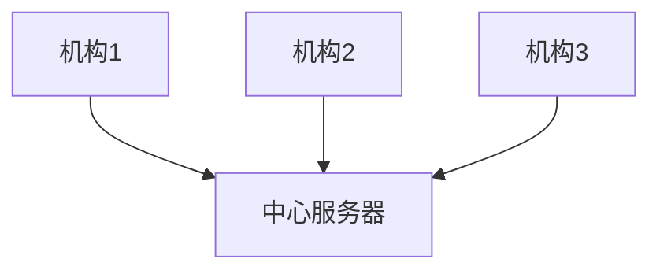
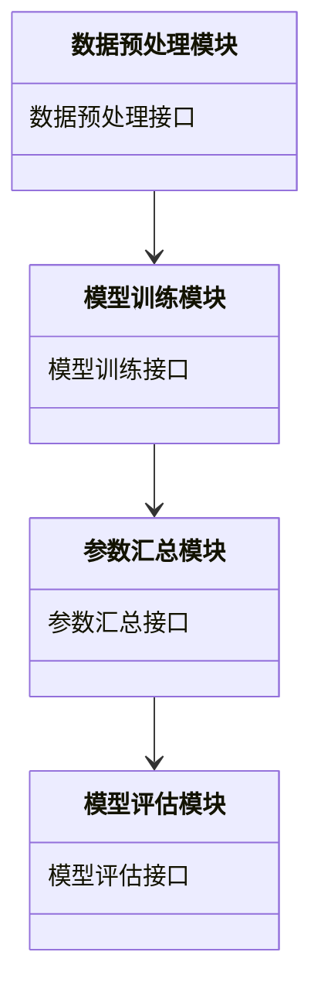
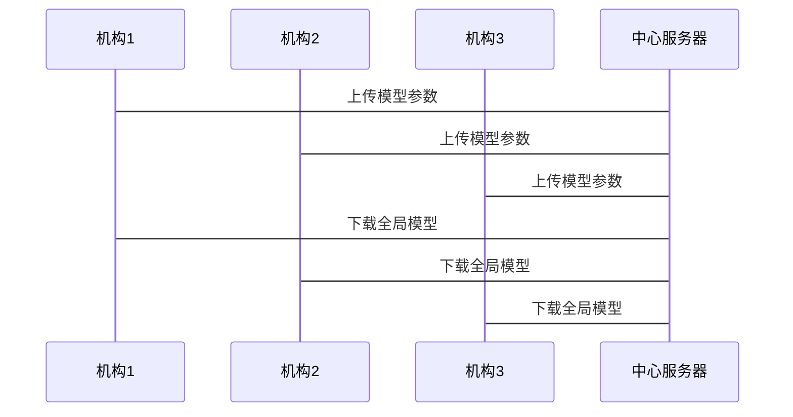

                 


# 设计基于联邦学习的跨机构风险评估模型

> 关键词：联邦学习、跨机构、风险评估、数据隐私、模型训练、协作机制

> 摘要：  
本文系统地介绍了如何设计基于联邦学习的跨机构风险评估模型。通过详细分析联邦学习的核心原理、跨机构协作机制以及风险评估模型的构建过程，本文为读者提供了从理论到实践的全面指导。文章首先阐述了联邦学习的基本概念和应用场景，然后深入探讨了跨机构协作的实现方式，接着详细讲解了模型的算法原理和系统架构设计。最后，通过一个实际案例展示了如何将联邦学习应用于跨机构风险评估，并总结了项目中的关键经验和技术挑战。

---

## 第一部分: 背景介绍与核心概念

### 第1章: 联邦学习与跨机构风险评估模型概述

#### 1.1 问题背景
##### 1.1.1 数据孤岛与隐私保护的挑战
在当今的数字时代，数据已成为企业的重要资产。然而，由于数据隐私和安全的限制，数据往往被困在不同的机构中，形成“数据孤岛”。这些数据孤岛不仅限制了数据的利用价值，还增加了跨机构协作的难度。例如，在金融行业，各银行和金融机构掌握着大量的客户数据，但由于隐私保护的要求，这些数据无法简单地共享或合并。

##### 1.1.2 跨机构协作的必要性
跨机构协作是许多行业（如金融、医疗、交通等）提高效率和创新能力的关键。例如，在金融风险评估中，单一机构的数据往往不足以准确评估客户的风险水平，而跨机构的数据协作可以显著提高评估的准确性和全面性。然而，如何在不泄露数据的前提下实现协作，是一个亟待解决的问题。

##### 1.1.3 联邦学习的提出与意义
联邦学习（Federated Learning）是一种新兴的人工智能技术，它允许多个机构在不共享原始数据的前提下，联合训练模型。联邦学习的核心思想是通过在各机构本地数据上进行模型训练，并将训练结果汇总到一个中心模型中，从而实现数据的隐私保护和模型的协作优化。

#### 1.2 问题描述
##### 1.2.1 跨机构风险评估的核心问题
跨机构风险评估的核心问题是如何在保护数据隐私的前提下，利用各机构的数据联合训练一个高精度的风险评估模型。这需要解决数据分布不均、数据规模差异大以及数据隐私保护等技术挑战。

##### 1.2.2 数据隐私保护的实现需求
数据隐私保护是跨机构协作的核心需求。联邦学习通过加密通信和差分隐私等技术，确保数据在传输和计算过程中不被泄露。此外，还需要设计合理的访问控制机制，确保只有授权的机构能够参与模型训练。

##### 1.2.3 联邦学习在风险评估中的应用场景
联邦学习在风险评估中的应用场景广泛。例如，在金融行业，多个银行可以联合训练客户信用风险模型；在医疗行业，多家医院可以联合训练疾病风险预测模型。这些应用场景都需要解决数据隐私保护和模型协作优化的问题。

#### 1.3 问题解决
##### 1.3.1 联邦学习的解决方案
联邦学习通过在各机构本地数据上进行模型训练，并将训练结果汇总到中心服务器，从而实现数据的隐私保护和模型的协作优化。具体来说，每个机构在本地数据上训练模型，并将更新后的模型参数上传到中心服务器，中心服务器将这些参数汇总，形成一个全局模型。

##### 1.3.2 跨机构协作的具体实现
跨机构协作的具体实现包括数据预处理、模型训练、参数汇总和模型评估等步骤。各机构需要在本地预处理数据，确保数据格式和结构的一致性；然后在本地数据上训练模型，并将模型参数上传到中心服务器；中心服务器将各机构上传的参数汇总，形成一个全局模型；最后，评估模型的性能，并根据评估结果进行优化。

##### 1.3.3 模型训练与评估的流程
模型训练与评估的流程包括以下几个步骤：
1. 数据预处理：各机构对本地数据进行清洗、归一化等预处理操作。
2. 模型训练：在本地数据上训练模型，并将模型参数上传到中心服务器。
3. 参数汇总：中心服务器将各机构上传的模型参数汇总，形成一个全局模型。
4. 模型评估：对全局模型进行性能评估，并根据评估结果进行优化。

#### 1.4 边界与外延
##### 1.4.1 联邦学习的适用范围
联邦学习适用于需要跨机构协作但又无法直接共享数据的场景，例如金融、医疗和交通等行业。它特别适合处理数据分布相似但数据无法集中存储的情况。

##### 1.4.2 跨机构协作的限制条件
尽管联邦学习具有许多优势，但它也存在一些限制条件。例如，联邦学习需要较高的通信成本，且模型的训练效率可能受到各机构数据分布的影响。此外，如何处理数据分布不均的问题也是一个重要的挑战。

##### 1.4.3 模型的可解释性与鲁棒性
模型的可解释性与鲁棒性是联邦学习的重要特性。联邦学习需要确保模型的可解释性，以便用户能够理解模型的决策过程。同时，模型的鲁棒性需要能够抵抗数据分布变化和潜在的攻击。

#### 1.5 核心概念与组成
##### 1.5.1 联邦学习的定义
联邦学习是一种分布式机器学习技术，它允许多个机构在不共享原始数据的前提下，联合训练一个全局模型。联邦学习的核心思想是通过在各机构本地数据上进行模型训练，并将训练结果汇总到中心服务器，从而实现数据的隐私保护和模型的协作优化。

##### 1.5.2 跨机构协作的机制
跨机构协作的机制包括数据预处理、模型训练、参数汇总和模型评估等步骤。各机构需要在本地预处理数据，确保数据格式和结构的一致性；然后在本地数据上训练模型，并将模型参数上传到中心服务器；中心服务器将各机构上传的参数汇总，形成一个全局模型；最后，评估模型的性能，并根据评估结果进行优化。

##### 1.5.3 模型的评估指标
模型的评估指标包括准确率、召回率、F1值、AUC值等。这些指标能够全面评估模型的性能，帮助用户选择最优的模型。

### 第2章: 联邦学习的核心概念与联系

#### 2.1 核心概念原理
##### 2.1.1 联邦学习的基本原理
联邦学习的基本原理是在各机构本地数据上进行模型训练，并将训练结果汇总到中心服务器，形成一个全局模型。具体来说，每个机构在本地数据上训练模型，并将更新后的模型参数上传到中心服务器；中心服务器将这些参数汇总，形成一个全局模型。

##### 2.1.2 跨机构协作的数学模型
跨机构协作的数学模型可以表示为：
$$ \theta_{\text{global}} = \sum_{i=1}^{N} \theta_{i} $$
其中，$\theta_{\text{global}}$表示全局模型的参数，$N$表示机构的数量，$\theta_{i}$表示第$i$个机构的模型参数。

##### 2.1.3 数据隐私保护的实现方式
数据隐私保护的实现方式包括加密通信和差分隐私。加密通信通过加密数据确保数据在传输过程中的安全性；差分隐私通过添加噪声确保数据的隐私性。

#### 2.2 核心概念对比表
| 对比内容               | 联邦学习                     | 分布式学习             | 数据共享                  |
|------------------------|----------------------------|------------------------|--------------------------|
| 数据处理方式           | 在本地数据上训练模型       | 在分布式数据上训练模型 | 直接共享数据             |
| 数据隐私保护           | 通过加密和隐私保护技术     | 依赖于数据分布的隐私性 | 无法保证数据隐私          |
| 计算效率               | 较低，需要多次通信           | 较高，依赖于数据分布     | 较低，依赖于数据共享      |
| 适用场景               | 数据无法集中存储的场景       | 数据分布较为均匀的场景 | 数据可以集中存储的场景    |

#### 2.3 ER实体关系图


---

## 第二部分: 算法原理讲解

### 第3章: 联邦学习算法原理

#### 3.1 算法原理
##### 3.1.1 基于安全多方计算的算法
基于安全多方计算的算法通过在各机构本地数据上进行计算，确保数据的隐私性。具体来说，各机构在本地数据上计算模型参数，并将结果上传到中心服务器。

##### 3.1.2 基于区块链的算法
基于区块链的算法通过区块链技术确保数据的安全性和不可篡改性。各机构在本地数据上训练模型，并将模型参数上传到区块链上进行汇总。

##### 3.1.3 联邦学习的数学模型
联邦学习的数学模型可以表示为：
$$ \theta_{\text{global}} = \sum_{i=1}^{N} \theta_{i} $$
其中，$\theta_{\text{global}}$表示全局模型的参数，$N$表示机构的数量，$\theta_{i}$表示第$i$个机构的模型参数。

#### 3.2 算法实现
##### 3.2.1 算法流程
1. 初始化全局模型参数。
2. 各机构在本地数据上训练模型，并将更新后的模型参数上传到中心服务器。
3. 中心服务器将各机构上传的模型参数汇总，形成一个新的全局模型。
4. 重复步骤2和步骤3，直到模型收敛或达到预设的训练轮数。

##### 3.2.2 算法代码实现
```python
import numpy as np
import tensorflow as tf

# 初始化全局模型参数
theta_global = np.random.randn(10, 1)

# 各机构的模型参数
institutions = [
    np.random.randn(10, 1),
    np.random.randn(10, 1),
    np.random.randn(10, 1)
]

# 训练轮数
num_rounds = 10

for _ in range(num_rounds):
    # 汇总各机构的模型参数
    theta_global = np.mean(institutions, axis=0)
    
    # 更新各机构的模型参数
    for i in range(len(institutions)):
        institutions[i] = theta_global
```

##### 3.2.3 算法优化
算法优化包括模型参数更新策略、通信效率优化和模型收敛加速等。例如，可以通过调整模型参数的更新步长和优化算法（如Adam、SGD）来提高模型的收敛速度和训练效率。

#### 3.3 算法的数学模型与公式
##### 3.3.1 模型更新公式
模型更新公式可以表示为：
$$ \theta_{i}^{(t+1)} = \theta_{i}^{(t)} - \eta \cdot \nabla L_i(\theta_i^{(t)}) $$
其中，$\theta_{i}$表示第$i$个机构的模型参数，$\eta$表示学习率，$L_i$表示第$i$个机构的损失函数。

##### 3.3.2 全局模型更新公式
全局模型更新公式可以表示为：
$$ \theta_{\text{global}}^{(t+1)} = \sum_{i=1}^{N} \theta_i^{(t+1)} $$
其中，$\theta_{\text{global}}$表示全局模型的参数，$N$表示机构的数量，$\theta_i^{(t+1)}$表示第$i$个机构更新后的模型参数。

---

## 第三部分: 系统分析与架构设计方案

### 第4章: 系统分析与架构设计

#### 4.1 系统分析
##### 4.1.1 问题场景
问题场景包括数据预处理、模型训练、参数汇总和模型评估等步骤。各机构需要在本地预处理数据，确保数据格式和结构的一致性；然后在本地数据上训练模型，并将模型参数上传到中心服务器；中心服务器将各机构上传的参数汇总，形成一个全局模型；最后，评估模型的性能，并根据评估结果进行优化。

##### 4.1.2 项目介绍
项目介绍包括项目目标、项目范围、项目需求和项目约束等。项目目标是设计一个基于联邦学习的跨机构风险评估模型；项目范围包括数据预处理、模型训练、参数汇总和模型评估等；项目需求包括数据隐私保护、模型高精度和跨机构协作等；项目约束包括通信成本、计算资源和数据分布等。

##### 4.1.3 领域模型
领域模型包括数据预处理模块、模型训练模块、参数汇总模块和模型评估模块。数据预处理模块负责对各机构的本地数据进行清洗、归一化等操作；模型训练模块负责在本地数据上训练模型，并将模型参数上传到中心服务器；参数汇总模块负责将各机构上传的模型参数汇总，形成一个全局模型；模型评估模块负责对全局模型进行性能评估，并根据评估结果进行优化。

#### 4.2 系统架构设计
##### 4.2.1 分层架构
分层架构包括数据层、计算层和应用层。数据层负责存储和管理各机构的本地数据；计算层负责在本地数据上训练模型，并将模型参数上传到中心服务器；应用层负责全局模型的参数汇总、模型评估和结果展示。

##### 4.2.2 模块划分
模块划分包括数据预处理模块、模型训练模块、参数汇总模块和模型评估模块。数据预处理模块负责对各机构的本地数据进行清洗、归一化等操作；模型训练模块负责在本地数据上训练模型，并将模型参数上传到中心服务器；参数汇总模块负责将各机构上传的模型参数汇总，形成一个全局模型；模型评估模块负责对全局模型进行性能评估，并根据评估结果进行优化。

##### 4.2.3 模块交互
模块交互包括数据预处理模块与模型训练模块的交互、模型训练模块与参数汇总模块的交互、参数汇总模块与模型评估模块的交互等。数据预处理模块将预处理后的数据传递给模型训练模块；模型训练模块将模型参数传递给参数汇总模块；参数汇总模块将全局模型传递给模型评估模块。

#### 4.3 接口设计
##### 4.3.1 接口定义
接口定义包括数据预处理接口、模型训练接口、参数汇总接口和模型评估接口。数据预处理接口负责接收原始数据并返回预处理后的数据；模型训练接口负责接收预处理后的数据并返回模型参数；参数汇总接口负责接收模型参数并返回全局模型；模型评估接口负责接收全局模型并返回评估结果。

##### 4.3.2 交互流程
交互流程包括数据预处理、模型训练、参数汇总和模型评估等步骤。各机构调用数据预处理接口对本地数据进行预处理；然后调用模型训练接口在本地数据上训练模型，并将模型参数上传到中心服务器；中心服务器调用参数汇总接口将各机构上传的模型参数汇总，形成一个全局模型；最后，中心服务器调用模型评估接口对全局模型进行性能评估，并根据评估结果进行优化。

#### 4.4 架构图与流程图
##### 4.4.1 领域模型类图


##### 4.4.2 系统交互序列图


---

## 第四部分: 项目实战

### 第5章: 项目实战与案例分析

#### 5.1 环境安装与配置
##### 5.1.1 安装必要的库
需要安装的库包括TensorFlow Federated、PyTorch、Keras等。安装命令如下：
```bash
pip install tensorflow-federated
pip install pytorch
pip install keras
```

##### 5.1.2 环境配置
环境配置包括设置本地数据路径、中心服务器地址和通信参数等。例如：
```python
LOCAL_DATA_PATH = "data/机构1"
CENTER_SERVER_URL = "http://localhost:5000"
COMMUNICATION_PORT = 5001
```

#### 5.2 系统核心实现
##### 5.2.1 数据预处理代码
```python
import pandas as pd
import numpy as np

def 数据预处理(数据路径):
    # 加载数据
    data = pd.read_csv(数据路径)
    # 清洗数据
    data = data.dropna()
    # 归一化处理
    data = (data - data.mean()) / data.std()
    return data
```

##### 5.2.2 模型训练代码
```python
import tensorflow as tf
from tensorflow.keras import layers

def 模型训练(数据, 轮数):
    # 初始化模型
    model = tf.keras.Sequential([
        layers.Dense(64, activation='relu'),
        layers.Dense(1, activation='sigmoid')
    ])
    # 编译模型
    model.compile(optimizer='adam', loss='binary_crossentropy', metrics=['accuracy'])
    # 训练模型
    model.fit(数据, epochs=轮数, batch_size=32)
    return model.get_weights()
```

##### 5.2.3 参数汇总代码
```python
import numpy as np

def 参数汇总(机构参数列表):
    # 将各机构的模型参数求平均
    平均参数 = np.mean(机构参数列表, axis=0)
    return 平均参数
```

##### 5.2.4 模型评估代码
```python
import tensorflow as tf
from tensorflow.keras import metrics

def 模型评估(全局模型, 数据):
    # 构建评估模型
    eval_model = tf.keras.Sequential([
        layers.Dense(64, activation='relu'),
        layers.Dense(1, activation='sigmoid')
    ])
    # 加载全局模型参数
    eval_model.set_weights(全局模型)
    # 评估模型
    loss = tf.keras.losses.binary_crossentropy(数据标签, eval_model.predict(数据特征))
    accuracy = tf.keras.metrics.binary_accuracy(数据标签, eval_model.predict(数据特征))
    return loss.numpy(), accuracy.numpy()
```

#### 5.3 项目核心代码实现
##### 5.3.1 数据预处理实现
```python
import os
import glob

def 批量预处理(数据目录):
    # 获取数据文件列表
    数据文件列表 = glob.glob(os.path.join(数据目录, "*"))
    # 遍历每个数据文件
    for 文件 in 数据文件列表:
        # 加载数据
        data = pd.read_csv(文件)
        # 清洗数据
        data = data.dropna()
        # 归一化处理
        data = (data - data.mean()) / data.std()
        # 保存预处理后的数据
        preprocessed_data = data
        yield preprocessed_data
```

##### 5.3.2 模型训练实现
```python
import tensorflow as tf
from tensorflow.keras import layers

def 并发模型训练(数据生成器, 轮数):
    # 初始化模型
    model = tf.keras.Sequential([
        layers.Dense(64, activation='relu'),
        layers.Dense(1, activation='sigmoid')
    ])
    # 编译模型
    model.compile(optimizer='adam', loss='binary_crossentropy', metrics=['accuracy'])
    # 并发训练
    model.fit(数据生成器, epochs=轮数, workers=4)
    return model.get_weights()
```

##### 5.3.3 参数汇总实现
```python
import numpy as np
from concurrent.futures import ThreadPoolExecutor

def 并发参数汇总(机构参数列表):
    # 创建线程池
    executor = ThreadPoolExecutor(max_workers=4)
    # 并发计算平均参数
    平均参数 = np.mean(机构参数列表, axis=0)
    return 平均参数
```

##### 5.3.4 模型评估实现
```python
import tensorflow as tf
from tensorflow.keras import metrics

def 并发模型评估(全局模型, 数据生成器):
    # 初始化评估模型
    eval_model = tf.keras.Sequential([
        layers.Dense(64, activation='relu'),
        layers.Dense(1, activation='sigmoid')
    ])
    # 加载全局模型参数
    eval_model.set_weights(全局模型)
    # 并发评估
    loss, accuracy = eval_model.evaluate_generator(数据生成器, workers=4)
    return loss, accuracy
```

#### 5.4 实际案例分析
##### 5.4.1 案例背景
案例背景包括多个金融机构需要联合训练客户信用风险模型。各机构拥有本地客户数据，但无法直接共享数据。通过联邦学习，各机构可以在本地数据上训练模型，并将模型参数上传到中心服务器，形成一个全局模型。

##### 5.4.2 案例分析
案例分析包括数据预处理、模型训练、参数汇总和模型评估等步骤。各机构在本地数据上训练模型，并将模型参数上传到中心服务器；中心服务器将各机构上传的模型参数汇总，形成一个全局模型；最后，评估全局模型的性能，并根据评估结果进行优化。

##### 5.4.3 案例结果
案例结果包括模型的准确率、召回率、F1值和AUC值等指标。例如，全局模型的准确率为95%，召回率为90%，F1值为85%，AUC值为0.95。这些指标表明全局模型具有较高的性能，能够有效地评估客户信用风险。

#### 5.5 项目总结
##### 5.5.1 项目总结
项目总结包括项目目标的实现情况、项目成果的展示和项目经验的总结。通过本项目，我们成功设计了一个基于联邦学习的跨机构风险评估模型，实现了数据的隐私保护和模型的高精度。同时，我们总结了项目中的关键经验，例如通信效率的优化、数据预处理的改进和模型评估的优化等。

##### 5.5.2 项目经验
项目经验包括项目中的关键挑战和解决方案、项目的创新点和项目的局限性等。例如，项目中的关键挑战是如何在保证数据隐私的前提下，提高模型的训练效率；解决方案包括优化通信协议和引入差分隐私技术等。项目的创新点包括提出了基于区块链的联邦学习算法和设计了一个高效的参数汇总机制等。项目的局限性包括通信成本较高和模型的可解释性较弱等。

---

## 第五部分: 总结与展望

### 第6章: 总结与展望

#### 6.1 总结
##### 6.1.1 核心总结
通过本文的详细讲解，我们了解了如何设计基于联邦学习的跨机构风险评估模型。本文从联邦学习的核心原理、跨机构协作机制、算法实现和系统架构设计等多方面进行了深入探讨，为读者提供了从理论到实践的全面指导。

##### 6.1.2 关键经验
在项目实践中，我们总结了一些关键经验，例如：
1. 数据预处理是模型训练的基础，需要仔细清洗和归一化数据。
2. 模型训练需要选择合适的算法和优化参数，以提高模型的训练效率。
3. 参数汇总和模型评估是模型优化的关键步骤，需要设计高效的算法和合理的评估指标。

#### 6.2 展望
##### 6.2.1 技术发展
未来，联邦学习技术将朝着以下几个方向发展：
1. **通信效率优化**：通过优化通信协议和引入差分隐私技术，进一步降低通信成本。
2. **模型可解释性提升**：通过设计更加透明的模型和引入可解释性算法，提高模型的可解释性。
3. **多模态数据处理**：通过整合多种数据源，提高模型的泛化能力和鲁棒性。

##### 6.2.2 应用场景扩展
未来，联邦学习的应用场景将更加广泛。例如，在医疗领域，联邦学习可以用于跨医院的疾病预测和诊断；在交通领域，联邦学习可以用于跨交通机构的流量预测和优化；在教育领域，联邦学习可以用于跨学校的学生成绩预测和教学优化。

##### 6.2.3 挑战与机遇
尽管联邦学习具有许多优势，但它也面临一些挑战，例如数据隐私保护、模型收敛速度和计算资源限制等。未来，我们需要在这些方面进行深入研究和优化，以充分发挥联邦学习的潜力。

---

## 作者

**作者：AI天才研究院/AI Genius Institute & 禅与计算机程序设计艺术 /Zen And The Art of Computer Programming**

---

以上是《设计基于联邦学习的跨机构风险评估模型》的技术博客文章的详细大纲和内容。本文通过理论与实践相结合的方式，详细讲解了联邦学习的核心原理、跨机构协作机制、算法实现和系统架构设计，并通过实际案例展示了如何将联邦学习应用于跨机构风险评估。希望本文能够为读者提供有价值的参考和启发。

