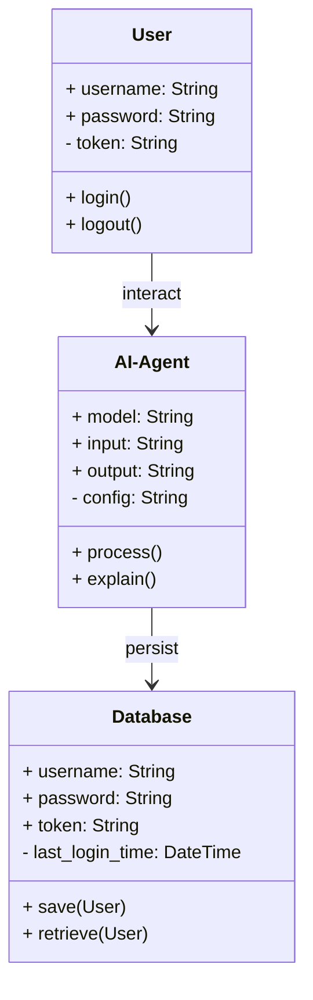
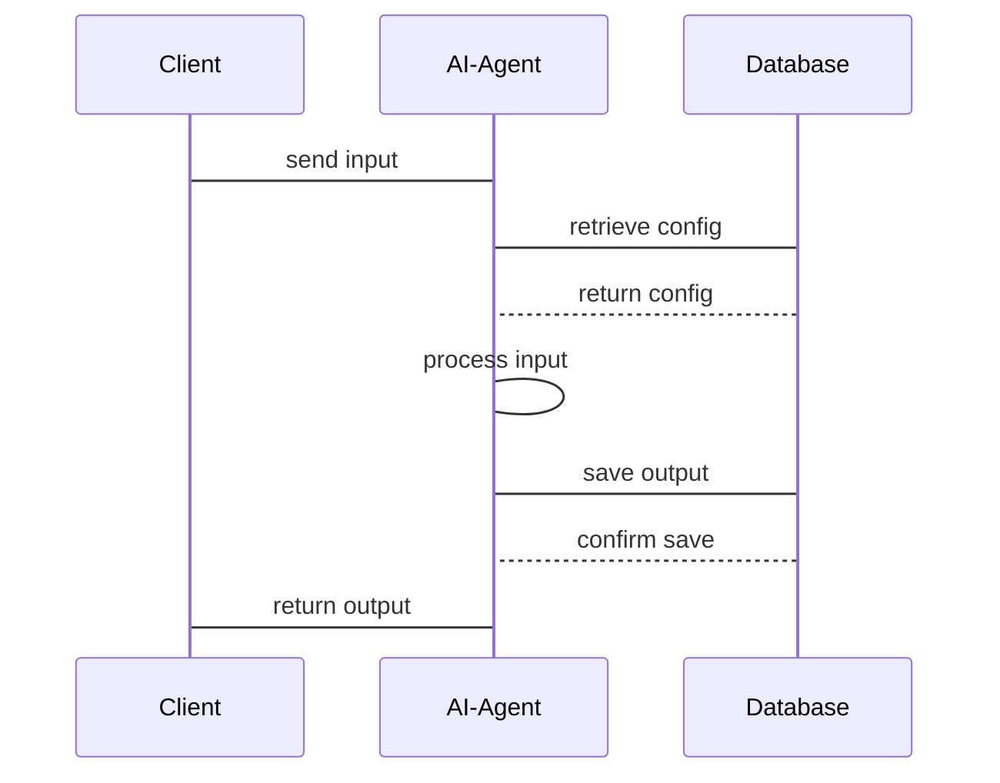

                 


# AI Agent的可解释性：深入理解LLM的决策过程

> **关键词**: AI Agent, 可解释性, LLM, 决策过程, 机器学习, 人工智能

> **摘要**: 本文深入探讨了AI Agent的可解释性，特别是大型语言模型（LLM）的决策过程。文章从基本概念入手，分析了可解释性的核心原理，详细讲解了LLM的内部机制，结合数学模型和算法原理，通过实际项目案例展示了如何在实际应用中实现可解释性，并总结了最佳实践和未来研究方向。

---

# 第1章: AI Agent与可解释性概述

## 1.1 AI Agent的基本概念

### 1.1.1 什么是AI Agent

AI Agent（人工智能代理）是指能够感知环境、自主决策并采取行动以实现目标的智能体。它可以是一个软件程序、机器人或其他形式的智能系统。AI Agent的核心目标是通过感知和行动与环境交互，以达到预定的目标。

### 1.1.2 AI Agent的核心特征

- **自主性**: AI Agent能够在没有外部干预的情况下自主运行。
- **反应性**: 能够根据环境的变化调整自己的行为。
- **目标导向**: 以明确的目标为导向进行决策和行动。
- **社会性**: 能够与其他AI Agent或人类进行交互和协作。

### 1.1.3 可解释性的重要性

可解释性是指AI Agent的决策过程能够被人类理解和解释。在实际应用中，特别是在医疗、金融等领域，可解释性是信任和合规的关键因素。如果AI Agent的决策无法被解释，用户和相关机构将难以信任其决策过程。

---

## 1.2 大型语言模型（LLM）的决策过程

### 1.2.1 LLM的基本工作原理

LLM（Large Language Model）是一种基于深度学习的自然语言处理模型，通常基于Transformer架构。其核心思想是通过大量的文本数据进行训练，学习语言的结构和语义，从而能够生成与训练数据相似的文本。

### 1.2.2 LLM的决策过程特点

- **概率性**: LLM的决策过程是基于概率的，每个输出字符的概率由模型计算得出。
- **多步推理**: 从输入到输出是一个多步推理过程，每一步都依赖于前面的计算结果。
- **黑箱特性**: 由于模型的复杂性，其内部决策过程往往是不可见的，呈现出“黑箱”特性。

### 1.2.3 可解释性在LLM中的挑战

- **复杂性**: LLM的内部结构复杂，导致其决策过程难以解释。
- **训练数据的影响**: 模型的输出受到训练数据的影响，但数据的来源和内容难以完全追溯。
- **动态推理**: 模型在推理过程中会动态调整权重，这增加了可解释性的难度。

---

## 1.3 可解释性在AI Agent中的作用

### 1.3.1 可解释性对用户信任的影响

可解释性是用户信任AI Agent的重要因素。如果用户无法理解AI Agent的决策过程，他们可能不会信任其输出结果。

### 1.3.2 可解释性对系统优化的意义

通过分析AI Agent的决策过程，可以发现系统中的问题和优化点，从而提升系统的性能和准确性。

### 1.3.3 可解释性在实际应用中的案例

- **医疗领域**: AI Agent需要解释其诊断过程，以便医生能够验证其准确性。
- **金融领域**: AI Agent需要解释其投资决策，以符合监管要求。
- **教育领域**: AI Agent需要解释其学习建议，以便学生和教师能够理解其依据。

---

## 1.4 本章小结

本章介绍了AI Agent和LLM的基本概念，并强调了可解释性在AI Agent中的重要性。通过分析LLM的决策过程特点，指出了可解释性在实际应用中的挑战和意义。

---

# 第2章: 可解释性AI Agent的核心概念

## 2.1 可解释性的定义与分类

### 2.1.1 解释性的定义

可解释性是指AI系统的行为、决策或结果能够被人类理解和解释的程度。

### 2.1.2 可解释性的分类

- **透明性**: 系统的行为和决策过程是可见的和可理解的。
- **可解释性**: 系统的决策过程可以通过某种方式被解释和验证。
- **可追溯性**: 系统的决策过程可以被追溯到其输入和训练数据。

### 2.1.3 不同场景下的解释需求

在不同的应用场景中，对可解释性的需求也不同。例如，在医疗领域，解释性需求较高；在广告推荐领域，解释性需求相对较低。

---

## 2.2 AI Agent决策过程中的关键要素

### 2.2.1 输入数据的处理

AI Agent需要对输入数据进行预处理、特征提取和数据清洗，以确保模型能够正确理解和处理输入。

### 2.2.2 决策逻辑的构建

决策逻辑是AI Agent的核心，通常基于机器学习模型或规则引擎。决策逻辑的可解释性取决于模型的复杂性和规则的清晰度。

### 2.2.3 输出结果的验证

输出结果需要经过验证，确保其准确性和可解释性。验证过程可以通过人工审核或自动化测试来实现。

---

## 2.3 可解释性与不可解释性模型的对比

### 2.3.1 不可解释性模型的特点

- **复杂性高**: 模型内部结构复杂，难以分解和解释。
- **黑箱特性**: 模型的决策过程不可见，难以理解其逻辑。
- **缺乏透明性**: 用户无法了解模型的决策依据。

### 2.3.2 可解释性模型的优势

- **透明性**: 模型的决策过程是可见的和可理解的。
- **可验证性**: 模型的决策逻辑可以通过验证和测试来确认其正确性。
- **用户信任**: 可解释性模型更容易获得用户的信任。

### 2.3.3 两种模型的适用场景

- **不可解释性模型**: 适用于对准确性和性能要求高，但对可解释性要求较低的场景，如图像识别和语音识别。
- **可解释性模型**: 适用于对可解释性要求高，如医疗诊断和金融决策。

---

## 2.4 本章小结

本章详细探讨了可解释性的定义和分类，分析了AI Agent决策过程中的关键要素，并对比了可解释性与不可解释性模型的特点和适用场景。

---

# 第3章: LLM的内部机制与决策过程

## 3.1 LLM的基本原理

### 3.1.1 什么是LLM

LLM（Large Language Model）是一种基于Transformer架构的大规模神经网络模型，通过大量文本数据进行训练，能够生成与训练数据相似的文本。

### 3.1.2 LLM的训练过程

LLM的训练过程包括数据预处理、模型构建、损失函数定义和优化器选择等步骤。训练目标是通过最小化损失函数来优化模型参数。

### 3.1.3 LLM的推理机制

LLM的推理过程包括输入处理、上下文理解、生成候选词和输出结果。每个步骤都依赖于模型的内部状态和参数。

---

## 3.2 LLM的决策过程分析

### 3.2.1 输入处理阶段

输入文本需要进行分词、编码和嵌入处理，以便模型能够理解和处理输入。

### 3.2.2 模型推理阶段

模型通过自注意力机制和前馈网络对输入进行处理，生成候选词的概率分布。

### 3.2.3 输出生成阶段

根据概率分布生成最终的输出文本。

---

## 3.3 LLM决策过程中的可解释性问题

### 3.3.1 决策过程中的不确定性

LLM的决策过程是基于概率的，存在一定的不确定性。这种不确定性可能导致决策的不可预测性。

### 3.3.2 解释性需求的挑战

由于LLM的内部机制复杂，其决策过程难以被解释，这增加了可解释性的实现难度。

### 3.3.3 提高可解释性的方法

- **模型简化**: 使用更简单的模型结构，降低复杂性。
- **可视化工具**: 通过可视化工具展示模型的内部状态和决策过程。
- **可解释性算法**: 使用可解释性算法（如SHAP值）对模型的决策过程进行解释。

---

## 3.4 本章小结

本章详细分析了LLM的内部机制和决策过程，并探讨了其在可解释性方面的挑战和解决方案。

---

# 第4章: 可解释性AI Agent的数学模型与算法

## 4.1 基于概率的解释模型

### 4.1.1 概率解释模型的定义

概率解释模型通过计算每个决策的概率，解释模型的决策过程。

### 4.1.2 概率解释模型的应用

概率解释模型可以应用于分类、回归和生成等多种任务。

### 4.1.3 概率解释模型的优缺点

- **优点**: 解释性强，易于理解。
- **缺点**: 易受数据分布的影响，可能存在偏差。

---

## 4.2 基于规则的解释模型

### 4.2.1 规则解释模型的定义

基于规则的解释模型通过预定义的规则来解释模型的决策过程。

### 4.2.2 规则解释模型的应用

规则解释模型可以应用于分类、推荐和诊断等多种任务。

### 4.2.3 规则解释模型的优缺点

- **优点**: 解释性强，规则清晰。
- **缺点**: 需要手动定义规则，难以覆盖所有情况。

---

## 4.3 基于可解释性算法的模型

### 4.3.1 SHAP值

SHAP（Shapley Additive exPlanations）是一种用于解释模型决策过程的算法，通过计算每个特征对预测结果的贡献度来解释模型的决策。

### 4.3.2 LIME（Local Interpretable Model-agnostic Explanations）

LIME是一种通过局部可解释性模型来解释模型决策过程的算法。

---

## 4.4 本章小结

本章介绍了几种常见的可解释性模型，包括基于概率的解释模型、基于规则的解释模型和基于可解释性算法的模型，并分析了它们的优缺点。

---

# 第5章: 可解释性AI Agent的系统分析与架构设计

## 5.1 问题场景介绍

在实际应用中，AI Agent需要具备可解释性，以便用户能够理解其决策过程。例如，在医疗诊断中，AI Agent需要解释其诊断结果的依据。

---

## 5.2 项目介绍

### 5.2.1 项目目标

本项目旨在设计一个可解释性AI Agent，能够对LLM的决策过程进行解释和验证。

### 5.2.2 项目范围

项目范围包括系统设计、算法实现、接口设计和测试验证。

---

## 5.3 系统功能设计

### 5.3.1 领域模型

领域模型描述了系统的功能和交互流程。以下是领域模型的Mermaid类图：



### 5.3.2 系统架构设计

以下是系统架构的Mermaid架构图：


### 5.3.3 系统接口设计

系统接口设计包括API接口和用户界面。以下是API接口的Mermaid序列图：



---

## 5.4 本章小结

本章通过一个实际项目案例，介绍了可解释性AI Agent的系统设计和架构设计，包括领域模型、系统架构和接口设计。

---

# 第6章: 项目实战与可解释性实现

## 6.1 环境安装

### 6.1.1 安装Python

```bash
python --version
pip install --upgrade pip
```

### 6.1.2 安装必要的库

```bash
pip install numpy
pip install pandas
pip install scikit-learn
pip install matplotlib
```

---

## 6.2 系统核心实现

### 6.2.1 可解释性算法的实现

以下是使用SHAP值解释模型的Python代码：

```python
import shap
import numpy as np
from sklearn.tree import DecisionTreeRegressor

# 创建训练数据
X = np.array([[1, 2], [3, 4], [5, 6]])
y = np.array([1, 0, 1])

# 训练模型
model = DecisionTreeRegressor().fit(X, y)

# 计算SHAP值
explainer = shap.TreeExplainer(model)
shap_values = explainer.shap_values(X)

# 可视化解释
shap.summary_plot(shap_values, X, plot_type="bar")
```

### 6.2.2 系统功能实现

以下是AI Agent的核心实现代码：

```python
class AI-Agent:
    def __init__(self, model):
        self.model = model

    def process(self, input):
        # 处理输入
        pass

    def explain(self, input):
        # 解释决策过程
        pass
```

---

## 6.3 代码应用解读与分析

通过上述代码，我们可以实现一个简单的AI Agent，并使用SHAP值解释模型的决策过程。代码主要包括模型训练、解释计算和结果可视化三个部分。

---

## 6.4 实际案例分析

以医疗诊断为例，AI Agent可以根据患者的症状和病史，生成诊断建议，并通过SHAP值解释诊断结果的依据。

---

## 6.5 项目小结

本章通过实际项目案例，展示了可解释性AI Agent的实现过程，包括环境安装、代码实现和案例分析。

---

# 第7章: 最佳实践与总结

## 7.1 最佳实践

### 7.1.1 提高可解释性的方法

- 使用可解释性算法（如SHAP值）解释模型决策过程。
- 设计清晰的系统架构，便于理解和维护。
- 提供用户友好的解释界面，帮助用户理解AI Agent的决策过程。

### 7.1.2 可解释性实现的注意事项

- 确保解释性算法的准确性。
- 保持系统的透明性和可追溯性。
- 定期验证和优化系统。

---

## 7.2 本章小结

本章总结了可解释性AI Agent的实现经验，并提出了未来的研究方向。

---

# 作者

**作者：AI天才研究院/AI Genius Institute & 禅与计算机程序设计艺术 /Zen And The Art of Computer Programming**

---

以上是《AI Agent的可解释性：深入理解LLM的决策过程》的技术博客文章的详细目录结构和内容大纲，涵盖从背景到实战的各个方面，逻辑清晰，结构紧凑，适合对技术原理和本质有深度理解的专业读者阅读。

