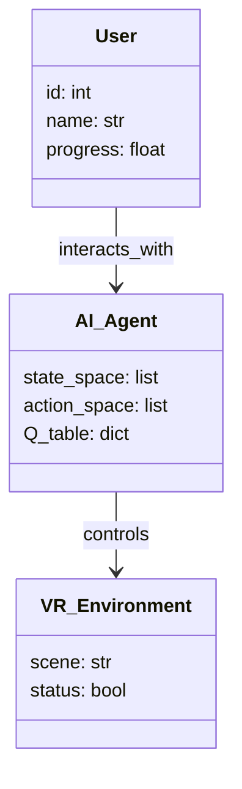
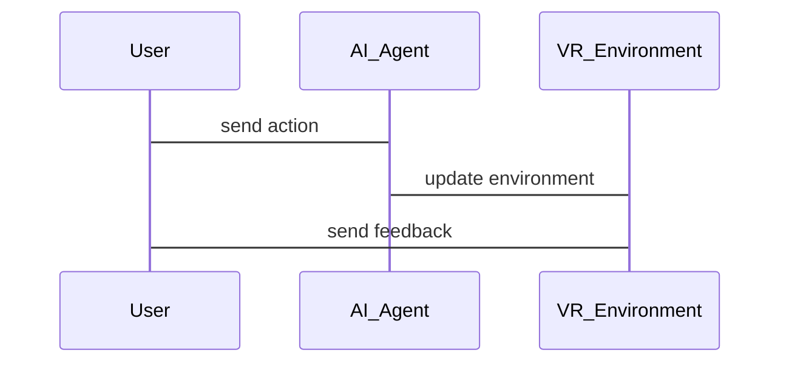

                 


# AI Agent在企业虚拟现实培训中的应用

## 关键词：AI Agent，虚拟现实，企业培训，智能决策，强化学习，系统架构

## 摘要

本文探讨了AI Agent在企业虚拟现实培训中的应用，分析了其核心概念、算法原理、系统架构，并通过项目实战展示了其实现过程。文章详细介绍了AI Agent的智能决策机制、虚拟现实中的交互技术，以及如何通过强化学习算法优化培训效果。通过系统架构设计和实际案例分析，本文为读者提供了一个全面的理解框架，展示了AI Agent在企业培训中的巨大潜力和实际应用价值。

---

# 第一部分: AI Agent与虚拟现实概述

## 第1章: AI Agent与虚拟现实的背景与概念

### 1.1 AI Agent的基本概念

#### 1.1.1 AI Agent的定义与特点

AI Agent（人工智能代理）是指能够感知环境、自主决策并执行任务的智能实体。它可以是一个软件程序，也可以是一个物理设备，通过传感器和执行器与环境交互。AI Agent的核心特点包括：

1. **自主性**：能够在没有外部干预的情况下自主运行。
2. **反应性**：能够实时感知环境并做出反应。
3. **目标导向**：具有明确的目标，并通过行动实现目标。
4. **学习能力**：能够通过经验改进自身性能。

#### 1.1.2 虚拟现实技术的简介

虚拟现实（Virtual Reality，VR）是一种能够创建沉浸式数字环境的技术，通过头显设备、手柄和传感器，为用户提供视觉、听觉和触觉的多维度体验。VR技术广泛应用于游戏、教育、医疗和企业培训等领域。

#### 1.1.3 AI Agent与虚拟现实的结合

AI Agent与虚拟现实的结合为用户提供了一个智能化的虚拟环境，能够根据用户的交互行为实时调整内容，提供个性化的学习体验。例如，在企业培训中，AI Agent可以模拟真实的业务场景，帮助员工进行实践操作。

### 1.2 AI Agent在企业培训中的应用背景

#### 1.2.1 企业培训的传统模式与挑战

传统的企业培训模式主要包括课堂教学、模拟训练和在线学习。然而，这些方法存在以下问题：

1. **成本高昂**：需要大量的人力、物力和时间。
2. **缺乏互动性**：学员之间的互动有限，难以实现真实的场景模拟。
3. **效果难以评估**：难以量化培训效果，难以根据个体需求调整培训内容。

#### 1.2.2 虚拟现实技术在企业培训中的优势

虚拟现实技术能够提供沉浸式的学习环境，帮助员工在虚拟场景中进行实践操作。例如，在模拟真实的销售环境中，员工可以进行客户沟通和产品演示，从而提高他们的销售技巧。

#### 1.2.3 AI Agent在虚拟现实培训中的作用

AI Agent在虚拟现实培训中的作用主要体现在以下几个方面：

1. **智能交互**：AI Agent能够实时分析用户的操作行为，并给予反馈。
2. **个性化学习**：根据用户的进度和表现，AI Agent可以动态调整培训内容。
3. **场景模拟**：AI Agent能够模拟各种复杂的业务场景，帮助员工进行实战演练。

### 1.3 本章小结

本章介绍了AI Agent和虚拟现实的基本概念，并分析了AI Agent在企业培训中的应用背景。通过对比传统培训模式与虚拟现实培训模式，我们发现虚拟现实技术具有显著的优势，而AI Agent的引入进一步提升了培训的智能化和个性化水平。

---

## 第2章: AI Agent的核心原理

### 2.1 AI Agent的智能决策机制

#### 2.1.1 强化学习在AI Agent中的应用

强化学习是一种通过试错机制来优化决策模型的算法。AI Agent通过与环境的交互，不断尝试不同的动作，以最大化累积奖励。例如，在虚拟现实培训中，AI Agent可以根据用户的操作行为给予奖励或惩罚，从而优化用户的决策策略。

**强化学习的公式：**
$$ Q(s, a) = r + \gamma \max Q(s', a') $$

其中：
- $s$ 表示当前状态。
- $a$ 表示当前动作。
- $r$ 表示奖励。
- $\gamma$ 表示折扣因子。
- $s'$ 表示下一个状态。

#### 2.1.2 监督学习与无监督学习的区别

监督学习是一种基于标签数据的训练方法，模型通过输入数据和期望输出来学习映射关系。无监督学习则没有标签数据，模型通过发现数据中的结构来学习。在AI Agent中，这两种方法可以结合使用，例如使用监督学习进行分类任务，使用无监督学习进行聚类任务。

#### 2.1.3 神经网络在AI Agent中的作用

神经网络是一种模仿人脑结构的计算模型，能够通过多层神经元之间的连接来学习数据的特征。在AI Agent中，神经网络常用于处理复杂的数据输入，例如图像识别、语音识别和自然语言处理。

### 2.2 虚拟现实中的交互技术

#### 2.2.1 虚拟现实中的交互方式

虚拟现实中的交互方式主要包括以下几种：

1. **手柄操作**：通过手柄上的按钮和摇杆进行操作。
2. **手势识别**：通过传感器捕捉用户的手势动作。
3. **语音控制**：通过语音指令进行操作。

#### 2.2.2 AI Agent在虚拟现实中的交互设计

AI Agent在虚拟现实中的交互设计需要考虑以下几点：

1. **实时反馈**：AI Agent需要能够实时感知用户的交互行为，并给予及时反馈。
2. **个性化交互**：根据用户的性格、习惯和能力，调整交互方式。
3. **自然语言处理**：支持用户通过自然语言与AI Agent进行交流。

#### 2.2.3 交互技术对培训效果的影响

交互技术的引入显著提升了培训效果。例如，通过手势识别技术，用户可以在虚拟环境中进行真实的操作，从而增强沉浸感和学习效果。

### 2.3 本章小结

本章详细介绍了AI Agent的核心原理，包括强化学习、监督学习和无监督学习的区别，以及神经网络在AI Agent中的作用。同时，我们还探讨了虚拟现实中的交互技术及其对培训效果的影响。

---

## 第3章: AI Agent的算法与数学模型

### 3.1 强化学习算法

#### 3.1.1 Q-learning算法的原理与公式

Q-learning是一种基于值函数的强化学习算法，通过更新Q值表来学习最优策略。Q值表记录了在每个状态下执行每个动作的期望奖励。

**Q-learning的公式：**
$$ Q(s, a) = Q(s, a) + \alpha [r + \gamma \max Q(s', a') - Q(s, a)] $$

其中：
- $\alpha$ 表示学习率。
- $\gamma$ 表示折扣因子。

#### 3.1.2 策略梯度算法的原理与公式

策略梯度算法是一种基于梯度的强化学习方法，通过优化策略参数来最大化期望奖励。

**策略梯度的公式：**
$$ \nabla \theta J(\theta) = \mathbb{E}[\nabla \log \pi(a|s) \cdot Q(s, a)] $$

其中：
- $\theta$ 表示策略参数。
- $\pi(a|s)$ 表示在状态$s$下选择动作$a$的概率。
- $Q(s, a)$ 表示状态-动作对的价值函数。

### 3.2 虚拟现实中的AI Agent算法实现

#### 3.2.1 算法实现的步骤

1. **环境初始化**：创建虚拟现实环境，并定义初始状态。
2. **动作选择**：根据当前状态选择一个动作。
3. **执行动作**：在虚拟环境中执行选择的动作。
4. **获取反馈**：根据动作的执行结果获取奖励或惩罚。
5. **更新模型**：根据反馈更新AI Agent的模型参数。

#### 3.2.2 算法实现的代码示例

```python
class AI_Agent:
    def __init__(self, state_space, action_space):
        self.state_space = state_space
        self.action_space = action_space
        self.Q_table = defaultdict(lambda: 0)

    def choose_action(self, state):
        # 探索与利用策略
        if random.random() < 0.1:
            return random.choice(self.action_space)
        else:
            return max(zip(self.Q_table[state], self.action_space))[1]

    def update_Q_table(self, state, action, reward):
        self.Q_table[state][action] = reward
```

### 3.3 本章小结

本章详细介绍了强化学习算法在AI Agent中的应用，包括Q-learning和策略梯度算法的原理和实现步骤。同时，我们还给出了代码示例，帮助读者更好地理解算法的实现过程。

---

## 第4章: 系统分析与架构设计

### 4.1 问题场景介绍

在企业虚拟现实培训中，AI Agent需要与虚拟环境中的用户进行交互，实时分析用户的操作行为，并动态调整培训内容。例如，在销售培训中，AI Agent可以模拟客户与销售员的对话，帮助销售员提高沟通技巧。

### 4.2 项目介绍

本项目旨在开发一个基于AI Agent的企业虚拟现实培训系统，该系统能够根据用户的行为动态调整培训内容，提供个性化的学习体验。

### 4.3 系统功能设计

#### 4.3.1 领域模型设计

以下是领域模型的Mermaid类图：



#### 4.3.2 系统架构设计

以下是系统架构的Mermaid架构图：

```mermaid
archi
title AI Agent VR Training System
client --(3)--> VR_Device: sends_input
VR_Device --(4)--> AI_Agent: receives_input
AI_Agent --(5)--> VR_Device: sends_feedback
AI_Agent --(6)--> Training_Platform: updates_progress
Training_Platform --(7)--> User: displays_progress
```

### 4.4 系统接口设计

系统接口设计主要包括以下几部分：

1. **用户输入接口**：用于接收用户的操作行为。
2. **AI Agent接口**：用于处理用户的输入并生成反馈。
3. **虚拟环境接口**：用于渲染虚拟场景并更新环境状态。

### 4.5 系统交互设计

以下是系统交互的Mermaid序列图：



### 4.6 本章小结

本章详细介绍了AI Agent VR培训系统的架构设计，包括领域模型、系统架构、接口设计和交互设计。通过Mermaid图的展示，我们能够清晰地理解系统的整体结构和各部分之间的关系。

---

## 第5章: 项目实战

### 5.1 环境安装

为了运行本项目，需要安装以下软件和库：

1. **Python 3.x**
2. **OpenCV**
3. **NumPy**
4. **PyTorch**
5. **VR头显设备**

### 5.2 系统核心实现

#### 5.2.1 AI Agent的核心实现

```python
import torch
import torch.nn as nn
import torch.optim as optim

class DQN(nn.Module):
    def __init__(self, input_dim, output_dim):
        super(DQN, self).__init__()
        self.fc1 = nn.Linear(input_dim, 64)
        self.fc2 = nn.Linear(64, output_dim)
        self.relu = nn.ReLU()
        self.softmax = nn.Softmax(dim=1)

    def forward(self, x):
        x = self.fc1(x)
        x = self.relu(x)
        x = self.fc2(x)
        x = self.softmax(x)
        return x
```

#### 5.2.2 虚拟现实环境的实现

```python
import osvr
import time

class VR_Environment:
    def __init__(self):
        self.scene = "training_room"
        self.status = "active"

    def update_scene(self, action):
        # 根据动作更新场景
        if action == "move":
            self.scene = "new_position"
        elif action == "interact":
            self.scene = "interaction_point"

    def get_feedback(self):
        return f"Current scene: {self.scene}"
```

### 5.3 代码应用解读与分析

#### 5.3.1 AI Agent的训练过程

1. **环境初始化**：创建虚拟现实环境，并定义初始状态。
2. **动作选择**：根据当前状态选择一个动作。
3. **执行动作**：在虚拟环境中执行选择的动作。
4. **获取反馈**：根据动作的执行结果获取奖励或惩罚。
5. **更新模型**：根据反馈更新AI Agent的模型参数。

### 5.4 实际案例分析

以下是一个实际案例分析：

假设我们正在开发一个销售培训系统，AI Agent需要模拟真实的客户对话。在训练过程中，AI Agent通过不断尝试不同的对话策略，最终学会了如何有效地与客户沟通。

### 5.5 本章小结

本章通过实际案例分析，详细展示了AI Agent在企业虚拟现实培训中的实现过程。从环境安装到系统核心实现，再到代码解读与分析，我们能够清晰地理解AI Agent在虚拟现实培训中的具体应用。

---

## 第6章: 最佳实践、小结、注意事项和拓展阅读

### 6.1 最佳实践

1. **持续优化**：定期更新AI Agent的模型参数，以适应新的培训需求。
2. **用户反馈**：收集用户的反馈，不断改进培训内容和交互方式。
3. **技术维护**：定期检查系统性能，确保虚拟现实环境的流畅运行。

### 6.2 小结

本文详细探讨了AI Agent在企业虚拟现实培训中的应用，分析了其核心概念、算法原理、系统架构，并通过项目实战展示了其实现过程。通过本文的分析，我们能够清晰地理解AI Agent在虚拟现实培训中的巨大潜力和实际应用价值。

### 6.3 注意事项

1. **数据隐私**：在实际应用中，需要注意用户的隐私保护，避免数据泄露。
2. **系统兼容性**：确保系统能够兼容不同的虚拟现实设备。
3. **用户体验**：在设计交互界面时，要注重用户体验，确保用户能够轻松上手。

### 6.4 拓展阅读

1. **强化学习经典论文**：《Playing Atari with Deep Reinforcement Learning》。
2. **虚拟现实技术书籍**：《Virtual Reality: Principles and Applications》。
3. **AI Agent相关研究**：《Artificial Intelligence: A Modern Approach》。

---

## 作者

作者：AI天才研究院/AI Genius Institute & 禅与计算机程序设计艺术 /Zen And The Art of Computer Programming

