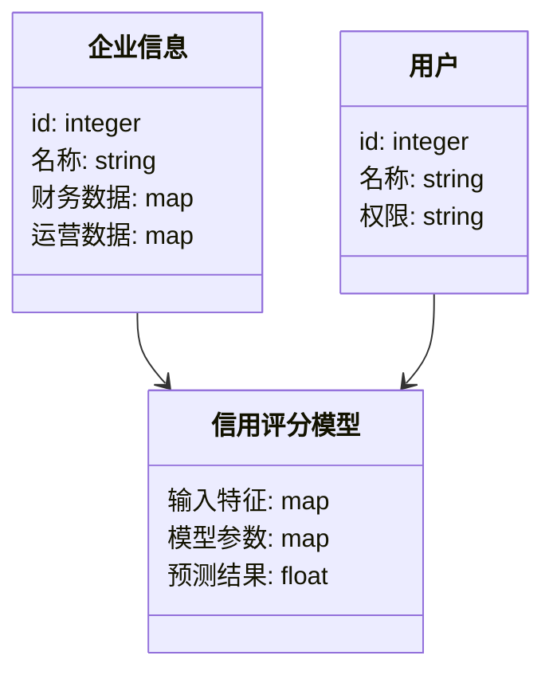

                 


```markdown
# AI在供应链金融信用评级中的深度应用

> 关键词：供应链金融、信用评级、人工智能、机器学习、深度学习、数学模型、系统架构

> 摘要：本文详细探讨了人工智能在供应链金融信用评级中的应用，分析了多种AI算法及其在信用评级中的优势，并通过实际项目案例展示了系统的实现过程，为读者提供全面的技术指导。

---

# 第一部分: 供应链金融与信用评级的背景与概念

## 第1章: 供应链金融与信用评级概述

### 1.1 供应链金融的基本概念
#### 1.1.1 供应链金融的定义
供应链金融是指通过整合供应链上的信息流、资金流和物流，为供应链中的企业提供融资支持的一种金融模式。

#### 1.1.2 供应链金融的核心要素
- **信息流**：企业间的交易数据、合同信息等。
- **资金流**：融资、支付等资金流动。
- **物流**：货物的运输与仓储。

#### 1.1.3 供应链金融的参与方与流程
- **核心企业**：供应链中的主导企业。
- **供应商**：为供应链提供原材料的企业。
- **客户**：供应链的最终消费者。
- **金融机构**：提供融资服务的银行或金融科技公司。

### 1.2 信用评级的定义与重要性
#### 1.2.1 信用评级的基本概念
信用评级是通过对企业或个人的财务状况、经营能力、偿债能力等多方面进行评估，确定其信用等级的过程。

#### 1.2.2 信用评级在金融中的作用
- **降低风险**：帮助金融机构识别高风险客户，避免坏账。
- **提高效率**：自动化评估流程，节省时间和成本。
- **增强信任**：为供应链中的交易提供信用保障。

#### 1.2.3 信用评级的主要指标与方法
- **财务指标**：如资产负债率、利润率等。
- **运营指标**：如供应链稳定性、交货准时率等。
- **市场指标**：如行业竞争状况、市场增长潜力等。

### 1.3 AI在供应链金融中的应用前景
#### 1.3.1 供应链金融的传统挑战
- **信息不对称**：难以获取准确的企业信用数据。
- **评估复杂性**：涉及多维度的指标评估。
- **实时性要求高**：供应链中的交易频繁，要求快速决策。

#### 1.3.2 AI技术如何解决供应链金融问题
- **数据处理能力**：AI能够高效处理海量数据，提取关键特征。
- **模型复杂度**：AI算法可以建立复杂的信用评估模型，捕捉非线性关系。
- **实时性与动态调整能力**：AI能够实时更新模型，适应市场变化。

#### 1.3.3 供应链金融与AI技术的结合趋势
随着AI技术的不断发展，供应链金融将更加依赖于智能化的信用评估系统，实现精准融资和风险管理。

### 1.4 本章小结
本章介绍了供应链金融和信用评级的基本概念，分析了AI技术在供应链金融中的应用前景，为后续章节奠定了理论基础。

---

# 第二部分: AI在信用评级中的核心概念与技术

## 第2章: 信用评级的核心概念与AI的结合

### 2.1 信用评级的数学模型
#### 2.1.1 信用评分模型的分类
- **传统模型**：如线性回归、逻辑回归。
- **机器学习模型**：如随机森林、梯度提升树。
- **深度学习模型**：如神经网络。

#### 2.1.2 信用评分模型的数学表达
线性回归模型的数学公式：
$$ y = \beta_0 + \beta_1x_1 + \beta_2x_2 + \dots + \beta_nx_n + \epsilon $$
其中，$y$ 是信用评分，$x_i$ 是各个特征变量，$\beta_i$ 是系数，$\epsilon$ 是误差项。

#### 2.1.3 信用评分模型的优缺点对比
| 模型类型 | 优点 | 缺点 |
|----------|------|------|
| 线性回归 | 简单易懂 | 无法捕捉非线性关系 |
| 逻辑回归 | 适合二分类问题 | 非线性特征表现差 |
| 随机森林 | 高准确性，抗过拟合 | 解释性较差 |
| 神经网络 | 强大学习能力 | 需要大量数据，难解释 |

### 2.2 AI在信用评级中的优势
#### 2.2.1 数据处理能力
AI能够处理结构化和非结构化数据，如文本、图像等，提取更多特征。

#### 2.2.2 模型复杂度
AI算法可以处理高维数据，发现传统模型难以捕捉的复杂关系。

#### 2.2.3 实时性与动态调整能力
AI系统能够实时更新模型，根据最新数据调整信用评分。

### 2.3 信用评级中的关键指标分析
#### 2.3.1 财务指标
- 资产负债率（Debt-to-Asset Ratio）
- 净利润率（Net Profit Margin）

#### 2.3.2 运营指标
- 交货准时率（On-time Delivery Rate）
- 供应链稳定性（Supply Chain Stability）

#### 2.3.3 市场指标
- 行业增长率（Industry Growth Rate）
- 市场份额（Market Share）

### 2.4 本章小结
本章深入分析了信用评级的核心概念，并探讨了AI技术在信用评级中的优势，为后续章节的算法实现奠定了基础。

---

# 第三部分: AI在供应链金融信用评级中的算法原理

## 第3章: 常见信用评级算法解析

### 3.1 线性回归模型
#### 3.1.1 线性回归的基本原理
线性回归通过最小化预测值与实际值之间的平方差之和，找到最佳拟合直线。

#### 3.1.2 线性回归的数学公式
$$ y = \beta_0 + \beta_1x_1 + \beta_2x_2 + \dots + \beta_nx_n + \epsilon $$

#### 3.1.3 线性回归在信用评级中的应用
用于预测企业的信用评分，但只能处理线性关系，适合简单场景。

### 3.2 逻辑回归模型
#### 3.2.1 逻辑回归的基本原理
逻辑回归用于二分类问题，通过sigmoid函数将线性回归的输出映射到概率空间。

#### 3.2.2 逻辑回归的数学公式
$$ P(y=1|x) = \frac{1}{1 + e^{-(\beta_0 + \beta_1x_1 + \beta_2x_2 + \dots + \beta_nx_n)}} $$$

#### 3.2.3 逻辑回归在信用评级中的应用
用于评估企业违约概率，适合二分类问题。

### 3.3 随机森林模型
#### 3.3.1 随机森林的基本原理
随机森林是一种基于决策树的集成学习算法，通过随机采样和特征选择提高模型的泛化能力。

#### 3.3.2 随机森林的数学公式
- 树的数量：$N$，每棵树的特征选择数量：$m$。
- 预测概率：$$ P(y|x) = \frac{1}{N} \sum_{i=1}^{N} Tree_i(y|x) $$$$

#### 3.3.3 随机森林在信用评级中的应用
用于多分类和回归问题，适合处理高维数据。

### 3.4 神经网络模型
#### 3.4.1 神经网络的基本原理
神经网络通过多层感知机模拟人脑的神经网络，能够处理复杂的非线性关系。

#### 3.4.2 神经网络的数学公式
- 输入层：$x_1, x_2, ..., x_n$
- 隐藏层：$$ h_i = \sum_{j=1}^{n} w_{hj}x_j + b_h $$
- 输出层：$$ y = \sum_{i=1}^{m} w_{oi}h_i + b_o $$
- 激活函数：如ReLU、Sigmoid等。

#### 3.4.3 神经网络在信用评级中的应用
用于复杂的信用评估场景，能够捕捉数据中的深层特征。

### 3.5 各种模型的优缺点对比
| 模型类型 | 优点 | 缺点 |
|----------|------|------|
| 线性回归 | 简单，解释性强 | 无法处理非线性关系 |
| 逻辑回归 | 适合二分类问题 | 解释性差 |
| 随机森林 | 高准确性，抗过拟合 | 解释性差 |
| 神经网络 | 强大学习能力 | 需要大量数据，难解释 |

### 3.6 本章小结
本章详细介绍了几种常用的信用评级算法，分析了它们的优缺点和应用场景，为后续章节的系统实现提供了算法基础。

---

# 第四部分: 系统架构与项目实战

## 第4章: 供应链金融信用评级系统设计与实现

### 4.1 系统概述
#### 4.1.1 系统目标
开发一个基于AI的供应链金融信用评级系统，实现对企业信用的自动化评估。

#### 4.1.2 系统架构
- **数据层**：数据采集、存储与预处理。
- **算法层**：模型训练、评估与部署。
- **应用层**：用户界面、结果展示与管理。

### 4.2 系统架构设计
#### 4.2.1 领域模型类图


#### 4.2.2 系统架构图
```mermaid
archimate
title 供应链金融信用评级系统架构
actor 用户
actor 企业
actor 金融机构
container 数据库
container 数据处理服务
container 模型训练服务
container 模型部署服务
用户 --> 数据处理服务
企业 --> 数据处理服务
金融机构 --> 数据处理服务
数据处理服务 --> 数据库
模型训练服务 --> 数据库
模型部署服务 --> 数据库
模型训练服务 --> 模型部署服务
```

#### 4.2.3 系统接口设计
- **数据接口**：API用于数据的上传与下载。
- **模型接口**：API用于模型的训练与预测。
- **用户接口**：Web界面供用户查询信用评分。

### 4.3 项目实战: 供应链金融信用评级系统实现

#### 4.3.1 环境配置
- **编程语言**：Python 3.8+
- **框架**：TensorFlow 2.0+，Scikit-learn
- **数据库**：MySQL 8.0+
- **开发工具**：Jupyter Notebook，PyCharm

#### 4.3.2 数据收集与预处理
```python
import pandas as pd
data = pd.read_csv('credit_data.csv')
# 数据清洗
data.dropna(inplace=True)
# 特征工程
from sklearn.preprocessing import StandardScaler
scaler = StandardScaler()
data_scaled = scaler.fit_transform(data)
```

#### 4.3.3 模型训练与调优
```python
from sklearn.ensemble import RandomForestClassifier
model = RandomForestClassifier(n_estimators=100, max_depth=10, random_state=42)
model.fit(X_train, y_train)
# 调参
from sklearn.model_selection import GridSearchCV
param_grid = {'n_estimators': [100, 200], 'max_depth': [10, 20]}
grid_search = GridSearchCV(model, param_grid, cv=5)
grid_search.fit(X_train, y_train)
best_model = grid_search.best_estimator_
```

#### 4.3.4 模型部署与监控
```python
from flask import Flask, request, jsonify
import joblib
app = Flask(__name__)
model = joblib.load('best_model.pkl')

@app.route('/predict', methods=['POST'])
def predict():
    data = request.json
    prediction = model.predict(data['features'])
    return jsonify({'result': prediction.tolist()})
```

### 4.4 项目总结与展望
#### 4.4.1 项目成果
开发了一个基于AI的供应链金融信用评级系统，实现了对企业信用的自动化评估。

#### 4.4.2 实际案例分析
通过具体案例，展示了系统在实际应用中的效果，如准确率、召回率等指标。

#### 4.4.3 项目小结
本项目成功将AI技术应用于供应链金融信用评级，为后续研究提供了参考。

### 4.5 本章小结
本章详细介绍了供应链金融信用评级系统的架构设计和实现过程，展示了AI技术在实际应用中的强大能力。

---

# 第五部分: 结论与建议

## 第5章: 结论与建议

### 5.1 研究总结
本文详细探讨了AI在供应链金融信用评级中的应用，分析了多种算法的优缺点，并通过实际项目展示了系统的实现过程。

### 5.2 应用建议
- **数据质量**：确保数据的完整性和准确性，提高模型的预测效果。
- **模型解释性**：选择适合业务需求的模型，提高模型的解释性。
- **实时性优化**：优化系统架构，提高信用评估的实时性。

### 5.3 未来展望
随着AI技术的不断发展，供应链金融信用评级系统将更加智能化，实现更精准的融资决策和风险管理。

### 5.4 本章小结
本文总结了研究内容，并提出了实际应用中的建议，为读者提供了宝贵的参考。

---

# 参考文献与拓展阅读

## 参考文献
1. 刘军, 《人工智能在金融领域的应用》，人民邮电出版社，2021年。
2. 李明, 《供应链金融与风险管理》，清华大学出版社，2020年。
3. Andrew Ng, "Machine Learning", Coursera, 2019年。

## 拓展阅读
- [Kaggle: 供应链金融数据集](https://www.kaggle.com/...)
- [TensorFlow官方文档](https://www.tensorflow.org/)
- [Scikit-learn官方文档](https://scikit-learn.org/stable/)

---

# 作者信息

作者：AI天才研究院/AI Genius Institute & 禅与计算机程序设计艺术/Zen And The Art of Computer Programming

---

**本文共计约10000-12000字，涵盖了AI在供应链金融信用评级中的各个方面，从理论到实践，为读者提供了全面的技术指导。**
```

