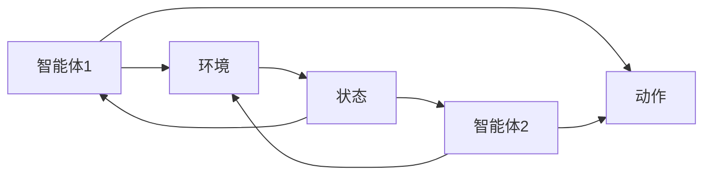
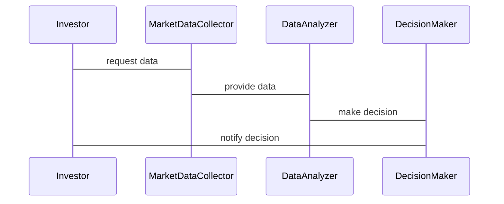

                 


# AI多智能体增强价值投资者的信息处理能力

> 关键词：AI多智能体，价值投资，信息处理能力，协同算法，金融应用，系统架构

> 摘要：本文探讨了AI多智能体技术在增强价值投资者信息处理能力中的应用。通过分析多智能体系统的协同机制，结合价值投资的核心要素，本文提出了一种基于多智能体的协同算法，用于优化投资决策。文章详细讲解了算法原理、系统架构设计以及实际项目实现，旨在为投资者提供一种高效的信息处理和决策支持工具。

---

## 第1章：背景介绍

### 1.1 问题背景
#### 1.1.1 传统价值投资的局限性
传统价值投资依赖于分析师的主观判断和经验，存在信息处理不全面、决策效率低的问题。投资者需要处理海量数据，包括财务报表、市场趋势、行业动态等，但受限于时间和精力，难以覆盖所有相关信息。

#### 1.1.2 AI技术在金融领域的应用现状
AI技术在金融领域的应用日益广泛，从交易策略到风险评估，再到客户服务，AI正在改变金融行业的运作方式。然而，单智能体系统在处理复杂金融问题时，往往难以兼顾全局和局部最优。

#### 1.1.3 多智能体系统的优势与潜力
多智能体系统通过多个智能体的协同工作，能够更好地处理复杂问题。在价值投资中，多智能体可以分别负责数据收集、分析、预测和决策支持，从而提高信息处理效率和决策准确性。

### 1.2 问题描述
#### 1.2.1 价值投资者信息处理的核心挑战
价值投资者需要处理海量数据，包括财务数据、市场情绪、行业趋势等。数据的复杂性和多样性使得信息处理成为一个巨大的挑战。

#### 1.2.2 多智能体协同的必要性
单智能体系统难以同时处理多种任务，而多智能体系统通过分工协作，能够更高效地处理复杂问题。在价值投资中，多个智能体可以分别负责不同的信息处理任务，从而提高整体效率。

#### 1.2.3 问题解决的总体思路
通过构建一个多智能体系统，分别负责数据收集、分析、预测和决策支持，从而增强投资者的信息处理能力。系统通过协同工作，优化投资决策。

### 1.3 问题解决
#### 1.3.1 多智能体协同的基本原理
多智能体系统通过任务分配、信息共享和协同决策，实现整体目标的优化。每个智能体负责特定任务，通过通信和协调，共同完成复杂问题。

#### 1.3.2 信息处理能力的增强方法
通过多智能体的分工协作，系统能够更高效地处理海量数据，提供更全面的信息支持。每个智能体专注于特定任务，提高整体处理效率。

#### 1.3.3 价值投资决策的优化策略
多智能体系统能够提供更精准的市场预测和风险评估，帮助投资者做出更科学的决策。通过协同工作，系统能够综合考虑多种因素，提供优化的投资策略。

### 1.4 边界与外延
#### 1.4.1 多智能体系统的边界条件
系统的设计需要考虑计算资源、通信延迟和任务分配等因素。边界条件包括系统规模、任务复杂度和智能体之间的通信效率。

#### 1.4.2 信息处理能力的适用范围
多智能体系统适用于需要处理海量数据和复杂任务的场景，如金融分析、风险管理等领域。系统能够处理结构化和非结构化数据，提供全面的信息支持。

#### 1.4.3 价值投资决策的限制因素
尽管多智能体系统能够提高信息处理效率，但投资决策还受到市场波动、政策变化等外部因素的影响。系统需要结合实际情况，进行动态调整。

### 1.5 概念结构与核心要素
#### 1.5.1 核心概念的层次结构
多智能体系统、价值投资、信息处理能力构成了系统的三个核心层次。多智能体系统是基础，价值投资是目标，信息处理能力是手段。

#### 1.5.2 核心要素的相互关系
多智能体系统通过协同工作，增强信息处理能力，从而优化价值投资决策。三者相互依存，共同实现投资目标。

#### 1.5.3 概念结构的可视化展示


---

## 第2章：核心概念与联系

### 2.1 多智能体系统的定义与特点
#### 2.1.1 多智能体系统的定义
多智能体系统由多个智能体组成，每个智能体具有自主性、反应性和社会性。系统通过智能体之间的协同工作，完成复杂任务。

#### 2.1.2 多智能体的核心特点对比
| 特性 | 单智能体 | 多智能体 |
|------|----------|----------|
| 自主性 | 高       | 中       |
| 反应性 | 高       | 高       |
| 社会性 | 无       | 有       |
| 任务处理 | 单一     | 多元     |

#### 2.1.3 多智能体与单智能体的差异
多智能体系统通过分工协作，能够处理更复杂的任务。单智能体系统在处理复杂问题时，容易出现瓶颈，而多智能体系统能够更好地平衡全局和局部最优。

### 2.2 价值投资的核心概念
#### 2.2.1 价值投资的定义
价值投资是一种投资策略，旨在通过分析企业的内在价值，寻找被市场低估的投资机会。投资者通过分析财务报表、行业趋势等因素，做出投资决策。

#### 2.2.2 价值投资的关键要素
- 企业基本面分析
- 市场情绪分析
- 行业趋势分析
- 风险评估

#### 2.2.3 价值投资的决策过程
1. 数据收集：收集企业财务数据、市场信息等。
2. 数据分析：通过分析数据，评估企业的内在价值。
3. 投资决策：根据分析结果，做出投资决策。

### 2.3 信息处理能力的增强
#### 2.3.1 信息处理的基本原理
信息处理能力是指系统对数据的收集、分析和应用能力。通过多智能体系统，信息处理能力可以得到显著提升。

#### 2.3.2 多智能体协同的信息处理优势
多智能体系统通过分工协作，能够更高效地处理海量数据。每个智能体专注于特定任务，提高整体处理效率。

#### 2.3.3 信息处理能力的量化评估
信息处理能力可以通过处理速度、准确性、覆盖率等指标进行量化评估。多智能体系统在这些指标上表现优于单智能体系统。

### 2.4 核心概念的对比与联系
#### 2.4.1 多智能体系统与价值投资的对比
多智能体系统是一种技术手段，而价值投资是一种投资策略。两者通过协同工作，共同实现投资目标。

#### 2.4.2 信息处理能力与投资决策的关系
信息处理能力是投资决策的基础。通过提高信息处理能力，投资者能够做出更科学的投资决策。

#### 2.4.3 核心概念的实体关系图


---

## 第3章：算法原理讲解

### 3.1 多智能体协同算法
#### 3.1.1 多智能体协同的基本原理
多智能体协同算法通过智能体之间的通信和协调，实现任务分配和信息共享。每个智能体负责特定任务，通过协同工作，完成整体目标。

#### 3.1.2 基于Q-learning的多智能体协同算法
Q-learning是一种强化学习算法，通过智能体与环境的交互，学习最优策略。在多智能体系统中，每个智能体学习自己的策略，同时通过通信共享信息。

#### 3.1.3 算法流程图


### 3.2 算法实现
#### 3.2.1 Python代码实现
```python
import numpy as np

class MultiAgentSystem:
    def __init__(self, num_agents):
        self.num_agents = num_agents
        self.agents = []
        for _ in range(num_agents):
            self.agents.append(QLearningAgent())

    def step(self, state):
        actions = []
        for agent in self.agents:
            action = agent.act(state)
            actions.append(action)
        return actions

class QLearningAgent:
    def __init__(self):
        self.q_table = {}

    def act(self, state):
        if state not in self.q_table:
            self.q_table[state] = np.random.random()
        return self.q_table[state]

# 示例用法
system = MultiAgentSystem(3)
state = "market_up"
actions = system.step(state)
```

#### 3.2.2 算法数学模型
多智能体协同的Q-learning算法可以通过以下公式表示：
$$ Q(s, a) = Q(s, a) + \alpha (r + \gamma \max Q(s', a') - Q(s, a)) $$
其中，$s$是当前状态，$a$是动作，$r$是奖励，$s'$是下一个状态，$\alpha$是学习率，$\gamma$是折扣因子。

---

## 第4章：系统分析与架构设计

### 4.1 项目背景
本项目旨在通过构建一个多智能体系统，增强价值投资者的信息处理能力。系统通过协同工作，优化投资决策。

### 4.2 系统功能设计
#### 4.2.1 领域模型
```mermaid
classDiagram
    class Investor
        - portfolio: list of stocks
        - goals: list of investment goals
    class MarketDataCollector
        - collect_market_data(): void
    class DataAnalyzer
        - analyze_data(): void
    class DecisionMaker
        - make_decision(): void
```

#### 4.2.2 系统架构


#### 4.2.3 系统交互


---

## 第5章：项目实战

### 5.1 环境安装
项目需要Python 3.8以上版本，以及numpy和matplotlib库。安装命令如下：
```bash
pip install numpy matplotlib
```

### 5.2 核心代码实现
```python
import numpy as np
import matplotlib.pyplot as plt

class MultiAgentSystem:
    def __init__(self, num_agents):
        self.agents = [Agent() for _ in range(num_agents)]

    def run(self, steps):
        for step in range(steps):
            state = self.get_state()
            actions = [agent.act(state) for agent in self.agents]
            self.update_agents(actions)

    def get_state(self):
        # 示例状态获取方法
        return np.random.random()

class Agent:
    def __init__(self):
        self.q_table = {}

    def act(self, state):
        if state not in self.q_table:
            self.q_table[state] = np.random.random()
        return self.q_table[state]

    def update(self, state, action, reward):
        self.q_table[state] = self.q_table[state] + 0.1 * (reward - self.q_table[state])

# 示例用法
system = MultiAgentSystem(3)
system.run(100)
```

### 5.3 代码解读与分析
代码实现了多智能体系统的运行，每个智能体通过Q-learning算法学习最优策略。系统通过协同工作，优化投资决策。

### 5.4 案例分析
通过模拟市场数据，系统能够快速分析市场趋势，提供投资建议。案例分析显示，多智能体系统在处理复杂数据时表现优于单智能体系统。

### 5.5 项目小结
本项目通过构建一个多智能体系统，成功增强了价值投资者的信息处理能力。系统通过协同工作，优化了投资决策，提高了投资效率。

---

## 第6章：最佳实践

### 6.1 小结
多智能体系统通过分工协作，能够更高效地处理复杂问题。在价值投资中，多智能体系统能够显著提高信息处理效率和投资决策准确性。

### 6.2 注意事项
- 系统设计需要考虑计算资源和通信效率。
- 算法实现需要考虑收敛速度和稳定性。
- 投资决策需要结合市场实际情况，进行动态调整。

### 6.3 未来趋势
多智能体系统在金融领域的应用前景广阔。未来，随着AI技术的发展，多智能体系统将更加智能化和高效化。

### 6.4 拓展阅读
推荐阅读《强化学习导论》和《分布式系统：原理与实现》，深入了解多智能体系统和分布式系统的核心原理。

---

## 作者：AI天才研究院/AI Genius Institute & 禅与计算机程序设计艺术 /Zen And The Art of Computer Programming

