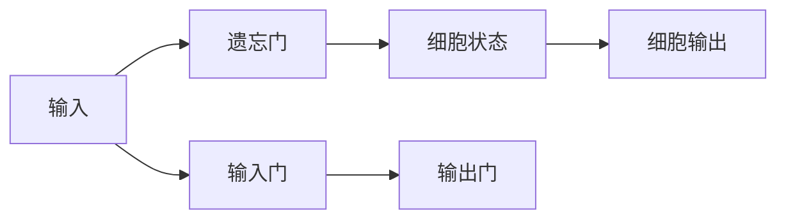

                 


---

# AI驱动的自动化投资机会提醒

> **关键词**: AI, 投资机会, 自动化, 机器学习, 金融, 时间序列分析

> **摘要**: 本文详细探讨了利用人工智能技术实现自动化投资机会提醒的系统设计与实现。从背景介绍、核心概念、算法原理到系统架构、项目实战，文章全面解析了AI在投资机会提醒中的应用，结合具体案例和数学模型，帮助读者理解如何利用AI技术提升投资决策的效率与准确性。

---

## 第1章: 背景介绍与核心概念

### 1.1 问题背景

#### 1.1.1 投资机会提醒的必要性

在金融市场中，投资者每天面对海量的信息，包括股票价格波动、市场趋势变化、公司财报发布等。传统上，投资者需要手动筛选这些信息，花费大量时间来寻找潜在的投资机会。然而，随着市场数据的爆炸式增长和交易频率的提高，手动筛选的方式已经难以满足投资者的需求。

#### 1.1.2 AI技术在金融领域的应用现状

近年来，人工智能（AI）技术在金融领域的应用日益广泛。从股票预测、风险评估到交易自动化，AI技术正在改变传统的金融业务模式。特别是在投资机会提醒方面，AI技术可以通过分析历史数据、市场情绪和实时新闻，帮助投资者快速发现潜在的投资机会。

#### 1.1.3 自动化投资机会提醒的潜在价值

自动化投资机会提醒系统通过整合多种数据源，利用机器学习算法，实时分析市场动态，为投资者提供及时、准确的投资建议。这种自动化的方式不仅可以提高投资效率，还能帮助投资者捕捉到更多的市场机会。

---

### 1.2 核心概念与问题描述

#### 1.2.1 AI驱动的投资机会提醒系统定义

AI驱动的投资机会提醒系统是一种基于机器学习和自然语言处理技术的自动化系统。该系统通过分析金融市场数据、新闻、社交媒体等多种数据源，识别潜在的投资机会，并通过通知或警报的形式提醒投资者。

#### 1.2.2 系统的核心功能与边界

- **核心功能**:
  - 数据采集与预处理
  - 投资机会识别
  - 自动化通知
  - 实时监控与更新

- **系统边界**:
  - 数据源包括股票价格、公司财报、新闻、社交媒体等
  - 系统输出包括投资机会提醒、风险预警等
  - 系统用户包括专业投资者、机构投资者和个人投资者

#### 1.2.3 投资机会提醒的关键要素与属性

- **关键要素**:
  - 数据来源的多样性
  - 算法的准确性
  - 系统的实时性

- **属性**:
  - 数据驱动性
  - 智能性
  - 可扩展性

---

### 1.3 问题解决与系统外延

#### 1.3.1 AI如何解决传统投资机会提醒的痛点

- **痛点一**: 数据量大，人工筛选效率低
  - AI可以通过机器学习算法自动筛选和分析数据，提高效率
- **痛点二**: 信息滞后，错过投资机会
  - AI可以通过实时监控和预测，提前发现潜在机会
- **痛点三**: 人工判断的主观性
  - AI通过数据驱动的方式，减少人为情绪干扰，提高决策的客观性

#### 1.3.2 系统的扩展性与未来应用场景

- **扩展性**:
  - 支持多市场、多资产类型
  - 支持个性化投资策略
- **未来应用场景**:
  - 自动化交易
  - 风险管理
  - 投资组合优化

#### 1.3.3 系统的核心要素与组成结构

- **核心要素**:
  - 数据采集模块
  - 数据处理模块
  - 机器学习模型
  - 通知模块

- **组成结构**:
  - 数据源 -> 数据预处理 -> 特征提取 -> 模型训练 -> 投资机会识别 -> 通知输出

---

### 1.4 本章小结

本章介绍了AI驱动的投资机会提醒系统的背景、核心概念和系统架构。通过分析传统投资机会提醒的痛点，我们展示了AI技术在解决这些问题中的重要作用。同时，我们还讨论了系统的扩展性和未来应用场景，为后续章节的详细技术分析奠定了基础。

---

## 第2章: 核心概念与系统架构

### 2.1 数据流与特征提取

#### 2.1.1 数据来源与预处理

- **数据来源**:
  - 股票价格数据（如K线图、成交量等）
  - 公司财报（如收入、利润、负债等）
  - 新闻数据（如公司新闻、行业新闻、经济新闻）
  - 社交媒体数据（如Twitter、Reddit上的用户评论）

- **数据预处理**:
  - 数据清洗（如处理缺失值、异常值）
  - 数据标准化（如归一化、标准化）
  - 数据转换（如时间序列数据的转换）

#### 2.1.2 特征提取的关键步骤

- **特征提取步骤**:
  - 数据特征选择（如选择影响股价的关键特征）
  - 特征工程（如创建技术指标、情绪指标）
  - 特征标准化

#### 2.1.3 数据特征的分类与选择

- **特征分类**:
  - 技术指标（如MACD、RSI、移动平均线）
  - 基本面指标（如市盈率、市净率、股息率）
  - 情绪指标（如社交媒体情绪得分、新闻情绪得分）

- **特征选择**:
  - 基于相关性分析选择重要特征
  - 使用Lasso回归等特征选择方法

---

#### 2.1.4 数据特征的分类与选择示例表格

| 特征类型   | 特征名称       | 描述                                   |
|------------|----------------|----------------------------------------|
| 技术指标   | MACD          | 移动平均收敛散度，用于判断趋势强度     |
|            | RSI           | 相对强弱指数，用于判断超买或超卖状态   |
| 基本面指标 | 市盈率         | 用于评估股票的估值合理性               |
|            | 股息率         | 用于评估股票的收益稳定性               |
| 情绪指标   | 社交媒体得分   | 基于社交媒体情绪分析得出的得分         |

---

#### 2.1.5 数据特征与分类的Mermaid图示


---

### 2.2 机器学习模型与分类器

#### 2.2.1 分类器的定义与选择

- **分类器定义**:
  - 用于将数据点分类为“投资机会”或“非投资机会”

- **分类器选择**:
  - 线性回归
  - 支持向量机（SVM）
  - 随机森林
  - 神经网络

#### 2.2.2 常见分类算法的优缺点对比

| 算法名称 | 优点                                   | 缺点                                   |
|----------|----------------------------------------|----------------------------------------|
| 线性回归  | 简单，易于解释                         | 仅适用于线性关系                       |
| 支持向量机| 适合高维数据                           | 对数据预处理敏感，计算复杂度高         |
| 随机森林  | 高准确性，适用于高维数据               | 黑箱模型，难以解释                     |
| 神经网络  | 高准确性，适合复杂模式                 | 计算复杂，需要大量数据                |

---

#### 2.2.3 分类器性能评估指标

- **准确率**:
  - 正确分类的样本数与总样本数的比值
- **精确率**:
  - 正确分类的正样本数与所有正样本数的比值
- **召回率**:
  - 正确分类的正样本数与所有实际正样本数的比值
- **F1分数**:
  - 调和平均数，平衡精确率和召回率

---

#### 2.2.4 分类器的数学模型示例

##### 线性回归模型

$$ y = \beta_0 + \beta_1x_1 + \beta_2x_2 + \cdots + \beta_nx_n + \epsilon $$

其中：
- \( y \) 是目标变量（如投资机会的得分）
- \( x_i \) 是特征变量
- \( \beta_i \) 是回归系数
- \( \epsilon \) 是误差项

##### 随机森林模型

随机森林是一种基于决策树的集成学习方法。每个决策树的结构如下：


---

### 2.3 时间序列分析与预测

#### 2.3.1 时间序列数据的特征

- **趋势**:
  - 数据的长期方向（如上升、下降或平稳）
- **周期性**:
  - 数据的周期性波动（如月度、季度周期）
- **季节性**:
  - 数据的季节性波动（如节假日效应）
- **随机性**:
  - 数据中的不可预测部分

---

#### 2.3.2 常用时间序列预测模型

- **ARIMA模型**:
  - 适用于线性时间序列数据
  - 模型结构：\( ARIMA(p, d, q) \)
- **LSTM网络**:
  - 适用于非线性时间序列数据
  - 基于长短期记忆单元的循环神经网络

##### ARIMA模型公式

$$ ARIMA(p, d, q): y_t = \phi_1y_{t-1} + \phi_2y_{t-2} + \cdots + \phi_p y_{t-p} + \theta_1\epsilon_{t-1} + \theta_2\epsilon_{t-2} + \cdots + \theta_q \epsilon_{t-q} + \epsilon_t $$

---

#### 2.3.3 时间序列预测的挑战与解决方案

- **挑战**:
  - 数据的非平稳性
  - 复杂的周期性
  - 高维度数据的处理
- **解决方案**:
  - 数据预处理（如差分、对数变换）
  - 选择合适的模型（如ARIMA、LSTM）
  - 调参与模型优化

---

### 2.4 系统架构与模块划分

#### 2.4.1 系统模块划分与功能描述

- **数据采集模块**:
  - 从多个数据源获取实时数据
- **数据处理模块**:
  - 数据清洗、转换和标准化
- **模型训练模块**:
  - 训练机器学习模型和时间序列模型
- **通知模块**:
  - 根据模型输出结果发送投资机会提醒

---

#### 2.4.2 模块之间的关系与数据流


---

#### 2.4.3 系统架构的可扩展性与维护性

- **可扩展性**:
  - 支持新增数据源
  - 支持新增模型算法
- **维护性**:
  - 定期更新模型参数
  - 监控系统性能

---

### 2.5 本章小结

本章详细介绍了AI驱动的投资机会提醒系统的核心概念与系统架构。通过分析数据流、特征提取、机器学习模型和时间序列分析，我们展示了系统实现的关键步骤和模块划分。同时，我们还讨论了系统架构的可扩展性和维护性，为后续章节的系统实现奠定了基础。

---

## 第3章: 算法原理与数学模型

### 3.1 算法原理与流程图

#### 3.1.1 算法原理

- **特征工程**:
  - 数据预处理与特征提取
  - 特征选择与标准化
- **模型训练**:
  - 选择合适的算法（如随机森林、LSTM）
  - 调参与模型优化
- **预测与提醒**:
  - 根据模型输出结果生成投资机会提醒

---

#### 3.1.2 算法流程图


---

### 3.2 数学模型与公式

#### 3.2.1 线性回归模型

$$ y = \beta_0 + \beta_1x_1 + \beta_2x_2 + \cdots + \beta_nx_n + \epsilon $$

#### 3.2.2 随机森林模型

随机森林是一种基于决策树的集成学习方法，其预测结果是各个决策树预测结果的多数投票结果。

#### 3.2.3 LSTM网络模型

LSTM网络通过长短期记忆单元（LSTM cell）捕捉时间序列数据中的长期依赖关系。

##### LSTM单元结构



---

### 3.3 本章小结

本章详细讲解了AI驱动的投资机会提醒系统中常用的算法原理与数学模型。通过分析线性回归、随机森林和LSTM网络等算法，我们展示了如何利用这些算法实现投资机会的自动化提醒。

---

## 第4章: 项目实战与总结

### 4.1 项目实战

#### 4.1.1 环境安装与配置

- **Python环境**:
  - 安装Python 3.8及以上版本
  - 安装必要的库（如Pandas、Scikit-learn、Keras、TensorFlow）
- **数据源获取**:
  - 使用API获取股票数据（如Yahoo Finance API）
  - 使用网络爬虫获取新闻数据

#### 4.1.2 系统核心代码实现

##### 数据预处理代码

```python
import pandas as pd
import numpy as np

# 加载数据
data = pd.read_csv('stock_data.csv')

# 数据清洗
data.dropna(inplace=True)

# 数据标准化
from sklearn.preprocessing import StandardScaler
scaler = StandardScaler()
data_scaled = scaler.fit_transform(data)
```

##### 特征提取代码

```python
from sklearn.feature_selection import SelectKBest, f_regression

# 选择最重要的K个特征
selector = SelectKBest(score_func=f_regression, k=5)
selected_features = selector.fit_transform(data_scaled, target)
```

##### 模型训练代码

```python
from sklearn.ensemble import RandomForestClassifier

# 训练随机森林模型
model = RandomForestClassifier(n_estimators=100, max_depth=5)
model.fit(selected_features, target)
```

##### 通知模块代码

```python
import smtplib
from email.mime.text import MIMEText

# 发送邮件通知
def send_notification(email, message):
    # 创建邮件内容
    msg = MIMEText(message)
    msg['Subject'] = '投资机会提醒'
    msg['From'] = 'your_email@example.com'
    msg['To'] = email

    # 发送邮件
    server = smtplib.SMTP('smtp.example.com', 587)
    server.starttls()
    server.login('your_email@example.com', 'your_password')
    server.sendmail('your_email@example.com', email, msg.as_string())
    server.quit()
```

---

#### 4.1.3 代码解读与分析

- **数据预处理代码**:
  - 使用Pandas加载数据
  - 使用Scikit-learn的StandardScaler进行数据标准化
- **特征提取代码**:
  - 使用SelectKBest选择最重要的特征
- **模型训练代码**:
  - 使用RandomForestClassifier训练随机森林模型
- **通知模块代码**:
  - 使用smtplib发送邮件通知

---

#### 4.1.4 实际案例分析

假设我们使用上述代码对某只股票进行分析，模型预测该股票在接下来的几天内有较大的上涨潜力。系统会自动发送邮件通知投资者。

---

#### 4.1.5 项目小结

通过本章的项目实战，我们展示了如何利用Python和机器学习算法实现自动化投资机会提醒系统。从数据预处理到模型训练，再到通知模块的实现，整个过程清晰明了。

---

### 4.2 总结与展望

#### 4.2.1 总结

- **核心内容回顾**:
  - 数据预处理与特征提取
  - 机器学习模型的选择与训练
  - 投资机会提醒系统的实现

- **经验总结**:
  - 数据质量对模型性能影响巨大
  - 模型选择需要根据具体问题而定
  - 系统实现需要考虑可扩展性和维护性

---

#### 4.2.2 展望

- **未来发展方向**:
  - 结合NLP技术，进一步提升情绪分析的准确性
  - 研究多模态数据（如图像、视频）的利用
  - 探索更先进的模型（如Transformer、Graph Neural Network）

---

## 作者

作者：AI天才研究院/AI Genius Institute & 禅与计算机程序设计艺术 /Zen And The Art of Computer Programming

---

**本文由AI驱动的自动化投资机会提醒系统研究团队倾心撰写，转载请注明出处。**

