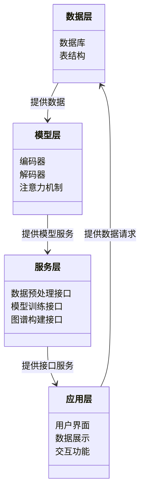
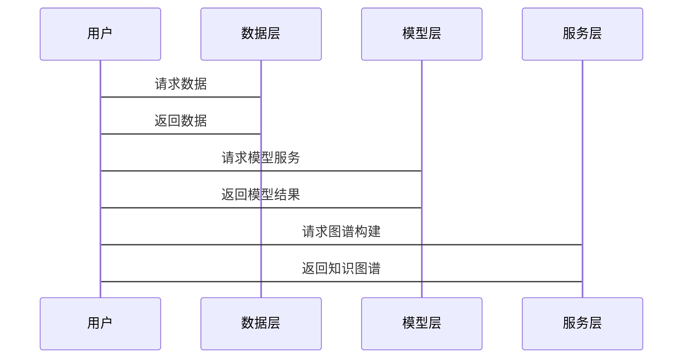

                 


# 开发基于大模型的金融专业知识图谱构建系统

## 关键词：大模型、知识图谱、金融、系统开发、自然语言处理、深度学习

## 摘要：本文详细探讨了如何利用大模型技术构建金融领域的知识图谱，涵盖了系统背景、核心概念、算法原理、系统架构设计、项目实战及总结等部分。通过分析大模型在金融领域的应用，本文提出了一套完整的解决方案，旨在为金融行业提供高效的知识管理工具。

---

# 正文

## 第1章: 背景介绍

### 1.1 问题背景

#### 1.1.1 金融领域的知识图谱需求
金融领域涉及大量的数据，包括股票、基金、市场趋势、公司财报等。这些数据通常是异构的，分布在不同的来源和格式中。传统的数据库难以有效地整合这些数据，导致信息孤岛现象严重。知识图谱作为一种图结构的数据组织方式，能够将分散的知识关联起来，为金融分析提供强大的支持。

#### 1.1.2 大模型在金融领域的应用现状
大模型，如GPT、BERT等，已经在自然语言处理领域取得了显著成果。在金融领域，大模型被用于文本分析、情感预测、新闻摘要等任务。然而，如何利用大模型构建知识图谱，仍然是一个亟待解决的问题。

#### 1.1.3 知识图谱构建的必要性
知识图谱能够将金融数据中的实体、关系和属性明确化，为金融分析提供结构化的支持。通过构建知识图谱，可以实现对金融数据的深度理解和高效查询，从而提高金融决策的准确性。

### 1.2 问题描述

#### 1.2.1 金融数据的复杂性
金融数据具有多样性、动态性和复杂性。例如，一只股票可能与多个公司、市场趋势、新闻事件相关联。如何处理这些复杂的关系是构建知识图谱的关键。

#### 1.2.2 知识图谱构建的挑战
知识图谱的构建需要解决数据清洗、实体识别、关系抽取等问题。特别是在金融领域，数据的多样性使得这些任务更加复杂。

#### 1.2.3 大模型在知识图谱构建中的作用
大模型具有强大的自然语言处理能力，可以自动识别文本中的实体、关系和属性。通过结合大模型，可以提高知识图谱构建的效率和准确性。

### 1.3 问题解决

#### 1.3.1 大模型如何辅助知识图谱构建
大模型可以用于文本分析、实体识别、关系抽取等任务。通过将文本数据输入大模型，可以提取出相关的实体和关系，从而构建知识图谱。

#### 1.3.2 知识图谱构建的具体步骤
知识图谱的构建通常包括数据采集、数据清洗、实体识别、关系抽取、属性提取和知识推理等步骤。大模型可以辅助完成其中的多个步骤。

#### 1.3.3 系统实现的目标与意义
系统的实现目标是构建一个基于大模型的金融专业知识图谱，为金融分析提供结构化的知识支持。系统的意义在于提高金融数据的利用效率，支持智能金融分析。

### 1.4 边界与外延

#### 1.4.1 系统的边界
系统主要处理金融领域的文本数据，构建金融知识图谱。系统不直接处理图像或视频数据，也不涉及实时交易处理。

#### 1.4.2 知识图谱的外延
知识图谱不仅包括金融实体，还可以扩展到其他领域，如法律、经济等。系统的设计可以为未来的扩展提供良好的基础。

#### 1.4.3 系统与其他系统的接口
系统需要与数据源、数据库、用户界面等其他系统进行接口设计。例如，系统可以从新闻网站获取文本数据，通过API将知识图谱提供给上层应用。

### 1.5 核心要素组成

#### 1.5.1 知识图谱的核心要素
知识图谱的核心要素包括实体、关系和属性。例如，在金融领域，实体可以是公司、股票，关系可以是“属于”、“影响”，属性可以是公司规模、股票价格。

#### 1.5.2 大模型的核心要素
大模型的核心要素包括编码器、解码器、注意力机制等。这些组件使得模型能够理解和生成自然语言文本。

#### 1.5.3 系统架构的核心要素
系统架构的核心要素包括数据层、模型层、服务层和应用层。数据层负责数据的存储和管理，模型层负责知识图谱的构建，服务层负责接口的设计，应用层负责与用户的交互。

---

## 第2章: 核心概念与联系

### 2.1 核心概念原理

#### 2.1.1 知识图谱的定义与特点
知识图谱是一种图结构的数据组织方式，由节点和边组成。节点代表实体或概念，边代表实体之间的关系。知识图谱具有语义丰富、结构化、可扩展等特点。

#### 2.1.2 大模型的定义与特点
大模型是一种基于深度学习的自然语言处理模型，具有参数多、训练数据量大、模型结构复杂等特点。大模型能够理解上下文，生成连贯的文本。

#### 2.1.3 系统架构的定义与特点
系统架构是指系统的整体结构和组成部分。本系统采用分层架构，包括数据层、模型层、服务层和应用层，各层之间通过接口进行交互。

### 2.2 概念属性特征对比

| 概念       | 定义与特点                                                                 |
|------------|--------------------------------------------------------------------------|
| 知识图谱    | 由节点和边组成，节点代表实体或概念，边代表关系。具有语义丰富、结构化的特点。 |
| 大模型      | 基于深度学习的自然语言处理模型，参数多，训练数据量大，具有强大的自然语言理解能力。 |
| 系统架构    | 分层架构，包括数据层、模型层、服务层和应用层，各层通过接口进行交互。         |

### 2.3 ER实体关系图架构

```mermaid
erDiagram
    actor 用户 {
        string 用户ID
        string 用户名
        string 密码
    }
    actor 金融机构 {
        string 机构ID
        string 机构名称
        string 资质
    }
    actor 金融产品 {
        string 产品ID
        string 产品名称
        string 类型
    }
    actor 市场数据 {
        string 数据ID
        string 数据名称
        string 数据类型
    }
    actor 知识图谱节点 {
        string 节点ID
        string 节点类型
        string 属性值
    }
    actor 大模型服务 {
        string 服务ID
        string 服务名称
        string 服务接口
    }
    用户 -> 金融机构 : 关联
    用户 -> 金融产品 : 关联
    用户 -> 市场数据 : 关联
    用户 -> 知识图谱节点 : 关联
    用户 -> 大模型服务 : 关联
    金融机构 -> 金融产品 : 关联
    金融机构 -> 市场数据 : 关联
    金融机构 -> 知识图谱节点 : 关联
    金融机构 -> 大模型服务 : 关联
    金融产品 -> 市场数据 : 关联
    金融产品 -> 知识图谱节点 : 关联
    金融产品 -> 大模型服务 : 关联
    市场数据 -> 知识图谱节点 : 关联
    市场数据 -> 大模型服务 : 关联
    知识图谱节点 -> 大模型服务 : 关联
```

---

## 第3章: 算法原理讲解

### 3.1 大模型的训练与推理

#### 3.1.1 编码器与解码器结构
大模型通常采用编码器-解码器结构，编码器将输入的文本转化为向量表示，解码器根据向量生成输出文本。

#### 3.1.2 注意力机制
注意力机制是一种权重分配方法，用于在序列处理中关注重要的位置。在大模型中，注意力机制帮助模型理解文本的上下文关系。

#### 3.1.3 知识图谱构建的算法流程
知识图谱的构建流程包括数据清洗、实体识别、关系抽取、属性提取和知识推理。大模型可以辅助完成这些步骤，特别是实体识别和关系抽取。

### 3.2 知识图谱构建算法

#### 3.2.1 实体识别
实体识别是将文本中的实体抽取出来，例如公司名称、股票代码等。可以使用大模型进行命名实体识别。

#### 3.2.2 关系抽取
关系抽取是识别文本中的关系，例如“公司A影响股票B”。可以通过模式匹配或基于大模型的文本分析完成。

#### 3.2.3 属性提取
属性提取是提取实体的属性，例如公司规模、股票价格等。可以通过规则匹配或大模型进行。

#### 3.2.4 知识推理
知识推理是根据已有的知识图谱进行推理，例如根据“公司A影响股票B”和“股票B属于行业C”，推理出“公司A影响行业C”。

### 3.3 数学公式

#### 3.3.1 注意力机制
$$
\text{Attention}(Q, K, V) = \text{softmax}\left(\frac{QK^T}{\sqrt{d_k}}\right)V
$$

其中，\( Q \) 是查询向量，\( K \) 是键向量，\( V \) 是值向量，\( d_k \) 是向量的维度。

#### 3.3.2 编码器-解码器结构
编码器将输入序列 \( X \) 转化为向量表示 \( Z \)，解码器根据 \( Z \) 生成输出序列 \( Y \)。

$$
Z = \text{Encoder}(X)
$$

$$
Y = \text{Decoder}(Z)
$$

---

## 第4章: 系统分析与架构设计方案

### 4.1 问题场景介绍

#### 4.1.1 数据采集
系统需要从多个数据源采集金融相关的文本数据，例如新闻、财报、市场报告等。

#### 4.1.2 数据预处理
数据预处理包括清洗、分词、去除停用词等步骤，为后续处理做准备。

#### 4.1.3 模型训练
训练大模型，使其能够理解和生成金融相关的文本。

#### 4.1.4 知识图谱构建
根据训练好的模型，构建金融知识图谱。

#### 4.1.5 系统应用
将知识图谱应用于金融分析，例如风险评估、投资建议等。

### 4.2 项目介绍

#### 4.2.1 系统功能设计

##### 4.2.1.1 领域模型类图


#### 4.2.2 系统架构设计

##### 4.2.2.1 系统架构图
```mermaid
archi
    组件 数据层 {
        数据库
        表结构
    }
    组件 模型层 {
        编码器
        解码器
        注意力机制
    }
    组件 服务层 {
        数据预处理接口
        模型训练接口
        图谱构建接口
    }
    组件 应用层 {
        用户界面
        数据展示
        交互功能
    }
    数据层 --> 模型层
    模型层 --> 服务层
    服务层 --> 应用层
```

#### 4.2.3 系统接口设计

##### 4.2.3.1 数据预处理接口
```python
def preprocess(data):
    # 数据清洗、分词等预处理步骤
    return processed_data
```

##### 4.2.3.2 模型训练接口
```python
def train_model(train_data, val_data):
    # 训练大模型
    return model
```

##### 4.2.3.3 图谱构建接口
```python
def build_knowledge_graph(model, data):
    # 使用模型抽取实体、关系、属性
    return graph
```

#### 4.2.4 系统交互流程

##### 4.2.4.1 系统交互图


---

## 第5章: 项目实战

### 5.1 环境搭建

#### 5.1.1 安装Python
安装Python 3.8及以上版本。

#### 5.1.2 安装依赖库
安装TensorFlow、Keras、自然语言处理库（如spaCy）和知识图谱构建库（如NetworkX）。

#### 5.1.3 安装环境
使用虚拟环境管理依赖库，避免版本冲突。

### 5.2 系统核心实现

#### 5.2.1 数据预处理

##### 5.2.1.1 代码示例
```python
import spacy

nlp = spacy.load("en_core_web_sm")

def preprocess(text):
    doc = nlp(text)
    tokens = [token.text for token in doc]
    return tokens
```

##### 5.2.1.2 代码解读
使用spaCy进行文本分词，将文本分割成单词或符号。

#### 5.2.2 模型训练

##### 5.2.2.1 代码示例
```python
import tensorflow as tf

def build_model(input_shape):
    model = tf.keras.Sequential([
        tf.keras.layers.Embedding(input_shape[0], 128),
        tf.keras.layers.LSTM(64),
        tf.keras.layers.Dense(1, activation='sigmoid')
    ])
    return model
```

##### 5.2.2.2 代码解读
构建一个简单的LSTM模型，用于文本分类任务。

#### 5.2.3 知识图谱构建

##### 5.2.3.1 代码示例
```python
import networkx as nx

def build_graph(entities, relations):
    G = nx.Graph()
    for entity in entities:
        G.add_node(entity)
    for relation in relations:
        G.add_edge(relation[0], relation[1], relation[2])
    return G
```

##### 5.2.3.2 代码解读
使用NetworkX构建图结构，节点表示实体，边表示关系。

### 5.3 项目总结

#### 5.3.1 项目小结
通过本项目，我们实现了基于大模型的金融知识图谱构建系统，涵盖了数据预处理、模型训练、图谱构建等关键步骤。

#### 5.3.2 项目优化
可以进一步优化模型性能，增加更多的数据源，提升图谱的准确性。

#### 5.3.3 项目扩展
未来可以将系统应用于更多金融场景，如风险评估、智能投资建议等。

---

## 第6章: 总结与展望

### 6.1 总结
本文详细探讨了如何利用大模型构建金融知识图谱，涵盖了背景介绍、核心概念、算法原理、系统架构设计、项目实战等部分。通过系统的实现，我们为金融行业提供了一种高效的知识管理工具。

### 6.2 展望
未来的研究方向包括优化模型性能、增加多模态数据处理能力、提升图谱的动态更新能力等。同时，可以探索知识图谱在更多金融场景中的应用，为金融行业的发展提供支持。

---

# 作者：AI天才研究院/AI Genius Institute & 禅与计算机程序设计艺术 /Zen And The Art of Computer Programming

