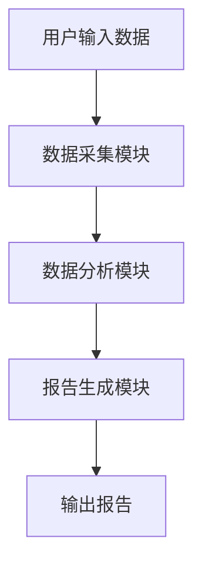
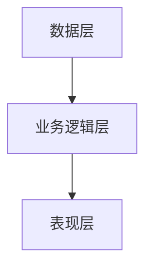

                 


# 彼得·林奇对公司产品生命周期管理能力的评估

> 关键词：彼得·林奇，产品生命周期，管理能力，投资评估，企业战略

> 摘要：本文从彼得·林奇的投资哲学出发，详细探讨了如何将产品生命周期管理能力的评估方法应用于公司价值评估中。通过分析产品生命周期的核心概念、评估框架、算法原理、系统设计、项目实战等多方面，结合实际案例，为投资者和企业管理者提供了全面的评估策略和实践指南。

---

## 第1章: 产品生命周期管理能力的背景与概念

### 1.1 产品生命周期管理的定义与核心要素

#### 1.1.1 产品生命周期的定义

产品生命周期（Product Life Cycle，PLC）是指产品从进入市场到退出市场的整个过程。通常包括四个阶段：引入期、成长期、成熟期和衰退期。每个阶段的特点和管理策略不同，企业需要根据所处阶段调整产品战略。

#### 1.1.2 核心要素分析

- **市场需求**：产品能否满足目标市场的需求，是决定产品生命周期的关键因素。
- **竞争优势**：企业在市场中的核心竞争力，包括成本、技术、品牌等方面。
- **创新能力**：企业是否能够持续创新，推出新产品或改进现有产品。
- **运营效率**：企业能否在各个阶段高效管理资源，降低成本。

#### 1.1.3 产品生命周期管理的重要性

有效的PLC管理可以帮助企业延长产品生命周期，提高市场份额和盈利能力。尤其是在引入期和衰退期，企业需要灵活调整策略，避免产品过早衰退或错过市场机会。

---

### 1.2 彼得·林奇的评估方法概述

#### 1.2.1 彼得·林奇的投资哲学

彼得·林奇强调基本面分析和长期投资。他认为，投资成功的关键在于选择具有持续竞争优势和良好管理能力的公司。他尤其关注企业的盈利能力和成长潜力。

#### 1.2.2 产品生命周期管理能力的评估框架

彼得·林奇的评估框架包括以下步骤：
1. **识别产品生命周期阶段**：分析产品的市场地位和所处阶段。
2. **评估企业的竞争优势**：考察企业在市场中的竞争力，包括技术、品牌、成本等方面。
3. **评估管理团队的能力**：判断管理层是否能够有效应对不同阶段的挑战。
4. **预测未来表现**：基于以上分析，预测产品生命周期的后续发展和企业的盈利能力。

#### 1.2.3 评估方法的实际应用

通过分析实际案例，我们可以看到彼得·林奇的方法如何帮助投资者识别具有潜力的公司。例如，在产品引入期，投资者需要关注企业的市场定位和创新能力；在衰退期，则需要关注企业的成本控制和转型能力。

---

## 第2章: 产品生命周期管理能力的核心概念与联系

### 2.1 核心概念原理

#### 2.1.1 生命周期各阶段的核心特征

- **引入期**：市场需求较低，竞争较小，企业需要投入大量资源进行市场推广。
- **成长期**：市场需求迅速增长，企业需要扩大生产能力，提高市场占有率。
- **成熟期**：市场需求稳定，竞争激烈，企业需要通过创新和成本控制保持竞争优势。
- **衰退期**：市场需求下降，企业需要逐步退出市场或转型。

#### 2.1.2 管理能力的关键维度

- **战略规划**：制定长期目标和战略，确保企业能够适应不同阶段的变化。
- **资源配置**：合理分配人力、物力和财力资源，提高运营效率。
- **风险管理**：识别和应对产品生命周期中的各种风险，如市场需求下降或技术淘汰。

#### 2.1.3 核心概念的数学模型

我们可以将产品生命周期的各个阶段与企业的财务指标联系起来。例如，引入期的销售额增长可以用指数函数表示：

$$
S(t) = S_0 \cdot e^{kt}
$$

其中，$S(t)$ 表示第 $t$ 时期的销售额，$S_0$ 是初始销售额，$k$ 是增长率。

---

### 2.2 核心概念属性特征对比表格

以下表格展示了产品生命周期各阶段的核心特征对比：

| 阶段      | 市场需求 | 竞争状况 | 运营重点 | 财务表现 |
|-----------|----------|----------|----------|----------|
| 引入期    | 低       | 小       | 市场推广 | 低       |
| 成长期    | 增长     | 中       | 生产扩大 | 高增长   |
| 成熟期    | 稳定     | 高       | 成本控制 | 稳定     |
| 衰退期    | 下降     | 极高     | 资源优化 | 下降     |

---

### 2.3 ER实体关系图架构

以下是产品生命周期管理的ER图：

```mermaid
erDiagram
    customer[客户] {
        id INT
        name VARCHAR
        purchase_history DATE
    }
    product[产品] {
        id INT
        name VARCHAR
        lifecycle_stage VARCHAR
    }
    sale[销售] {
        id INT
        date DATE
        amount DECIMAL
    }
    customer --> sale: 购买
    product --> sale: 销售
```

---

## 第3章: 产品生命周期管理能力的算法原理

### 3.1 算法原理概述

#### 3.1.1 算法的核心思想

通过分析历史销售数据和市场趋势，预测产品生命周期的未来表现。具体步骤包括数据收集、特征提取、模型训练和预测。

#### 3.1.2 算法的输入输出

- **输入**：产品历史销售数据、市场趋势数据。
- **输出**：预测的生命周期阶段和未来销售趋势。

#### 3.1.3 算法的实现步骤

1. 数据清洗：去除异常值和缺失数据。
2. 特征工程：提取关键特征，如销售额增长率、市场份额等。
3. 模型训练：使用机器学习算法（如决策树、随机森林）进行分类或回归。
4. 模型预测：基于训练好的模型，预测未来的产品生命周期阶段。

---

### 3.2 算法的数学模型与公式

#### 3.2.1 数学模型的构建

我们可以使用线性回归模型来预测产品生命周期的销售趋势：

$$
y = \beta_0 + \beta_1x + \epsilon
$$

其中，$y$ 是销售额，$x$ 是时间变量，$\beta_0$ 和 $\beta_1$ 是回归系数。

#### 3.2.2 关键公式的推导

通过最小二乘法，我们可以得到回归系数的估计值：

$$
\hat{\beta_1} = \frac{\sum (x_i - \bar{x})(y_i - \bar{y})}{\sum (x_i - \bar{x})^2}
$$

$$
\hat{\beta_0} = \bar{y} - \hat{\beta_1}\bar{x}
$$

---

### 3.3 算法的实现与优化

#### 3.3.1 算法的实现代码

以下是Python代码示例：

```python
import pandas as pd
import numpy as np
from sklearn.linear_model import LinearRegression

# 数据加载
data = pd.read_csv('productLifecycle.csv')

# 特征提取
X = data[['time']]
y = data['sales']

# 模型训练
model = LinearRegression()
model.fit(X, y)

# 预测
predictions = model.predict(X)
```

#### 3.3.2 算法的优化建议

- 使用更复杂的模型（如随机森林）提高预测准确性。
- 增加更多特征（如竞争对手数据）丰富模型输入。

---

## 第4章: 产品生命周期管理能力的系统分析与架构设计

### 4.1 系统分析与设计概述

#### 4.1.1 系统分析的步骤

1. 需求分析：明确系统目标和功能需求。
2. 数据收集：收集产品生命周期相关的数据。
3. 数据分析：使用数据分析工具（如Python、R）进行数据处理和建模。

#### 4.1.2 系统设计的原则

- **模块化**：系统功能划分清晰，便于维护和扩展。
- **可扩展性**：设计能够适应未来数据和功能的增加。

---

### 4.2 系统功能设计

#### 4.2.1 功能模块划分

- 数据采集模块：负责数据的收集和预处理。
- 数据分析模块：执行数据建模和预测。
- 报告生成模块：生成评估报告和可视化图表。

#### 4.2.2 功能模块的交互设计

以下是功能模块的交互流程图：



---

### 4.3 系统架构设计

#### 4.3.1 架构设计的思路

采用分层架构：将系统分为数据层、业务逻辑层和表现层，确保各层职责明确。

#### 4.3.2 架构设计的实现

以下是系统架构图：



---

## 第5章: 产品生命周期管理能力的项目实战

### 5.1 项目环境与工具安装

#### 5.1.1 开发环境的配置

- 操作系统：Windows 10 或更高版本。
- 开发工具：PyCharm 或 VS Code。

#### 5.1.2 开发工具的安装

- Python：安装最新版本的Python。
- 包管理工具：安装pip。
- 必要的库：安装pandas、numpy、scikit-learn。

---

### 5.2 核心代码实现

#### 5.2.1 核心算法的实现

以下是核心算法的实现代码：

```python
import pandas as pd
from sklearn.model_selection import train_test_split
from sklearn.metrics import mean_squared_error
import matplotlib.pyplot as plt

# 数据加载
data = pd.read_csv('productLifecycle.csv')

# 特征选择
X = data[['time']]
y = data['sales']

# 数据分割
X_train, X_test, y_train, y_test = train_test_split(X, y, test_size=0.2, random_state=42)

# 模型训练
model = LinearRegression()
model.fit(X_train, y_train)

# 预测与评估
predictions = model.predict(X_test)
print('均方误差:', mean_squared_error(y_test, predictions))

# 可视化
plt.scatter(X_test, y_test, color='blue', label='实际值')
plt.scatter(X_test, predictions, color='red', label='预测值')
plt.xlabel('时间')
plt.ylabel('销售额')
plt.legend()
plt.show()
```

#### 5.2.2 系统功能的实现

以下是系统功能的实现代码：

```python
class ProductLifecycleManager:
    def __init__(self, data):
        self.data = data

    def analyze_phase(self):
        # 判断当前阶段
        current_phase = '引入期' if self.data['sales'].mean() < 100 else '成长期' if (self.data['sales'].mean() > 100) & (self.data['sales'].diff().mean() > 0) else '成熟期' if (self.data['sales'].mean() > 200) else '衰退期'
        return current_phase

    def generate_report(self):
        # 生成分析报告
        report = {}
        report['阶段'] = self.analyze_phase()
        report['建议'] = '建议增加市场推广' if report['阶段'] == '引入期' else '建议优化成本结构' if report['阶段'] == '衰退期' else '建议加大研发投入'
        return report
```

---

### 5.3 项目案例分析

#### 5.3.1 案例背景介绍

假设我们有一家科技公司，其产品正处于成熟期，但市场竞争激烈，利润率开始下降。

#### 5.3.2 案例分析与解读

通过数据分析，我们发现该产品的市场增长率正在放缓，但竞争对手的产品性能和价格优势逐渐显现。建议公司加大研发投入，推出新产品或改进现有产品。

#### 5.3.3 案例的总结与反思

通过彼得·林奇的评估方法，我们成功识别了产品的潜在问题，并提出了有效的解决方案，帮助公司在竞争激烈的市场中保持优势。

---

## 第6章: 产品生命周期管理能力的最佳实践与注意事项

### 6.1 最佳实践 tips

- **持续监控**：定期评估产品生命周期阶段，及时调整策略。
- **数据驱动**：利用数据分析工具和模型，提高评估的准确性和效率。
- **团队协作**：跨部门合作，确保产品生命周期管理的顺利实施。

---

## 结语

通过本文的分析，我们可以看到，彼得·林奇的评估方法为产品生命周期管理能力的评估提供了有力的工具和思路。企业可以通过科学的管理策略和数据分析，延长产品生命周期，提升竞争力。

---

## 作者

作者：AI天才研究院/AI Genius Institute & 禅与计算机程序设计艺术 /Zen And The Art of Computer Programming

