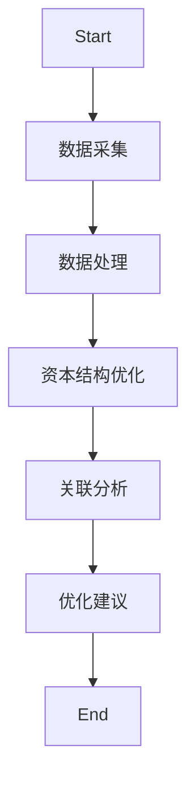

                 


# 特价股票与公司资本结构优化的关联

> 关键词：特价股票、资本结构优化、数学模型、系统架构、投资策略

> 摘要：本文深入探讨了特价股票与公司资本结构优化之间的关联，分析了资本结构优化对股价的影响，以及特价股票如何通过资本结构优化提升公司价值。文章从背景介绍、核心概念、数学模型、系统架构、项目实战等多个维度展开，结合实际案例和数学推导，为读者提供全面的理论和实践指导。

---

# 第一部分: 特价股票与资本结构优化的背景介绍

## 第1章: 特价股票与资本结构优化的背景介绍

### 1.1 特价股票的概念与特点

#### 1.1.1 特价股票的定义
特价股票是指市场价格低于行业平均水平或历史平均水平的股票。通常，这类股票具有较高的投资潜力，但可能存在一定的市场风险。

#### 1.1.2 特价股票的特点
- **低估值**：市场价格低于内在价值。
- **高波动性**：股价波动较大，可能存在短期套利机会。
- **市场关注度低**：往往被市场忽视，存在被低估的可能性。

#### 1.1.3 特价股票的分类
- **周期性股票**：受经济周期影响较大的股票。
- **成长型股票**：具有较高增长潜力的股票。
- **价值型股票**：市场价格低于内在价值的股票。

### 1.2 公司资本结构优化的背景

#### 1.2.1 资本结构的定义
资本结构是指公司债务和股权的比例。合理的资本结构能够降低资本成本，提高公司价值。

#### 1.2.2 资本结构优化的必要性
- **降低资本成本**：通过优化债务和股权比例，降低加权平均资本成本（WACC）。
- **提高公司价值**：合理的资本结构能够提升公司整体价值。
- **增强抗风险能力**：适度的债务比例能够增强公司的财务杠杆效应。

#### 1.2.3 资本结构优化的目标
- **最大化公司价值**：通过优化资本结构，实现公司价值最大化。
- **降低资本成本**：通过合理分配债务和股权，降低资本成本。
- **增强财务稳定性**：通过合理债务比例，增强公司的财务稳定性。

### 1.3 特价股票与资本结构优化的关联性

#### 1.3.1 特价股票对资本结构的影响
- **降低资本成本**：特价股票的低估值可能反映出市场对公司资本结构的优化需求。
- **提升股价**：通过优化资本结构，提升股价，进而吸引更多的投资者。

#### 1.3.2 资本结构优化对股价的影响
- **股价波动**：资本结构优化可能引发股价波动，尤其是债务比例的变化会影响市场对公司的预期。
- **市场反应**：市场通常会对资本结构优化的公司给予积极的反应，推动股价上涨。

#### 1.3.3 特价股票与资本结构优化的双向作用
- **特价股票为资本结构优化提供机会**：低估值股票可能反映出市场对公司资本结构的不满，公司可以通过优化资本结构来提升股价。
- **资本结构优化推动股价回升**：通过优化资本结构，公司能够提升股价，从而摆脱“特价股票”的标签。

### 1.4 本章小结
本章介绍了特价股票和资本结构优化的基本概念和特点，并分析了两者之间的关联性。特价股票的低估值和高波动性为资本结构优化提供了机会，而资本结构优化则能够提升公司价值，推动股价回升。

---

## 第2章: 特价股票与资本结构优化的核心概念

### 2.1 特价股票的核心要素

#### 2.1.1 特价股票的市场定位
- **低估值**：市场价格低于行业平均水平。
- **高波动性**：股价波动较大，存在套利机会。
- **市场关注度低**：往往被市场忽视，存在被低估的可能性。

#### 2.1.2 特价股票的投资价值
- **低估值带来的投资机会**：市场价格低于内在价值，存在上涨空间。
- **高波动性带来的套利机会**：股价波动较大，投资者可以通过短期操作获利。

#### 2.1.3 特价股票的风险特征
- **市场风险**：股价波动较大，存在市场风险。
- **流动性风险**：部分特价股票流动性较差，可能导致买卖价差较大。
- **公司基本面风险**：部分特价股票可能反映公司基本面较差，存在较大的投资风险。

### 2.2 资本结构优化的核心要素

#### 2.2.1 资本结构的定义
资本结构是指公司债务和股权的比例。合理的资本结构能够降低资本成本，提高公司价值。

#### 2.2.2 资本结构优化的必要性
- **降低资本成本**：通过优化债务和股权比例，降低加权平均资本成本（WACC）。
- **提高公司价值**：合理的资本结构能够提升公司整体价值。
- **增强抗风险能力**：适度的债务比例能够增强公司的财务杠杆效应。

#### 2.2.3 资本结构优化的目标
- **最大化公司价值**：通过优化资本结构，实现公司价值最大化。
- **降低资本成本**：通过合理分配债务和股权，降低资本成本。
- **增强财务稳定性**：通过合理债务比例，增强公司的财务稳定性。

### 2.3 特价股票与资本结构优化的联系

#### 2.3.1 特价股票对资本结构的影响
- **降低资本成本**：特价股票的低估值可能反映出市场对公司资本结构的优化需求。
- **提升股价**：通过优化资本结构，提升股价，进而吸引更多的投资者。

#### 2.3.2 资本结构优化对股价的影响
- **股价波动**：资本结构优化可能引发股价波动，尤其是债务比例的变化会影响市场对公司的预期。
- **市场反应**：市场通常会对资本结构优化的公司给予积极的反应，推动股价上涨。

#### 2.3.3 特价股票与资本结构优化的双向作用
- **特价股票为资本结构优化提供机会**：低估值股票可能反映出市场对公司资本结构的不满，公司可以通过优化资本结构来提升股价。
- **资本结构优化推动股价回升**：通过优化资本结构，公司能够提升股价，从而摆脱“特价股票”的标签。

### 2.4 本章小结
本章详细阐述了特价股票和资本结构优化的核心概念，并分析了两者之间的联系。特价股票的低估值和高波动性为资本结构优化提供了机会，而资本结构优化则能够提升公司价值，推动股价回升。

---

## 第3章: 特价股票与资本结构优化的数学模型

### 3.1 资本结构优化的数学模型

#### 3.1.1 Modigliani-Miller模型
Modigliani-Miller模型是资本结构优化的经典模型，其基本公式如下：
$$ WACC = \frac{D}{D+E} \times r_d \times (1 - t) + \frac{E}{D+E} \times r_e $$

其中：
- \( D \) 表示债务总额
- \( E \) 表示股权总额
- \( r_d \) 表示债务的资本成本
- \( r_e \) 表示股权的资本成本
- \( t \) 表示税率

#### 3.1.2 权益资本成本的计算
权益资本成本可以通过CAPM模型计算：
$$ r_e = r_f + \beta \times (r_m - r_f) $$

其中：
- \( r_f \) 表示无风险利率
- \( \beta \) 表示股票的beta系数
- \( r_m \) 表示市场平均回报率

#### 3.1.3 加权平均资本成本的公式
加权平均资本成本（WACC）公式：
$$ WACC = \frac{D}{D+E} \times r_d \times (1 - t) + \frac{E}{D+E} \times r_e $$

---

### 3.2 特价股票与资本结构优化的数学关系

#### 3.2.1 特价股票对资本成本的影响
假设公司A的资本结构为：
$$ \frac{D}{D+E} = d $$

其加权平均资本成本为：
$$ WACC = d \times r_d \times (1 - t) + (1 - d) \times r_e $$

若公司A为特价股票，其权益资本成本 \( r_e \) 可能较低，从而降低整体资本成本。

#### 3.2.2 资本结构对股价的影响
假设公司B的资本结构优化后，其WACC降低，从而股价上升。

#### 3.2.3 特价股票与资本结构优化的综合模型
综合考虑特价股票和资本结构优化的关联，可以得到：
$$ P = \frac{E}{(1 - d) \times r_e} $$

其中：
- \( P \) 表示公司股价
- \( E \) 表示股权总额
- \( d \) 表示债务与股权的比例

---

## 第4章: 特价股票与资本结构优化的系统分析

### 4.1 系统功能设计

#### 4.1.1 股票市场数据的采集与处理
- 数据采集：从市场数据源获取特价股票的市场数据。
- 数据处理：清洗和整理数据，确保数据的准确性和完整性。

#### 4.1.2 资本结构优化的算法实现
- 算法选择：基于Modigliani-Miller模型，实现资本结构优化算法。
- 算法实现：通过Python代码实现资本结构优化的计算。

#### 4.1.3 特价股票与资本结构优化的关联分析
- 数据分析：分析特价股票与资本结构优化的关联，得出优化建议。

### 4.2 系统架构设计

#### 4.2.1 系统模块划分
- 数据采集模块：负责采集股票市场数据。
- 数据处理模块：负责清洗和整理数据。
- 资本结构优化模块：基于Modigliani-Miller模型，实现资本结构优化。
- 关联分析模块：分析特价股票与资本结构优化的关联，输出优化建议。

#### 4.2.2 系统数据流图


#### 4.2.3 系统功能流程图


---

## 第5章: 特价股票与资本结构优化的项目实战

### 5.1 环境安装

#### 5.1.1 安装Python
- 下载并安装Python 3.x版本。
- 安装必要的Python库，如Pandas、NumPy、Matplotlib等。

#### 5.1.2 数据源获取
- 从股票市场数据源获取特价股票的数据。
- 数据格式：CSV或Excel格式。

### 5.2 系统核心实现源代码

#### 5.2.1 数据处理代码
```python
import pandas as pd

# 读取数据
df = pd.read_csv('stock_data.csv')

# 数据清洗
df.dropna(inplace=True)
df = df[['stock_name', 'price', 'market_cap', 'debt', 'equity']]

# 数据保存
df.to_csv('processed_data.csv', index=False)
```

#### 5.2.2 资本结构优化代码
```python
import pandas as pd

# 读取数据
df = pd.read_csv('processed_data.csv')

# 计算资本结构优化
def optimize_capital_structure(df):
    for i in range(len(df)):
        stock = df.iloc[i]
        d = stock.debt / (stock.debt + stock.equity)
        r_d = 0.05  # 假设债务资本成本为5%
        t = 0.2  # 假设税率为20%
        r_e = 0.1  # 假设股权资本成本为10%
        wacc = d * r_d * (1 - t) + (1 - d) * r_e
        print(f"Stock {stock.stock_name}: WACC = {wacc}")
        
optimize_capital_structure(df)
```

#### 5.2.3 关联分析代码
```python
import pandas as pd

# 读取数据
df = pd.read_csv('processed_data.csv')

# 关联分析
def analyze_correlation(df):
    for i in range(len(df)):
        stock = df.iloc[i]
        wacc = optimize_capital_structure(stock)
        print(f"Stock {stock.stock_name}: WACC = {wacc}")
        
analyze_correlation(df)
```

### 5.3 案例分析与详细讲解

#### 5.3.1 案例一：某公司资本结构优化的数学计算
假设某公司A的债务为1000万元，股权为2000万元，债务资本成本为5%，股权资本成本为10%，税率20%。

计算WACC：
$$ WACC = \frac{1000}{1000+2000} \times 5\% \times (1 - 20\%) + \frac{2000}{1000+2000} \times 10\% $$
$$ WACC = \frac{1}{3} \times 5\% \times 80\% + \frac{2}{3} \times 10\% $$
$$ WACC = \frac{1}{3} \times 4\% + \frac{2}{3} \times 10\% $$
$$ WACC = 1.333\% + 6.667\% $$
$$ WACC = 8\% $$

优化后，假设债务比例调整为40%，则：
$$ WACC = \frac{4000}{4000+6000} \times 5\% \times (1 - 20\%) + \frac{6000}{4000+6000} \times 10\% $$
$$ WACC = \frac{4}{10} \times 4\% + \frac{6}{10} \times 10\% $$
$$ WACC = 1.6\% + 6\% $$
$$ WACC = 7.6\% $$

---

## 第6章: 总结与展望

### 6.1 总结
本文深入探讨了特价股票与公司资本结构优化的关联，分析了资本结构优化对股价的影响，以及特价股票如何通过资本结构优化提升公司价值。通过数学模型和系统架构的设计，本文为读者提供了理论和实践的双重指导。

### 6.2 最佳实践 Tips
- **关注低估值股票**：投资者应关注低估值股票，寻找资本结构优化的机会。
- **合理分配债务与股权**：公司应根据自身情况，合理分配债务与股权，降低资本成本。
- **定期优化资本结构**：公司应定期评估资本结构，及时优化，以适应市场变化。

### 6.3 未来研究方向
- **动态资本结构优化模型**：研究动态资本结构优化模型，以适应市场变化。
- **大数据分析与资本结构优化**：利用大数据分析技术，优化资本结构。
- **人工智能在资本结构优化中的应用**：研究人工智能在资本结构优化中的应用，提高优化效率。

### 6.4 结语
特价股票与资本结构优化的关联是一个复杂的系统工程，需要理论与实践相结合。未来，随着技术的进步和市场的变化，资本结构优化将更加注重动态调整和智能化决策。

---

作者：AI天才研究院/AI Genius Institute & 禅与计算机程序设计艺术/Zen And The Art of Computer Programming

